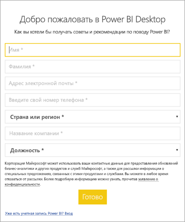

# <a name="administrators-manage-the-power-bi-desktop-sign-in-form"></a>Администраторы Управление формой для входа в Power BI Desktop
При первом запуске Power BI Desktop отображается форма для входа. Вы можете заполнить эту форму или войти в Power BI, чтобы продолжить. Администраторы управляют этой формой с помощью раздела реестра. 



Администраторы могут отключить форму для входа, используя указанный ниже раздел реестра. Ее также можно отключить для всей организации с помощью глобальных политик.

```
Key: HKEY_CURRENT_USER\SOFTWARE\Policies\Microsoft\Microsoft Power BI Desktop
valueName: ShowLeadGenDialog
```
Вы также можете воспользоваться следующим разделом. Такой способ подошел некоторым клиентам с учетом их конфигураций.

```
Key: HKEY_CURRENT_USER\SOFTWARE\Microsoft\Microsoft Power BI Desktop
valueName: ShowLeadGenDialog
```

Задайте значение 0, чтобы отключить диалоговое окно.


Появились дополнительные вопросы? [Попробуйте задать вопрос в сообществе Power BI.](https://community.powerbi.com/)

