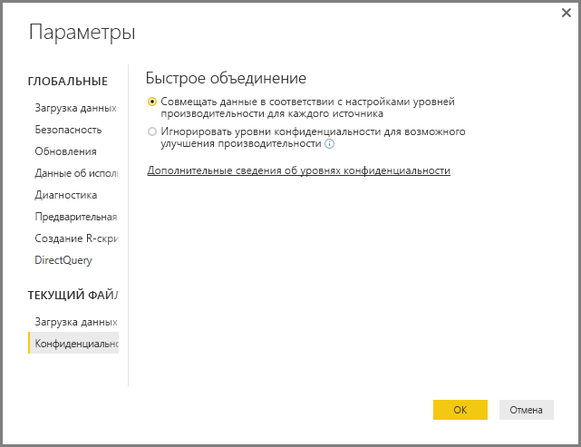
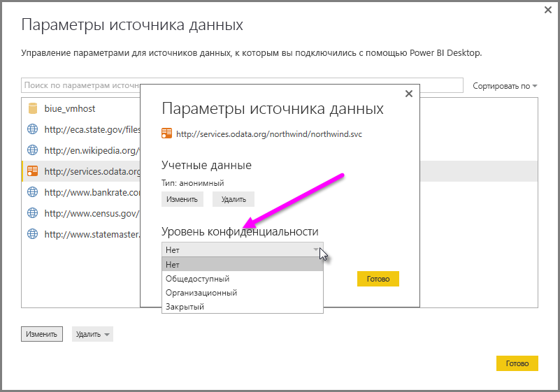

# Уровни конфиденциальности Power BI Desktop
В **Power BI Desktop** уровни конфиденциальности служат для указания уровня изоляции, определяющего степень изолированности одного источника данных от других. Хотя строгий уровень изоляции блокирует обмен данными между источниками данных, он может сократить доступную функциональность и снизить производительность.

Параметр **Уровни конфиденциальности** в области **Файл > Параметры и настройки > Параметры** и **Текущий файл > Privacy** (Конфиденциальность) определяет, использует ли Power BI Desktop параметры уровня конфиденциальности при объединении данных. Это диалоговое окно содержит ссылку на документацию Power BI Desktop об уровнях конфиденциальности (эта статья).

## Настройка уровня конфиденциальности
Параметры уровня конфиденциальности позволяют указать уровень изоляции, определяющий степень изолированности одного источника данных от других.

| Параметр | Описание | Примеры источников данных |
| --- | --- | --- |
| **Частный источник данных** |**Частный** источник данных содержит важные или конфиденциальные сведения, а доступ к нему можно ограничить кругом авторизованных пользователей. Частный источник данных полностью изолирован от других источников данных. |Данные Facebook, текстовый файл со сведениями о предоставлении сотрудникам акций организации или книга с информацией о сотрудниках. |
| **Корпоративный источник данных** |**Корпоративный** источник данных ограничивает доступ к источнику данных группой доверенных лиц. **Корпоративный** источник данных изолирован от всех **общедоступных** источников данных, однако является видимым для других **корпоративных** источников данных. |Документ **Microsoft Word** на сайте SharePoint интрасети с разрешениями, назначенными группе доверенных лиц. |
| **Общедоступный источник данных** |**Общедоступный** источник данных позволяет всем пользователям просматривать содержащиеся в нем данные. В качестве **общедоступных**можно пометить только файлы, источники данных в Интернете или данные книги. |Бесплатные данные из Microsoft Azure Marketplace, данные со страницы Википедии или локальный файл с данными, скопированными с общедоступной веб-страницы. |

## Настройка параметров уровня конфиденциальности
Диалоговое окно с параметрами **Конфиденциальность** для каждого источника данных находится в меню **Файл > Параметры и настройки > Настройки источника данных**.

Чтобы настроить уровень конфиденциальности источника данных, выберите источник, а затем выберите элемент **Изменить**. Отображается диалоговое окно **Настройки источника данных** , раскрывающееся меню в нижней части которого позволяет выбрать соответствующий уровень конфиденциальности, как показано на следующем рисунке.

> [!CAUTION]
> Источник данных, содержащий крайне важные или конфиденциальные данные, необходимо настроить как **Частный**.
> 

## Настройка уровней конфиденциальности
Для параметра **Уровни конфиденциальности** по умолчанию задано значение **Совмещать данные в соответствии с настройками уровней производительности для каждого источника**, то есть **Уровни конфиденциальности** применяются принудительно.

| Параметр | Описание |
| --- | --- |
| **Совмещать данные в соответствии с настройками уровней производительности для каждого источника** (включено, используется по умолчанию) |Параметры уровня конфиденциальности используются для определения уровня изоляции между источниками данных при объединении данных. |
| **Игнорировать уровни конфиденциальности для возможного улучшения производительности** (выключено) |Уровни конфиденциальности не учитываются при объединении данных. Но при этом может возрасти производительность и функциональность данных. |

> **Примечание о безопасности.** Если в диалоговом окне **Уровни конфиденциальности** выбрано значение **Игнорировать уровни конфиденциальности**, неавторизованное лицо может получить доступ к важным или конфиденциальным данным. Этот параметр можно *отключить* только в том случае, если вы уверенны, что источник данных не содержит важные или конфиденциальные данные.
> 
> 

> [!CAUTION]
> Параметр **Игнорировать уровни конфиденциальности для возможного улучшения производительности** не работает в службе Power BI. Поэтому, если этот параметр включен в отчетах Power BI Desktop, которые затем публикуются в службе Power BI, этот параметр *не* применяется.
> 

**Настройка уровней конфиденциальности**

В Power BI Desktop или в редакторе запросов выберите **Файл > Параметры и настройки > Параметры** и затем **Текущий файл > Конфиденциальность**.

а. Если выбрано значение **Совмещать данные в соответствии с настройками уровней производительности для каждого источника** , данные объединяются согласно настройке уровней конфиденциальности. Объединение данных из разных зон изоляции конфиденциальности приведет к буферизации некоторых данных.

б. Когда выбрано значение **Игнорировать уровни конфиденциальности для возможного улучшения производительности** , данные объединяются без учета уровней конфиденциальности, что может предоставить неавторизованному лицу возможность доступа к важным или конфиденциальным данным. Этот параметр может повысить производительность и функциональность.

> **Примечание о безопасности.** Выбор значения **Игнорировать уровни конфиденциальности для возможного улучшения производительности** может повысить производительность, но Power BI Desktop не может гарантировать конфиденциальность данных, объединенных в файл Power BI Desktop.
> 
> 

