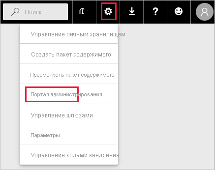
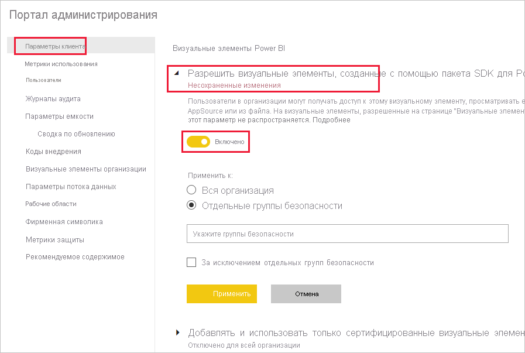
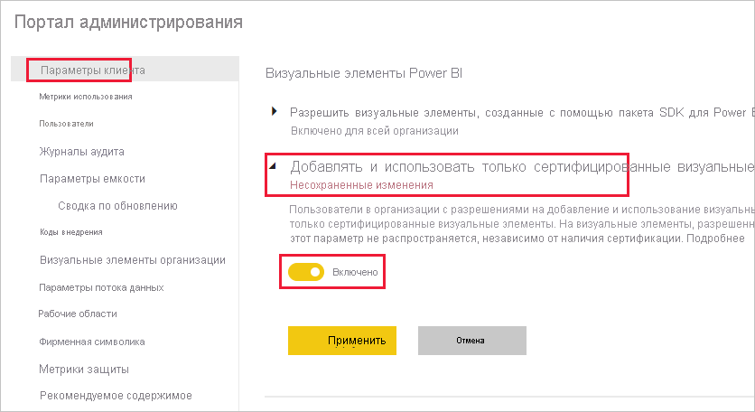
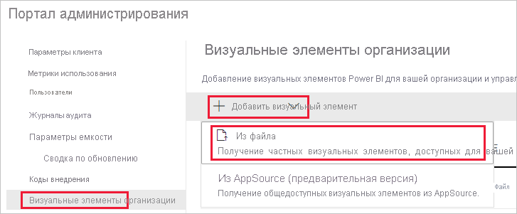
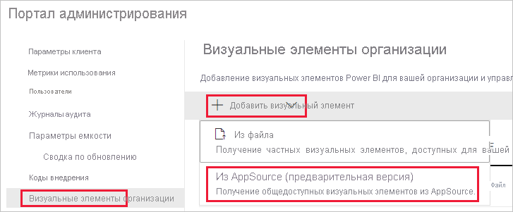
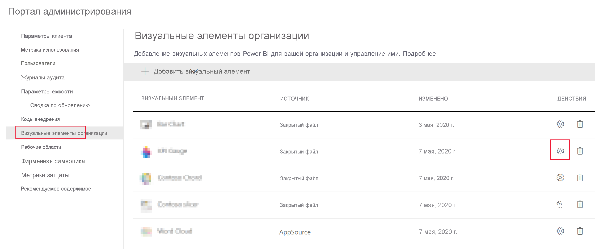
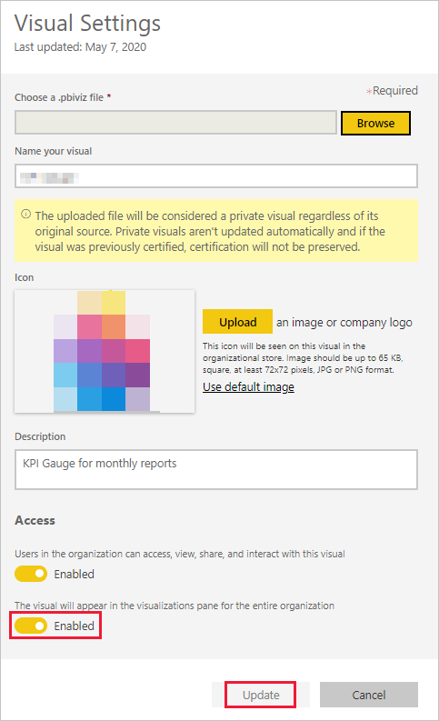

# Управление параметрами администратора визуальных элементов Power BI

Администратор Power BI может контролировать то, какие типы визуальных элементов Power BI доступны пользователям в организации.

Для управления визуальными элементами Power BI требуется роль глобального администратора в Office 365 или роль администратора службы Power BI. Дополнительные сведения о роли администратора службы Power BI см. в [этой статье](service-admin-role.md).

## Доступ к порталу администрирования

Чтобы включить параметры, описанные в этой статье, необходимо получить доступ к порталу администрирования.

1. В службе Power BI выберите **Параметры**.

2. В раскрывающемся меню параметров выберите пункт **Портал администрирования**.

    

## Параметры клиента визуальных элементов Power BI

Администратор Power BI может контролировать то, какие типы визуальных элементов Power BI доступны пользователям в организации.

Параметры клиента, настраиваемые в пользовательском интерфейсе, влияют только на службу Power BI. Чтобы эти параметры действовали в Power BI Desktop, используйте групповые политики. В таблице в конце каждого раздела приводятся сведения о включении параметра в Power BI Desktop.

>[!NOTE]
>Изменения параметров клиента не влияют на визуальные элементы Power BI, перечисленные на вкладке [Визуальные элементы организации](#organizational-visuals).

### Визуальные элементы из AppSource или из файла

В организации можно управлять доступом к следующим типам визуальных элементов Power BI:

* визуальные элементы, созданные разработчиками и сохраненные в виде файлов PBIVIZ;

* визуальные элементы, доступные из AppSource.

Чтобы разрешить пользователям в организации отправлять файлы PBIVIZ и добавлять визуальные элементы из AppSource в отчеты и панели мониторинга, следуйте приведенным ниже инструкциям.

1. Разверните раздел параметров **Разрешить визуальные элементы, созданные с помощью пакета SDK для Power BI**.

2. Щелкните **Включен**.

3. Выберите, кто может отправлять файлы PBIVIZ и визуальные элементы из AppSource.

    * Чтобы разрешить всем пользователям в организации передавать файлы PBIVIZ и добавлять визуальные элементы из AppSource, выберите вариант **Вся организация**.

     * Чтобы управлять отправкой файлов PBIVIZ и добавлением визуальных элементов из AppSource с помощью групп безопасности, выберите вариант **Отдельные группы безопасности**. Добавьте группы безопасности, которыми требуется управлять, в текстовой строке *Укажите группы безопасности*. Указанные группы безопасности по умолчанию исключаются. Чтобы включить эти группы безопасности и исключить остальных пользователей в организации, выберите параметр **За исключением отдельных групп безопасности**.

4. Щелкните **Применить**.

Изменения параметров клиента в пользовательском интерфейсе влияют только на службу Power BI. Чтобы разрешить пользователям в организации отправлять файлы PBIVIZ и добавлять визуальные элементы из AppSource в область визуализации в Power BI Desktop, используйте [групповую политику Azure AD](https://docs.microsoft.com/azure/active-directory-domain-services/manage-group-policy).

|Ключ  |Имя значения  |Значение  |
|---------|---------|---------|
|Программное обеспечение\Политики\Microsoft\Power BI Desktop\    |EnableCustomVisuals    |0 — отключить  1 — включить (по умолчанию)         |
|

### Сертифицированные визуальные элементы Power BI

Если этот параметр включен, в отчетах и панелях мониторинга организации будут отображаться только [сертифицированные визуальные элементы Power BI](../developer/visuals/power-bi-custom-visuals-certified.md). Для несертифицированных визуальных элементов Power BI из AppSource или файлов будет возвращаться сообщение об ошибке.

1. На портале администрирования выберите параметр **Добавлять и использовать только сертифицированные визуальные элементы**.

2. Щелкните **Включен**.

3. Щелкните **Применить**.

Изменения параметров клиента в пользовательском интерфейсе влияют только на службу Power BI. Чтобы управлять параметрами клиента для сертифицированных визуальных элементов в Power BI Desktop, используйте [групповую политику Azure AD](https://docs.microsoft.com/azure/active-directory-domain-services/manage-group-policy).

|Ключ  |Имя значения  |Значение  |
|---------|---------|---------|
|Программное обеспечение\Политики\Microsoft\Power BI Desktop\    |EnableUncertifiedVisuals    |0 — отключить  1 — включить (по умолчанию)         |
|

## Визуальные элементы организации

Администратор Power BI может управлять списком визуальных элементов Power BI, доступных в [хранилище организации](../developer/visuals/power-bi-custom-visuals.md#organizational-store). На вкладке **Визуальные элементы организации** на *портале администрирования* можно добавлять и удалять визуальные элементы, а также решать, какие визуальные элементы будут автоматически отображаться в области визуализации для пользователей организации. В список можно добавлять визуальные элементы любых типов, включая несертифицированные визуальные элементы и визуальные элементы из файлов PBIVIZ, даже если это противоречит [параметрам клиента](#power-bi-visuals-tenant-settings) организации.

Параметры визуальных элементов организации автоматически развертываются в Power BI Desktop.

>[!NOTE]
>Визуальные элементы организации не поддерживаются на сервере отчетов Power BI.

### Добавление визуального элемента из файла

Используйте этот метод для добавления нового визуального элемента Power BI из файла PBIVIZ.

> [!WARNING]
> Визуальный элемент Power BI, добавленный из файла, может содержать код, угрожающий безопасности или конфиденциальности. Перед его развертыванием в репозитории организации убедитесь в надежности автора и источника визуального элемента.

1. Выберите **Добавить визуальный элемент** > **Из файла**.

    

2. Заполните следующие поля:

    * **Выберите PBIVIZ-файл** — выберите файл визуального элемента для отправки.

    * **Укажите имя визуального элемента** — укажите краткое название визуального элемента, чтобы авторы отчетов могли понять его назначение.

    * **Значок** — отправьте файл значка, который будет отображаться в области визуализации.

    * **Описание** — введите краткое описание визуального элемента, чтобы предоставить пользователю дополнительные сведения.

    * **Доступ** — в этом разделе два параметра.
    
        * Укажите, доступен ли этот визуальный элемент пользователям в организации. Этот флажок устанавливается по умолчанию.

        * Укажите, будет ли этот визуальный элемент отображаться в области визуализации для пользователей в организации. Этот флажок по умолчанию снят. Дополнительные сведения см. в разделе [Добавление визуального элемента в область визуализации](#add-a-visual-to-the-visualization-pane).

    

3. Чтобы инициировать запрос на отправку, выберите **Добавить**. После отправки визуальный элемент появится в списке визуальных элементов организации.

### Добавление визуального элемента из AppSource (предварительная версия)

Используйте этот метод для добавления нового визуального элемента Power BI из AppSource.

Визуальные элементы Power BI из AppSource обновляются автоматически. Пользователям в вашей организации всегда будет доступна последняя версия визуального элемента.

1. Выберите **Добавить визуальный элемент** > **Из AppSource**.

    

2. В окне **Визуальные элементы Power BI** найдите визуальный элемент AppSource, который нужно добавить, и щелкните **Добавить**. После отправки визуальный элемент появится в списке визуальных элементов организации.

### Добавление визуального элемента в область визуализации

На странице "Визуальные элементы организации" можно выбрать визуальные элементы, которые будут автоматически отображаться в области визуализации для всех пользователей в организации.

1. В строке визуального элемента, который требуется добавить, щелкните **Параметры**.

    область организации

2. Включите параметр области визуализации и щелкните **Обновить**.

    

### Удаление визуального элемента, переданного из файла

В репозитории выберите значок корзины для визуального элемента, который нужно удалить без возможности восстановления.

> [!IMPORTANT]
> Удаление необратимо. После удаления визуальный элемент сразу же перестает отображаться в имеющихся отчетах. Даже если вы отправите визуальный элемент еще раз, он не заменит тот, который был удален. Тем не менее пользователи могут импортировать новый визуальный элемент, чтобы заменить экземпляр, который у них есть в отчетах.

### Отключение визуального элемента из файла PBIVIZ

Вы можете отменить доступ к визуальному элементу из файла PBIVIZ через [хранилище организации](../developer/visuals/power-bi-custom-visuals.md#organizational-store), оставив его в списке визуальных элементов организации.

1. В строке визуального элемента из файла PBIVIZ, который требуется отключить, щелкните **Параметры**.

2. В разделе **Доступ** отключите следующий параметр: *Пользователи в организации могут получать доступ к этому визуальному элементу, просматривать его, а также предоставлять к нему общий доступ и взаимодействовать с ним*.

После этого он не будет отображаться в имеющихся отчетах и появится следующее сообщение об ошибке:

*Этот пользовательский визуальный элемент больше недоступен. Для получения дополнительных сведений свяжитесь со своим администратором.*

>[!NOTE]
>Визуальные элементы из файла PBIVIZ, добавленные в закладки, продолжают работать после отключения.

### Обновление визуального элемента

Визуальные элементы из AppSource обновляются автоматически. Когда в AppSource становится доступна новая версия, она заменяет прежнюю версию, развернутую посредством списка визуальных элементов организации.

Чтобы обновить визуальный элемент из файла PBIVIZ, замените его, выполнив указанные ниже действия.

1. В строке визуального элемента, который требуется добавить, щелкните **Параметры**.

2. Нажмите кнопку **Обзор** и выберите файл PBIVIZ, которым нужно заменить текущий визуальный элемент.

3. Нажмите кнопку **Обновить**.

## Дальнейшие действия

> [!div class="nextstepaction"]
>[Администрирование Power BI на портале администрирования](service-admin-portal.md)

> [!div class="nextstepaction"]
>[Визуальные элементы в Power BI](../developer/visuals/power-bi-custom-visuals.md)

> [!div class="nextstepaction"]
>[Визуальные элементы организации в Power BI](../developer/visuals/power-bi-custom-visuals-organization.md)