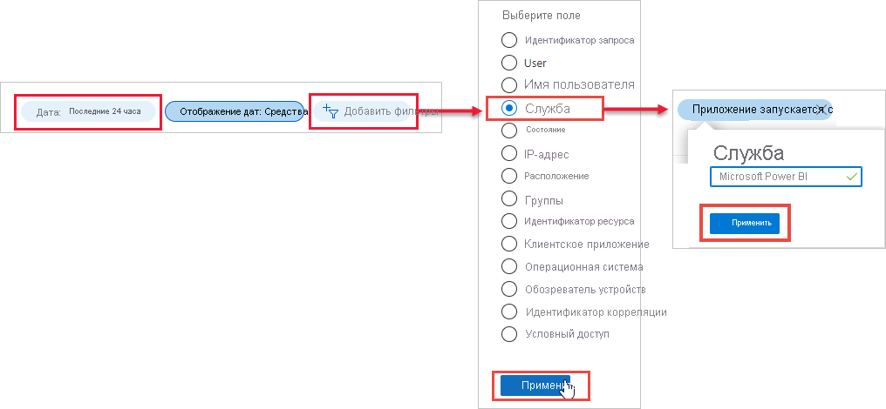

# Поиск пользователей Power BI, выполнивших вход

Если вы являетесь администратором клиента и хотите узнать, кто выполнил вход в Power BI, можете использовать [отчеты о доступе и использовании Azure Active Directory](/azure/active-directory/reports-monitoring/concept-sign-ins), чтобы получить нужные сведения.

> [!NOTE]
> Отчет **Входы** предоставляет полезную информацию, но не определяет тип лицензии каждого пользователя. Используйте Центр администрирования Microsoft 365 для просмотра лицензий.

## Требования

Любой пользователь (в том числе без прав администратора) может просмотреть отчет о своих событиях входа в систему, но для просмотра отчета для всех пользователей необходимо выполнить следующие требования.

* У клиента должна быть лицензия Azure Active Directory Premium.

* У вас должна быть одна их следующих ролей: глобальный администратор, администратор безопасности или читатель сведений о безопасности.

## Просмотр событий входа с помощью портала Azure

Чтобы просмотреть событие входа в систему, выполните следующие действия.

1. На **портале Azure**выберите **Azure Active Directory**.

1. В разделе **Мониторинг** выберите **События входа**.
   
    

1. Отфильтруйте приложение по **Microsoft Power BI** или **Power BI Gateway** и выберите **Применить**.

    Параметр **Microsoft Power BI** отфильтровывает события входа, связанные со службой, тогда как **Power BI Gateway** — конкретные события входа, связанные с локальным шлюзом данных.
   
    

## Экспорт данных

Вы можете [скачать отчет о входах](/azure/active-directory/reports-monitoring/quickstart-download-sign-in-report) в двух форматах: CSV или JSON.

В верхней части отчета **Входы** выберите **Скачать** и один из следующих вариантов.

* **CSV** для скачивания CSV-файла для текущих отфильтрованных данных.

* **JSON** для скачивания JSON-файла для текущих отфильтрованных данных.

## Хранение данных

Данные о событиях входа доступны в течение 30 дней. Дополнительные сведения см. в статье [Политики хранения отчетов Azure Active Directory](/azure/active-directory/reports-monitoring/reference-reports-data-retention).

## Дальнейшие действия

[Применение функции аудита в своей организации](service-admin-auditing.md)

У вас имеются и другие вопросы? [Попробуйте задать вопрос в сообществе Power BI.](https://community.powerbi.com/)