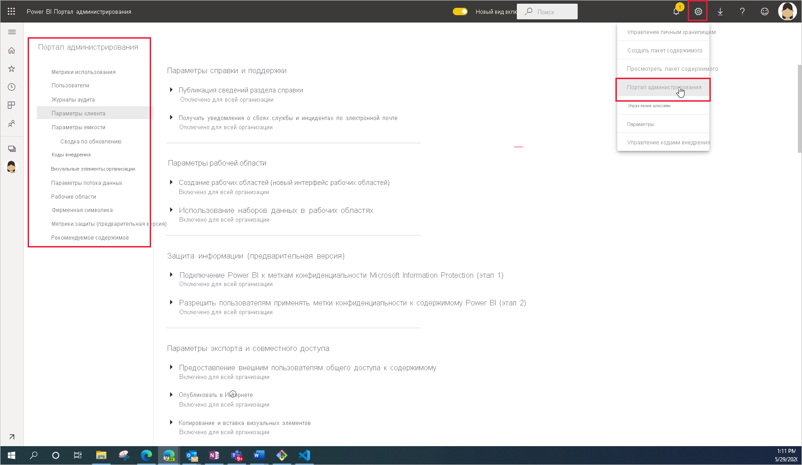

# Что такое администрирование Power BI

Администрирование Power BI — это управление параметрами, управляющими работой Power BI, для всей организации. Пользователи, которым назначены роли администратора, настраивают, отслеживают и подготавливают ресурсы организации. В этой статье содержится обзор ролей, задач и средств администрирования, которые помогут вам начать работу.

## Роли администратора, связанные с Power BI

Для администрирования Power BI в организации используются несколько ролей, которые работают вместе. Большинство ролей администратора назначаются в центре администрирования Microsoft 365 или с помощью PowerShell. Роли администратора емкости Power BI Premium и Power BI Embedded назначаются при создании емкости. Дополнительные сведения о каждой из ролей администратора см. в статье [О ролях администратора](/microsoft-365/admin/add-users/about-admin-roles?view=o365-worldwide). Сведения о назначении ролей администратора см. в статье [Назначение ролей администратора](/microsoft-365/admin/add-users/assign-admin-roles?view=o365-worldwide).

| **Тип администратора** | **Область ответственности администратора** | **Задачи Power BI** |
| --- | --- | --- |
| Глобальный администратор | Microsoft 365 | Имеет неограниченный доступ ко всем функциям управления в организации |
| | | Назначает роли другим пользователям |
| Администратор выставления счетов | Microsoft 365 | Управление подписками |
| | | Приобретение лицензий |
| Администратор лицензий | Microsoft 365 | Назначение и удаление лицензий для пользователей |
| Администратор пользователей | Microsoft 365 | Создание групп пользователей и управление ими |
| | | Сброс паролей пользователей |
| Администратор Power BI | Служба Power BI | Полный доступ к задачам управления Power BI|
| | | Включение и отключение основных возможностей Power BI |
| | | Отчеты о потреблении и производительности |
| | | Просмотр результатов аудита и управление аудитом |
| Администратор емкости Power BI Premium | Отдельная емкость Premium | назначать рабочие области для емкости;|
| | | Управление разрешениями пользователей в отношении емкости |
| | | Управление рабочими нагрузками для настройки использования памяти |
| | | Перезапуск емкости |
| Администратор емкости Power BI Embedded | Отдельная емкость Embedded | назначать рабочие области для емкости;|
| | | Управление разрешениями пользователей в отношении емкости |
| | | Управление рабочими нагрузками для настройки использования памяти |
| | | Перезапуск емкости |

## Задачи и средства администрирования

Администраторы Power BI преимущественно работают на портале администрирования Power BI. Однако вы должны быть знакомы с соответствующими средствами и центрами администрирования. Ознакомьтесь с приведенной выше таблицей, чтобы определить, какая роль необходима для выполнения задач с использованием указанных средств.

| **Инструмент** | **Типичные задачи** |
| --- | --- |
| [Портал администрирования Power BI](https://app.powerbi.com/admin-portal) | Приобретение и применение емкости Premium |
| | Обеспечение качества обслуживания |
| | Управление рабочими областями |
| | Публикация визуальных элементов Power BI |
| | Проверка кодов, используемых для внедрения Power BI в другие приложения |
| | Устранение неполадок с доступом к данным и решение других проблем |
| [Центр администрирования Microsoft 365](https://admin.microsoft.com) | Управление пользователями и группами |
| | Приобретение и назначение лицензий |
| | Запрет доступа пользователей к Power BI |
| [Центр безопасности и соответствия требованиям Microsoft 365](https://protection.office.com) | Просмотр результатов аудита и управление аудитом |
| | Классификация и отслеживание данных |
| | Политики защиты от потери данных |
| | Управление информацией |
| [Azure Active Directory (AAD) на портале Azure](https://aad.portal.azure.com) | Настройка условного доступа к ресурсам Power BI |
| | Подготовка емкости Power BI Embedded |
| [Командлеты PowerShell](/powershell/power-bi/overview) | Управление рабочими областями и другими аспектами Power BI с помощью скриптов |
| [Административные API и пакеты SDK](service-admin-reference.md) | Создание пользовательских средств администрирования. Например, в Power BI Desktop эти API можно использовать для создания отчетов на основе данных, связанных с администрированием. |

## Дальнейшие действия

Теперь, когда вы знакомы с основами администрирования Power BI, обратитесь за дополнительной информацией к следующим статьям.

- [Портал администрирования Power BI](service-admin-portal.md)
- [Руководство по параметрам администрирования клиента](../guidance/admin-tenant-settings.md)
- [Использование командлетов PowerShell](/powershell/power-bi/overview)
- [Administering Power BI — frequently asked questions (FAQ)](service-admin-faq.md) (Часто задаваемые вопросы об администрировании Power BI)
- [Лицензирование службы Power BI для пользователей в организации](service-admin-licensing-organization.md)
- У вас появились вопросы? [Попробуйте задать вопрос в сообществе Power BI.](https://community.powerbi.com/)
- У вас есть предложения? [Идеи по улучшению Power BI](https://ideas.powerbi.com/)