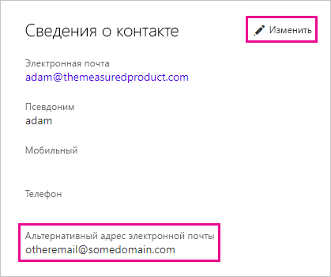

# <a name="use-an-alternate-email-address"></a>Использование запасного адреса электронной почты

При регистрации в Power BI вы указываете адрес электронной почты. По умолчанию Power BI использует этот адрес для отправки вам сообщений о действиях в службе. Например, этот адрес будет задействован, когда другой пользователь отправляет вам приглашение к совместному использованию.

Иногда требуется, чтобы такие сообщения отправлялись на другой адрес, а не тот, который использовался для регистрации. В этой статье объясняется, как указать запасной адрес в Microsoft 365 и в PowerShell. В ней также объясняется, как в Azure Active Directory (Azure AD) разрешается адрес электронной почты.

> [!NOTE]
> Указание запасного адреса не влияет на то, какой адрес электронной почты служба Power BI использует для отправки сообщений об обновлении служб, информационных бюллетеней и других рекламных материалов. Такие сообщения всегда отправляются на адрес электронной почты, который использовался при регистрации в Power BI.

## <a name="use-microsoft-365"></a>Использование Microsoft 365

Чтобы указать запасной адрес в Microsoft 365, выполните указанные ниже действия.

1. Откройте страницу [Персональные данные](https://portal.office.com/account/#personalinfo) своей учетной записи. При появлении запроса на вход в приложение укажите адрес электронной почты и пароль, используемые для входа в Power BI.

1. В меню слева выберите **Личные сведения**.

1. В разделе **Сведения о контакте** щелкните ссылку **Изменить**.

    Если вы не можете изменить свои данные, значит, вашим адресом электронной почты управляет администратор. Чтобы изменить свой адрес электронной почты, обратитесь к администратору.

    

1. В поле **Альтернативный адрес электронной почты** введите адрес электронной почты, который нужно использовать в Microsoft 365 для обновлений Power BI.

## <a name="use-powershell"></a>PowerShell

Чтобы указать запасной адрес в PowerShell, выполните команду [Set-AzureADUser](/powershell/module/azuread/set-azureaduser/).

```powershell
Set-AzureADUser -ObjectId john@contoso.com -OtherMails "otheremail@somedomain.com"
```

## <a name="email-address-resolution-in-azure-ad"></a>Разрешение адресов электронной почты в Azure AD

Чтобы записать токен внедрения Azure AD для Power BI, можно использовать один из трех разных типов адресов электронной почты:

* основной адрес электронной почты, связанный с пользовательской учетной записью Azure AD;

* адрес электронной почты в формате UPN (имя участника-пользователя);

* атрибут массива *other email address* (другой адрес электронной почты).

Power BI выбирает адрес электронной почты в следующей последовательности:

1. Если в объекте-пользователе Azure AD присутствует атрибут почты, Power BI использует его как адрес электронной почты.

1. Если адрес электронной почты в формате UPN *отличается* от адреса электронной почты домена **\*.onmicrosoft.com** (сведения после символа "\@"), Power BI использует этот атрибут как адрес электронной почты.

1. Если в объекте-пользователе Azure AD присутствует атрибут массива *other email address* (другой адрес электронной почты), то Power BI использует первый адрес электронной почты в этом списке (так как в этом атрибуте может существовать список адресов электронной почты).

1. Если ни одно из указанных выше условий не выполняется, то Power BI использует адрес в формате UPN.

Появились дополнительные вопросы? [Ответы на них см. в сообществе Power BI.](https://community.powerbi.com/)