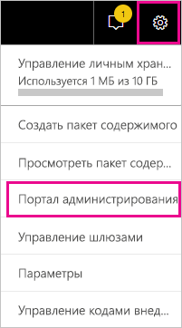
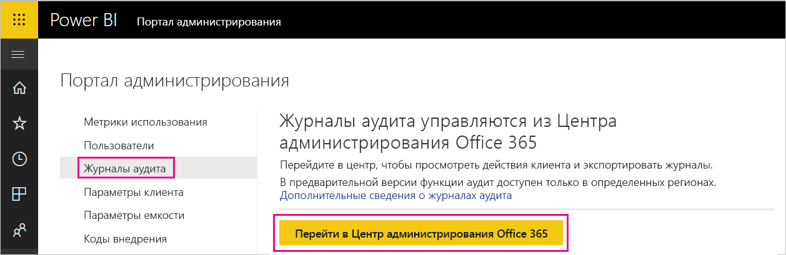
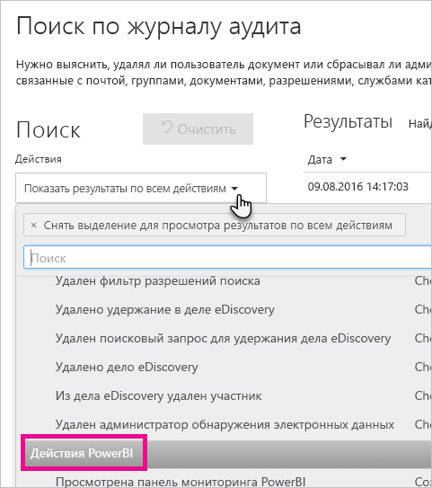
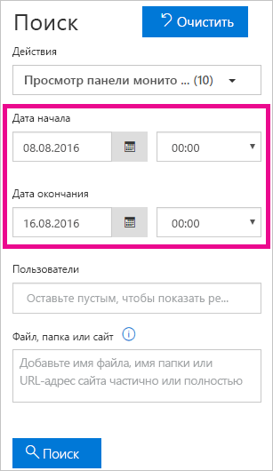
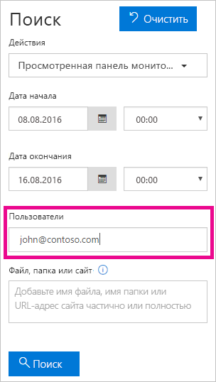
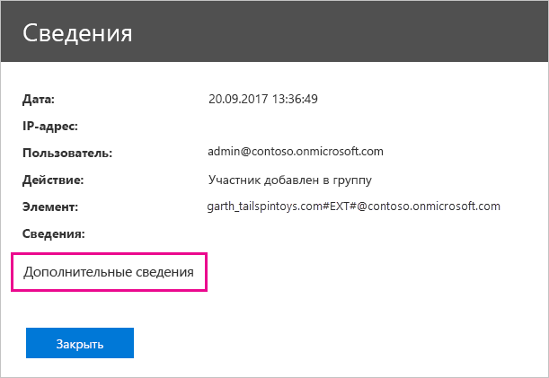
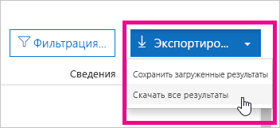

# <a name="track-user-activities-in-power-bi"></a>Отслеживание действий пользователей в Power BI

Сведения о том, кто выполняет действия в клиенте Power BI, что это за действия и какие элементы они затрагивают, могут быть важными для выполнения требований в организации, например для соблюдения нормативных требований или для управления записями. В Power BI отслеживать действия пользователей можно двумя способами: с помощью [журнала действий Power BI](#use-the-activity-log) и [единого журнала аудита](#use-the-audit-log). В каждом из этих журналов содержится полная копия [данных аудита Power BI](#operations-available-in-the-audit-and-activity-logs). Тем не менее между ними есть ряд важных отличий, которые описываются в следующей таблице.

| **Единый журнал аудита** | **Журнал действий Power BI** |
| --- | --- |
| Содержит события из SharePoint Online, Exchange Online, Dynamics 365 и других служб, а также события аудита Power BI. | Содержит только события аудита Power BI. |
| Доступ предоставляется только пользователям с разрешениями только на просмотр журналов аудита или доступ к журналам аудита, таким как глобальные администраторы или аудиторы. | Доступ предоставляется глобальным администраторам и администраторам службы Power BI. |
| Глобальные администраторы и аудиторы могут выполнять поиск в едином журнале аудита с использованием Центра безопасности Microsoft 365 и Центра соответствия требованиям Microsoft 365. | Пользовательский интерфейс для поиска по журналу действий на данный момент отсутствует. |
| Глобальные администраторы и аудиторы могут скачивать записи журнала аудита с помощью командлетов и API-интерфейсов управления Microsoft 365. | Глобальные администраторы и администраторы службы Power BI могут скачивать записи журнала действий с помощью командлета управления REST и API Power BI. |
| Данные аудита хранятся в течение 90 дней. | Данные о действиях хранятся в течение 30 дней (общедоступная предварительная версия). |
| Данные аудита сохраняются, даже если клиент перемещается в другой регион Azure. | Данные о действиях не сохраняются, если клиент перемещается в другой регион Azure. |


## <a name="use-the-activity-log"></a>Использование журнала действий

Администратор службы Power BI может анализировать использование всех ресурсов Power BI на уровне клиента с помощью пользовательских отчетов на основе журнала действий Power BI. Действия можно скачать с использованием REST API или командлета PowerShell. Кроме того, вы можете фильтровать данные о действиях по диапазону дат, пользователю или типу действия.

### <a name="activity-log-requirements"></a>Требования для использования журнала действий

Чтобы получить доступ к журналам действий Power BI, необходимо соблюдение следующих требований:

- Наличие разрешений глобального администратора или администратора службы Power BI.
- Локальная установка [командлетов управления Power BI](https://www.powershellgallery.com/packages/MicrosoftPowerBIMgmt) или использование командлетов управления Power BI в Azure Cloud Shell.

### <a name="activityevents-rest-api"></a>REST API ActivityEvents

Для экспорта событий действий в хранилище BLOB-объектов или базу данных SQL можно использовать административное приложение на основе REST API Power BI. На основе экспортированных данных можно создавать пользовательские отчеты об использовании. В вызове REST API **ActivityEvents** необходимо указать даты начала и окончания, а также при необходимости фильтр для выбора действий по типу действия или идентификатору пользователя. Поскольку журнал действий может содержать большой объем данных, API **ActivityEvents** в настоящее время поддерживает скачивание данных по одному запросу за период, не превышающий одного дня. Другими словами, начальная и конечная даты должны совпадать, как показано в следующем примере. Значения даты и времени необходимо указывать в формате UTC.

```
https://api.powerbi.com/v1.0/myorg/admin/activityevents?startDateTime='2019-08-31T00:00:00'&endDateTime='2019-08-31T23:59:59'
```

При слишком большом числе записей API **ActivityEvents** возвращает от 5000 до 10 000 записей и токен продолжения. Для получения следующего пакета записей повторно вызовите API **ActivityEvents** с указанием токена продолжения. Эту процедуру следует повторять до тех пор, пока не будут извлечены все записи, то есть пока не прекратится выдача токена продолжения. Ниже представлен пример использования токена продолжения.

```
https://api.powerbi.com/v1.0/myorg/admin/activityevents?continuationToken='%2BRID%3ARthsAIwfWGcVAAAAAAAAAA%3D%3D%23RT%3A4%23TRC%3A20%23FPC%3AARUAAAAAAAAAFwAAAAAAAAA%3D'
```

Независимо от числа возвращаемых записей, при наличии токена продолжения в результатах следует повторно вызвать API с указанием этого токена для извлечения оставшихся данных. Эту процедуру следует повторять до тех пор, пока не прекратится выдача токена продолжения в результатах. В некоторых случаях вызов может возвращать токен продолжения без записей событий. В следующем примере демонстрируется цикл, в ответе которого возвращается токен продолжения:

```
while(response.ContinuationToken != null)
{
   // Store the activity event results in a list for example
    completeListOfActivityEvents.AddRange(response.ActivityEventEntities);

    // Make another call to the API with continuation token
    response = GetPowerBIActivityEvents(response.ContinuationToken)
}
completeListOfActivityEvents.AddRange(response.ActivityEventEntities);
```
> [!NOTE]
> Отображение всех событий может занять до 24 часов, хотя обычно они становятся доступны гораздо раньше.
>
>
### <a name="get-powerbiactivityevent-cmdlet"></a>Командлет Get-PowerBIActivityEvent

Скачайте события действий с помощью командлетов управления Power BI для PowerShell. Командлет **Get-PowerBIActivityEvent** автоматически обрабатывает токен продолжения. Командлет **Get-PowerBIActivityEvent** принимает параметры даты начала и окончания (StartDateTime и EndDateTime) с теми же ограничениями, что и для REST API **ActivityEvents**. Другими словами, даты начала и окончания должны совпадать, поскольку за один раз можно извлекать данные о действиях только за один день.

В следующем скрипте демонстрируется скачивание всех действий Power BI. Эта команда преобразует результаты из формата JSON в объекты .NET для удобства доступа к отдельным свойствами. В этих примерах показаны самая ранняя и самая поздняя метки времени для суток, которые позволяют избежать пропуска событий.

```powershell
Login-PowerBI

$activities = Get-PowerBIActivityEvent -StartDateTime '2019-08-31T00:00:00' -EndDateTime '2019-08-31T23:59:59' | ConvertFrom-Json

$activities.Count
$activities[0]

```

### <a name="filter-activity-data"></a>Фильтрация данных о действиях

События действий можно фильтровать по типу действия и идентификатору пользователя. В следующем скрипте демонстрируется скачивание данных только для действия **ViewDashboard**. Для получения дополнительных сведений о поддерживаемых параметрах используйте команду `Get-Help Get-PowerBIActivityEvent`.

```powershell
Login-PowerBI

$activities = Get-PowerBIActivityEvent -StartDateTime '2019-08-31T00:00:00' -EndDateTime '2019-08-31T23:59:59' -ActivityType 'ViewDashboard' | ConvertFrom-Json

$activities.Count
$activities[0]

```

## <a name="use-the-audit-log"></a>Использование журнала аудита

Если вам требуется отслеживать действия пользователей в Power BI и Microsoft 365, вы будете использовать функции аудита в Центре безопасности и соответствия требованиям Office 365 или среду PowerShell. Аудит зависит от функциональных возможностей Exchange Online (автоматически подготавливается для Power BI).

Данные аудита можно фильтровать по диапазону дат, пользователю, панели мониторинга, отчету, набору данных и типу действий. Кроме того, можно загрузить информацию о действиях в CSV-файл и проанализировать ее в автономном режиме.

### <a name="audit-log-requirements"></a>Требования для использования журнала аудита

Чтобы получить доступ к журналам аудита, вам нужно выполнить следующие требования:

- Для доступа к журналам аудита вы должны быть глобальным администратором или вам должна быть назначена роль журналов аудита или журналов аудита в режиме просмотра в Exchange Online. По умолчанию группы ролей управления соответствием и управления организацией назначены на странице **Разрешения** в центре администрирования Exchange.

    Чтобы предоставить учетным записям без прав администратора доступ к журналу аудита, сделайте пользователя участником одной из этих групп ролей. Если вы хотите сделать это другим способом, вы можете создать пользовательскую группу ролей в центре администрирования Exchange, назначить упомянутые выше роли, связанные с журналом аудита, этой группе, а затем включить учетную запись без прав администратора в новую группу ролей. См. дополнительные сведения об [управлении группами ролей в Exchange Online](/Exchange/permissions-exo/role-groups).

    Если у вас нет доступа к Центру администрирования Exchange из Центра администрирования Microsoft 365, перейдите на страницу https://outlook.office365.com/ecp и войдите в систему с помощью своих учетных данных.

- Если у вас есть доступ к журналу аудита, но вы не являетесь глобальным администратором или администратором службы Power BI, вы не сможете получить доступ к порталу администрирования Power BI. В этом случае используйте прямую ссылку на [Центр безопасности и соответствия требованиям Office 365](https://sip.protection.office.com/#/unifiedauditlog).

### <a name="access-your-audit-logs"></a>Доступ к журналам аудита

Для доступа к журналам сначала убедитесь, что ведение журнала включено в Power BI. Дополнительные сведения см. в разделе [Журналы аудита](service-admin-portal.md#audit-logs) в документации на портале администрирования. После включения аудита его данные могут отобразиться с задержкой до 48 часов. Если данные не отображаются сразу, проверьте журналы аудита позже. Аналогичная задержка возможна при получении разрешения на просмотр журналов аудита: доступ к ним может быть предоставлен не сразу.

Журналы аудита Power BI доступны непосредственно из [Центра безопасности и соответствия требованиям Office 365](https://sip.protection.office.com/#/unifiedauditlog). На портале администрирования Power BI также есть соответствующая ссылка:

1. В Power BI в правом верхнем углу экрана щелкните **значок шестеренки** и выберите **Портал администрирования**.

   

1. Выберите **Журналы аудита**.

1. Нажмите кнопку **Перейти в Центр администрирования Office 365**.

   

### <a name="search-only-power-bi-activities"></a>Поиск только действий Power BI

Ограничьте результаты поиска только действиями Power BI, выполнив следующие действия. См. дополнительные сведения о [списке действий, проверяемых Power BI](#operations-available-in-the-audit-and-activity-logs) далее в этой статье.

1. На странице **Поиск журналов аудита** в разделе **Поиск** найдите раскрывающийся список **Действия**.

2. Выберите в нем пункт **Действия Power BI**.

   

3. Щелкните в любом месте за пределами поля выбора, чтобы закрыть его.

Поисковые запросы возвращают только действия Power BI.

### <a name="search-the-audit-logs-by-date"></a>Поиск журналов аудита по дате

С помощью полей **Дата начала** и **Дата окончания** можно искать журналы по диапазону дат. По умолчанию выбрано последние семь дней. На экране отображаются дата и время в формате UTC. Максимально возможный диапазон дат составляет 90 дней. 

Если выбранный диапазон дат превышает 90 дней, отобразится сообщение об ошибке. Если используется максимальный диапазон в 90 дней, выберите текущее время для поля **Дата начала**. В противном случае отобразится сообщение об ошибке, предупреждающее, что дата начала предшествует дате окончания. Если функция аудита была включена в течение последних 90 дней, начало диапазона дат не может предшествовать дате включения этой функции.



### <a name="search-the-audit-logs-by-users"></a>Поиск журналов аудита по пользователям

В записях журнала аудита можно искать действия, выполненные конкретными пользователями. Введите одно или несколько имен пользователей в поле **Пользователи**. Имя пользователя имеет форму адреса электронной почты. Это учетная запись, которую пользователи используют для входа в Power BI. Чтобы поиск вернул записи для всех пользователей (и учетных записей служб) в организации, оставьте это поле пустым.



### <a name="view-search-results"></a>Просмотр результатов поиска

После того как вы нажмете кнопку **Поиск**, будут загружены результаты поиска. Через несколько минут они отобразятся в разделе **Результаты**. По завершении поиска показывается число найденных результатов. В окне **поиска по журналу аудита** отображается максимум 1000 событий. Если более 1000 событий соответствуют критерию поиска, в приложении отображаются последние 1000 событий.

#### <a name="view-the-main-results"></a>Просмотр основных результатов

Область **Результаты** содержит следующие сведения о каждом событии, найденном в ходе поиска. Чтобы отсортировать результаты, щелкните заголовок столбца в области **Результаты**.

| **Столбец** | **Определение** |
| --- | --- |
| Дата |Дата и время (в формате UTC) события. |
| IP-адрес |IP-адрес устройства, которое используется для зарегистрированного действия. IP-адрес отображается в приложении в формате IPv4 или IPv6. |
| Пользователь |Пользователь (или учетная запись службы), выполнивший действие, которое вызвало событие. |
| Действие |Действие, выполненное пользователем. Это значение соответствует действиям, выбранным в раскрывающемся списке **Действия**. Для события из журнала аудита администратора Exchange значением в этом столбце является командлет Exchange. |
| Элемент |Объект, который был создан или изменен из-за соответствующего действия. Например, просмотренный или измененный файл либо обновленная учетная запись пользователя. Значения в этом столбце отображаются не для всех действий. |
| Сведения |Дополнительные сведения о действии. Аналогичным образом значения в этом столбце отображаются не для всех действий. |

#### <a name="view-the-details-for-an-event"></a>Просмотр сведений о событии

Дополнительные сведения о событии можно просмотреть, выбрав запись о событии в списке результатов поиска. Отобразится страница **Сведения** с подробными свойствами из записи события. Отображаемые свойства на странице **Сведения** зависят от службы Microsoft 365, в которой произошло событие.

Для отображения этих сведений выберите **Дополнительные сведения**. Свойство RecordType всех записей в Power BI имеет значение 20. См. дополнительные сведения о [свойствах в журнале аудита](/office365/securitycompliance/detailed-properties-in-the-office-365-audit-log/).

   

### <a name="export-search-results"></a>Экспорт результатов поиска

Чтобы экспортировать журнал аудита Power BI в CSV-файл, выполните следующие действия:

1. Выберите команду **Export results** (Экспорт результатов).

1. Выберите пункт **Save loaded results** (Сохранить загруженные результаты) или **Download all results** (Загрузить все результаты).

    

### <a name="use-powershell-to-search-audit-logs"></a>Поиск в журналах аудита с помощью PowerShell

Вы также можете получить доступ к журналам аудита по имени пользователя с помощью PowerShell. В следующем примере показано, как подключиться к Exchange Online PowerShell и извлечь записи журнала аудита Power BI с помощью команды [Search-UnifiedAuditLog](/powershell/module/exchange/policy-and-compliance-audit/search-unifiedauditlog?view=exchange-ps/). Чтобы запустить скрипт, администратор должен назначить вам соответствующие разрешения, как описано в разделе [Требования для использования журнала аудита](#audit-log-requirements).

```powershell
Set-ExecutionPolicy RemoteSigned

$UserCredential = Get-Credential

$Session = New-PSSession -ConfigurationName Microsoft.Exchange -ConnectionUri https://outlook.office365.com/powershell-liveid/ -Credential $UserCredential -Authentication Basic -AllowRedirection

Import-PSSession $Session
Search-UnifiedAuditLog -StartDate 9/11/2018 -EndDate 9/15/2018 -RecordType PowerBI -ResultSize 1000 | Format-Table | More
```

### <a name="use-powershell-to-export-audit-logs"></a>Экспорт журналов аудита с помощью PowerShell

Вы также можете экспортировать результаты поиска журналов аудита с помощью PowerShell. В следующем примере показано, как отправить данные из команды [Search-UnifiedAuditLog](/powershell/module/exchange/policy-and-compliance-audit/search-unifiedauditlog?view=exchange-ps/) и экспортировать результаты с помощью командлета [Export-CSV](/powershell/module/microsoft.powershell.utility/export-csv). Чтобы запустить скрипт, администратор должен назначить вам соответствующие разрешения, как описано в разделе [Требования для использования журнала аудита](#audit-log-requirements).

```powershell
$UserCredential = Get-Credential

$Session = New-PSSession -ConfigurationName Microsoft.Exchange -ConnectionUri https://outlook.office365.com/powershell-liveid/ -Credential $UserCredential -Authentication Basic -AllowRedirection

Import-PSSession $Session
Search-UnifiedAuditLog -StartDate 9/11/2019 -EndDate 9/15/2019 -RecordType PowerBI -ResultSize 5000 |
Export-Csv -Path "c:\temp\PowerBIAuditLog.csv" -NoTypeInformation

Remove-PSSession $Session
```

Дополнительные сведения о подключении к Exchange Online см. в разделе [Подключение к Exchange Online с помощью удаленной оболочки PowerShell](/powershell/exchange/exchange-online/connect-to-exchange-online-powershell/connect-to-exchange-online-powershell/). Еще один пример использования PowerShell с журналами аудита описан в руководстве по [использованию журнала аудита Power BI и PowerShell для назначения лицензий Power BI Pro](https://powerbi.microsoft.com/blog/using-power-bi-audit-log-and-powershell-to-assign-power-bi-pro-licenses/).

## <a name="operations-available-in-the-audit-and-activity-logs"></a>Операции, доступные в журналах аудита и действий

В журналах аудита и действий доступны следующие операции.

| Понятное имя                                     | Имя операции                              | Примечания                                  |
|---------------------------------------------------|---------------------------------------------|------------------------------------------|
| Доступ к связанным с Power BI таблицам в Excel | AnalyzedByExternalApplication |    |
| Добавлен источник данных в шлюз Power BI             | AddDatasourceToGateway                      |                                          |
| Добавлен доступ к папке Power BI                      | AddFolderAccess                             | Сейчас не используется                       |
| Добавлены участники группы Power BI                      | AddGroupMembers                             |                                          |
| Администратор подключил к клиенту учетную запись хранения для потоков данных | AdminAttachedDataflowStorageAccountToTenant | Сейчас не используется                       |
| Анализируемый набор данных Power BI                         | AnalyzedByExternalApplication               |                                          |
| Проанализирован отчет Power BI                          | AnalyzeInExcel                              | Создается, когда пользователи взаимодействуют со службой. При скачивании файла `*.odc` не создается событие аудита                                         |
| К клиенту подключили учетную запись хранения для потоков данных                 | AttachedDataflowStorageAccount              |                                          |
| привязка набора данных Power BI к шлюзу;                | BindToGateway                               |                                          |
| Обновление потока данных отменено                        | CancelDataflowRefresh                       |                                          |
| Изменено состояние емкости                            | ChangeCapacityState                         |                                          |
| Изменено назначение пользователей емкости                  | UpdateCapacityUsersAssignment               |                                          |
| Изменены подключения к наборам данных Power BI              | SetAllConnections                           |                                          |
| Изменение администраторов шлюза Power BI                   | ChangeGatewayAdministrators                 |                                          |
| Изменен состав пользователей источника данных шлюза Power BI        | ChangeGatewayDatasourceUsers                |                                          |
| Создан пакет содержимого организации Power BI      | CreateOrgApp                                |                                          |
| Создано приложение Power BI                              | CreateApp                                   |                                          |
| Создана панель мониторинга Power BI                        | CreateDashboard                             |                                          |
| Создан поток данных Power BI                         | CreateDataflow                              |                                          |
| Создан набор данных Power BI                          | CreateDataset                               |                                          |
| Создана подписка на Power BI по электронной почте               | CreateEmailSubscription                     |                                          |
| Создана папка Power BI                           | CreateFolder                                |                                          |
| Создание шлюза Power BI                          | CreateGateway                               |                                          |
| Создана группа Power BI                            | CreateGroup                                 |                                          |
| Создан отчет Power BI                           | CreateReport <sup>1</sup>                                |                                          |
| Поток данных перенесен во внешнюю учетную запись хранения     | DataflowMigratedToExternalStorageAccount    | Сейчас не используется                       |
| Добавлены разрешения для потока данных                        | DataflowPermissionsAdded                    | Сейчас не используется                       |
| Удалены разрешения для потока данных                      | DataflowPermissionsRemoved                  | Сейчас не используется                       |
| Удален пакет содержимого организации Power BI      | DeleteOrgApp                                |                                          |
| Удален комментарий Power BI                          | DeleteComment                               |                                          |
| Удалена панель мониторинга Power BI                        | DeleteDashboard                             | Сейчас не используется                       |
| Удален поток данных Power BI                         | DeleteDataflow                              | Сейчас не используется                       |
| Удален набор данных Power BI                          | DeleteDataset                               |                                          |
| Удалена подписка на Power BI по электронной почте               | DeleteEmailSubscription                     |                                          |
| Удалена папка Power BI                           | DeleteFolder                                |                                          |
| Удален доступ к папке Power BI                    | DeleteFolderAccess                          | Сейчас не используется                       |
| Удаление шлюза Power BI                          | DeleteGateway                               |                                          |
| Удалена группа Power BI                            | DeleteGroup                                 |                                          |
| Удален отчет Power BI                           | DeleteReport                                |                                          |
| Обнаружены источники набора данных Power BI          | GetDatasources                              |                                          |
| Скачанный отчет Power BI                        | DownloadReport                              |                                          |
| Изменены свойства потока данных                        | EditDataflowProperties                      |                                          |
| Изменено разрешение сертификации Power BI          | EditCertificationPermission                 | Сейчас не используется                       |
| Изменена панель мониторинга Power BI                         | EditDashboard                               | Сейчас не используется                       |
| Изменен набор данных Power BI                           | EditDataset                                 |                                          |
| Изменены свойства набора данных Power BI                | EditDatasetProperties                       | Сейчас не используется                       |
| Изменен отчет Power BI                            | EditReport                                  |                                          |
| Экспортирован поток данных Power BI                        | ExportDataflow                              |                                          |
| Экспортированы данные визуальных элементов отчета Power BI              | ExportReport                                |                                          |
| Экспортированы данные плиток Power BI                       | ExportTile                                  |                                          |
| Не удалось добавить разрешения для потока данных                | FailedToAddDataflowPermissions              | Сейчас не используется                       |
| Не удалось удалить разрешения для потока данных             | FailedToRemoveDataflowPermissions           | Сейчас не используется                       |
| Создан маркер SAS потока данных Power BI             | GenerateDataflowSasToken                    |                                          |
| Создан токен внедрения Power BI                    | GenerateEmbedToken                          |                                          |
| Импортирован файл в Power BI                         | Импорт                                      |                                          |
| Установлено приложение Power BI                            | InstallApp                                  |                                          |
| Рабочая область перенесена в емкость                  | MigrateWorkspaceIntoCapacity                |                                          |
| Опубликован комментарий Power BI                           | PostComment                                 |                                          |
| Напечатана панель мониторинга Power BI                        | PrintDashboard                              |                                          |
| Напечатана страница отчета Power BI                      | PrintReport                                 |                                          |
| Отчет Power BI опубликован в Интернете                  | PublishToWebReport <sup>2</sup>                         |                                          |
| Публикация или изменение популярных таблиц | UpdateFeaturedTables <sup>3</sup>   | |
| Получен секрет потока данных Power BI из Key Vault  | ReceiveDataflowSecretFromKeyVault           |                                          |
| Удаление источника данных из шлюза Power BI         | RemoveDatasourceFromGateway                 |                                          |
| Удалены участники группы Power BI                    | DeleteGroupMembers                          |                                          |
| Рабочая область удалена из емкости                 | RemoveWorkspacesFromCapacity                |                                          |
| Переименована панель мониторинга Power BI                        | RenameDashboard                             |                                          |
| Запрошено обновление потока данных Power BI               | RequestDataflowRefresh                      | Сейчас не используется                       |
| Запрошено обновление набора данных Power BI                | RefreshDataset                              |                                          |
| Получены рабочие области Power BI                     | GetWorkspaces                               |                                          |
| Задано расположение хранилища потоков данных для рабочей области     | SetDataflowStorageLocationForWorkspace      |                                          |
| Задано запланированное обновление потока данных Power BI        | SetScheduledRefreshOnDataflow               |                                          |
| Задано запланированное обновление набора данных Power BI         | SetScheduledRefresh                         |                                          |
| Предоставлен общий доступ к панели мониторинга Power BI                         | ShareDashboard                              |                                          |
| Предоставлен общий доступ к отчету Power BI                            | ShareReport                                 |                                          |
| Начало работы в расширенной пробной версии Power BI                   | OptInForExtendedProTrial                    | Сейчас не используется                       |
| Запущена пробная версия Power BI                            | OptInForProTrial                            |                                          |
| Принято управление источником данных Power BI                   | TakeOverDatasource                          |                                          |
| Принято управление набором данных Power BI                        | TakeOverDataset                             |                                          |
| Принято управление потоком данных Power BI                     | TookOverDataflow                             |                                          |
| Отменена публикация приложения Power BI                          | UnpublishApp                                |                                          |
| Обновлены параметры управления ресурсами емкости      | UpdateCapacityResourceGovernanceSettings    | Пока не реализовано в Центре администрирования Microsoft 365 |
| Обновлен администратор емкости                            | UpdateCapacityAdmins                        |                                          |
| Обновлено отображаемое имя емкости                     | UpdateCapacityDisplayName                   |                                          |
| Обновлены разрешения на назначение хранилища потоков данных   | UpdatedDataflowStorageAssignmentPermissions |                                          |
| Обновлены параметры Power BI организации          | UpdatedAdminFeatureSwitch                   |                                          |
| Обновлено приложение Power BI                              | UpdateApp                                   |                                          |
| Обновлен поток данных Power BI                         | UpdateDataflow                              |                                          |
| Обновлены источники набора данных Power BI             | UpdateDatasources                           |                                          |
| Обновлены параметры набора данных Power BI               | UpdateDatasetParameters                     |                                          |
| Обновлена подписка на Power BI по электронной почте               | UpdateEmailSubscription                     |                                          |
| Обновлена папка Power BI                           | UpdateFolder                                |                                          |
| Обновлен доступ к папке Power BI                    | UpdateFolderAccess                          |                                          |
| Обновлены учетные данные источника данных шлюза Power BI  | UpdateDatasourceCredentials                 |                                          |
| Просмотрена панель мониторинга Power BI                         | ViewDashboard                               |                                          |
| Просмотрен поток данных Power BI                          | ViewDataflow                                |                                          |
| Просмотрен отчет Power BI                            | ViewReport                                  |                                          |
| Просмотрена плитка Power BI                              | ViewTile                                    |                                          |
| Просмотрены метрики использования Power BI                     | ViewUsageMetrics                            |                                          |
|                                                   |                                             |                                          |

<sup>1</sup> Публикация из Power BI Desktop в службе является событием CreateReport в службе.

<sup>2</sup> PublishtoWebReport относится к функции [Публикация в Интернете](../collaborate-share/service-publish-to-web.md).

<sup>3</sup> UpdateFeaturedTables относится к [связанным с Power BI таблицам в Excel](../collaborate-share/service-excel-featured-tables.md).

## <a name="next-steps"></a>Дальнейшие действия

[Что такое администрирование Power BI?](service-admin-administering-power-bi-in-your-organization.md)  

[Портал администрирования Power BI](service-admin-portal.md)  

Появились дополнительные вопросы? [Попробуйте задать вопрос в сообществе Power BI.](https://community.powerbi.com/)
