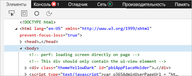
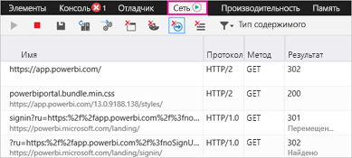
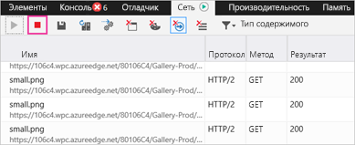
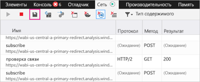

# Запись дополнительных диагностических сведений для Power BI

В этой статье представлены инструкции по ручному сбору дополнительных диагностических сведений из веб-клиента Power BI.

1. Перейдите к [Power BI](https://app.powerbi.com) с помощью браузера Microsoft Edge или Internet Explorer.

1. Нажмите клавишу **F12**, чтобы открыть средства разработчика Microsoft Edge.

   

1. Откройте вкладку **Сеть**. Здесь указан уже зафиксированный трафик.

   

    Вы можете выбрать один из следующих вариантов.

    * Перемещайтесь по этому окну и воспроизводите возникшие проблемы.

    * Чтобы скрыть или показать окно средств разработчика в любой момент во время работы, нажмите клавишу F12.

1. Чтобы остановить профилирование сеанса, щелкните красный квадрат на вкладке **Сеть** в области средств разработчика.

   

1. Выберите значок дискеты, чтобы экспортировать данные в качестве архива HTTP (HAR-файла).

   

1. Укажите имя HAR-файла и сохраните его.

    HAR-файл будет содержать все сведения о сетевых запросах между окном браузера и Power BI, в том числе:

    * идентификаторы действий для каждого запроса;

    * точную метку времени для каждого запроса;

    * все сведения об ошибках, возвращенные клиенту.

    Эта трассировка также будет содержать данные, используемые для заполнения визуальных элементов, отображаемых на экране.

1. HAR-файл можно передать на анализ службе поддержки.

Появились дополнительные вопросы? [Попробуйте задать вопрос в сообществе Power BI.](https://community.powerbi.com/)
