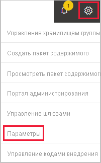
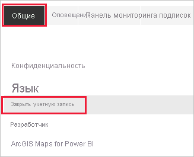
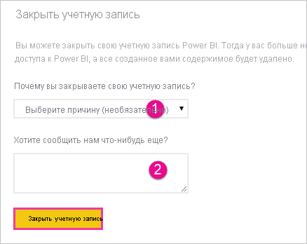
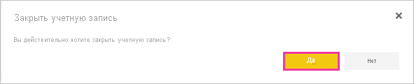
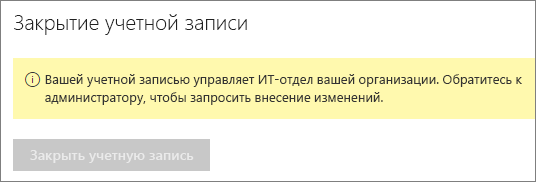

# Закрытие учетной записи Power BI

Если вы больше не планируете пользоваться Power BI, закройте свою учетную запись.  Закрыв учетную запись, вы не сможете войти в Power BI. Кроме того, все данные клиента, переданные или созданные в Power BI, будут удалены в соответствии с политикой хранения данных, изложенной в условиях использования Power BI. Они не сохраняются.

## Отдельные пользователи Power BI

Если вы вошли в Power BI как отдельный пользователь, учетную запись можно закрыть на экране **Параметры**.

1. В Power BI в правом верхнем углу экрана щелкните значок шестеренки и выберите **Параметры**.

    

1. На вкладке **Общие** выберите **Закрыть учетную запись**.

    

1. Выберите причину закрытия учетной записи (1). Вы также можете указать дополнительные сведения (2). После этого выберите **Закрыть учетную запись**.

    

1. Подтвердите, что вы хотите закрыть свою учетную запись.

    

    Вы увидите подтверждение того, что Power BI закрыл учетную запись. При необходимости здесь можно повторно открыть учетную запись.

    

## Пользователи управляемого клиента

Если ваша организация зарегистрировала вас для использования Power BI, обратитесь к администратору клиента Попросите его отменить назначение лицензии для вашей учетной записи.

Появились дополнительные вопросы? [Попробуйте задать вопрос в сообществе Power BI.](https://community.powerbi.com/)