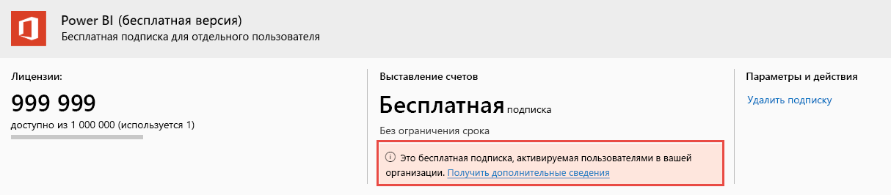

# Просмотр пользовательских лицензий Power BI и управление ими

В этой статье описывается, как администраторы могут использовать центр администрирования Microsoft 365 или портал Azure для просмотра пользовательских лицензий для службы Power BI и управления ими.

> [!NOTE]
>
>Пользователю может быть назначена как бесплатная лицензия Power BI, так и лицензия Power BI Pro. Такая ситуация возможна, если пользователь зарегистрировался для получения бесплатной лицензии, а затем ему была назначена лицензия Power BI Pro. В этом случае применяется лицензия более высокого уровня.
>

## Просмотр подписок

Чтобы узнать, какие подписки Power BI есть в вашей организации, выполните указанные ниже действия.

1. Войдите в [Центр администрирования Microsoft 365](https://admin.microsoft.com).
2. В меню навигации выберите **Выставления счетов** > **Продукты и службы**.

Активные подписки Power BI приводятся в списке вместе с другими имеющимися подписками. Иногда в списке может быть непредвиденная бесплатная подписка Power BI, как показано на иллюстрации.

  

Такая подписка создается, когда пользователи прибегают к самостоятельной регистрации. Дополнительные сведения см. в статье [Power BI в организации](/microsoft-365/admin/misc/power-bi-in-your-organization?view=o365-worldwide).

## Управление пользовательскими лицензиями в Microsoft 365

Сведения об использовании центра администрирования Microsoft 365 для управления пользовательскими лицензиями см. в [документации по бизнес-подпискам и выставлению счетов](/microsoft-365/commerce/?view=o365-worldwide).

## Управление пользовательскими лицензиями на портале Azure

Для просмотра и назначения лицензий Power BI с помощью портала Azure выполните указанные ниже действия.

1. Войдите на [портал Azure](https://portal.azure.com).

2. Найдите и выберите **Azure Active Directory**.

3. В разделе **Управление** в меню ресурсов Azure Active Directory выберите пункт **Лицензии**.

4. В меню ресурсов выберите пункт **Все продукты**, а затем выберите тип лицензии Power BI, чтобы открыть список лицензированных пользователей.

5. Чтобы назначить лицензию, на панели команд выберите **+ Назначить**. На странице **Назначить лицензию** выберите пользователя, а затем элемент **Параметры назначения**, чтобы включить лицензию Power BI для выбранной учетной записи пользователя.

6. Чтобы удалить лицензию, установите флажок рядом с именем пользователя, а затем выберите команду **Удалить лицензию**.

## Дальнейшие действия

- [Приобретение Power BI Pro](service-admin-purchasing-power-bi-pro.md)
- [Лицензирование для вашей организации](service-admin-licensing-organization.md)