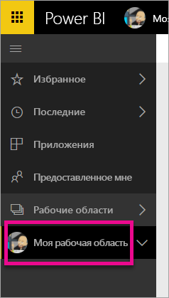
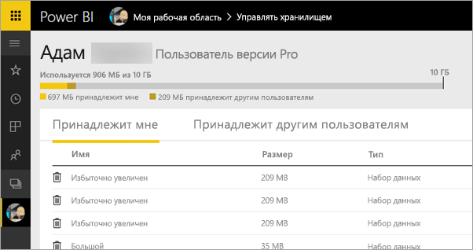
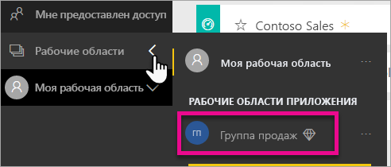
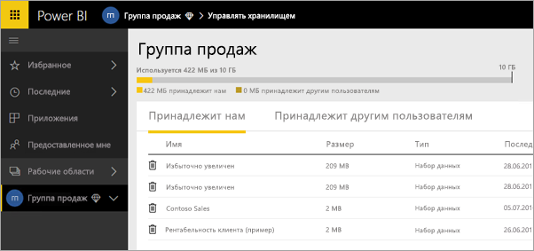
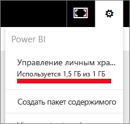
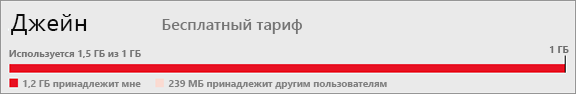

# Управление хранилищем данных в рабочих областях Power BI

Узнайте, как управлять хранилищем данных в рабочей области или у пользователя, чтобы обеспечить публикацию отчетов и наборов данных.

## Ограничения емкости

Ограничения хранилища рабочей области для рабочей области "Моя рабочая область" или рабочей области приложения зависят от того, находится ли рабочая область в [общей емкости или в емкости уровня "Премиум"](../fundamentals/service-basic-concepts.md#capacities).

### Ограничение общей емкости
Рабочие области в общей емкости 

- Размер хранилища для каждой рабочей области составляет 10 ГБ.
- Для рабочих областей приложений общий объем не может превышать ограничение для хранилища арендатора в 10 ГБ, умноженные на число лицензий Pro в арендаторе.

### Ограничения емкости уровня "Премиум"
Для рабочих областей в емкости уровня "Премиум"
- Для емкости уровня "Премиум" существует ограничение в 100 ТБ.
- Ограничение на объем хранилища для каждого пользователя не предусмотрено.

Сведения о других возможностях см. в разделе [Power BI, модель ценообразования](https://powerbi.microsoft.com/pricing).

## Что входит в хранилище

В максимальный допустимый объем хранилища включены наборы данных и отчеты Excel — ваши и других пользователей, которые предоставили вам общий доступ к этим элементам. Наборы данных представляют собой любые источники данных, которые были загружены или подключены. К ним относятся используемые файлы Power BI Desktop и книги Excel. Кроме того, емкость хранилища включает следующее:

* диапазоны Excel, закрепленные на панели мониторинга;
* локальные визуализации служб отчетности, закрепленные на панели мониторинга Power BI;
* переданные изображения.

Размер совместно используемой панели мониторинга зависит от того, что закреплено на ней. Например, если закрепить элементы из двух отчетов, которые являются частью двух разных наборов данных, то размер панели мониторинга будет соответствующий.

## Управление принадлежащими вам элементами

Контролируйте объем хранилища, используемый в вашей учетной записи Power BI, и управляйте учетной записью.

1. Для управления хранилищем перейдите в раздел **Моя рабочая область** на панели навигации.
   
    

2. Щелкните значок шестеренки  в правом верхнем углу и выберите **Управление личным хранилищем**.
   
    На верхней панели отображаются сведения об использованном объеме хранилища из максимально допустимого.
   
    
   
    Наборы данных и отчеты разделены по двум вкладкам:
   
    **Принадлежит мне:** отчеты и наборы данных, переданные вами в вашу учетную запись Power BI, в том числе наборы данных таких служб, как Salesforce и Dynamics CRM.  

    **Принадлежит другим пользователям:** другие пользователи предоставили вам общий доступ к этим отчетам и наборам данных.
1. Чтобы удалить набор данных или отчет, щелкните значок корзины .

Имейте в виду, что у вас или другого пользователя могут быть отчеты и панели мониторинга, сформированные на основе набора данных. После удаления такого набора данных связанные с ним отчеты и панели мониторинга перестанут работать.

## Управление рабочей областью
1. Щелкните стрелку рядом с пунктом **Рабочие области** и выберите имя рабочей области.
   
    
2. Щелкните в правом верхнем углу значок шестеренки  и выберите **Управление хранилищем группы**.
   
    На верхней панели отображаются сведения об использованном объеме хранилища группы из максимально допустимого.
   
    
   
    Наборы данных и отчеты разделены по двум вкладкам:
   
    **Принадлежит нам:** отчеты и наборы данных, переданные вами или другим пользователем в учетную запись Power BI группы, в том числе наборы данных таких служб, как Salesforce и Dynamics CRM.

    **Принадлежит другим пользователям:** другие пользователи предоставили вашей группе общий доступ к этим отчетам и наборам данных.

3. Чтобы удалить набор данных или отчет, щелкните значок корзины .
   
   > [!NOTE]
   > Имейте в виду, что у вас или другого пользователя в группе могут быть отчеты и панели мониторинга, сформированные на основе набора данных. После удаления такого набора данных связанные с ним отчеты и панели мониторинга перестанут работать.
   
   Любой участник в рабочей области с ролью администратора, члена или участника может удалять наборы данных и отчеты из рабочей области.

## Ограничения наборов данных
В Power BI нельзя импортировать наборы данных объемом больше 1 ГБ. Если вы выбрали сохранение возможностей Excel вместо импорта данных, ограничение составляет 250 МБ для набора данных.

## Что происходит при достижении предела
При достижении максимально допустимой емкости данных служба выдаст сообщения. 

Выбрав значок шестеренки , вы увидите красную полосу, означающую, что вы превысили ограничение на объем данных.

Соответствующее указание также появляется в разделе **Управление личным хранилищем**.

 

 При попытке выполнить действие, в результате которого одно из ограничений будет превышено, появляется сообщение о превышении лимита. Вы можете [управлять](#manage-items-you-own) хранилищем и уменьшать объем содержащихся в нем данных в соответствии с ограничениями.

 

 ## Дальнейшие действия

 Появились дополнительные вопросы? [Попробуйте задать вопрос в сообществе Power BI.](https://community.powerbi.com/)
