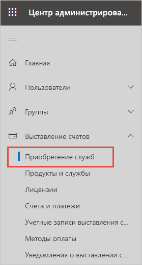
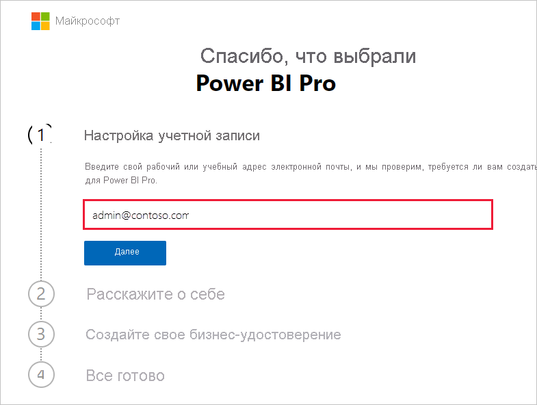
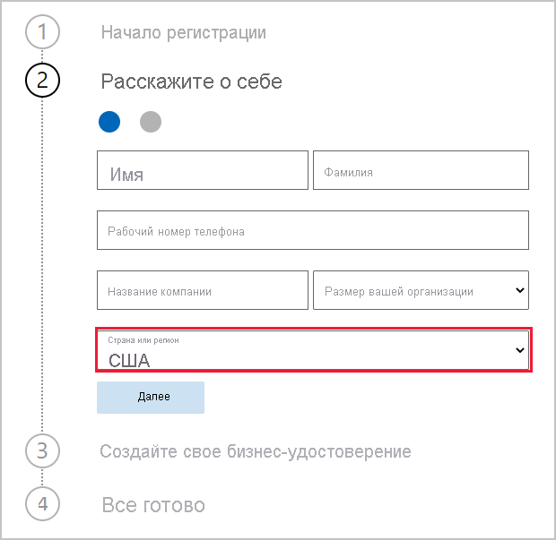
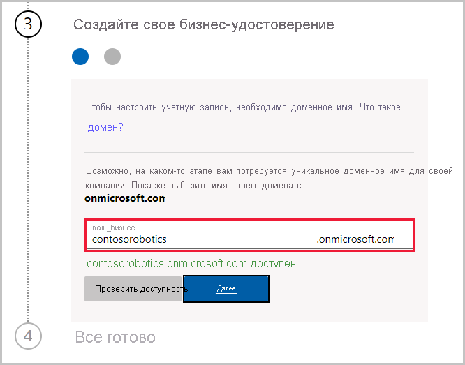

# Получение подписки на Power BI для организации

Администраторы могут зарегистрироваться в Power BI на странице **приобретения служб** Центра администрирования Microsoft 365. После регистрации в Power BI администратор может назначать лицензии пользователям, которым будет предоставляться доступ.

Пользователи организации могут зарегистрироваться в Power BI на веб-сайте Power BI. Когда пользователь организации регистрируется в Power BI, ему автоматически назначается лицензия Power BI. Чтобы отключить возможности самостоятельной регистрации, выполните инструкции в статье [Включение и отключение самостоятельной регистрации и приобретения](service-admin-disable-self-service.md).

## Регистрация через Microsoft 365

Если вы являетесь глобальным администратором или администратором выставления счетов, вы можете получить подписку Power BI для своей организации. Дополнительные сведения см. в разделе [Кто может приобретать и назначать лицензии?](service-admin-licensing-organization.md#who-can-purchase-and-assign-licenses).

> [!NOTE]
>
> Подписка Microsoft 365 E5 уже включает в себя лицензии Power BI Pro. Сведения об управлении лицензиями см. в статье [Просмотр лицензий пользователей и управление ими](service-admin-manage-licenses.md).
>
>

Выполните следующие действия, чтобы приобрести лицензии Power BI Pro в Центре администрирования Microsoft 365:

1. Войдите в [Центр администрирования Microsoft 365](https://admin.microsoft.com).

2. В меню навигации выберите **Выставления счетов** > **Приобретение служб**.
  
   

3. Выполните поиск или прокрутите список, чтобы найти подписку, которую вы хотите купить. Вы найдете **Power BI** в **Other categories that might interest you** (Другие категории, которые могут быть интересными) в нижней части страницы. Перейдите по ссылке, чтобы просмотреть подписки Power BI, доступные для вашей организации.

4. Выберите предложение, например Power BI Pro.

5. На странице **Приобретение служб** выберите **Купить**. Если вы еще не использовали Power BI Pro, то можете оформить бесплатную пробную подписку. Она включает 25 лицензий, которые действуют один месяц.

   

6. Выберите предпочитаемый вариант выставления счетов: **Платить ежемесячно** или **Заплатить за весь год**.

7. В области **Сколько пользователей в вашей организации?** введите нужное число лицензий для покупки, а затем выберите **Быстрый заказ** и завершите транзакцию.

8. Чтобы проверить свою покупку, перейдите на страницу **Выставления счетов** > **Products & services** (Продукты и службы) и найдите **Power BI Pro**.

Дополнительные сведения о приобретении службы Power BI для организации и управления ею см. в статье [Power BI в организации](https://docs.microsoft.com/microsoft-365/admin/misc/power-bi-in-your-organization?view=o365-worldwide).

## Дополнительные способы получения Power BI для вашей организации

Если вы еще не являетесь подписчиком Microsoft 365, выполните указанные ниже действия, чтобы получить пробную версию Power BI Pro для своей организации. Вы также можете [зарегистрироваться для получения новой пробной версии Microsoft 365](service-admin-signing-up-for-power-bi-with-a-new-office-365-trial.md), а затем добавить Power BI, выполнив действия, описанные в предыдущем разделе.

Чтобы оформить подписку на Power BI, требуется рабочая или учебная учетная запись. Мы не поддерживаем адреса электронной почты, предоставляемые потребительскими службами электронной почты или поставщиками телекоммуникационных услуг. Если у вас нет рабочей или учебной учетной записи, вы можете создать ее во время регистрации.

Чтобы зарегистрироваться, выполните указанные ниже действия.

1. Выберите [Регистрация Power BI Pro](https://signup.microsoft.com/create-account/signup?OfferId=d59682f3-3e3b-4686-9c00-7c7c1c736085&ali=1&products=d59682f3-3e3b-4686-9c00-7c7c1c736085). 

2. Введите рабочий или учебный адрес электронной почты и нажмите **Далее**. Можно ввести адрес электронной почты, который не считается рабочим или учебным адресом электронной почты. При создании бизнес-удостоверения будет создана новая учетная запись.

   

3. Мы выполним быструю проверку, чтобы узнать, требуется ли создавать новую учетную запись. Выберите **Настроить учетную запись**, чтобы продолжить процесс регистрации.

   > [!NOTE]
   >Если ваш адрес электронной почты уже используется в другой службе Майкрософт, можно **войти** или **создать новую учетную запись**. Если вы решили создать новую учетную запись, выполните следующие действия по настройке.
>
>
 
4. Заполните форму, чтобы предоставить сведения о себе. Обязательно укажите правильную страну или регион. Выбранная страна определяет место хранения данных, как описано в разделе [Как определить, где расположен ваш клиент Power BI](service-admin-where-is-my-tenant-located.md#how-to-determine-where-your-power-bi-tenant-is-located).

   

5. Нажмите кнопку **Далее**. Для подтверждения мы отправим проверочный код. Укажите номер телефона, на который можно отправить текстовое сообщение или позвонить вам. Затем выберите **Отправить проверочный код**.

6. Введите проверочный код, а затем выберите **Создайте свое бизнес-удостоверение**.

   

    Введите короткое название для своей компании и убедитесь, что оно доступно. Мы используем это короткое имя для создания названия организации в центре обработки данных в качестве поддомена onmicrosoft.com. Добавить собственный домен можно позже. Не переживайте, если желаемое короткое имя уже занято. Вероятно, что кто-то с похожим названием организации выбрал такое же короткое имя — просто попробуйте другой вариант. Нажмите кнопку **Далее**.
    
7. Создайте идентификатор пользователя и пароль для входа в учетную запись. Выберите **Зарегистрироваться**. Готово!

Созданная учетная запись теперь является глобальным администратором нового клиента пробной версии Power BI Pro. Вы можете войти в [центр администрирования Microsoft 365](https://admin.microsoft.com), чтобы добавить дополнительных пользователей, настроить личный домен, приобрести больше служб и управлять подпиской Power BI.

## Дальнейшие действия

- [Просмотр лицензий пользователей и управление ими](service-admin-manage-licenses.md)
- [Включение и отключение самостоятельной регистрации и приобретения](service-admin-disable-self-service.md)
- [Документация по бизнес-подпискам и выставлению счетов](https://docs.microsoft.com/microsoft-365/commerce/?view=o365-worldwide)
