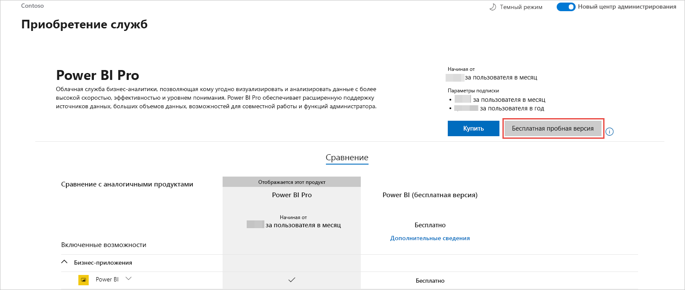

# Получение подписки на Power BI для организации

Администратор может зарегистрироваться в Power BI на [веб-сайте Power BI](https://powerbi.microsoft.com). Кроме того, регистрация доступна на странице приобретения служб в центре администрирования Microsoft 365. После регистрации в Power BI администратор может назначать лицензии пользователям, которым будет предоставляться доступ.

Кроме того, отдельные пользователи в организации могут регистрироваться в Power BI через веб-сайт Power BI. Когда пользователь организации регистрируется в Power BI, ему автоматически назначается лицензия Power BI. Чтобы отключить эту возможность, выполните инструкции в статье [Включение и отключение самостоятельной регистрации и приобретения](service-admin-disable-self-service.md).

## Регистрация через Power BI

Чтобы оформить подписку на Power BI, требуется рабочая или учебная учетная запись. Мы не поддерживаем адреса электронной почты, предоставляемые потребительскими службами электронной почты или поставщиками телекоммуникационных услуг.

Чтобы зарегистрироваться, выполните указанные ниже действия.

1. Перейдите на [веб-сайт Power BI](https://powerbi.microsoft.com). Выберите **Попробовать бесплатно**.
2. Введите рабочий адрес электронной почты, а затем выберите **Зарегистрироваться**.

   

3. Подтвердите свою личность. Мы сообщим вам проверочный код в телефонном звонке или текстовом сообщении.
4. Выберите **Да**, чтобы подтвердить, что вы используете адрес электронной почты, полученный от вашей организации.
5. Создайте учетную запись. Мы отправим проверочный код на ваш адрес электронной почты для завершения регистрации.

   

## Регистрация через Microsoft 365

Если вы являетесь глобальным администратором или администратором выставления счетов Microsoft 365, вы можете получить подписку Power BI для своей организации. Дополнительные сведения см. в разделе [Кто может приобретать и назначать лицензии?](../service-admin-licensing-organization.md#who-can-purchase-and-assign-licenses).

> [!NOTE]
>
> Подписка Microsoft 365 E5 уже включает в себя лицензии Power BI Pro. Сведения об управлении лицензиями см. в статье [Просмотр лицензий пользователей и управление ими](service-admin-manage-licenses.md).
>
>

Выполните следующие действия, чтобы приобрести лицензии Power BI Pro в Центре администрирования Microsoft 365:

1. Войдите в [Центр администрирования Microsoft 365](https://admin.microsoft.com).

2. В меню навигации выберите **Выставления счетов** > **Приобретение служб**.
  
   

3. Выполните поиск или прокрутите список, чтобы найти подписку, которую вы хотите купить. Вы найдете **Power BI** в **Other categories that might interest you** (Другие категории, которые могут быть интересными) в нижней части страницы. Перейдите по ссылке, чтобы просмотреть подписки Power BI, доступные для вашей организации.

4. Выберите предложение, например Power BI Pro.

5. На странице **Приобретение служб** выберите **Купить**. Если вы еще не использовали Power BI Pro, то можете оформить бесплатную пробную подписку. Она включает 25 лицензий, которые действуют один месяц.

   

6. Выберите предпочитаемый вариант выставления счетов: **Платить ежемесячно** или **Заплатить за весь год**.

7. В области **Сколько пользователей в вашей организации?** введите нужное число лицензий для покупки, а затем выберите **Быстрый заказ** и завершите транзакцию.

8. Чтобы проверить свою покупку, перейдите на страницу **Выставления счетов** > **Products & services** (Продукты и службы) и найдите **Power BI Pro**.

Дополнительные сведения о приобретении службы Power BI для организации см. в статье [Power BI в организации](https://docs.microsoft.com/microsoft-365/admin/misc/power-bi-in-your-organization?view=o365-worldwide).

## Дальнейшие действия

- [Просмотр лицензий пользователей и управление ими](service-admin-manage-licenses.md)
- [Включение и отключение самостоятельной регистрации и приобретения](service-admin-disable-self-service.md)
- [Документация по бизнес-подпискам и выставлению счетов](https://docs.microsoft.com/microsoft-365/commerce/?view=o365-worldwide)
