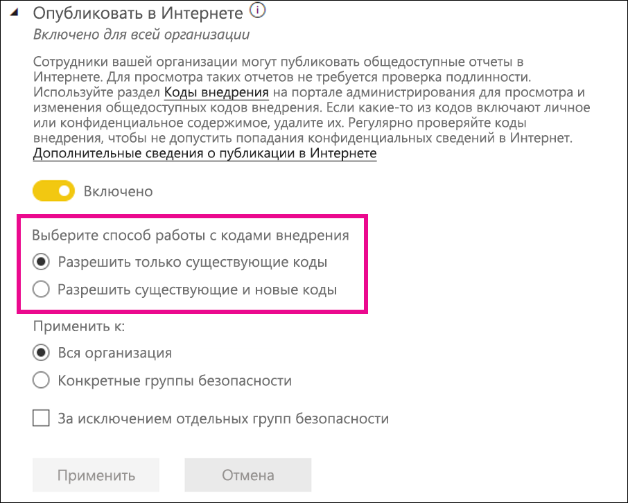
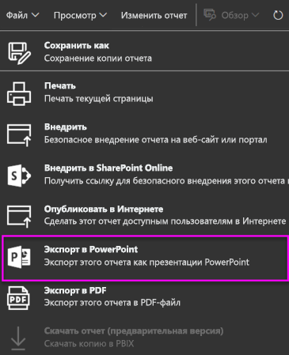

# Администрирование Power BI на портале администрирования

На портале администрирования можно управлять параметрами Power BI для вашей организации. Портал включает метрики использования, доступ к Центру администрирования Microsoft 365 и параметры арендатора.

Доступ ко всем функциям портала администрирования могут иметь глобальные администраторы и пользователи с ролью "Администратор службы Power BI". Если у вас нет этих ролей, вы увидите на портале только пункт **Параметры емкости**. Дополнительные сведения о роли администратора службы Power BI см. в [этой статье](service-admin-role.md).

## Переход к порталу администрирования

Для доступа к порталу администрирования Power BI требуются права глобального администратора или администратора службы Power BI. Дополнительные сведения о роли администратора службы Power BI см. в [этой статье](service-admin-role.md). Чтобы перейти к порталу администрирования Power BI, сделайте следующее:

1. Войдите в [Power BI](https://app.powerbi.com), используя учетные данные учетной записи администратора.

1. В заголовке страницы выберите **Настройки** > **Портал администрирования**.

    

На портале администрирования есть несколько разделов. Сведения о каждом из них представлены ниже.

* [Метрики использования](#usage-metrics)
* [Пользователи](#users)
* [Журналы аудита](#audit-logs)
* [Параметры клиента](#tenant-settings)
* [Параметры емкости](#capacity-settings)
* [Коды внедрения](#embed-codes)
* [Визуальные элементы организации](organizational-visuals.md#organizational-visuals)
* [Подключения Azure (предварительная версия)](#azure-connections-preview)
* [Рабочие области](#workspaces)
* [Пользовательская фирменная символика](#custom-branding)
* [Метрики защиты](#protection-metrics)
* [Рекомендуемое содержимое](#featured-content)

## Метрики использования

Раздел **Метрики использования** позволяет отслеживать использование Power BI в вашей организации. В нем также показано, какие пользователи и группы в вашей организации наиболее активны в Power BI.

> [!NOTE]
> При первом доступе к панели мониторинга или при ее повторном открытии после длительного периода ее неиспользования отображается экран загрузки, так как загрузка панели мониторинга может занимать некоторое время.

После загрузки панели мониторинга отобразится два раздела с плитками. Первый раздел содержит данные об использовании для отдельных пользователей, а второй — аналогичные сведения для групп.

Ниже показано содержимое каждой плитки:

* Точное число всех панелей мониторинга, отчетов и наборов данных в рабочей области пользователя.
  
    

* Самая востребованная панель мониторинга по числу пользователей, которые могут получать к ней доступ. Например: у вас есть панель мониторинга, которую вы совместно используете с тремя пользователями. Вы также добавили панель мониторинга в пакет содержимого, к которому подключены два других пользователя. Число пользователей панели мониторинга — 6 (1 + 3 + 2).
  
    

* Самое популярное содержимое, к которому подключаются пользователи. Это может быть любое содержимое, к которому могут перейти пользователи с помощью функции получения данных, например пакеты содержимого SaaS, пакеты содержимого, файлы или базы данных организации.

  
    

* Представление основных пользователей на основе числа их панелей мониторинга (как созданных ими, так и тех, к которым им предоставлен доступ).
  
    

* Представление основных пользователей на основе числа их отчетов.
  
    

Во втором разделе показаны те же сведения, но для групп. Этот раздел позволяет понять, какие группы в организации являются наиболее активными и какое содержимое они используют.

Благодаря этим данным вы сможете получить полезные сведения о том, как Power BI используется в организации.

## Управление использованием метрик

Отчеты на основе метрик использования — это функция, которую администратор Power BI или глобальный администратор могут включать или выключать. Администраторы могут управлять доступом отдельных пользователей к метрикам использования. По умолчанию эти сведения **включены** для всех пользователей в организации.

Администраторы могут определить, будут ли создатели видеть в метриках использования данные об отдельных пользователях. 

Сведения о самих отчетах вы найдете в статье [Мониторинг метрик использования для панелей мониторинга и отчетов Power BI](../collaborate-share/service-usage-metrics.md).

### Метрики использования для создателей содержимого

1. На портале администрирования выберите **Параметры арендатора** > **Параметры аудита и использования** > **Метрики использования для создателей содержимого**.

    

1. Включите (или выключите) метрики использования и щелкните **Применить**.

    

### Данные отдельных пользователей в метриках использования для создателей содержимого

По умолчанию данные по отдельным пользователям включены для метрик использования, а сведения об учетной записи включены в отчет на основе метрик. Если вы не хотите добавлять сведения об учетных записях для некоторых или всех пользователей, отключите функцию для указанных групп безопасности или для всей организации. В таком случае данные учетных записей будут отображаться в отчете с отметкой *Без имени*.

### Удаление всего существующего содержимого для метрик использования

Отключая метрики использования для всей организации, администраторы могут выбрать одно или оба из следующих действий:

- **Удалить все содержимое существующих метрик использования** . Сюда относятся все существующие плитки отчетов и панелей мониторинга, созданные с помощью отчетов на основе метрик использования и наборов данных. Этот параметр блокирует доступ к данным метрик использования для всех корпоративных пользователей, которые уже могли работать с ними.
- **Удалить все существующие данные отдельных пользователей в текущем содержимом метрик использования** . Этот параметр блокирует доступ к данным метрик использования для всех корпоративных пользователей, которые уже могли работать с ними. 

Будьте внимательны, так как эта операция является необратимой.

## Пользователи

Вы можете управлять пользователями Power BI, администраторами и группами в Центре администрирования Microsoft 365. На вкладке **Пользователи** содержится ссылка для перехода в Центр администрирования.

## Журналы аудита

Вы можете управлять журналами аудита Power BI в центре Безопасности и соответствия требованиям Office 365. На вкладке **Журналы аудита** содержится ссылка для перехода в центр "Безопасность и соответствие требованиям". Дополнительные сведения см. в статье [Отслеживание действий пользователей в Power BI](service-admin-auditing.md).

Чтобы использовать журналы аудита, включите параметр [**Создание журналов аудита для учета внутренних действий и обеспечения соответствия требованиям**](#create-audit-logs-for-internal-activity-auditing-and-compliance).

## Параметры клиента

Вкладка **Параметры арендатора** позволяет детально управлять функциями, которые предоставляются для пользователей вашей организации. Некоторые функции могут не подходить для вашей организации, если вам нужно обеспечить высокий уровень конфиденциальности данных или предоставить определенную функцию отдельной группе.

> [!NOTE]
> Параметры арендатора, позволяющие управлять доступностью функций в пользовательском интерфейсе Power BI, помогают в определении политик управления, но не являются мерой безопасности. Например, параметр **Экспорт данных** не ограничивает разрешения пользователя Power BI в наборе данных. Пользователи Power BI с правом чтения набора данных имеют разрешение на запросы к этому набору данных и могут сохранять результаты без использования функции **Экспорт данных** в пользовательском интерфейсе Power BI.

На следующем рисунке показано несколько параметров на вкладке **Параметры клиента**.

> [!NOTE]
> Для вступления измененных параметров в силу для всех пользователей в организации может потребоваться до 15 минут.

Параметры могут иметь одно из трех состояний:

* **Отключено для всей организации**. Никто в вашей организации не может использовать эту функцию.

    

* **Включено для всей организации**. Любой пользователь из вашей организации может использовать эту функцию.

    

* **Включено для части организации**. Чтобы не включать функцию для всей организации, можно применить этот параметр для **отдельных групп безопасности** в вашей организации, которым разрешено использовать эту функцию.

    Вы также можете включить эту функцию для всей организации или **исключить отдельные группы безопасности**.

    

    Кроме того, вы можете сочетать параметры, чтобы включить функцию только для определенной группы пользователей, за исключением отдельных сотрудников. Так определенные пользователи не будут иметь доступ к функции, даже если они входят в группу с правами доступа к этой функции. Для пользователей приоритетным будет параметр с более строгим ограничением.

    

Следующие несколько разделов содержат общие сведения о различных типах параметров клиента.

## Параметры справки и поддержки

### Публикация информации "Вызова справки"

Чтобы переопределить назначения ссылок в меню "Справка" Power BI и упростить повышение уровня лицензий, администраторы могут указать URL-адреса внутренних ресурсов. Если заданы пользовательские URL-адреса, пользователи в организации будут переходить к внутренним ресурсам справки и службы поддержки вместо назначений по умолчанию. Можно настроить следующие назначения ресурсов:

* **Обучение.** По умолчанию эта ссылка в меню "Справка" позволяет перейти к [списку всех схем и модулей обучения по Power BI](https://docs.microsoft.com/learn/browse/?products=power-bi). Чтобы эта ссылка вела на внутренние ресурсы обучения, задайте пользовательский URL-адрес для параметра **Обучающая документация**.

* **Сообщество.** Чтобы из меню справки пользователи перенаправлялись на внутренний форум вместо форума [сообщества Power BI](https://community.powerbi.com/), задайте пользовательский URL-адрес для параметра **Форум обсуждения**.

* **Повышение уровня лицензий.** Пользователям с бесплатной лицензией Power BI можно предоставить возможность повысить уровень учетной записи до Power BI Pro при использовании службы. Если для параметра **Запросы лицензирования** указать внутренний URL-адрес, пользователи будут перенаправляться на внутренний поток отправки запросов и совершения покупок. Это исключит возможность совершения самостоятельной покупки. Если вы хотите запретить пользователям покупать лицензии, но разрешить использовать пробную версию Power BI Pro, ознакомьтесь с разделом [Возможность пробного использования Power BI Pro](#allow-users-to-try-power-bi-pro), чтобы отделить возможность покупки от пробного использования.

* **Получение справки.** Чтобы из меню "Справка" пользователи перенаправлялись на ресурс внутренней службы поддержки, а не на [страницу службы поддержки Power BI](https://powerbi.microsoft.com/support/), задайте пользовательский URL-адрес для параметра **Служба поддержки**.

### Получать уведомления о сбоях службы и инцидентах по электронной почте

Группы безопасности с включенной поддержкой электронной почты получат уведомления по электронной почте, если на этого клиента повлияет сбой службы или инцидент. Дополнительные сведения об [уведомлениях о перебое в работе служб](service-interruption-notifications.md).

### Возможность пробного использования Power BI Pro

По умолчанию параметр **Возможность пробного использования Power BI Pro** включен. Он обеспечивает больший контроль над тем, как пользователи получают лицензии Power BI Pro. В сценариях с блокировкой самостоятельной покупки этот параметр позволяет начать пробное использование Power BI Pro. Возможности для пользователей зависят от сочетания параметров лицензий. В приведенной ниже таблице показано, как меняется возможность перехода с бесплатной версии Power BI на версию Power BI Pro в зависимости от разных сочетаний параметров:

| Параметр самостоятельной покупки | Параметр "Возможность пробного использования Power BI Pro" | Взаимодействие с пользователем |
| ------ | ------ | ----- |
| Активировано | Выключено | Пользователь может приобрести лицензию Pro, но не может начать использовать пробную версию. |
| Активировано | Активировано | Пользователь может начать использовать бесплатную пробную версию Pro и перейти на платную лицензию. |
| Выключено | Выключено | Для пользователя отображается сообщение со сведениями о том, как обратиться к ИТ-администратору, чтобы запросить лицензию. |
| Выключено | Активировано | Пользователь может начать использовать пробную версию Pro, но должен обратиться к ИТ-администратору, чтобы получить платную лицензию. |

> [!NOTE]
> Для запросов на получение лицензии вы можете добавить внутренний URL-адрес, как описано в разделе [Параметры справки и поддержки](#help-and-support-settings). Указав такой URL-адрес, вы переопределите стандартный процесс покупки. Пользователи, которые могут приобрести лицензию в сценариях, описанных в таблице выше, будут перенаправляться на внутренний URL-адрес.

Дополнительные сведения см. в статье [Включение и отключение самостоятельной регистрации и приобретения](service-admin-disable-self-service.md).

## Параметры рабочей области

На вкладке **Параметры арендатора** портала администрирования есть три раздела для управления рабочими областями:

- [Создание рабочих областей (новый интерфейс рабочих областей).](#create-the-new-workspaces)
- [Использование наборов данных в рабочих областях.](#use-datasets-across-workspaces)
- [Запрет на создание классической рабочей области.](#block-classic-workspace-creation)

### Создание новых рабочих областей

Рабочие области — это места, где пользователи могут работать с информационными панелями, отчетами и другим содержимым. Администраторы используют параметр **Create workspaces (new workspace experience)** (Создание рабочих областей (новый интерфейс рабочих областей)), чтобы определить, кто из пользователей в организации может создавать рабочие области. Администраторы могут разрешить или запретить всем пользователям в организации создавать новые интерфейсы рабочей области в рабочих областях. Они также могут разрешить их создание только участникам определенных групп безопасности. Дополнительные сведения о [рабочих областях](../collaborate-share/service-new-workspaces.md) см. здесь.

:::image type="content" source="media/service-admin-portal/power-bi-admin-workspace-settings.png" alt-text="Создание нового интерфейса рабочей области":::

Для классических рабочих областей на основе групп Microsoft 365 администрирование по-прежнему выполняется на портале администрирования и в Azure Active Directory.

> [!NOTE]
> По умолчанию параметр **Create workspaces (new workspace experience)** (Создание рабочих областей [новый интерфейс рабочих областей]) разрешает создавать новые рабочие области Power BI только тем пользователям, которые могут создавать группы Microsoft 365. Обязательно установите на портале администрирования Power BI значение, позволяющее соответствующим пользователям создавать их.

**Список рабочих областей**

На портале администрирования, в клиенте, есть другой раздел параметров о рабочих областях. В этом разделе список рабочих областей можно отсортировать и отфильтровать для отображения сведений о каждой рабочей области. Дополнительные сведения см. в разделе [Рабочие области](#workspaces) этой статьи.

**Публикация пакетов содержимого и приложений**

На портале администрирования можно также контролировать разрешением на распространение приложений для организации. Дополнительные сведения см.в разделе [Публикация пакетов содержимого и приложений для всей организации](#publish-content-packs-and-apps-to-the-entire-organization).

### Использование наборов данных в рабочих областях

Администраторы могут управлять тем, какие пользователи в организации могут использовать наборы данных в рабочих областях. Если этот параметр включен, пользователям все равно требуется разрешение на сборку для определенного набора данных.

:::image type="content" source="media/service-admin-portal/power-bi-admin-datasets-workspaces.png" alt-text="Использование наборов данных в рабочих областях":::

Дополнительные сведения см. в статье [Введение в использование наборов данных в рабочих областях (предварительная версия)](../connect-data/service-datasets-across-workspaces.md).

### Блокирование создания классической рабочей области

Администраторы могут контролировать, можно ли в организации создавать классические рабочие области. Если этот параметр включен, пользователи, создающие рабочую область, могут создавать только рабочие области с новым интерфейсом. 

Если этот параметр включен, недавно созданные группы Office 365 не будут отображаться в списке рабочих областей Power BI. Существующие классические рабочие области по прежнему будут отображаться в списке. Если этот параметр отключен, все группы Office 365, членом которых является пользователь, отображаются в списке рабочих областей. Узнайте [подробнее о рабочих областях с новым интерфейсом](../collaborate-share/service-new-workspaces.md).

## Параметры экспорта и совместного доступа

### Предоставление внешним пользователям общего доступа к содержимому

Пользователи могут предоставлять общий доступ к панелям мониторинга, отчетам и приложениям пользователям вне организации. Узнайте больше об [общем доступе извне](../collaborate-share/service-share-dashboards.md#share-a-dashboard-or-report-outside-your-organization).

Ниже показано сообщение, которое отображается при предоставлении общего доступа внешнему пользователю.

  

> [!IMPORTANT]
> Этот параметр определяет, могут ли пользователи в Power BI приглашать внешних пользователей в качестве гостевых пользователей Azure Active Directory B2B (Azure AD B2B) в вашей организации с помощью Power BI. Если этот параметр включен, пользователи, обладающие ролью "Приглашающий гостей" в Azure AD, могут добавлять внешние адреса электронной почты при предоставлении общего доступа к отчетам, информационным панелям и приложениям Power BI. Внешних получателей приглашают присоединиться к организации в качестве гостевых пользователей Azure AD B2B. Важно! При отключении этого параметра внешние пользователи, которые уже являются гостевыми пользователями Azure AD B2B в вашей организации, продолжают отображаться в пользовательских интерфейсах для средства выбора людей в Power BI и им можно предоставлять доступ к элементам, рабочим областям и приложениям.

### Опубликовать в Интернете

Администратор клиента Power BI может управлять тем, для каких элементов пользователи могут создавать коды внедрения с помощью функции **Опубликовать в Интернете**. Эта функция делает отчет и содержащиеся в нем данные доступными всем пользователям в Интернете. Дополнительные сведения о [публикации в Интернете](../collaborate-share/service-publish-to-web.md).

> [!NOTE]
> Только администраторы Power BI могут разрешать создавать коды внедрения для публикации в Интернете. У организаций могут быть существующие коды внедрения. Для просмотра опубликованных в настоящее время отчетов обратитесь к разделу [Коды внедрения](service-admin-portal.md#embed-codes) на портале администрирования.

Ниже показано меню **Дополнительные параметры (...)** для отчета с включенным параметром **Опубликовать в Интернете**.

Параметр **Опубликовать в Интернете** на портале администрирования позволяет управлять тем, для каких элементов пользователи могут создавать коды внедрения.

Администратор может выбрать для параметра **Опубликовать в Интернете** значение **Включено**, а для параметра **Выберите способ работы с кодами внедрения** — значение **Разрешить только существующие коды внедрения**. В этом случае пользователи могут создавать коды внедрения, но им нужно обращаться к администратору Power BI за разрешением.

Отображаемые в пользовательском интерфейсе параметры зависят от настроек параметра **Опубликовать в Интернете**.

|Признак |Включена для всей организации |Отключена для всей организации |Конкретные группы безопасности   |
|---------|---------|---------|---------|
|**Опубликовать в Интернете** в меню **Дополнительные параметры (...)** отчета|Включена для всех|Не отображается никому|Отображается только авторизованным пользователям и группам.|
|**Управление кодами внедрения** в меню **Параметры**|Включена для всех|Включена для всех|Включена для всех  Параметр * **Удалить** доступен для авторизованных пользователей или групп. Параметр * **Получить коды** доступен для всех.|
|Параметр **Коды внедрения** на портале администратора|Состояние отражает одно из следующих значений: * Активен * Не поддерживается * Заблокирован|Отображается состояние **Отключено**|Состояние отражает одно из следующих значений: * Активен * Не поддерживается * Заблокирован  Если пользователь не авторизовался в соответствии с настройками клиента, отображается состояние **Нарушено**.|
|Существующие опубликованные отчеты|Все включены|Все отключены|Отчеты продолжают отображаться для всех.|

### Экспорт данных

Пользователи в организации могут экспортировать данные с плитки или из визуализации. Этот параметр управляет функциями "Анализ в Excel", "Динамическое подключение к службе Power BI", а также функциями экспорта в CSV-файл и скачивания наборов данных (PBIX). Дополнительные сведения об [экспорте данных из плитки или визуального элемента](../visuals/power-bi-visualization-export-data.md).

>[!NOTE]
> До появления параметра "Экспорт в Excel" этот параметр также управлял экспортом данных в файлы Excel. Подробные сведения см. в [примечании в конце раздела "Экспорт в Excel"](#export-to-excel).

Ниже показан параметр для экспорта данных из плитки.

> [!NOTE]
> Если отключить параметр **Экспортировать данные**, пользователи не смогут использовать функцию [анализа в Excel](../collaborate-share/service-analyze-in-excel.md), а также функцию динамического подключения к службе Power BI.

### Экспорт в Excel

Пользователи в организации могут экспортировать данные из визуализации в файл Excel.

>[!IMPORTANT]
> До появления параметра "Экспорт в Excel" экспортом данных в файлы Excel управлял параметр "Экспорт данных". Поэтому в клиентах, существовавших до появления параметра "Экспорт в Excel", при первом обращении к нему администраторы клиента будут видеть *несохраненные изменения*. Чтобы новый параметр вступил в силу, им необходимо применить эти изменения. В противном случае экспорт в файл Excel будет по прежнему контролироваться параметром "Экспорт данных".

### Экспорт отчетов в презентации PowerPoint или PDF-документы

Пользователи в организации могут экспортировать отчеты Power BI в виде файлов PowerPoint или PDF-документов. [Дополнительные сведения](../consumer/end-user-powerpoint.md)

Ниже показано меню **Файл** для отчета с включенным параметром **Экспорт отчетов в презентации PowerPoint или PDF-документы**.

### Печать панелей мониторинга и отчетов

Пользователи в организации могут распечатывать информационные панели и отчеты. [Дополнительные сведения](../consumer/end-user-print.md)

Ниже показана функция печати панели мониторинга.

Ниже показано меню **Файл** для отчета с включенным параметром **Печать панелей мониторинга и отчетов**.

### Разрешение внешним гостям отслеживать и изменять содержимое в организации

Гостевые пользователи Azure AD B2B могут изменять содержимое в организации и управлять им. [Дополнительные сведения](service-admin-azure-ad-b2b.md)

На следующем изображении показан параметр "Разрешение внешним гостям отслеживать и изменять содержимое в организации".

На портале администрирования можно также контролировать разрешения на приглашение внешних пользователей для организации. Дополнительные сведения см. в разделе о [предоставлении общего доступа к содержимому для внешних пользователей](#export-and-sharing-settings).

### Почтовые подписки
Пользователи в организации могут создавать почтовые подписки. Дополнительные сведения о [подписках](../collaborate-share/service-publish-to-web.md)см. здесь.

### Рекомендуемое содержимое

Разрешите некоторым или всем авторам отчетов в организации использовать их содержимое в разделе "Подборка"на главной странице Power BI. Новые пользователи увидят рекомендуемые материалы в верхней части главной страницы Power BI. Рекомендуемые материалы добавляются на главную страницу по мере добавления пользователями содержимого в раздел **Подборка**, **часто используемых материалов** и **последних документов**. 

Мы советуем начинать с небольшого набора рекомендателей. Предоставление всей организации возможности рекомендовать содержимое может привести к тому, что рекомендуемые материалы будет довольно сложно отслеживать. 

После включения рекомендуемого содержимого им также можно управлять на портале администрирования. Сведения об управлении рекомендуемым содержимым по вашей тематике см. в разделе [Управление рекомендуемым содержимым](#manage-featured-content) в этой статье.

## Пакет содержимого и параметры приложения

### Публикация пакетов содержимого и приложений в пределах всей организации

Администраторы используют этот параметр, чтобы решить, кто из пользователей может публиковать пакеты содержимого и приложения для всей организации, а не только для определенных групп. Дополнительные сведения о [публикации приложений](../collaborate-share/service-create-distribute-apps.md).

Ниже показан параметр **Вся моя организация** при создании пакета содержимого.

### Создание шаблона приложений и пакеты содержимого организации

Пользователи в организации могут создавать шаблон приложений и пакеты содержимого организации, в которых используются наборы данных, созданные на основе одного источника данных из Power BI Desktop. См. дополнительные сведения о [приложениях-шаблонах](../connect-data/service-template-apps-create.md).

### Принудительно отправлять приложения конечным пользователям

Создатели отчетов могут отправлять приложения конечным пользователям напрямую без установки из [AppSource](https://appsource.microsoft.com). Дополнительные сведения см. в разделе [Автоматическая установка приложений для пользователей](../collaborate-share/service-create-distribute-apps.md#automatically-install-apps-for-end-users).

## Вкладка "Параметры интеграции"

### Параметр "Использовать анализ в Excel для работы с локальными наборами данных"

Пользователи в организации могут просматривать локальные наборы данных Power BI и взаимодействовать с ними в Excel. [Дополнительные сведения](../collaborate-share/service-analyze-in-excel.md)

> [!NOTE]
> Если отключить параметр **Экспортировать данные**, пользователи не смогут использовать функцию **анализа в Excel**.

### Использовать ArcGIS Maps for Power BI

Пользователи в организации могут использовать визуализацию ArcGIS Maps for Power BI от Esri. [Дополнительные сведения](../visuals/power-bi-visualization-arcgis.md)

### Использование глобального поиска для Power BI (предварительная версия)

Пользователи в организации могут использовать внешние функции поиска на основе службы "Поиск Azure".

## Параметры подборки таблиц

В разделе **Параметры клиента** параметр **Разрешение подключений к рекомендуемым таблицам** позволяет администраторам Power BI управлять тем, кто в организации может использовать рекомендуемые таблицы из коллекции типов данных Excel. 

:::image type="content" source="media/service-admin-portal/admin-allow-connections-featured-tables.png" alt-text="Все подключения к рекомендуемым таблицам":::

Подключения к рекомендуемым таблицам также отключаются, если для параметра **Экспорт данных** клиента задано значение **Отключено**.

См. дополнительные сведения о [рекомендуемых таблицах Power BI в Excel](../collaborate-share/service-excel-featured-tables.md).

## Параметр "Поделиться в Teams" для клиента

Параметр **Поделиться в Teams** находится в разделе **Параметры клиента** на портале администрирования Power BI. Этот параметр позволяет организациям скрывать кнопку **Поделиться в Teams** в службе Power BI. Если этот параметр отключен, пользователи не увидят кнопки **Поделиться в Teams** на панели действий или в контекстных меню при просмотре отчетов и панелей мониторинга в службе Power BI.

Узнайте [подробнее о предоставлении общего доступа к содержимому Power BI в Teams](../collaborate-share/service-share-report-teams.md).

## Вкладка "Параметры визуальных элементов R"

### Взаимодействие с визуальными элементами R и их публикация

Пользователи в организации могут взаимодействовать с визуальными элементами, созданными при помощи R-скриптов, и делиться ими. [Дополнительные сведения](../visuals/service-r-visuals.md)

> [!NOTE]
> Этот параметр применяется ко всей организации и не ограничивается определенными группами.

## Параметры аудита и использования

### Создание журналов аудита для аудита внутренних действий и обеспечения соответствия требованиям

Пользователи в организации могут отслеживать действия других пользователей в Power BI при помощи аудита. [Дополнительные сведения](service-admin-auditing.md)

Для сбора записей журнала аудита этот параметр должен быть включен. После включения аудита его данные могут отобразиться с задержкой до 48 часов. Если данные не отображаются сразу, проверьте журналы аудита позже. Аналогичная задержка возможна при получении разрешения на просмотр журналов аудита: доступ к ним может быть предоставлен не сразу.

> [!NOTE]
> Этот параметр применяется ко всей организации и не ограничивается определенными группами.

### Метрики использования для создателей содержимого

Пользователи в организации могут просматривать метрики использования созданных ими панелей мониторинга и отчетов. [Дополнительные сведения](../collaborate-share/service-usage-metrics.md)

### Данные отдельных пользователей в метриках использования для создателей содержимого

В метриках использования для создателей содержимого будут отражены имена и адреса электронной почты пользователей, которые обращаются к содержимому. [Дополнительные сведения](../collaborate-share/service-usage-metrics.md)

Данные пользователей включены для метрик использования по умолчанию, а сведения об учетной записи создателя содержимого включаются в отчет на основе метрик. Если вы не хотите собирать эту информацию для всех пользователей, вы можете отключить функцию для указанных групп безопасности или для всей организации. В таком случае учетные записи исключенных пользователей будут отображаться в отчете как *Без имени*.

## Параметры панели мониторинга

### Классификация данных для панелей мониторинга

Пользователи в организации могут отмечать панели мониторинга, используя классификации, определяющие уровни безопасности. [Дополнительные сведения](../create-reports/service-data-classification.md)

> [!NOTE]
> Этот параметр применяется ко всей организации и не ограничивается определенными группами.

## Параметры разработчика

### Внедрение содержимого в приложениях

Пользователи в организации могут внедрить панели мониторинга и отчеты Power BI в приложения SaaS. Если отключить этот параметр, пользователи не смогут использовать REST API для внедрения содержимого Power BI в приложение. [Дополнительные сведения](../developer/embedded/embedding.md)

### Разрешение субъектам-службам использовать API-интерфейсы Power BI

Веб-приложения, зарегистрированные в Azure Active Directory (Azure AD), будут использовать назначенный субъект-службу для доступа к API-интерфейсам Power BI, когда не выполнен вход пользователя. Чтобы использовать такую аутентификацию, добавьте субъект-службу приложения в разрешенную группу безопасности. [Дополнительные сведения](../developer/embedded/embed-service-principal.md)

> [!NOTE]
> Субъекты-службы наследуют разрешения для всех параметров клиента Power BI от своей группы безопасности. Чтобы дополнительно ограничить разрешения, создайте для субъектов-служб отдельную группу безопасности и добавьте ее в список "За исключением отдельных групп безопасности" для тех параметров Power BI, которые должны быть включены.

## Параметры потока данных

### Создание и использование потоков данных

Пользователи в организации могут создавать и использовать потоки данных. Общие сведения о потоках данных. [Самостоятельная подготовка данных в Power BI](../transform-model/service-dataflows-overview.md). Чтобы включить потоки данных в емкости Premium, см. [Настройка рабочих нагрузок](service-admin-premium-workloads.md).

> [!NOTE]
> Этот параметр применяется ко всей организации и не ограничивается определенными группами.

## Параметры приложений-шаблонов

Приложения-шаблоны имеют возможность публикации или установки приложений шаблона, находясь под контролем трех параметров.

### Публикация приложений-шаблонов

Пользователи в организации могут создавать рабочие области приложений-шаблонов. Контролировать, какие пользователи могут публиковать приложения-шаблоны или распространять эти приложения среди клиентов вне вашей организации через[AppSource](https://appsource.microsoft.com) или иным методом.

### Установка приложений-шаблонов, перечисленных в AppSource

Пользователи в организации могут выполнять загрузку и установку приложений-шаблонов **только** из [AppSource](https://appsource.microsoft.com). Проконтролируйте, какой определенный пользователь или группа безопасности имеет полномочия к выполнению установки приложений-шаблонов из AppSource.

### Установка приложений-шаблонов, не перечисленных в AppSource

Проконтролируйте, какие пользователи в организации могут выполнять загрузку и установку приложений-шаблонов **не перечисленных [ в ](https://appsource.microsoft.com)AppSource**.

## Параметры емкости

### Power BI Premium

На вкладке **Power BI Premium** можно управлять любыми емкостями Power BI Premium (номер SKU Em или P), приобретенными для вашей организации. Вкладка **Power BI Premium** будет отображаться для всех пользователей вашей организации, но они смогут увидеть ее содержимое, только если им назначена роль *администратора емкости* или пользователя с назначенными разрешениями. Если у пользователей нет разрешений, появляется следующее сообщение.

### Power BI Embedded

Вкладка **Power BI Embedded** позволяет просматривать емкости Power BI Embedded (номер SKU А), приобретенные для клиента. Так как вы можете приобрести только номер SKU A в Azure, вы можете [управлять емкостями Embedded в Azure](../developer/embedded/azure-pbie-create-capacity.md) на **портале Azure**.

Дополнительные сведения о том, как управлять параметрами Power BI Embedded (номер SKU A), см. в статье [Что такое Power BI Embedded в Azure?](../developer/embedded/azure-pbie-what-is-power-bi-embedded.md)

## Коды внедрения

Как администратор, вы можете просматривать коды внедрения, созданные для вашего клиента для предоставления общего доступа к отчетам. Коды можно также отзывать или удалять. [Дополнительные сведения](../collaborate-share/service-publish-to-web.md)

## Визуальные элементы организации

Все параметры администрирования визуализаций Power BI, включая параметры арендатора для визуализаций Power BI, описаны в статье [Управление параметрами администратора визуальных элементов Power BI](organizational-visuals.md).

## Подключения Azure (предварительная версия)

### Хранилище на уровне арендатора (предварительная версия)

По умолчанию данные, используемые в Power BI, хранятся во внутренней памяти, предоставляемой Power BI. С помощью интеграции потоков данных и Azure Data Lake Storage 2-го поколения (ADLS 2-го поколения) вы можете хранить свои потоки данных в корпоративной учетной записи Azure Data Lake Storage 2-го поколения. Дополнительную информацию см. в статье [Потоки данных и интеграция Azure Data Lake (предварительная версия)](../transform-model/service-dataflows-azure-data-lake-integration.md).

### Разрешения хранилища на уровне рабочей области (предварительная версия)

По умолчанию администраторы рабочей области не могут подключить свою учетную запись хранения. Используя эту предварительную версию функции, вы можете включить параметр, позволяющий администраторам рабочей области подключать свои учетные записи хранения.

## Рабочие области

Как администратор вы можете просматривать рабочие области в вашем арендаторе на вкладке **Рабочие области**. На этой вкладке можно выполнять такие действия:

- Обновить список рабочих областей и сведения о них.
- Экспортировать данные о рабочих областях в CSV-файл. 
- Просмотреть сведения о рабочей области, включая ее идентификатор, пользователей и их роли, а также панели мониторинга, отчеты и наборы данных.
- Изменить список пользователей, которым предоставлен доступ. Это означает, что рабочую область можно удалить. Вы можете добавить себя в рабочую область как администратора, а затем открыть рабочую область и удалить ее.
- Изменить имена и описание полей.

Администраторы также могут управлять возможностью пользователей создавать новые рабочие области и классические рабочие области. Дополнительные сведения см. в разделе [Параметры рабочей области](#workspace-settings) этой статьи. 

Столбцы таблицы на вкладке **Рабочие области** соответствуют свойствам, которые возвращает [REST API администратора Power BI](/rest/api/power-bi/admin) для рабочих областей. Личные рабочие области принадлежат типу **PersonalGroup**, классические рабочие области — типу **Group** и новые рабочие области — типу **Workspace**. Дополнительные сведения см. в статье [Организация работы в новых рабочих областях](../collaborate-share/service-new-workspaces.md).

На вкладке **Рабочие области** отображается *состояние* каждой рабочей области. В следующей таблице приводятся более подробные сведения о значении этих состояний.

|Состояние  |Описание  |
|---------|---------|
| **Активен** | Обычная рабочая область. Не указывает ни на какие сведения об использовании, лишь на то, что сама рабочая область — обычная. |
| **Потерянная** | Рабочая область без пользователя с правами администратора. |
| **Удалено** | Удаленная рабочая область. В течение 90 дней мы храним достаточно метаданных для восстановления рабочей области, если это потребуется. |
| **Удаление** | Рабочая область в процессе удаления, но еще не пропала. Пользователи могут удалять свои рабочие области, помещая их в удаленное и в конечном итоге удаляя. |

Администраторы также могут управлять рабочими областями и восстанавливать их с помощью портала администрирования или командлетов PowerShell. 

## Пользовательская фирменная символика

Администратор может настроить внешний вид Power BI для всей организации. В настоящее время существует три основных варианта:

* **Передать логотип**. Для получения лучших результатов передайте логотип в формате PNG размером не более 10 КБ с разрешением не менее 200 x 30 пикселей.

* **Передать изображение обложки**. Для получения лучших результатов передайте изображение обложки в формате JPG или PNG размером не более 1 МБ с разрешением не менее 1920 x 160 пикселей.

* **Выбрать цвет темы**. Вы можете выбрать тему на основе шестнадцатеричного кода, RGB, значения или из предоставленной палитры.

Дополнительные сведения о пользовательской фирменной символике для вашей организации см. [здесь](https://aka.ms/orgBranding).

## Метрики защиты

Когда вы включите защиту информации для Power BI, на портале администрирования станут отображаться метрики защиты данных. В этом отчете показано, как метки конфиденциальности помогают защитить ваше содержимое.

## Управление рекомендуемым содержимым

Администратор клиента может управлять всеми отчетами, панелями мониторинга и приложениями, которые были добавлены в раздел "Подборка" на главной странице Power BI в организации.

- На портале администрирования выберите **Рекомендуемое содержимое**.

Здесь представлены общие сведения о том, кто рекомендовал содержимое и когда это было сделано, а также все соответствующие метаданные. Если что-то кажется подозрительным или вы хотите очистить раздел "Подборка", при необходимости можно удалить содержимое, которое было бы рекомендовано.

Сведения о включении рекомендуемого содержимого см. в разделе [Рекомендуемое содержимое](#featured-content) в этой статье.

## Дальнейшие действия

[Администрирование Power BI в организации](service-admin-administering-power-bi-in-your-organization.md)  
[Основные сведения о роли администратора Power BI](service-admin-role.md)  
[Аудит Power BI в организации](service-admin-auditing.md)  

Появились дополнительные вопросы? [Попробуйте задать вопрос в сообществе Power BI.](https://community.powerbi.com/)
