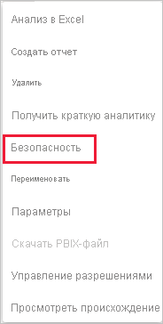

# Безопасность на уровне строк (RLS) в Power BI

Функции безопасности на уровне строк (RLS) в Power BI позволяют ограничивать доступ к данным для определенных пользователей. Фильтры ограничивают доступ к данным на уровне строк; определить их можно в ролях. В службе Power BI участники рабочей области имеют доступ к наборам данных в ней. Безопасность на уровне строк не ограничивает такой доступ.

Вы можете настроить RLS для моделей данных, импортированных в Power BI с помощью Power BI Desktop. Вы также можете настроить RLS для наборов данных, которые используют DirectQuery, таких как SQL Server. Для динамических подключений Analysis Services или Azure Analysis Services безопасность на уровне строк настраивается в модели, а не в Power BI Desktop. Параметр безопасности не будет отображаться для наборов данных динамического подключения.

[!INCLUDE [include-short-name](../includes/rls-desktop-define-roles.md)]

По умолчанию при фильтрации с обеспечением безопасности на уровне строк используются однонаправленные фильтры, независимо от установленного типа связи (однонаправленной или двунаправленной). Вы можете вручную включить двунаправленную кросс-фильтрацию с обеспечением безопасности на уровне строк. Для этого выберите связь и установите флажок **Применить фильтр безопасности в обоих направлениях**. Выберите этот параметр, если на уровне сервера также реализована функция динамической безопасности на уровне строк и при этом безопасность на уровне строк обеспечивается на основе имени пользователя.

Дополнительные сведения см. в статье [Двунаправленная перекрестная фильтрация при работе с DirectQuery в Power BI Desktop](../transform-model/desktop-bidirectional-filtering.md) и техническом документе по [обеспечению безопасности в табличной семантической модели бизнес-аналитики](https://download.microsoft.com/download/D/2/0/D20E1C5F-72EA-4505-9F26-FEF9550EFD44/Securing%20the%20Tabular%20BI%20Semantic%20Model.docx).

[!INCLUDE [include-short-name](../includes/rls-desktop-view-as-roles.md)]

## Управление безопасностью в модели

Для управления безопасностью в модели данных выполните следующие действия.

1. В службе Power BI выберите меню **Дополнительные параметры** для набора данных. Это меню появляется при наведении указателя мыши на имя набора данных независимо от того, выбираете ли вы его в меню навигации или на странице рабочей области.

    

    

1. Выберите **Безопасность**.

   

После выбора пункта "Безопасность" откроется страница RLS, где можно добавить участников к роли, созданной в Power BI Desktop. Параметр "Безопасность" отображается только владельцам набора данных. Если набор данных передается в составе группы, этот параметр будет доступен только администраторам.

Создавать и изменять роли можно только в приложении Power BI Desktop.

## Работа с участниками

### Добавление членов

Добавьте участника в роль, введя адрес электронной почты, имя пользователя или группу безопасности. Невозможно добавить группы, созданные в Power BI. Вы можете добавлять участников, [находящихся вне вашей организации](../guidance/whitepaper-azure-b2b-power-bi.md#data-security-for-external-partners).

Также по числу в скобках рядом с именем роли или рядом с участниками можно определить, сколько участников входит в данную роль.

### Удаление членов

Участников можно удалять, нажимая "X" рядом с их именем. 

## Проверка роли в службе Power BI

Чтобы убедиться в работоспособности роли, которую вы определили, выполните проверку роли.

1. Выберите **Дополнительные параметры** (...) рядом с ролью.
2. Выберите пункт **Проверить данные в качестве роли**.

На экран будут выведены отчеты, доступные для этой роли. Панели мониторинга не отображаются в этом представлении. В верхнем колонтитуле страницы будет показана применяемая роль.

Проверьте другие роли или комбинации ролей, выбрав **Now viewing as** (Теперь показать как).

Вы можете просмотреть данные для определенного пользователя или выбрать комбинацию из доступных ролей, чтобы проверить их работоспособность.

Чтобы вернуться в обычный режим просмотра, выберите **Вернуться к безопасности на уровне строк**.

[!INCLUDE [include-short-name](../includes/rls-usernames.md)]

## Использование RLS с рабочими областями в Power BI

При публикации отчета Power BI Desktop в рабочей области в службе Power BI роли будут применяться к участникам с правами только для чтения. В параметрах рабочей области вам потребуется указать, что участники могут только просматривать содержимое Power BI.

> [!WARNING]
> Если вы настроили рабочую область таким образом, что ее участники обладают разрешениями на изменение, то роли RLS не будут применяться к этим участникам. Пользователи могут видеть все данные.

[!INCLUDE [include-short-name](../includes/rls-limitations.md)]

[!INCLUDE [include-short-name](../includes/rls-faq.md)]

## Дальнейшие действия

- [Ограничение доступа к данным с помощью безопасности на уровне строк (RLS) для Power BI Desktop](../create-reports/desktop-rls.md)
- [Руководство по обеспечению безопасности на уровне строк (RLS) в Power BI Desktop](../guidance/rls-guidance.md)
- Вопросы? [Попробуйте задать вопрос в сообществе Power BI.](https://community.powerbi.com/)
- У вас есть предложения? [Идеи по улучшению Power BI](https://ideas.powerbi.com/)
