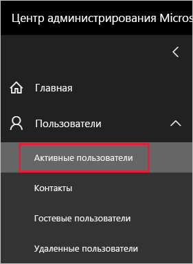
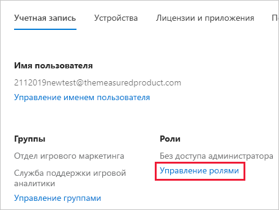
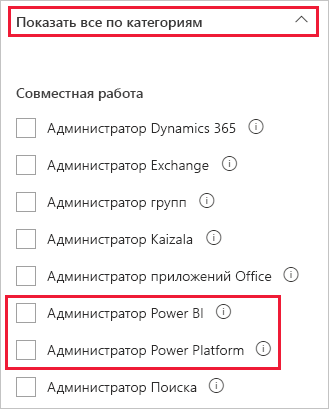

# <a name="understanding-power-bi-service-administrator-roles"></a>Основные сведения о ролях администратора службы Power BI

Для администрирования клиента Power BI пользователю должна быть назначена одна из следующих ролей: администратор Power BI, администратор Power Platform или глобальный администратор Microsoft 365. Роли администратора Power BI или Power Platform пользователям назначают администраторы управления пользователями Microsoft 365 в Центре администрирования Microsoft 365 или с помощью скрипта PowerShell. Дополнительные сведения см. в статье, посвященной [назначению ролей учетным записям пользователей с помощью PowerShell](/office365/enterprise/powershell/assign-roles-to-user-accounts-with-office-365-powershell).

Пользователи с ролями администратора Power BI и Power Platform могут полностью управлять клиентом Power BI и его административными функциями (кроме лицензирования). Когда роль будет назначена, пользователь сможет получить доступ к [порталу администрирования Power BI](service-admin-portal.md). Пользователь будет иметь доступ к метрикам использования, а также сможет управлять функциями Power BI на уровне клиента. Эти роли администратора идеально подходят пользователям, которым нужен доступ к порталу администрирования Power BI без полного административного доступа к службам Microsoft 365.

> [!NOTE]
> В документации по Power BI под администратором Power BI понимается пользователь, которому назначена роль администратора Power BI или Power Platform. В документации четко указывается, когда для выполнения задачи требуется роль глобального администратора Microsoft 365.

## <a name="limitations-and-considerations"></a>Рекомендации и ограничения

Роли администратора службы Power BI и администратора Power Platform не предоставляют следующие возможности:

* Изменение пользователей и лицензий в Центре администрирования Microsoft 365.

* Доступ к журналам аудита. Дополнительные сведения см. в разделе [Отслеживание действий пользователей в Power BI](service-admin-auditing.md).

Для выполнения этих задач требуется роль глобального администратора Microsoft 365.

## <a name="assign-users-to-an-admin-role-in-the-microsoft-365-admin-center"></a>Назначение пользователям роли администратора в Центре администрирования Microsoft 365

Чтобы назначить пользователям роль администратора в Центре администрирования Microsoft 365, выполните следующие действия.

1. В [Центре администрирования Microsoft 365](https://portal.office.com/adminportal/home#/homepage) выберите **Пользователи** > **Активные пользователи**.

    

1. Выберите пользователя, которому нужно назначить роль.

1. Выберите элемент **Роли** в разделе **Управление ролями**.

    

1. Разверните узел **Показать все по категориям** и затем выберите **Администратор Power BI** или **Администратор Power Platform**.

    

1. Щелкните **Save changes** (Сохранить изменения).

## <a name="assign-users-to-the-admin-role-with-powershell"></a>Назначение пользователям роли администратора с помощью PowerShell

Вы также можете назначать роли пользователям с помощью PowerShell. Управление пользователями осуществляется с помощью Azure Active Directory (Azure AD). Если у вас нет модуля PowerShell для Azure AD, [скачайте и установите последнюю версию](https://www.powershellgallery.com/packages/AzureAD/).

1. Сначала подключитесь к Azure AD.
   ```
   PS C:\Windows\system32> Connect-AzureAD
   ```

1. После этого получите **идентификатор объекта** для роли **Администратор службы Power BI**. Чтобы получить **идентификатор объекта**, можно выполнить команду [Get-AzureADDirectoryRole](/powershell/module/azuread/get-azureaddirectoryrole).

    ```
    PS C:\Windows\system32> Get-AzureADDirectoryRole

    ObjectId                             DisplayName                        Description
    --------                             -----------                        -----------
    00f79122-c45d-436d-8d4a-2c0c6ca246bf Power BI Service Administrator     Full access in the Power BI Service.
    250d1222-4bc0-4b4b-8466-5d5765d14af9 Helpdesk Administrator             Helpdesk Administrator has access to perform..
    3ddec257-efdc-423d-9d24-b7cf29e0c86b Directory Synchronization Accounts Directory Synchronization Accounts
    50daa576-896c-4bf3-a84e-1d9d1875c7a7 Company Administrator              Company Administrator role has full access t..
    6a452384-6eb9-4793-8782-f4e7313b4dfd Device Administrators              Device Administrators
    9900b7db-35d9-4e56-a8e3-c5026cac3a11 AdHoc License Administrator        Allows access manage AdHoc license.
    a3631cce-16ce-47a3-bbe1-79b9774a0570 Directory Readers                  Allows access to various read only tasks in ..
    f727e2f3-0829-41a7-8c5c-5af83c37f57b Email Verified User Creator        Allows creation of new email verified users.
    ```

    В этом случае **идентификатором объекта** роли будет 00f79122-c45d-436d-8d4a-2c0c6ca246bf.

1. Затем получите **идентификатор объекта** пользователя. Его можно найти, выполнив команду [Get-AzureADUser](/powershell/module/azuread/get-azureaduser).

    ```
    PS C:\Windows\system32> Get-AzureADUser -ObjectId 'tim@contoso.com'

    ObjectId                             DisplayName UserPrincipalName      UserType
    --------                             ----------- -----------------      --------
    6a2bfca2-98ba-413a-be61-6e4bbb8b8a4c Tim         tim@contoso.com        Member
    ```

1. Чтобы добавить участника в роль, выполните команду [Add-AzureADDirectoryRoleMember](/powershell/module/azuread/add-azureaddirectoryrolemember).

    | Параметр | Описание |
    | --- | --- |
    | ObjectId |Идентификатор объекта роли. |
    | RefObjectId |Идентификатор объекта участников. |

    ```powershell
    Add-AzureADDirectoryRoleMember -ObjectId 00f79122-c45d-436d-8d4a-2c0c6ca246bf -RefObjectId 6a2bfca2-98ba-413a-be61-6e4bbb8b8a4c
    ```

## <a name="next-steps"></a>Дальнейшие действия

[Администрирование Power BI в организации](service-admin-administering-power-bi-in-your-organization.md)  
[Портал администрирования Power BI](service-admin-portal.md)  

Появились дополнительные вопросы? [Попробуйте задать вопрос в сообществе Power BI.](https://community.powerbi.com/)