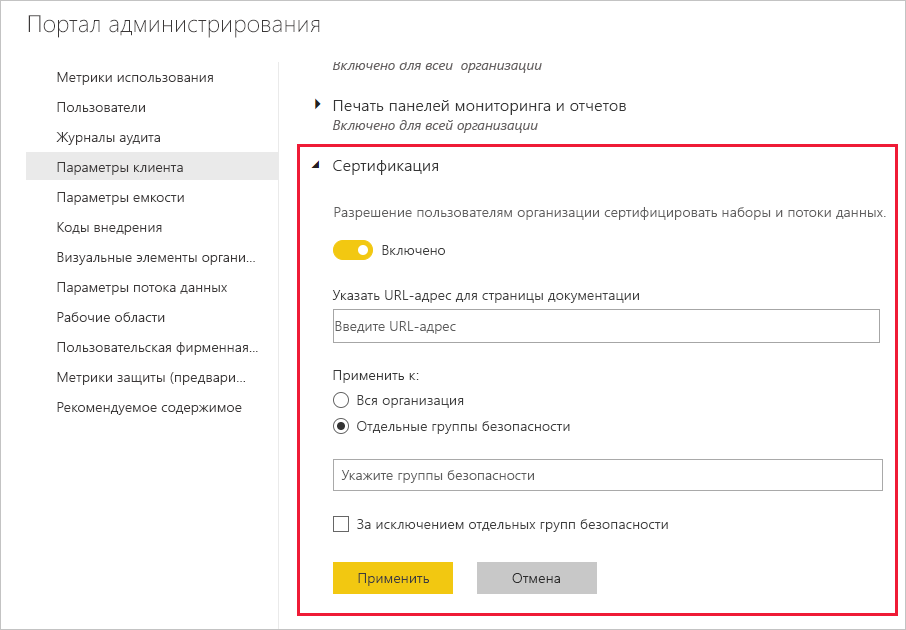

# Настройка сертификации наборов и потоков данных (предварительная версия)

Ваша организация может сертифицировать наборы и потоки данных, которые являются заслуживающим доверия источником критически важных сведений.

Администратор клиента Power BI несет ответственность за настройку процесса сертификации для организации. Это означает следующее:
* Включение сертификации в клиенте.
* Определение списка групп и пользователей, которым разрешено сертифицировать наборы и потоки данных.
* Для наборов данных укажите URL-адрес политики сертификации наборов данных организации, если такая политика существует.

Сертификация наборов и потоков данных входит в *подтверждение* наборов и потоков данных. Дополнительные сведения см. в статьях о [подтверждении наборов данных](../service-datasets-promote.md) и [подтверждении потоков данных](../transform-model/service-dataflows-promote-certify.md).

## Настройка сертификации

1. На портале администрирования перейдите в раздел "Параметры клиента".
1. В разделе "Параметры экспорта и общего доступа" разверните раздел "Сертификация".

   

1. Установите переключатель в положение **Включено**.
1. Если в вашей организации есть опубликованная политика сертификации, для сертификации набора данных можно указать ее URL-адрес. Это будет ссылка **Дополнительные сведения** в разделе сертификации [диалогового окна параметров подтверждения потока данных](../service-datasets-promote.md#request-dataset-certification). 
1. Укажите пользователей или группы, которым разрешено сертифицировать наборы и потоки данных. Эти полномочные пользователи смогут использовать кнопку "Сертификация" в разделе "Сертификация" диалогового окна параметров подтверждения [набора данных](../service-datasets-promote.md#request-dataset-certification) или [потока данных](../transform-model/service-dataflows-promote-certify.md#certify-a-dataflow).
1. Щелкните **Применить**.

## Дальнейшие действия
* [Повышение уровня наборов данных](../service-datasets-promote.md)
* [Сертификация наборов данных](../service-datasets-certify.md)
* [Повышение уровня потоков данных](../transform-model/service-dataflows-promote-certify.md#promote-a-dataflow)
* [Сертификация потоков данных](../transform-model/service-dataflows-promote-certify.md#certify-a-dataflow)
* У вас появились вопросы? [Попробуйте задать вопрос в сообществе Power BI.](https://community.powerbi.com/)
