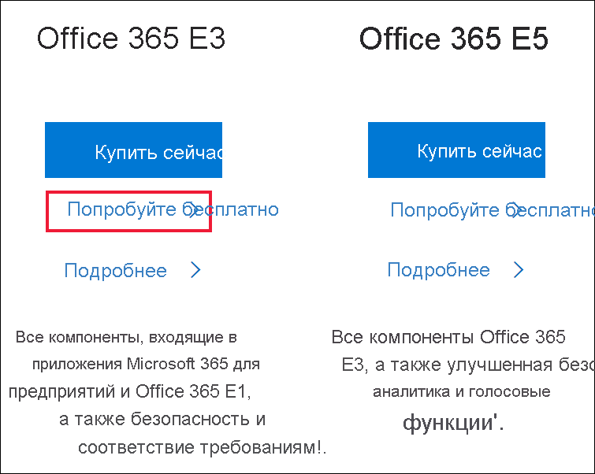
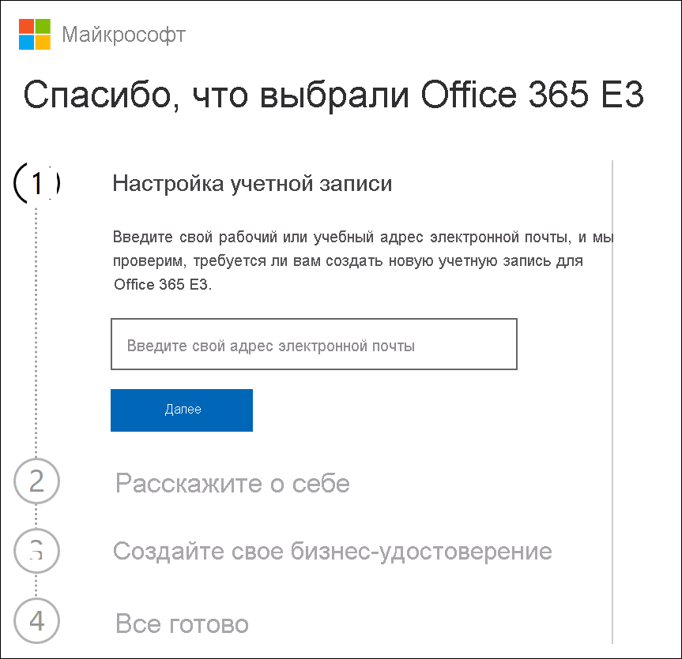
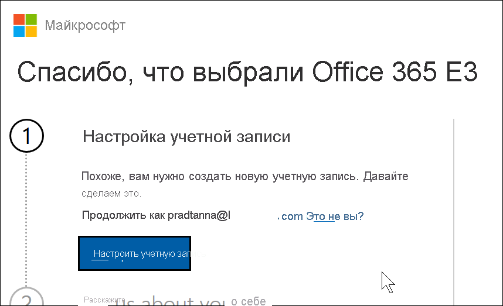
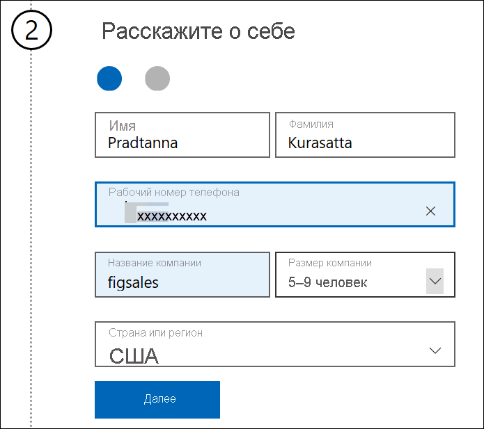
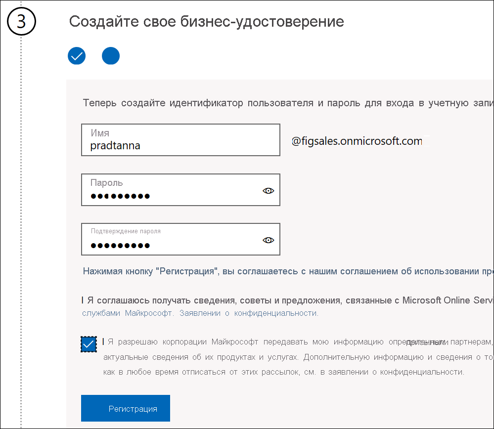
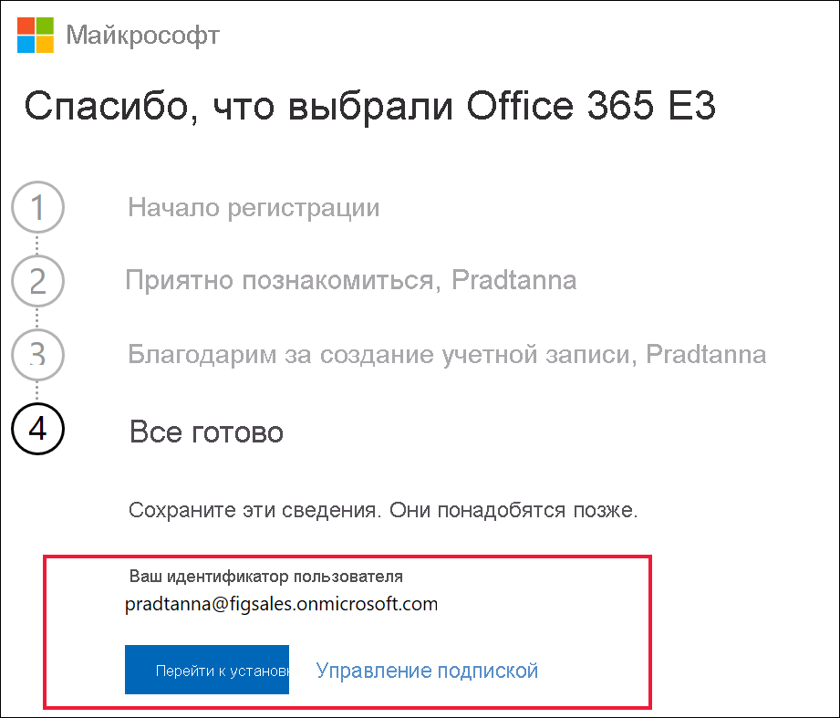

# Регистрация в Power BI с новой пробной версией Microsoft 365

В этой статье описывается альтернативный способ регистрации в службе Power BI, если у вас еще нет рабочей или учебной учетной записи электронной почты.

Если у вас возникли проблемы при регистрации в Power BI с использованием адреса электронной почты, убедитесь, что [его можно использовать с Power BI](../fundamentals/service-self-service-signup-for-power-bi.md#supported-email-addresses). В противном случае зарегистрируйтесь в пробной версии Microsoft 365 и создайте рабочую учетную запись. Затем используйте эту новую рабочую учетную запись для регистрации в службе Power BI. Вы сможете использовать Power BI даже после истечения срока действия бесплатной пробной версии Microsoft 365.

## Регистрация для использования пробной версии Office Microsoft 365

Зарегистрируйтесь в [пробной версии Microsoft 365 на веб-сайте Microsoft 365](https://www.microsoft.com/microsoft-365/business/compare-more-office-365-for-business-plans). Если у вас еще нет учетной записи, Майкрософт поможет вам создать ее. Поскольку коммерческие учетные записи электронной почты (например, Hotmail и Gmail) не поддерживаются Microsoft 365, вы создадите новую учетную запись, которая поддерживается.  Эта учетная запись электронной почты будет выглядеть примерно так: *zalan\@onmicrosoft.com*.

Если выбрать **Office 365 E5**, то пробная версия будет включать Power BI Pro. Срок действия пробной версии Power BI Pro истекает одновременно с пробной версией Office 365 E5, которая в настоящее время составляет 30 дней. Если вместо этого выбрать **Office 365 E3**, вы сможете зарегистрироваться в Power BI в качестве *бесплатного* пользователя и выполнить обновление до **Pro** для использования пробной версии в течение 60 дней. 

1. Укажите свой адрес электронной почты. Корпорация Майкрософт уведомит вас о том, будет ли этот адрес электронной почты работать с Microsoft 365 или же вам потребуется создать новый адрес электронной почты.  

    Если вам нужен новый адрес электронной почты, корпорация Майкрософт поможет в этом. Сначала необходимо создать новую учетную запись. Выберите **Настроить учетную запись**.

    

2. Введите сведения о новой учетной записи.

    

3. Создайте новый адрес электронной почты и задайте пароль. Создайте новое имя для входа, например you@yourcompany.onmicrosoft.com. Это имя для входа, которое вы будете использовать с новой рабочей или учебной учетной записью и с Power BI.

    

4. Да, уже все.  Теперь у вас есть адрес электронной почты, который можно использовать для регистрации в Power BI. Перейдите к статье [Регистрация учетной записи отдельного пользователя в Power BI](../fundamentals/service-self-service-signup-for-power-bi.md)

     

    Создание клиента может занять несколько минут.

## Важные замечания

Если у вас возникли проблемы со входом с помощью новой учетной записи, попробуйте использовать сеанс браузера в конфиденциальном режиме.

С помощью этого метода регистрации вы создаете клиент-организацию и становитесь администратором этого клиента. Дополнительные сведения: [Что такое администрирование Power BI?](service-admin-administering-power-bi-in-your-organization.md) Вы можете добавлять в клиент новых пользователей, а затем предоставлять им общий доступ, как описано в [документации по администрированию Microsoft 365](https://support.office.com/article/Add-users-individually-to-Office-365---Admin-Help-1970f7d6-03b5-442f-b385-5880b9c256ec).

## Дальнейшие действия

[Что такое администрирование Power BI?](service-admin-administering-power-bi-in-your-organization.md)  
[Лицензирование Power BI в организации](service-admin-licensing-organization.md)  
[Регистрация учетной записи отдельного пользователя в Power BI](../fundamentals/service-self-service-signup-for-power-bi.md)

Появились дополнительные вопросы? [Попробуйте задать вопрос в сообществе Power BI.](https://community.powerbi.com/)