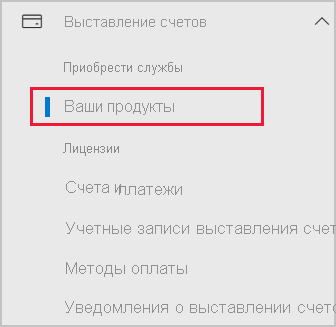
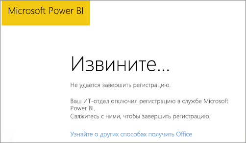

# Добавление Power BI в подписку Microsoft 365 от партнера

Microsoft 365 позволяет компаниям перепродавать пакеты Microsoft 365, интегрированные в их собственные решения. В этом случае такие компании и решения являются единой точкой контакта по вопросам приобретения, выставления счетов и поддержки.

Если вы хотите добавить Power BI в свою подписку Microsoft 365, обратитесь к своему партнеру. Если ваш партнер пока не предлагает Power BI, вы можете выполнить описанные ниже действия.

## Приобретение Power BI через партнера

Чтобы приобрести подписку на Power BI Pro и Power BI Premium, обратитесь к партнеру для выяснения доступных вам вариантов.

* Ваш партнер соглашается добавить Power BI в свой портфель, после чего вы сможете купить подписку у него.

* Ваш партнер может перевести вас на использование модели, в соответствии с которой вы можете приобрести Power BI непосредственно в корпорации Майкрософт или у другого партнера, предлагающего Power BI.

## Приобретение у Майкрософт или через другой канал

В зависимости от отношений с партнером вы можете приобрести Power BI непосредственно у корпорации Майкрософт или у другого партнера. Вы можете проверить, возможно ли добавить подписки Power BI на портале администрирования Microsoft 365 (требуется членство в роли глобального администратора или администратора выставления счетов).

1. Перейдите в [Центр администрирования Microsoft 365](https://admin.microsoft.com/AdminPortal/Home#/homepage).

1. В меню слева откройте **Выставление счетов** и выберите **Ваши продукты**.

   

 1. Найдите **Подписки**, как показано ниже. Если вы видите раздел **Подписки**, то можете приобрести службу непосредственно у корпорации Майкрософт или обратиться к другому партнеру, который предлагает Power BI.

    

    Если пункт **Подписки** не отображается, вы не можете приобрести решение непосредственно у корпорации Майкрософт или другого партнера.

Если ваш партнер не предлагает Power BI и вы не можете приобрести это решение непосредственно у корпорации Майкрософт или другого партнера, попробуйте зарегистрироваться для получения бесплатной пробной версии.

## Регистрация для получения бесплатной пробной версии

Вы можете зарегистрироваться для получения бесплатной пробной версии Power BI. Если вы не приобретете Power BI Pro в конце пробного периода, у вас по-прежнему будет бесплатная лицензия с множеством функций Power BI. Дополнительные сведения см. в разделе [Регистрация отдельного пользователя в Power BI](../fundamentals/service-self-service-signup-for-power-bi.md).

### Включение специализированных подписок

По умолчанию индивидуальная регистрация (специализированная подписка) не поддерживается. В этом случае при попытке зарегистрироваться отобразится следующее сообщение: *Ваш ИТ-отдел отключил регистрацию на Microsoft Power BI*.

Чтобы включить специализированные подписки, свяжитесь со своим партнером и попросите его включить эту возможность. Если вы являетесь администратором клиента и знаете, как использовать команды PowerShell Azure Active Directory, вы можете включить специализированные подписки самостоятельно. Чтобы получить дополнительные сведения, выполните действия, описанные в разделе [Включение или отключение возможности самостоятельного приобретения](service-admin-disable-self-service.md).

## Дальнейшие действия

* [Лицензирование Power BI в организации](service-admin-licensing-organization.md)
* [Приобретение и назначение лицензий Power BI Pro](service-admin-purchasing-power-bi-pro.md)

Появились дополнительные вопросы? [Попробуйте задать вопрос в сообществе Power BI.](https://community.powerbi.com/)