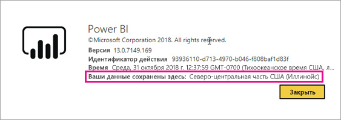
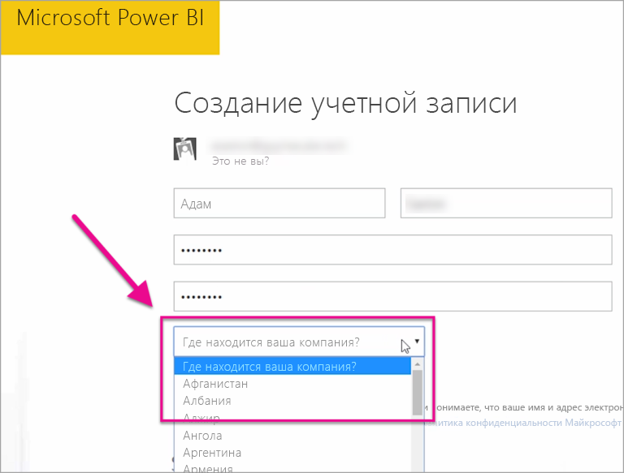

# Где расположен мой клиент Power BI?

<iframe width="560" height="315" src="https://www.youtube.com/embed/0fOxaHJPvdM?showinfo=0" frameborder="0" allowfullscreen></iframe>

Узнайте, где расположен ваш клиент Power BI и как происходит выбор места расположения. Это важно знать, так как расположение клиента может влиять на взаимодействие со службой.

## Как определить, где расположен ваш клиент Power BI

Чтобы найти регион, в котором расположен ваш клиент, выполните следующие действия.

1. В службе Power BI в верхнем меню выберите справку ( **?** ) и **О Power BI**.

1. Посмотрите, какой регион указан после текста **Ваши данные сохранены в**. Это регион, в котором расположен ваш клиент. Кроме того, это значение указывает на регион, где хранятся ваши данные, если только вы не используете для своих рабочих областей выделенные емкости в разных регионах.

    

## Как происходит выбор региона

Регион для хранения данных зависит от страны или региона, которые были выбраны при создании клиента. Это относится к регистрации в Microsoft 365 и Power BI, так как эта информация является общей для указанных служб. Если это новый клиент, выберите нужную страну или регион в списке при регистрации.

Power BI выбирает регион, наиболее близкий к выбранному варианту, определяя, где будут храниться данные для вашего клиента.

> [!IMPORTANT]
> Этот выбор нельзя будет изменить после создания клиента.

Появились дополнительные вопросы? [Ответы на них см. в сообществе Power BI.](https://community.powerbi.com/)
