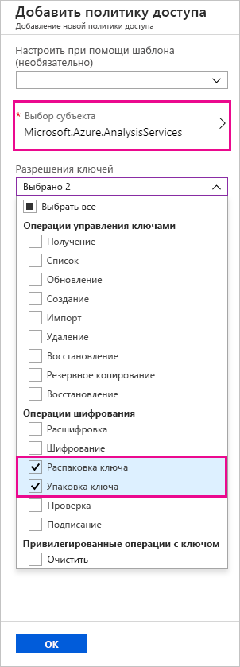
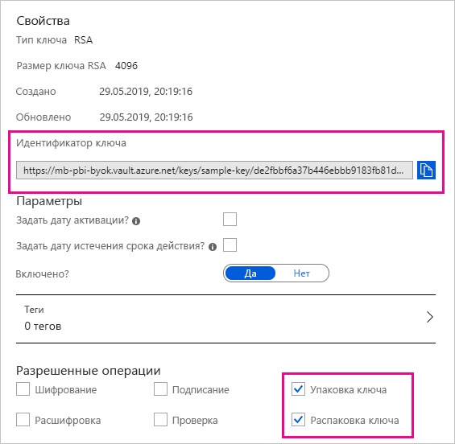

# <a name="bring-your-own-encryption-keys-for-power-bi"></a>Использование собственных ключей шифрования для Power BI

Power BI шифрует _неактивные_ и _внутрипроцессные_ данные. По умолчанию Power BI использует для шифрования ваших данных ключи, управляемые Майкрософт. В Power BI Premium можно также использовать собственные ключи для неактивных данных, которые импортируются в набор данных (дополнительные сведения см. в разделе [Рекомендации по источнику и хранилищу данных](#data-source-and-storage-considerations)). Этот подход часто называют _использованием собственного ключа_ (BYOK).

## <a name="why-use-byok"></a>Зачем использовать BYOK?

BYOK облегчает соблюдение нормативных требований, описывающие ключевые отношения с поставщиком облачных служб (в этом случае Майкрософт). С помощью BYOK вы предоставляете ключи шифрования для неактивных данных Power BI на уровне приложения и управляете ими. В результате вы можете осуществлять контроль и отменить ключи вашей организации, если вы решите прекратить использование службы. Если отменить ключи, данные станут нечитаемыми для службы на 30 минут.

## <a name="data-source-and-storage-considerations"></a>Рекомендации по источнику и хранилищу данных

Чтобы использовать BYOK, нужно отправить данные в службу Power BI из файла Power BI Desktop (PBIX). BYOK запрещено использовать в следующих сценариях:

- Активное подключение к службам Analysis Services
- Книги Excel (если только данные не были сначала импортированы в Power BI Desktop)
- [наборы данных для принудительной отправки](/rest/api/power-bi/pushdatasets);
- [Наборы данных для потоковой передачи](../connect-data/service-real-time-streaming.md#set-up-your-real-time-streaming-dataset-in-power-bi)
- [Крупные модели](service-premium-large-models.md)

BYOK применяется только к наборам данных. Наборы данных для принудительной отправки, файлы Excel и CSV, которые пользователи могут передавать в службу, не шифруются с помощью собственного ключа. Чтобы узнать, какие артефакты хранятся в ваших рабочих областях, используйте следующую команду PowerShell:

```PS C:\> Get-PowerBIWorkspace -Scope Organization -Include All```

> [!NOTE]
> Для этого командлета требуется модуль управления Power BI версии 1.0.840. Узнать, какая версия у вас, можно с помощью команды Get-InstalledModule -Name MicrosoftPowerBIMgmt. Чтобы установить последнюю версию, выполните команду Install-Module -Name MicrosoftPowerBIMgmt. Дополнительные сведения об этом командлете Power BI и его параметрах см. в описании [модуля командлетов Power BI для PowerShell](https://docs.microsoft.com/powershell/power-bi/overview).

## <a name="configure-azure-key-vault"></a>Настройка Azure Key Vault

В этом разделе вы узнаете, как настроить Azure Key Vault — средство для безопасного хранения и использования секретов, таких как ключи шифрования. Можно использовать существующее хранилище ключей для хранения ключей шифрования или создать новое хранилище специально для использования с Power BI.

В инструкциях в этом разделе предполагается общее знакомство с Azure Key Vault. Дополнительные сведения см. в разделе [Что такое Azure Key Vault?](/azure/key-vault/key-vault-whatis). Настройте хранилище ключей следующим образом:

1. Добавьте службу Power BI в качестве субъекта-службы для хранилища ключей с разрешениями на упаковку и распаковку.

1. Создайте ключ RSA длиной 4096 бит (или используйте существующий ключ этого типа) с разрешениями на упаковку и распаковку.

    > [!IMPORTANT]
    > Служба BYOK Power BI поддерживает только ключи RSA длиной 4096 бит.

1. Рекомендуется: Убедитесь, что для хранилища ключей включен параметр _обратимого удаления_.

### <a name="add-the-service-principal"></a>Добавление субъекта-службы

1. На портале Azure в хранилище ключей в разделе **Политики доступа** выберите **Добавить новый**.

1. В разделе **Выбор субъекта** найдите и выберите Microsoft.Azure.AnalysisServices.

    > [!NOTE]
    > Если вы не можете найти "Microsoft.Azure.AnalysisServices", вероятнее всего, с подпиской Azure, связанной с вашим Azure Key Vault, никогда не сопоставлялся ресурс Power BI. Попробуйте вместо этого найти следующую строку: 00000009-0000-0000-c000-000000000000.

1. В разделе **Разрешения ключей** выберите **Распаковка ключа** и **Упаковка ключа**.

    

1. Нажмите кнопку **ОК** и затем **Сохранить**.

> [!NOTE]
> Чтобы в будущем отозвать у Power BI доступ к данным, удалите права доступа к этому субъекту-службе из Azure Key Vault.

### <a name="create-an-rsa-key"></a>Создание ключа RSA

1. В хранилище ключей в разделе **Ключи** выберите **Создать/импортировать**.

1. Выберите **Тип ключа** RSA и **Размер ключа RSA** 4096.

    

1. Щелкните **Создать**.

1. В разделе **Ключи** выберите созданный ключ.

1. Выберите GUID для **текущей версии** ключа.

1. Убедитесь, что выбраны значения **Распаковка ключа** и **Упаковка ключа**. Скопируйте **Идентификатор ключа** для использования при включении BYOK в Power BI.

    

### <a name="soft-delete-option"></a>Параметр обратимого удаления

Мы рекомендуем включить [обратимое удаление](/azure/key-vault/key-vault-ovw-soft-delete) в хранилище ключей для защиты от потери данных при случайном удалении ключа или хранилища ключей. Необходимо [включить в PowerShell свойство "обратимого удаления"](/azure/key-vault/key-vault-soft-delete-powershell) для хранилища ключей, так как эта функция пока недоступна на портале Azure.

Настроив свойство Azure Key Vault, вы можете включать BYOK в своем клиенте.

## <a name="enable-byok-on-your-tenant"></a>Включение BYOK в клиенте

Включите BYOK на уровне клиента с помощью [PowerShell](https://www.powershellgallery.com/packages/MicrosoftPowerBIMgmt.Admin), предоставив своему клиенту Power BI ключи шифрования, созданные и сохраненные в Azure Key Vault. Назначьте эти ключи шифрования емкости Premium для шифрования содержимого в ней.

### <a name="important-considerations"></a>Важные замечания

Перед включением BYOK учитывайте следующие факторы:

- Сейчас невозможно отключить BYOK после включения. В зависимости от того, как вы включили параметры для `Add-PowerBIEncryptionKey`, можно управлять использованием BYOK для одной или нескольких ваших емкостей. Однако вы не можете отменить представление ключей вашему клиенту. Дополнительные сведения см. в разделе [Включение BYOK](#enable-byok).

- Вы не можете _напрямую_ переместить рабочую область, использующую BYOK из выделенной емкости в Power BI Premium в общую емкость. Сначала следует переместить рабочую область в выделенную емкость, где не включена функция BYOK.

- Если переместить рабочую область, использующую функцию BYOK, из выделенной емкости в Power BI Premium в общую, отчеты и наборы данных станут недоступны, поскольку они шифруются с помощью ключа. Чтобы избежать этого, сначала следует переместить рабочую область в выделенную емкость, где не включена функция BYOK.

### <a name="enable-byok"></a>Включение BYOK

Чтобы включить BYOK, нужно быть администратором клиента в службе Power BI и войти в систему с помощью командлета `Connect-PowerBIServiceAccount`. Затем включите BYOK с помощью [`Add-PowerBIEncryptionKey`](/powershell/module/microsoftpowerbimgmt.admin/Add-PowerBIEncryptionKey), как показано в следующем примере:

```powershell
Add-PowerBIEncryptionKey -Name'Contoso Sales' -KeyVaultKeyUri'https://contoso-vault2.vault.azure.net/keys/ContosoKeyVault/b2ab4ba1c7b341eea5ecaaa2wb54c4d2'
```

Чтобы добавить несколько ключей, выполните `Add-PowerBIEncryptionKey` с различными значениями –`-Name` и `-KeyVaultKeyUri`. 

Командлет принимает два параметра, влияющие на шифрование для текущих и будущих емкостей. По умолчанию ни один из параметров не задан:

- `-Activate` — указывает, что этот ключ будет использоваться для всех существующих емкостей в клиенте, которые пока не зашифрованы.

- `-Default` — указывает, что этот ключ используется по умолчанию для всего клиента. При создании новой емкости она наследует этот ключ.

> [!IMPORTANT]
> Если указать параметр `-Default`, то все емкости, создаваемые теперь в вашем клиенте, будут шифроваться с использованием указанного вами ключа (или обновленного ключа по умолчанию). Операцию по умолчанию невозможно отменить, вы потеряете возможность создавать емкость Premium, которая не использует BYOK в вашем клиенте.

После включения BYOK в клиенте задайте ключ шифрования для одной или нескольких емкостей Power BI:

1. Используйте [`Get-PowerBICapacity`](/powershell/module/microsoftpowerbimgmt.capacities/get-powerbicapacity),чтобы получить идентификатор емкости, необходимый на следующем шаге.

    ```powershell
    Get-PowerBICapacity -Scope Individual
    ```

    Командлет возвращает данные, аналогичные приведенным ниже.

    ```
    Id              : xxxxxxxx-xxxx-xxxx-xxxx-xxxxxxxxxxxx
    DisplayName     : Test Capacity
    Admins          : adam@sometestdomain.com
    Sku             : P1
    State           : Active
    UserAccessRight : Admin
    Region          : North Central US
    ```

1. Используйте [`Set-PowerBICapacityEncryptionKey`](/powershell/module/microsoftpowerbimgmt.admin/set-powerbicapacityencryptionkey), чтобы задать ключ шифрования:

    ```powershell
    Set-PowerBICapacityEncryptionKey -CapacityId xxxxxxxx-xxxx-xxxx-xxxx-xxxxxxxxxxxx -KeyName 'Contoso Sales'
    ```

Вы можете контролировать использование BYOK в клиенте. Например, для шифрования отдельной емкости вызовите `Add-PowerBIEncryptionKey` без параметров `-Activate` или `-Default`. Затем вызовите `Set-PowerBICapacityEncryptionKey` для той емкости, где вы хотите включить BYOK.

## <a name="manage-byok"></a>Управление BYOK

Power BI предоставляет дополнительные командлеты для управления BYOK в клиенте:

- Используйте [`Get-PowerBICapacity`](/powershell/module/microsoftpowerbimgmt.capacities/get-powerbicapacity), чтобы получить ключ, который сейчас используется емкостью:

    ```powershell
    Get-PowerBICapacity -Scope Organization -ShowEncryptionKey
    ```

- Используйте [`Get-PowerBIEncryptionKey`](/powershell/module/microsoftpowerbimgmt.admin/get-powerbiencryptionkey), чтобы получить ключ, который сейчас используется вашим клиентом:

    ```powershell
    Get-PowerBIEncryptionKey
    ```

- Используйте [`Get-PowerBIWorkspaceEncryptionStatus`](/powershell/module/microsoftpowerbimgmt.admin/get-powerbiworkspaceencryptionstatus), чтобы узнать, шифруются ли наборы данных в рабочей области и синхронизировано ли с ней их состояние шифрования:

    ```powershell
    Get-PowerBIWorkspaceEncryptionStatus -Name'Contoso Sales'
    ```

    Обратите внимание на то, что шифрование включено на уровне емкости, но вы получаете состояние шифрования на уровне набора данных для указанной рабочей области.

- Используйте [`Switch-PowerBIEncryptionKey`](/powershell/module/microsoftpowerbimgmt.admin/switch-powerbiencryptionkey) для переключения (_ротации_) версии ключа, используемого для шифрования. Командлет просто обновляет `-KeyVaultKeyUri` для ключа `-Name`:

    ```powershell
    Switch-PowerBIEncryptionKey -Name'Contoso Sales' -KeyVaultKeyUri'https://contoso-vault2.vault.azure.net/keys/ContosoKeyVault/b2ab4ba1c7b341eea5ecaaa2wb54c4d2'
    ```


## <a name="next-steps"></a>Дальнейшие действия

* [Модуль командлетов PowerShell для Power BI](https://docs.microsoft.com/powershell/power-bi/overview) 

* [Способы совместного использования работы в Power BI](../collaborate-share/service-how-to-collaborate-distribute-dashboards-reports.md)

* [Фильтрация отчета с помощью параметров строки запроса в URL-адресе](../collaborate-share/service-url-filters.md)

* [Внедрение с помощью веб-части отчетов в SharePoint Online](../collaborate-share/service-embed-report-spo.md)

* [Публикация в Интернете из Power BI](../collaborate-share/service-publish-to-web.md)

