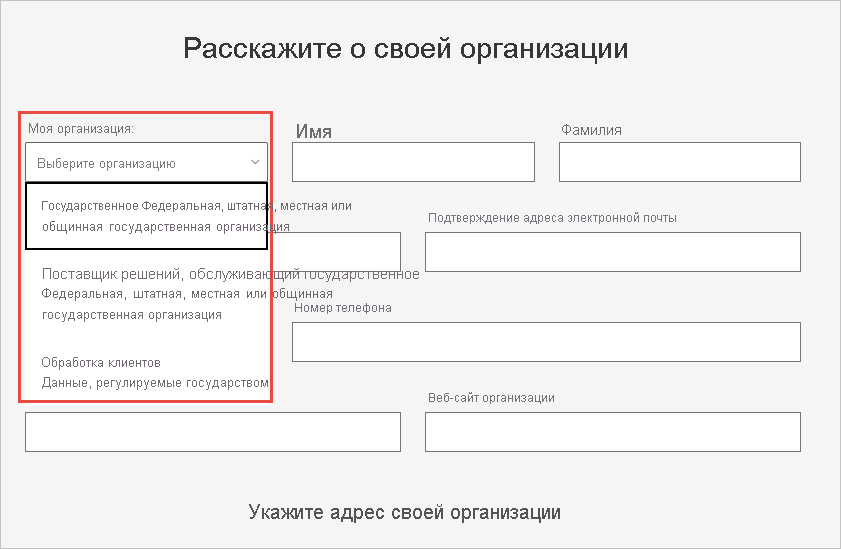

# Регистрация государственных организаций США в службе Power BI

Есть версия службы Power BI в составе [планов Microsoft 365 для государственных организаций](https://www.microsoft.com/microsoft-365/government/compare-office-365-government-plans?rtc=1). Эта статья предназначена для клиентов из государственных организаций США. Описанный в ней процесс регистрации отличается от регистрации коммерческой версии службы Power BI.

Дополнительные сведения о службе Power BI для государственных организаций США см. в [обзорной статье, посвященной Power BI для государственных организаций США](service-govus-overview.md).

> [!NOTE]
> Эта статья предназначена для администраторов, которые имеют право регистрировать государственные организации США для использования Power BI. Если вы обычный пользователь, обратитесь к администратору, чтобы получить подписку на службу Power BI для государственных организаций США.
> 
> 

## Выберите соответствующий процесс регистрации для своей государственной организации США

Ваша организация может быть новым клиентом облака сообщества для государственных организаций или уже иметь соответствующую подписку. В следующих разделах подробно описаны действия по регистрации в зависимости от наличия планов Microsoft 365 для государственных организаций и Power BI. Действия различаются в зависимости от текущей регистрации.

После регистрации в Power BI для государственных организаций США обратитесь в службу технической поддержки учетных записей, чтобы начать [*процесс* добавления в список разрешений](#additional-signup-information), описанный в этой статье. Этот шаг необходим для полноценной активации вашей организации в облаке сообщества для государственных организаций.

## Регистрация для получения нового плана Microsoft 365 для государственных организаций

Если ваша организация еще не использовала облако сообщества для государственных организаций, выполните указанные ниже действия, чтобы получить план Microsoft 365 для государственных организаций:

> [!NOTE]
> Эти действия должен выполнять глобальный администратор.
>

1. Перейдите к [планам Microsoft 365 для государственных организаций](https://products.office.com/government/office-365-web-services-for-government).
2. Щелкните ссылку **Приступить к работе с бесплатной пробной версией**.
3. Заполните форму, чтобы сообщить нам сведения о вашей организации. Выберите тип организации в раскрывающемся списке.

   

4. Отправьте форму, чтобы начать процесс подключения. Ваш представитель или партнер Майкрософт может помочь по любым вопросам.

По завершении этого процесса выполните инструкции по добавлению подписки Power BI для существующих клиентов Microsoft 365 для государственных организаций.

## Добавление Power BI в план Microsoft 365 для государственных организаций

Если у вашего учреждения уже есть план Microsoft 365 для государственных организаций, выполните указанные ниже действия, чтобы добавить подписку на Power BI:

> [!NOTE]
> Эти действия должен выполнять глобальный администратор.
> 
> 

1. Войдите в центр администрирования Microsoft 365, используя учетные данные глобального администратора или администратора выставления счетов.
2. Выберите **Выставление счетов** > **Приобрести службы**.
4. Выполните поиск или прокрутите содержимое, чтобы найти предложение Power BI Pro для государственных организаций, и выберите **Опробовать** или **Купить сейчас**.
5. Подтвердите свой заказ.
6. Назначьте лицензии учетным записям пользователей.

## Дополнительные сведения о регистрации

Прежде чем использовать службу Power BI для государственных организаций США, необходимо обратиться в службу технической поддержки учетных записей Майкрософт, чтобы инициировать процесс *добавления в список разрешений* для вашей организации. Добавление в список разрешений — это процесс, с помощью которого команда инженеров Power BI переносит клиентов из коммерческой облачной среды в безопасное облако сообщества для государственных организаций. Это гарантирует правильную работу компонентов, доступных в облаке для государственных организаций США. 

Чтобы начать процесс, обратитесь за помощью в свою службу технической поддержки учетных записей Майкрософт. Запросить добавление в список разрешений могут только администраторы. Процесс занимает около трех недель. В это время инженеры Power BI вносят соответствующие изменения, чтобы обеспечить корректную работу клиента в облаке для государственных организаций США.

## Дальнейшие действия

* [Общие сведения о службе Power BI для государственных организаций США](service-govus-overview.md)
- [Приобретение Microsoft 365 для государственных организаций](https://docs.microsoft.com/office365/servicedescriptions/office-365-platform-service-description/office-365-us-government/microsoft-365-government-how-to-buy#how-do-i-buy-microsoft-365-government)