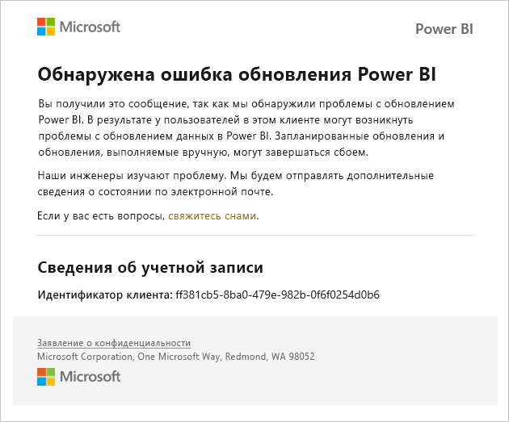
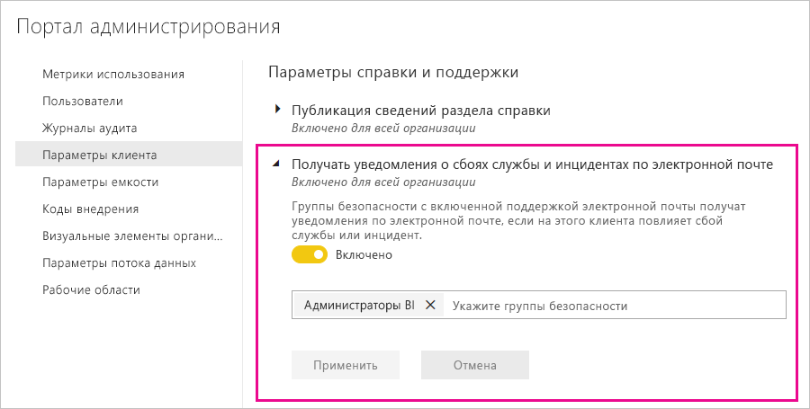

# Уведомления о перебое в работе служб

Важно иметь представление о доступности критически важных бизнес-приложений. Power BI обеспечивает уведомление об инциденте, поэтому вы можете получать сообщения электронной почты при нарушении или снижении производительности в службе. Хотя благодаря Соглашению об уровне обслуживания (SLA) в 99,9 % для Power BI такие события возникают нечасто, мы хотим проинформировать вас об этом. На следующем снимке экрана показан тип сообщения электронной почты, которое вы получите при включении уведомлений:

Сейчас мы отправляем сообщения электронной почты для следующих _сценариев надежности_:

- Надежность открытия отчетов
- Надежность обновления моделей
- Надежность обновления запросов

Уведомления отправляются, когда происходит _значительная задержка_ в работе, например при открытии отчетов, обновлении набора данных или выполнении запросов. После разрешения инцидента вы получите сообщение электронной почты с дальнейшими указаниями.

> [!NOTE]
> Сейчас эта функция доступна только для выделенных емкостей в Power BI Premium. Она недоступна для общей или встроенной емкости.

## Уведомления о емкости и надежности

Если емкость Power BI Premium в течение длительных периодов времени подвергается большой нагрузке, из-за которой может снизиться надежность, по электронной почте отправляется уведомление. К примерам таких ситуаций относятся длительные задержки в работе, например при открытии отчета, обновлении набора данных или выполнении запроса. 

В сообщении с уведомлением содержатся сведения о причине повышения нагрузки, в том числе следующие данные:

* идентификатор соответствующего набора данных;
* Operation type (Тип операции)
* Время ЦП, связанное с активным использованием ресурсов. Ниже приведено [определение времени ЦП](https://wikipedia.org/wiki/CPU_time) в Википедии.

Power BI также отправляет уведомления по электронной почте при обнаружении перегрузки в емкости Power BI Premium. В сообщении указываются вероятная причина перегрузки, операции, которые создавали нагрузку последние 10 минут, а также уровень нагрузки, создаваемой каждой операцией.

Если у вас несколько емкостей Premium, сообщение содержит сведения об этих емкостях в течение периода перегрузки. Эта информация полезна, чтобы рассмотреть возможность перемещения рабочих областей, содержащих ресурсоемкие элементы, в емкость с минимальной нагрузкой.

Уведомления о перегрузке отправляются по электронной почте только при достижении порога перегрузки. Когда нагрузка на емкость Premium вернется на обычный уровень, вы не получите еще одно сообщение.

На следующем изображении показан пример сообщения с уведомлением:

## Включение уведомлений

Администратор Power BI включает уведомления на портале администрирования:

1. Найдите или создайте группу безопасности с включенной поддержкой электронной почты, которая должна получать уведомления.

1. На портале администрирования выберите **Параметры клиента**. В разделе **Параметры справки и поддержки** разверните узел **Получать уведомления о сбоях службы и инцидентах по электронной почте**.

1. Включите уведомления, войдите в группу безопасности и нажмите кнопку **Применить.**

    

> [!NOTE]
> Power BI отправляет уведомления из учетной записи no-reply-powerbi@microsoft.com. Убедитесь, что эта учетная запись добавлена в список надежных отправителей, чтобы уведомления не попадали в папку нежелательной почты.

## Работоспособность службы в Microsoft 365

В этой статье описывается, как получать уведомления службы с помощью Power BI. Вы также можете отслеживать работоспособность службы Power BI с помощью Microsoft 365. Выберите вариант получения уведомлений о работоспособности службы от Microsoft 365 по электронной почте. Дополнительные сведения см. в статье [Проверка работоспособности службы Microsoft 365](https://docs.microsoft.com/microsoft-365/enterprise/view-service-health).

## Дальнейшие действия

[Варианты поддержки Power BI Pro и Power BI Premium](service-support-options.md)

Остались вопросы? [Ответы на них см. в сообществе Power BI.](https://community.powerbi.com/)
