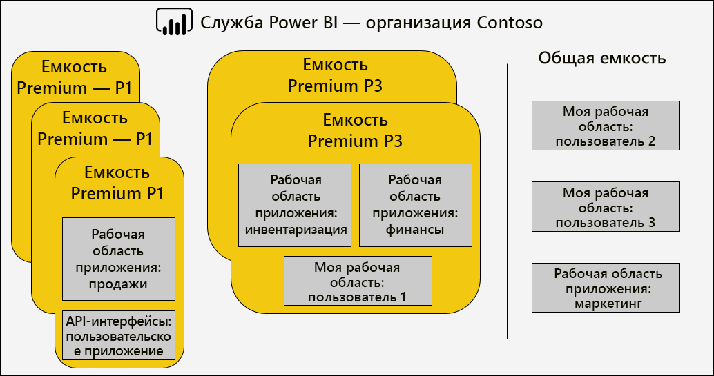
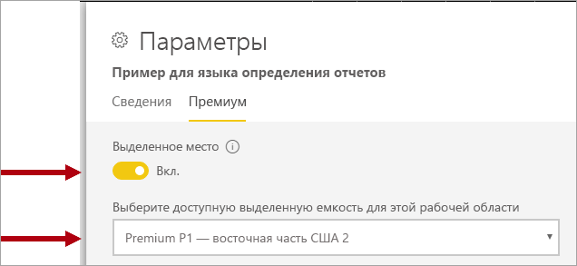
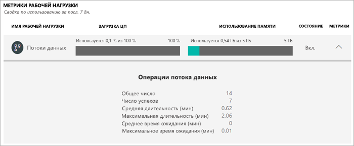
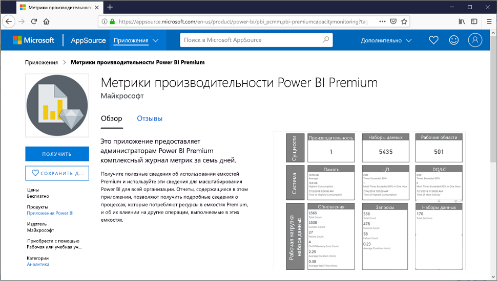

# Управление емкостями Premium

Управление Power BI Premium включает в себя создание и мониторинг емкостей Premium, а также управление ими. В этой статье приводятся общие сведения о емкостях. Пошаговые инструкции см. в [этой статье](service-admin-premium-manage.md).

## Создание емкостей и управление ими

На странице **Параметры емкости** на портале администрирования Power BI отображается количество приобретенных виртуальных ядер и доступных емкостей Premium. На этой странице глобальные администраторы Office 365 или администраторы Power BI могут создавать емкости Premium из доступных виртуальных ядер или изменять имеющиеся емкости Premium.

При создании емкости Premium администратор должен определить следующее:

- имя емкости (уникально в пределах клиента);
- администраторов емкости;
- размер емкости;
- регион для расположения данных.

Необходимо назначить по меньшей мере одного администратора емкости. Пользователи, которым назначены права администратора емкости, могут делать следующее:

- назначать рабочие области для емкости;
- управлять разрешениями пользователей, добавляя дополнительных администраторов емкости или пользователей с назначенными разрешениями (чтобы они могли назначать рабочие области для емкости);
- управлять рабочими нагрузками, настраивая максимальное использование памяти для отчетов с разбивкой на страницы и рабочих нагрузок потоков данных;
- перезапускать емкость, чтобы отменить выполнение всех операций в случае перегрузки системы.

У администраторов емкости нет доступа к содержимому рабочей области, если он явно не назначен в ее разрешениях. У них также нет доступа ко всем областям администрирования Power BI (если они явно не назначены), таким как метрики использования, журналы аудита или параметры клиента. Но что еще более важно, администраторы емкости не имеют разрешений на создание других емкостей или масштабирование имеющихся. Кроме того, администраторы назначаются для каждой емкости, поэтому они могут просматривать и контролировать только те емкости, которым они назначены.

Размер емкости нужно выбирать из доступного списка вариантов SKU, который ограничен количеством доступных виртуальных ядер в пуле. Вы можете создать несколько емкостей в пуле, который можно получить из одного или нескольких приобретенных номеров SKU. Например, для создания трех емкостей можно использовать SKU P3 (32 виртуальных ядра): один P2 (16 виртуальных ядра) и два P1 (в каждом из них по 8 виртуальных ядер). Повышение производительности и масштабирования может быть достигнуто за счет создания емкостей меньшего размера. Эта тема раскрыта в статье [Оптимизация емкостей Premium](service-premium-capacity-optimize.md). На приведенном ниже рисунке показан пример конфигурации для фиктивной организации Contoso. Он состоит из пяти емкостей Premium (3 P1 и 2 P3), каждая из которых содержит рабочие области, и нескольких рабочих областей в общей емкости.

Емкость Premium можно назначить региону, отличному от домашнего региона клиента Power BI (это называется поддержкой нескольких регионов). Поддержка нескольких регионов обеспечивает административный контроль над тем, какие центры обработки данных находятся в определенных географических регионах, где хранится содержимое Power BI. Как правило, основной причиной для развертывания в нескольких регионах является обеспечение соответствия требованиям корпорации или правительства, а не производительность и масштабируемость. Загрузка отчетов и панелей мониторинга по-прежнему сопряжена с запросами метаданных из домашнего региона. Дополнительные сведения см. в разделе [Поддержка нескольких регионов для Power BI Premium](service-admin-premium-multi-geo.md).

Администраторы службы Power BI и глобальные администраторы Office 365 могут изменять емкости Premium. В частности, они могут:

- Изменять размер емкости, масштабируя ресурсы.
- Добавлять или удалять администраторов емкости.
- Добавлять или удалять пользователей с назначенными разрешениями.
- Добавлять или удалять дополнительные рабочие нагрузки.
- Изменять регионы.

Для назначения рабочей области для определенной емкости Premium требуются разрешения на назначение. Разрешения могут быть предоставлены всей организации, конкретным пользователям или группам.

По умолчанию емкости Premium поддерживают рабочие нагрузки, связанные с выполнением запросов Power BI. Емкости Premium также поддерживают дополнительные рабочие нагрузки: **искусственный интеллект (Cognitive Services)** , **отчеты с разбивкой на страницы** и**потоки данных**. Каждая рабочая нагрузка требует настройки максимального объема памяти (процент от общего объема доступной памяти), который может использоваться рабочей нагрузкой. Важно понимать, что увеличение максимальных выделений памяти может повлиять на количество размещаемых активных моделей и на пропускную способность обновлений. 

Память выделяется динамически для потоков данных, но статически для отчетов с разбивкой на страницы. Причиной статического выделения максимального объема памяти является запуск отчетов с разбивкой на страницы в защищенном ограниченном пространстве емкости. Будьте внимательны при настройке памяти отчетов с разбивкой на страницы, так при этом уменьшается объем памяти, доступной для загрузки моделей. Дополнительные сведения см. в разделе [Параметры памяти по умолчанию](service-admin-premium-workloads.md#default-memory-settings).

Удаление емкости Premium возможно. Оно не приведет к удалению ее рабочих областей и содержимого. Вместо этого все назначенные рабочие области перемещаются в общую емкость. При создании емкости Premium в другом регионе рабочая область перемещается в общую емкость домашнего региона.

### Назначение рабочих областей для емкостей

Назначать рабочие области емкости Premium можно на портале администрирования Power BI или на панели **Рабочая область**.

Администраторы емкости, а также глобальные администраторы Office 365 или администраторы служб Power BI могут выполнять массовое назначение рабочих областей на портале администрирования Power BI. Массовое назначение может применяться к следующим рабочим областям:

- **Рабочие области по пользователям**. Все рабочие области, принадлежащие этим пользователям, включая личные рабочие области, назначаются для емкости Premium. Этот процесс включает в себя переназначение рабочих областей, если они уже назначены для другой емкости Premium. Кроме того, пользователям также назначаются разрешения на назначение рабочей области.

- **Определенные рабочие области**
- **Рабочие области всей организации**. Все рабочие области, в том числе личные рабочие области, назначены для емкости Premium. Всем нынешним и будущим пользователям назначены разрешения на назначение рабочих областей. Этот подход не рекомендуется. Лучше использовать более целевой подход.

Рабочую область можно добавить в емкость Premium с помощью панели **Рабочая область**, если пользователь одновременно обладает правами администратора рабочей области и разрешениями на назначение.

Администраторы рабочей области могут удалить рабочую область из емкости, переместив ее в общую емкость, без разрешения на назначение. При удалении рабочих областей из выделенных емкостей рабочие области перемещаются в общую емкость. Обратите внимание, что удаление рабочей области из емкости Premium может иметь негативные последствия, например, общедоступное содержимое станет недоступным для пользователей с лицензией Power BI Free или произойдет приостановка запланированного обновления в результате превышения резервов, поддерживаемых общедоступными емкостями.

Определить рабочую область, назначенную емкости Premium, в службе Power BI достаточно легко — возле ее имени расположен значок ромба.

## Мониторинг емкостей

Мониторинг емкостей Premium предоставляет администраторам сведения о выполнении емкостей. Емкости можно отслеживать на портале администрирования Power BI или с помощью приложения **Power BI Premium Capacity Metrics** (Power BI).

### Портал администрирования Power BI

На портале администрирования на вкладке **Работоспособность** предоставляются сводные метрики для отдельной емкости и каждой включенной рабочей нагрузки. Метрики показывают среднее значение за последние семь дней.  

На уровне емкости метрики представляют совокупное число для всех включенных рабочих нагрузок. Доступны следующие метрики.

- **ЗАГРУЗКА ЦП**. Отображает среднюю загрузку ЦП в процентах от общего доступного объема ЦП для емкости.  
- **ИСПОЛЬЗОВАНИЕ ПАМЯТИ**. Отображает среднее использование памяти (в ГБ) от общего объема доступной памяти для емкости. 

Для каждой включенной рабочей нагрузки предоставляются сведения об использовании ЦП и памяти, а также некоторые присущие этой нагрузке метрики. Например, для рабочей нагрузки потока данных значение **Общее количество** отображает общее количество обновлений для каждого потока данных, а **Средняя продолжительность** — среднюю продолжительность обновления потока данных.

Дополнительные сведения обо всех доступных метриках для каждой рабочей нагрузки см. в статье [Мониторинг емкостей на портале администрирования](service-admin-premium-monitor-portal.md).

Возможности мониторинга на портале администрирования Power BI предназначены для получения сведения о ключевых метриках емкости. Для более подробного мониторинга рекомендуется использовать приложение **Power BI Premium Capacity Metrics**.

### Приложение Power BI Premium Capacity Metrics

Приложение [Power BI Premium Capacity Metrics](https://appsource.microsoft.com/product/power-bi/pbi_pcmm.pbi-premiumcapacitymonitoring?tab=Overview) представляет собой приложение Power BI, доступное для администраторов емкости. Его установка аналогична установке любого другого приложения Power BI. Оно содержит панель мониторинга и отчеты.

При открытии приложения загружается панель мониторинга с большим количеством плиток, содержащих общее представление всех емкостей, администратором которых является пользователь. Макет панели мониторинга состоит из пяти основных разделов.

- **Обзор** — версия приложения, количество емкостей и рабочих областей.
- **Сведения о системе** — метрики памяти и ЦП.
- **Сведения о наборе данных** — количество наборов данных, DQ или активных подключений, метрики обновления и запроса.
- **Сведения о потоке данных** — количество потоков данных и метрики набора данных.
- **Сведения об отчете с разбивкой на страницы** — обновление и просмотр метрик.

Доступ к базовому отчету (из которого были закреплены плитки панели мониторинга) можно получить, щелкнув любую плитку на панели мониторинга. В этом отчете содержится более подробное описание каждого раздела панели мониторинга. Кроме того, в нем поддерживается интерактивная фильтрация. 

Фильтрацию можно выполнить путем настройки срезов по диапазону дат, емкости, рабочей области и рабочей нагрузке (отчет, набор данных, поток данных) и выбора элементов в визуальных элементах отчета для перекрестной фильтрации страницы отчета. Перекрестная фильтрация — это мощный инструмент, позволяющий сузить круг до определенных периодов времени, емкостей, рабочих областей, наборов данных и т. д. Данный вид фильтрации может быть очень полезен при выполнении анализа первопричин.

Подробные сведения о метриках на панели мониторинга и в приложении см. в статье [Мониторинг емкостей Premium в приложении](service-admin-premium-monitor-capacity.md).

### Интерпретация метрик

Отслеживайте метрики, чтобы получить базовое понимание использования ресурсов и рабочей нагрузки. Если производительность становится низкой, важно понять, какие показатели нужно отслеживать, и какие выводы можно сделать.

В идеале запросы должны завершаться в течение одной секунды, чтобы обеспечивать быструю работу для пользователей отчетов и более высокую пропускную способность. Обычно это менее важно при выполнении фоновых процессов, включая обновления, которые занимают больше времени.

Как правило, наличие медленно выполняющихся отчетов может указывать на перегрузку емкости. Сбой загрузки отчетов свидетельствует о перегрузке емкости. В любой ситуации первопричину можно объяснить несколькими факторами, например:

- **Неудачные запросы** определенно указывают на нехватку памяти, потому модель не может быть загружена в память. Служба Power BI будет пытаться загрузить модель на протяжении 30 секунд до сбоя.

- **Чрезмерное время ожидания запроса** может быть вызвано следующими причинами:
  - Потребность в том, чтобы служба Power BI сначала удаляла неактивные модели, а затем загружала запрашиваемую модель (напомним, что более высокие скорости вытеснения набора данных не являются признаком перегрузки емкости, если только они не сопровождаются длительным временем ожидания запроса, которое указывает на пробуксовку памяти).
  - Время загрузки модели (особенно ожидание загрузки в память большой модели).
  - Длительные запросы.
  - Наличие большого количества подключений DQ или активных подключений (превышение пределов емкости).
  - Перегрузка ЦП.
  - Сложные схемы отчетов с чрезмерным количеством визуальных элементов на странице (напомним, что каждый визуальный элемент является запросом).

- **Длительное выполнение запроса** может указывать на то, что схемы моделей не оптимизированы, особенно когда в емкости несколько наборов данных находятся в активном состоянии и только один набор данных создает длительные запросы. Это свидетельствует о том, что емкость достаточно обеспечена ресурсами и что рассматриваемый набор данных является неоптимальным или просто медленным. При выполнении длительных запросов могут возникать проблемы, так как они могут блокировать доступ к ресурсам, необходимым для других процессов.
- **Длительное время ожидания обновления** указывает на нехватку памяти, возникшей вследствие того, что многие активные модели потребляют память или проблемное обновление блокирует другие обновления (превышая пределы параллельного обновления).

Подробные сведения об использовании метрик см. в статье [Оптимизация емкостей Premium](service-premium-capacity-optimize.md).

## Благодарности

Эта статья была написана Питером Майерсом (Peter Myers), MVP-специалистом по платформам данных и независимым экспертом в области бизнес-аналитики в [Bitwise Solutions](https://www.bitwisesolutions.com.au/).

## Дальнейшие действия

> [!div class="nextstepaction"]
> [Оптимизация емкостей Premium](service-premium-capacity-optimize.md)   
> [!div class="nextstepaction"]
> [Настройка рабочих нагрузок в емкости Premium](service-admin-premium-workloads.md)   

Появились дополнительные вопросы? [Попробуйте задать вопрос в сообществе Power BI.](https://community.powerbi.com/)

