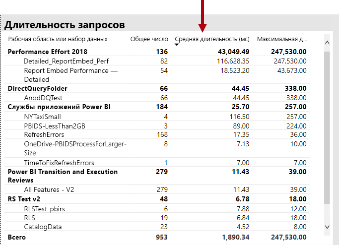

# Сценарии использования емкостей Premium

В этой статье описываются реальные сценарии, в которых реализованы емкости уровня "Премиум" Power BI. Описаны распространенные проблемы и задачи, а также способы выявления проблем и их устранения.

- [Постоянное обновление наборов данных](#keeping-datasets-up-to-date)
- [Выявление медленно реагирующих наборов данных](#identifying-slow-responding-datasets).
- [Определение причин для медленной реакции наборов данных](#identifying-causes-for-sporadically-slow-responding-datasets).
- [Определение наличия достаточного объема памяти](#determining-whether-there-is-enough-memory).
- [Определение наличия достаточного объема ЦП](#determining-whether-there-is-enough-cpu).

Описание необходимых шагов, а также примеры диаграмм и таблиц взяты из приложения **Power BI Premium Capacity Metrics**, к которому администратор Power BI получит доступ.

## Постоянное обновление наборов данных

Изучение этого сценария началось, когда пользователи стали жаловаться, что данные отчета иногда оказываются устаревшими.

В приложении администратор использует визуальный элемент **Обновления**, сортируя наборы данных по статистике **Максимальное время ожидания** в порядке убывания. Этот визуальный элемент может выявлять наборы данных с самым длительным временем ожидания, сгруппированные по имени рабочей области.

В визуальном элементе **Почасовые показатели среднего времени ожидания обновления** видно, что время ожидания обновления постоянно достигает максимума примерно в 16:00 каждый день.

Эти результаты обусловлены рядом возможных причин:

- Слишком много попыток обновления может происходить одновременно, выходя за пределы, установленные узлом емкости. В этом случае на P1 выполняются шесть одновременных обновлений с выделением памяти по умолчанию.

- Размер обновляемых наборов данных может быть слишком большим, чтобы вместиться в доступную память (для полного обновления требуется как минимум 2-кратный объем памяти).
- Неэффективная логика Power Query может привести к максимальной загрузке памяти при обновлении набора данных. При перегрузке емкости этот пик может достичь физического предела, что приводит к сбою обновления и потенциально может повлиять на другие операции просмотра отчетов в емкости.
- Часто запрашиваемые наборы данных, которые должны оставаться в памяти, могут повлиять на обновление других наборов данных по причине ограниченного объема доступной памяти.

Помогая в решении данной проблемы, администратор Power BI может искать:

- Недостаточный объем доступной памяти во время обновления данных, если объем доступной памяти менее чем в 2 раза превышает размер обновляемого набора данных.
- Наборы данных, которые не обновлялись и не были загружены в память перед обновлением, сейчас начали отображать интерактивный трафик в периоды интенсивного обновления. Чтобы узнать, какие наборы данных загружаются в память в любой момент времени, администратор Power BI может просмотреть область наборов данных на вкладке **Наборы данных** в приложении. Затем администратор может перекрестно отфильтровать до определенного времени, щелкнув один из столбцов во вкладке **Число наборов данных, загружаемых каждый час**. Локальный пик (изображенный на приведенном ниже рисунке) указывает час, на протяжении которого в память было загружено несколько наборов данных. Такая загрузка может задержать запуск запланированных обновлений.
- Увеличение вытеснений набора данных происходит при запланированном запуске обновлений данных. Вытеснения могут указывать на высокую нехватку памяти, вызванную обслуживанием слишком большого количества интерактивных отчетов до обновления. Визуальный элемент **Почасовые исключения наборов данных и использование памяти** может четко указывать на пики вытеснений.

На следующем рисунке показан локальный пик загруженных наборов данных, который предполагает выполнение интерактивных запросов с отложенным запуском обновлений. При выборе периода времени в визуальном элементе **Число наборов данных, загружаемых каждый час** будет выполняться перекрестная фильтрация визуального элемента **Размеры наборов данных**.

Администратор Power BI может попытаться решить эту проблему, проверив наличие достаточного объема памяти для запуска обновления данных. Для этого он выполняет следующие действия:

- Обращается к владельцам наборов данных и просит их изменить расписания обновления данных и увеличить между ними промежутки.
- Снижает нагрузку на запросы к набору данных путем удаления ненужных панелей мониторинга или плиток на панели мониторинга, особенно того содержимого, которое обеспечивает безопасность на уровне строк.
- Ускорение обновления данных путем оптимизации логики Power Query. Улучшение моделирования вычисляемых столбцов или таблиц. Уменьшение размеров набора данных или настройка более крупных наборов данных для выполнения добавочного обновления.

## Выявление медленно реагирующих наборов данных

Изучение этого сценария началось, когда пользователи стали жаловаться, что некоторые отчеты долго открываются. Иногда отчеты перестают отвечать на запросы.

В приложении администратор Power BI может использовать визуальный элемент **Длительность запросов**, чтобы определить наборы данных с наихудшими результатами, отсортировав наборы данных по убыванию **средней длительности**. В этих визуальных элементах также отображается количество запросов к набору данных, поэтому вы можете узнать, как часто они запрашиваются.

Администратор может использовать визуальный элемент **Распределение продолжительности выполнения запросов**, который показывает общее распределение производительности отдельных запросов (<= 30 мс, 0–100 мс) за отфильтрованный период времени. Как правило, большинство пользователей считает нормальным откликом для запросов длительность в одну секунду или меньше. Производительность запросов, которые занимают больше времени, обычно считается неудовлетворительной.

Визуальный элемент **Почасовое распределение продолжительности выполнения запросов** позволяет администратору Power BI определять одночасовые периоды, когда производительность емкости могла восприниматься как низкая. Чем больше сегментов столбца, представляющих длительность запроса более одной секунды, тем выше риск низкой производительности.

Визуальный элемент является интерактивным, и когда выбран сегмент панели, в соответствующем визуальном элементе таблицы **Продолжительность запроса** на странице отчета выполняется перекрестная фильтрация для отображения наборов данных, которые он представляет. Такая перекрестная фильтрация позволяет администратору Power BI легко определить, какие наборы данных медленно реагируют.

На следующем рисунке показан визуальный элемент, отфильтрованный по **почасовому распределению продолжительности выполнения запросов** с акцентом на наборы данных с наихудшими показателями производительности в одночасовых сегментах.

После того как набор данных с низкой производительностью за конкретный одночасовой промежуток времени будет определен, администратор Power BI сможет выяснить, чем вызвана низкая производительность: перегруженной емкостью или плохо спроектированным набором данных или отчетом. Они могут использовать визуальный элемент **Время ожидания запросов**, отсортировав наборы данных по убыванию среднего времени ожидания запроса. Если задержка отмечается для большого процента запросов, самой вероятной причиной является высокая загрузка набора данных. Если среднее время ожидания запроса является существенным (> 100 мс), возможно, стоит просмотреть набор данных и отчет, чтобы узнать, можно ли выполнить оптимизацию. Например, уменьшить количество визуальных элементов на заданных страницах отчета или оптимизировать выражения DAX.

Существует несколько возможных причин для увеличения времени ожидания создания запроса в наборах данных:

- Неоптимальная разработка модели, выражений мер или даже отчетов могут способствовать длительному выполнению запросов, которые приводят к высокому уровню загрузки ЦП. Поэтому новые запросы помещаются в очередь, ожидая, пока потоки ЦП не станут доступными, и могут создавать эффект колонны (например, пробка), который обычно наблюдается в час пик. Страница **Ожидания запросов** будет основным ресурсом для определения наличия высокого значения среднего времени ожидания запроса в наборах данных.
- Большое количество пользователей емкости (от сотен до тысяч), одновременно использующих один и тот же отчет или набор данных. Даже хорошо спроектированные наборы данных могут иметь низкие показатели производительности за пределами порога параллелизма. На это обычно указывает один набор данных, отображающий значительно большее значение для количества запросов, чем другие наборы данных. Например, 300 000 запросов для одного набора данных по сравнению с <30 000 запросов для всех других наборов данных. В какой-то момент запрос будет ожидать освобождения набора данных. Это будет отображено в визуальном элементе **Продолжительность запросов**.
- Большое количество запрошенных одновременно разрозненных наборов данных приводит к пробуксовке памяти, так как наборы данных часто циклически загружались в память и удалялись из нее. Это приводит к снижению производительности при загрузке набора данных в память. Чтобы выяснить, так ли это, администратор Power BI использует визуальный элемент **Почасовые исключения наборов данных и использование памяти**, который может указывать на то, что большое количество наборов данных, загруженных в память, постоянно вытесняется.

## Определение причин для медленной реакции наборов данных

Изучение этого сценария началось, когда пользователи сообщили, что визуальные элементы в отчетах в некоторых случаях реагируют медленно или могут вообще перестать отвечать. Но в других случаях они давали достаточно быстрый отклик.

В приложении в разделе **Длительность запросов** можно выполнить поиск проблемных наборов данных следующим образом:

- В визуальном элементе "Длительность запросов" администратор выполнил фильтрацию по набору данных (начиная с первых запрошенных наборов данных) и изучил перекрестно отфильтрованные столбцы в визуальном элементе **почасового распределения времени ожидания запросов**.
- Когда в одной одночасовой гистограмме отображаются существенные изменения в соотношении между всеми группами продолжительности запросов к другим одночасовым гистограммам для этого набора данных (например, соотношение между цветами резко меняется), это означает, что в производительности данного набора данных произошли разовые изменения.
- Одночасовые гистограммы, отображающие нерегулярную долю запросов с низкими показателями производительности, указывают временной интервал, на протяжении которого данный набор данных попал под влияние "шумных соседей", вызванное действиями других наборов данных.

На приведенном ниже рисунке показаны изменения, происшедшие за один час 30 января, когда произошел существенный спад в производительности набора данных, о чем свидетельствует размер сегмента продолжительности выполнения (3,10 с). При выборе этой часовой шкалы отображаются все наборы данных, загруженные в память за это время, в том числе всевозможные наборы данных, оказывающие влияние "шумного соседа".

После выявления проблемного промежутка времени (например, 30 января, указанное на приведенном выше изображении) администратор Power BI может удалить все фильтры набора данных, а затем выполнить фильтрацию только по этому промежутку времени, чтобы определить, какие наборы данных активно запрашивались в течение этого времени. Проблемный набор, оказывающий влияние "шумного соседа", как правило, представляет собой либо набор данных с самым большим количеством запросов, либо набор данных с самой длительной средней продолжительностью запроса.

Решением этой проблемы может быть распределение проблемных наборов данных по разным рабочим областям в разных емкостях Premium или в общедоступной емкости при наличии необходимого размера набора данных и шаблонов обновления данных, а также соблюдении требований к потреблению.

Обратное также может быть верным. Администратор Power BI может определить случаи, когда производительность запросов к набору данных резко улучшается, а затем приступить к поиску причины. Если на этом этапе отсутствуют определенные сведения, это может указывать на причину проблемы.

## Определение наличия достаточного объема памяти

Чтобы проверить, достаточно ли в емкости памяти для выполнения рабочих нагрузок, администратор Power BI может использовать визуальный элемент **Использование памяти (%)** на вкладке **Наборы данных** в приложении. **Вся** (общий объем) память представляет собой память, занятую наборами данных, загруженными в память, независимо от того, активно ли они запрашиваются или обрабатываются. **Активная** память представляет собой память, занятую наборами данных, которые активно обрабатываются.

В работоспособной емкости визуальный элемент будет выглядеть следующим образом, отображая промежуток между всей памятью (общим объемом) и активной памятью:

В емкости, испытывающей нехватку памяти, один и тот же визуальный элемент будет ясно отображать схождение активной памяти и общей памяти, а это означает, что в данный момент загрузка дополнительных наборов данных в память невозможна. В этом случае администратор Power BI может щелкнуть **Перезапуск емкости** (в разделе **Расширенные параметры** в области параметров емкости портала администрирования). Перезапуск емкости приводит к удалению всех наборов данных из памяти, позволяя им перезагружаться в память по мере необходимости (путем выполнения запросов или обновления данных).

## Определение наличия достаточного объема ЦП

Как правило, средняя загрузка процессора емкости не должна превышать 80 %. Превышение этого значения означает, что емкость приближается к перегрузке ЦП.

Последствия перегрузки ЦП выражаются в увеличении длительности выполнения операций из-за большого числа переключений контекста ЦП в емкости при попытке обработать все операции. В емкости Premium с большим количеством одновременных запросов на этот процесс указывает длительное время ожидания запросов. Следствием длительного времени ожидания запросов является медленный отклик. Администратор Power BI может легко определить, насколько сильно загружен ЦП, просмотрев сведения, представленные в визуальном элементе **Почасовое распределение времени ожидания запросов**. Количество случаев периодического резкого увеличения времени ожидания запросов указывает на потенциальную перегрузку ЦП.

Иногда подобная картина может встречаться при выполнении фоновых операций, если они способствуют перегрузке ЦП. Администратор Power BI может искать периодический пик значений времени обновления для определенного набора данных, который может указывать на перегрузку ЦП в данный момент времени (возможно, из-за других текущих обновлений набора данных и (или) выполнения интерактивных запросов). В этом случае в представлении **Система** в приложении может отображаться (необязательно), что загрузка процессора составляет 100 %. В представлении **Система** отображаются среднечасовые средние значения, но ЦП может насыщаться в течение нескольких минут интенсивного выполнения операций, что проявляется как пик в значениях времени ожидания.

Существуют и другие причины перегрузки ЦП. В то время как количество ожидающих запросов важно, время ожидания запроса никогда не вызывает заметного снижения производительности. Некоторые наборы данных (с более длительным средним временем поступления запроса, указывающим на сложность или размер) более подвержены эффектам перегрузки ЦП, чем другие. Чтобы легко идентифицировать эти наборы данных, администратор Power BI может обратить внимание на изменения в цветовом составе гистограмм в визуальном элементе **почасового распределения времени ожидания**. После определения гистограммы выбросов администраторы могут искать наборы данных с ожидающим в течение всего этого времени запросом, а также сравнить среднее время ожидания запроса со средней продолжительностью запроса. Если эти две метрики имеют одинаковую величину, а рабочая нагрузка запроса для набора данных нетривиальна, вероятнее всего, на набор данных влияет недостаточная загрузка ЦП.

Это влияние может быть особенно очевидным при использовании набора данных в коротких интервалах высокочастотных запросов несколькими пользователями (например, во время сеанса обучения), что приводит к перегрузке ЦП во время каждого интервала. В этом случае может наблюдаться увеличение времени ожидания запроса для этого набора данных, а также влияние на другие наборы данных в емкости (эффект "шумного соседа").

В некоторых случаях администраторы Power BI могут потребовать, чтобы владельцы наборов данных создали менее энергозависимую рабочую нагрузку для запросов, создав вместо отчета панель мониторинга (которая периодически запрашивает любое обновление набора данных для кэшированных плиток). Это может помочь предотвратить пики в случае, когда панель мониторинга загружается. Это решение может оказаться невозможным при наличии некоторых бизнес-требований, однако оно может быть эффективным способом избежания перегрузки ЦП без изменения набора данных.

## Благодарности

Эта статья была написана Питером Майерсом (Peter Myers), MVP-специалистом по платформам данных и независимым экспертом в области бизнес-аналитики в [Bitwise Solutions](https://www.bitwisesolutions.com.au/).

## Дальнейшие действия

> [!div class="nextstepaction"]
> [Мониторинг емкостей Premium в приложении](service-admin-premium-monitor-capacity.md)    
> [!div class="nextstepaction"]
> [Мониторинг емкостей на портале администрирования](service-admin-premium-monitor-portal.md)   

У вас имеются и другие вопросы? [Попробуйте задать вопрос в сообществе Power BI.](https://community.powerbi.com/)

||||||
