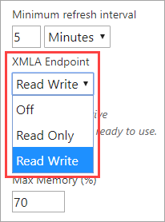
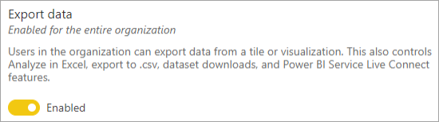
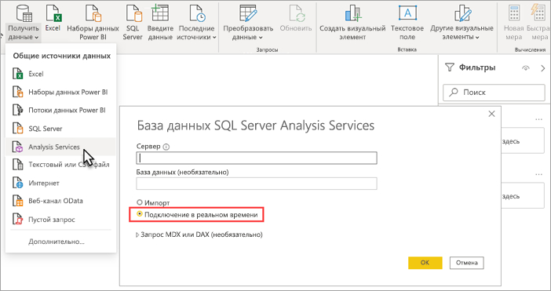

# Возможность подключения к набору данных с помощью конечной точки XMLA (предварительная версия)

Рабочие области и наборы данных Power BI Premium на уровне совместимости 1500 и выше поддерживают подключение открытых платформ от корпорации Майкрософт, а также клиентских приложений и средств сторонних производителей с помощью *конечной точки XMLA*.

> [!NOTE]
> Эта возможность предоставляется в **предварительной версии**. Возможности предварительной версии не следует использовать в рабочей среде. Некоторые функциональные возможности, поддержка и документация ограничены.  Дополнительные сведения см. на странице [условий лицензирования Microsoft Online Services (OST)](https://www.microsoft.com/licensing/product-licensing/products?rtc=1).

## Общие сведения о конечной точке XMLA

Power BI Premium использует протокол [XML для аналитики](/analysis-services/xmla/xml-for-analysis-xmla-reference?view=power-bi-premium-current) (XMLA) для обеспечения взаимодействия клиентских приложений и подсистемы, которая управляет рабочими областями и наборами данных Power BI. Такое взаимодействие осуществляется посредством так называемых конечных точек XMLA. XMLA — это тот же протокол связи, который использует подсистема Microsoft Analysis Services, отвечающая за семантическое моделирование, регулирование, управление жизненным циклом и данными в Power BI.

По умолчанию для **рабочих нагрузок наборов данных** в емкости включена возможность подключения *c доступом только для чтения* с помощью конечной точки. При доступе только для чтения приложения и средства визуализации данных могут запрашивать данные, метаданные, события и схему модели набора данных. Для включения операций *чтения и записи* с помощью конечной точки необходимо обеспечить дополнительное управление наборами данных, систему управления, расширенное семантическое моделирование, отладку и мониторинг. Если разрешен доступ на чтение и запись, наборы данных Power BI Premium лучше подходят для средств и процессов табличного моделирования корпоративного класса в Azure Analysis Services и SQL Server Analysis Services.

> [!NOTE]
> Рекомендуется использовать передовые возможности рабочей области, особенно при подключении к наборам данных с помощью конечной точки XMLA. Такие операции, как создание или удаление наборов данных, не поддерживаются в классических рабочих областях. Дополнительные сведения см. в статье [Обновление классических рабочих областей до новых рабочих областей в Power BI](../collaborate-share/service-upgrade-workspaces.md).

## Средства моделирования данных и управления ими

Ниже приведены некоторые из наиболее распространенных средств, которые используются для Azure Analysis Services и SQL Server Analysis Services и теперь поддерживаются наборами данных Power BI Premium.

**Visual Studio с поддержкой проектов Analysis Services**  (другое название — SQL Server Data Tools, или просто **SSDT**) — это средство разработки моделей корпоративного класса для табличных моделей Analysis Services. Расширения проектов Analysis Services поддерживаются во всех выпусках Visual Studio 2017 и более поздних версий, включая бесплатный выпуск Community. Для развертывания табличных моделей в рабочей области Premium требуется расширение версии 2.9.6 или более новой. При развертывании в рабочей области Premium уровень совместимости модели должен быть не менее 1500. Для рабочей нагрузки наборов данных требуется доступ для чтения и записи по протоколу XMLA. Дополнительные сведения см. в статье [Средства для Analysis Services](/analysis-services/tools-and-applications-used-in-analysis-services?view=power-bi-premium-current).

**SQL Server Management Studio (SSMS)**   — поддерживает запросы DAX, многомерные выражения и XMLA. Выполнение операций точного обновления и создание скриптов для метаданных набора данных с помощью [языка сценариев табличной модели](/analysis-services/tmsl/tabular-model-scripting-language-tmsl-reference) (TMSL). Для операций запроса требуется доступ только для чтения. Для создания скриптов для метаданных требуется доступ для чтения и записи. При этом требуется SSMS версии 18.4 или более новой. Загрузите это средство  [здесь](/sql/ssms/download-sql-server-management-studio-ssms).

**SQL Server Profiler**  — это средство (устанавливается вместе с SSMS) обеспечивает трассировку и отладку событий набора данных. Хотя средство Profiler признано нерекомендуемым для SQL Server, оно по-прежнему входит в состав SSMS и поддерживается для Analysis Services и Power BI Premium. Требуется доступ только для чтения по протоколу XMLA. Дополнительные сведения см. в статье об  [SQL Server Profiler для Analysis Services](/analysis-services/instances/use-sql-server-profiler-to-monitor-analysis-services?view=power-bi-premium-current).

**Мастер развертывания служб Analysis Services**  — это средство (устанавливается вместе с SSMS) обеспечивает развертывание проектов для разработанных с помощью Visual Studio табличных моделей в Analysis Services и рабочих областях Power BI Premium. Его можно запустить в интерактивном режиме или (для автоматизации) из командной строки. Требуется доступ на чтение и запись по протоколу XMLA. Дополнительные сведения см. в статье о [мастере развертывания служб Analysis Services](/analysis-services/deployment/deploy-model-solutions-using-the-deployment-wizard?view=power-bi-premium-current).

**Командлеты PowerShell**  — командлеты Analysis Services можно использовать для автоматизации таких задач управления наборами данных, как операции обновления. Требуется доступ на чтение и запись по протоколу XMLA. При этом требуется [модуль SqlServer PowerShell](https://www.powershellgallery.com/packages/SqlServer/) версии **21.1.18221** или более новой. Командлеты Azure Analysis Services в модуле Az.AnalysisServices для Power BI Premium не поддерживаются. Дополнительные сведения см. в [справочнике по Analysis Services PowerShell](/analysis-services/powershell/analysis-services-powershell-reference?view=power-bi-premium-current).

**Power BI Report Builder**  — средство для разработки отчетов с разбивкой на страницы. С его помощью можно создать определение отчетов, указывающее данные, которые следует получить, место их получения и способ отображения. Вы можете просмотреть такой отчет в Report Builder, а затем опубликовать его в службе Power BI. Требуется доступ только для чтения по протоколу XMLA. Дополнительные сведения см. в статье о  [Power BI Report Builder](../paginated-reports/report-builder-power-bi.md).

**Tabular Editor** — инструмент с открытым исходным кодом для создания табличных моделей, их ведения и управления ими с помощью интуитивно понятного упрощенного редактора. В иерархическом представлении отображаются все объекты табличной модели. Объекты упорядочены по папкам отображения и поддерживают изменение свойств множественного выбора и выделение синтаксиса DAX. Для операций запроса требуется доступ только для чтения по протоколу XMLA. Для операций с метаданными требуется доступ для чтения и записи. Дополнительные сведения см. на сайте [tabulareditor.github.io](https://tabulareditor.github.io/).

**DAX Studio**  — инструмент с открытым исходным кодом для разработки, диагностики, настройки производительности и анализа DAX. Он предоставляет такие возможности, как просмотр объектов, интегрированная трассировка, разбивка выполнения запросов с подробной статистикой, выделение синтаксиса DAX и форматирование. Для операций запроса требуется доступ только для чтения по протоколу XMLA. Дополнительные сведения см. на сайте  [daxstudio.org](https://daxstudio.org/).

**Набор средств для ALM** — средство сравнения схем с открытым кодом для наборов данных Power BI, наиболее часто используемых для сценариев управления жизненным циклом приложений (ALM). Выполняет развертывание в различных средах и хранит данные о прошлых добавочных обновлениях. Выявляет различия в файлах, ветвях и репозиториях метаданных и объединяет их единое целое. Повторно используйте общие определения для наборов данных. Для операций запроса требуется доступ только для чтения. Для операций с метаданными требуется доступ для чтения и записи. Дополнительные сведения см. на сайте  [alm-toolkit.com](http://alm-toolkit.com/).

**Microsoft Excel**  (сводные таблицы Excel) — это одно из наиболее распространенных средств, используемых для суммирования, анализа, просмотра и представления сводных данных из наборов данных Power BI. Для операций запроса требуется доступ только для чтения. Требуется Office с технологией "нажми и работай" (версия 16.0.11326.10000 или более поздняя).

**Средства стороннего производителя**  — клиентские приложения и средства для визуализации данных, которые могут подключаться к наборам данных в Power BI Premium, отправлять в них запросы и использовать их. Для большинства средств требуются последние версии клиентских библиотек MSOLAP, но некоторые могут использовать ADOMD. Конечная точка XMLA обеспечивает доступ только для чтения или для чтения и записи в зависимости от операций.

### Клиентские библиотеки

Клиентские приложения не взаимодействуют напрямую с конечной точкой XMLA. Вместо этого они используют в качестве уровня абстракции *клиентские библиотеки*. Это те же клиентские библиотеки, которые используются приложениями для подключения к Azure Analysis Services и SQL Server Analysis Services. Приложения Майкрософт (например, Excel, SQL Server Management Studio (SSMS) и расширение проектов Analysis Services для Visual Studio) устанавливают все три клиентские библиотеки и обновляют их в рамках периодических обновлений приложения и расширений. Разработчики также могут использовать клиентские библиотеки для сборки пользовательских приложений. Если они не установлены вместе с приложением, в некоторых случаях (в частности, при использовании сторонних приложений) может потребоваться установить более новые версии клиентских библиотек. Клиентские библиотеки обновляются каждый месяц. Дополнительные сведения см. в разделе  [Клиентские библиотеки для подключения к Analysis Services](/azure/analysis-services/analysis-services-data-providers).

## Поддерживаемые операции записи

Метаданные набора данных предоставляются разработчикам через клиентские библиотеки на основе модели табличных объектов (TOM) для создания пользовательских приложений. Это позволяет Visual Studio и средствам, предоставляемым сообществом разработчиков ПО с открытым кодом, например Tabular Editor, предоставлять дополнительные возможности развертывания и моделирования данных, которые уже поддерживаются подсистемой Analysis Services, но еще не поддерживаются Power BI Desktop. Ниже перечислены дополнительные функции моделирования данных.

- [Группы вычислений](/analysis-services/tabular-models/calculation-groups?view=power-bi-premium-current). Обеспечивают повторное использование вычислений и упрощенное использование сложных моделей.

- [Переводы метаданных](/analysis-services/tabular-models/translations-in-tabular-models-analysis-services?view=power-bi-premium-current). Обеспечивают поддержку многоязыковых отчетов и наборов данных.

- [Перспективы](/analysis-services/tabular-models/perspectives-ssas-tabular?view=power-bi-premium-current). Используются для определения специализированных представлений метаданных набора данных для конкретных областей бизнеса.

Безопасность на уровне объектов (OLS) в наборах данных Power BI Premium пока не поддерживается.

## Оптимизация наборов данных для операций записи

При использовании конечной точки XMLA для управления набором данных с помощью операций записи рекомендуется включить набор данных для больших моделей. Это сокращает количество служебных данных, используемых для операций записи, что может значительно ускорить их выполнение. Для наборов данных, размер которых превышает 1 ГБ (после сжатия), разница может быть значительной. Дополнительные сведения см. в статье [Большие модели в Power BI Premium](service-premium-large-models.md).

## Включение чтения и записи по протоколу XMLA

По умолчанию для емкости Premium в свойствах конечной точки XMLA настроен доступ только для чтения. Это означает, что приложения могут только запрашивать набор данных. Чтобы приложения выполняли операции записи, в свойствах конечной точки XMLA должен быть включен доступ для чтения и записи. Свойства конечной точки XMLA для емкости настраиваются в области **рабочей нагрузки для наборов данных**. Настройка конечной точки XMLA применяется ко *всем рабочим областям и наборам данных*, назначенным емкости.

### Включение доступа к емкости для чтения и записи

1. На портале администрирования щелкните **Параметры емкости** > **Power BI Premium** > имя емкости.
2. Разверните **Рабочие нагрузки**. Для параметра **Конечная точка XMLA** выберите значение **Чтение и запись**.

    

## Подключение к рабочей области Premium

Рабочие области, которые были назначены выделенной емкости, имеют строку подключения в таком формате URL-адреса: `powerbi://api.powerbi.com/v1.0/[tenant name]/[workspace name]`.

Приложения, подключающиеся к рабочей области, используют URL-адрес в качестве имени сервера Analysis Services. Например, `powerbi://api.powerbi.com/v1.0/contoso.com/Sales Workspace`.

Пользователи с именами участников-пользователей в одном клиенте (не B2B) могут заменить имя клиента на `myorg`. Например,  `powerbi://api.powerbi.com/v1.0/myorg/Sales Workspace`.

Пользователи B2B в качестве имени клиента указывают UPN своей организации. Например,  `powerbi://api.powerbi.com/v1.0/fabrikam.com/Sales Workspace`.

### Получение URL-адреса подключения к рабочей области

Для рабочей области выберите **Параметры** > **Premium** > **Подключение рабочей области** и нажмите кнопку **Копировать**.

## Требования к подключению

### Исходный каталог

Для некоторых средств, таких как SQL Server Profiler, вам может понадобиться указать *исходный каталог*. Укажите набор данных (базу данных) в рабочей области. В диалоговом окне **Подключение к серверу** выберите **Параметры** > **Свойства подключения** > **Подключение к базе данных** и введите имя набора данных.

### Дублирование имен рабочих областей

Для [новых рабочих областей](../collaborate-share/service-new-workspaces.md) (созданных с помощью новых возможностей) в Power BI предусмотрена проверка, позволяющая избежать появления рабочих областей с одинаковыми именами при создании или переименовании. Создание рабочих областей отличным от миграции способом может привести к появлению областей с повторяющимися именами. При подключении к рабочей области с таким же именем, что и у другой рабочей области, может появиться следующая ошибка:

**Не удается подключиться к powerbi://api.powerbi.com/v1.0/[имя клиента]/[имя рабочей области].**

Чтобы обойти эту ошибку, в дополнение к имени рабочей области укажите идентификатор ObjectIDGuid, который можно скопировать из objectID рабочей области в URL-адресе. Добавьте objectID в URL-адрес подключения. Например,  
"powerbi://api.powerbi.com/v1.0/myorg/Contoso Sales - 9d83d204-82a9-4b36-98f2-a40099093830".

### Дублирование имени набора данных

При подключении к набору данных с таким же именем, как и у другого набора данных в той же рабочей области, добавьте GUID набора данных к имени набора данных. Вы можете получить имя набора данных и GUID при подключении к рабочей области в SSMS.

### Задержка при отображении наборов данных

При подключении к рабочей области для отображения изменений из новых, удаленных и переименованных наборов данных может потребоваться несколько минут.

### Неподдерживаемые наборы данных

К следующим наборам данных невозможно обратиться с помощью конечной точки XMLA. Эти наборы данных не отображаются в рабочей области в SSMS или в других средствах:

- наборы данных на основе динамического подключения к модели Azure Analysis Services и SQL Server Analysis Services; 
- наборы данных на основе динамического подключения к набору данных Power BI в другой рабочей области (дополнительные сведения см. в статье [Введение в использование наборов данных в рабочих областях](../connect-data/service-datasets-across-workspaces.md));
- Наборы данных с принудительной отправкой данных с помощью REST API.
- Наборы данных книги Excel.

## Безопасность

Помимо настройки для конечной точки XMLA доступа на чтение и запись (выполняется администратором емкости), необходимо также включить для функции "Анализ в Excel" параметр **Экспорт данных** на портале администрирования Power BI.

При доступе через конечную точку XMLA будет учитываться членство в группе безопасности, заданное на уровне рабочей области или приложения.

Участники рабочей области и пользователи с более высокими привилегиями имеют доступ к набору данных с правом на запись, поэтому они эквивалентны администраторам базы данных Analysis Services. Они могут развертывать новые наборы данных из Visual Studio и выполнять сценарии TMSL в среде SSMS.

Операции, для которых требуются разрешения администратора сервера Analysis Services (а не администратора базы данных), например трассировка на уровне сервера и олицетворение пользователя с помощью свойства строки подключения [EffectiveUserName](/analysis-services/instances/connection-string-properties-analysis-services?view=power-bi-premium-current#bkmk_auth), в настоящее время в Power BI Premium не поддерживаются.

Другие пользователи, имеющие для набора данных [разрешение на сборку](../connect-data/service-datasets-build-permissions.md), эквивалентны читателям базы данных Analysis Services. Они могут подключаться к наборам данных и просматривать их для использования и визуализации данных. При этом учитываются правила безопасности на уровне строк (RLS), так что они не могут просматривать внутренние метаданные набора данных.

### Роли модели

Для получаемых через конечную точку XMLA метаданных набора данных можно создавать, изменять или удалять роли модели из набора данных, в том числе задавать фильтры безопасности на уровне строк (RLS). Роли модели в Power BI используются только для RLS. Чтобы управлять разрешениями вне требований RLS, используйте модель безопасности Power BI.

При работе с ролями наборов данных через конечную точку XMLA применяются следующие ограничения.

- **В общедоступной предварительной версии нельзя указать членство в роли для набора данных с помощью конечной точки XMLA**. Вместо этого укажите членов роли на странице "Безопасность на уровне строк" для набора данных в службе Power BI.
- Единственным разрешением роли, которое можно задать для наборов данных Power BI, является разрешение на чтение. Независимо от наличия ролей набора данных, для доступа на чтение через конечную точку XMLA требуется разрешение на сборку для набора данных. Чтобы управлять разрешениями вне требований RLS, используйте модель безопасности Power BI.
- Правила безопасности на уровне объектов (OLS) в настоящее время в Power BI не поддерживаются.

### Задание учетных данных для источника данных

Метаданные, указанные с помощью конечной точки XMLA, могут обеспечивать подключение к источникам данных, но не позволяют задать для них учетные данные. Вместо этого учетные данные можно задать на странице "Параметры набора данных" в службе Power BI.

### Субъекты-службы

Субъекты-службы Azure можно использовать для выполнения операций на уровне ресурсов и служб в автоматическом режиме. Дополнительные сведения см. в статье [Автоматизация задач по управлению рабочими областями Premium и наборами данных с помощью субъектов-служб](service-premium-service-principal.md).

## Развертывание проектов модели из Visual Studio (SSDT)

Развертывание проекта табличной модели из Visual Studio в рабочую область Power BI Premium во многом аналогично развертыванию на сервере Azure или SQL Server Analysis Services. Отличие заключается лишь в значении свойства "Сервер развертывания", указанном для проекта, и способе задания учетных данных источников данных, которые необходимы для импорта данных из таких источников в новый набор данных в рабочей области с помощью операций обработки.

> [!IMPORTANT]
> В общедоступной предварительной версии в средствах, использующих конечную точку XMLA, нельзя указывать членство в ролях. Если проект модели не удается развернуть, убедитесь, что ролям не назначены пользователи. После успешного развертывания модели укажите пользователей для ролей набора данных в службе Power BI. Дополнительные сведения см. в разделе [Роли модели](#model-roles) ранее в этой статье.

Чтобы развернуть проект табличной модели, разработанный в Visual Studio, необходимо сначала задать URL-адрес подключения к рабочей области в свойстве проекта **Сервер развертывания**. В Visual Studio в **обозревателе решений** щелкните узел проекта правой кнопкой мыши и выберите **Свойства**. В поле свойства **Сервер** вставьте URL-адрес подключения к рабочей области.

После настройки свойства "Сервер развертывания" проект можно развернуть.

**При первом развертывании** в рабочей области создается набор данных, для которого используются метаданные из файла model.bim. В ходе операции развертывания после создания в рабочей области набора данных из метаданных модели обработка для загрузки данных в набор данных из источников данных завершится ошибкой.

Это происходит потому, что, в отличие от развертывания в экземпляре сервера Azure или SQL Server Analysis Services, в ходе которого отображается запрос учетных данных источника данных, в процессе развертывания в рабочей области Premium такие учетные данные указать невозможно. Вместо этого учетные данные источника данных задаются после завершения развертывания метаданных и создания набора данных в службе Power BI в параметрах набора данных. В рабочей области щелкните **Наборы данных** > **Параметры** > **Учетные данные источника данных** > **Изменить учетные данные**.

Указав учетные данные источника данных, можно обновить набор данных в службе Power BI, настроить расписание обновления или обработать (обновить) данные из SQL Server Management Studio, чтобы загрузить их в набор данных.

При этом учитывается значение свойства развертывания **Параметр обработки**, заданное для проекта в Visual Studio. Однако если учетные данные для источника данных в службе Power BI еще не заданы, то даже при успешном развертывании метаданных обработка завершится ошибкой. Чтобы предотвратить попытку обработки в процессе развертывания, для этого свойства можно задать значение **Не обрабатывать**. Однако если для нового набора данных в параметрах источника данных заданы учетные данные такого источника, то обработка в ходе последующих операций развертывания будет успешной. Поэтому, возможно, в дальнейшем стоит восстановить значение **По умолчанию**.

## Подключение к SSMS

Процесс подключения к рабочей области с помощью SSMS аналогичен подключению к серверу Azure или SQL Server Analysis Services. Единственное отличие заключается в том, что в поле имени сервера следует указать URL-адрес рабочей области и для проверки подлинности использовать вариант **Active Directory — универсальная с поддержкой MFA**.

### Подключение к рабочей области с помощью SSMS

1. В SQL Server Management Studio щелкните **Подключить** > **Подключиться к серверу**.

2. На странице **Тип сервера** выберите **Analysis Services**. В поле **Имя сервера** введите URL-адрес рабочей области. В поле **Проверка подлинности** выберите **Active Directory — универсальная с поддержкой MFA**, а затем в поле **Имя пользователя** введите свой идентификатор пользователя организации.

    

После подключения рабочая область отображается как сервер Analysis Services, а наборы данных в ней отображаются как базы данных.  

Дополнительные сведения об использовании SSMS для создания скриптов метаданных см. в статье [Создание скриптов Analysis Services](/analysis-services/instances/create-analysis-services-scripts-in-management-studio?view=power-bi-premium-current) и [справочнике по языку сценариев табличных моделей (TMSL)](/analysis-services/tmsl/tabular-model-scripting-language-tmsl-reference?view=power-bi-premium-current).

## Обновление набора данных

Конечная точка XMLA обеспечивает широкий спектр сценариев для возможностей точного обновления с помощью SSMS, автоматизации с помощью PowerShell, [службы автоматизации Azure](/azure/automation/automation-intro) и [Функций Azure](/azure/azure-functions/functions-overview) с использованием TOM. Например, можно обновить определенные разделы прошлых [добавочных обновлений](service-premium-incremental-refresh.md) без повторной загрузки всех данных за прошедший период.

В отличие от настройки обновления в службе Power BI, операции обновления через конечную точку XMLA не ограничены 48 обновлениями в день и при этом нет строго заданного [времени ожидания запланированного обновления](../connect-data/refresh-troubleshooting-refresh-scenarios.md#scheduled-refresh-timeout).

## Динамические административные представления

[Динамические административные представления](/analysis-services/instances/use-dynamic-management-views-dmvs-to-monitor-analysis-services) в Analysis Services обеспечивают видимость метаданных набора данных, а также сведений о происхождении данных и использовании ресурсов. Для запросов через конечную точку XMLA в Power BI доступны только те динамические административные представления, которые требуют разрешений не выше уровня администратора базы данных. Некоторые из них, например, недоступны, так как им требуются разрешения администратора сервера Analysis Services.

## Наборы данных, разработанные в Power BI Desktop

### Расширенные метаданные

Для операций записи XMLA в наборах данных, разработанных в Power BI Desktop и опубликованных в рабочей области Premium, требуется включить расширенные метаданные. Дополнительные сведения см. в статье о [расширенных метаданных набора данных](../connect-data/desktop-enhanced-dataset-metadata.md).

> [!CAUTION]
> В настоящее время операция записи в набор данных, разработанный в Power BI Desktop, приводит к тому, что этот набор невозможно скачать в виде PBIX-файла. Обязательно сохраните исходный PBIX-файл.

### Объявление источника данных

При подключении к источникам данных и запросе данных Power BI Desktop использует в качестве встроенных объявлений источника данных выражения Power Query M. Хотя в рабочих областях Power BI Premium их поддержка предусмотрена, в Azure Analysis Services и SQL Server Analysis Services они не поддерживаются. Вместо этого средства моделирования данных Analysis Services, например Visual Studio, используют для создания метаданных *структурированные* определения источников данных и/или определения источников данных *поставщика*. Благодаря конечной точке XMLA Power BI Premium также поддерживает структурированные источники данных и источники данных поставщиков, однако такая поддержка не обеспечивается в рамках встроенных объявлений источников данных Power Query M в моделях Power BI Desktop. Дополнительные сведения см. в разделе [Общие сведения о поставщиках](/azure/analysis-services/analysis-services-datasource#understanding-providers).

### Power BI Desktop в режиме активного подключения

Power BI Desktop может подключаться к набору данных службы Power BI Premium с помощью динамического подключения. При использовании динамического подключения данные не реплицируются локально, что упрощает пользователям использование семантических моделей. Пользователи могут подключиться двумя способами.

Выбрав **наборы данных Power BI**, а затем выбрав набор данных для создания отчета. Это **рекомендуемый** способ подключения пользователей к наборам данных. Этот метод обеспечивает улучшенный опыт поиска, демонстрирующий уровень подтверждения наборов данных. Пользователям не нужно искать и контролировать URL-адреса рабочих областей. Чтобы найти набор данных, пользователи просто вводят имя набора данных или прокручивают экран, чтобы найти нужный набор данных.

Другим способом является использование меню **Получить данные** > **Службы аналитики**, укажите имя рабочей области Power BI Premium в качестве URL-адреса, выберите **Подключиться в реальном времени**, а затем в навигаторе выберите набор данных. В этом случае Power BI Desktop использует конечную точку XMLA для прямого подключения к набору данных, как если бы это была модель данных Служб аналитики. 

Организациям с существующими отчетами, подключенными к модели данных Служб аналитики, которые планируется перенести на Power BI Premium, необходимо только изменить URL-адрес имени сервера в меню **Преобразовать данные** > **Параметры источника данных**.

> [!NOTE]
> Во время общедоступной предварительной версии XMLA для чтения и записи при использовании Power BI Desktop для подключения к набору данных Power BI Premium с помощью меню **Получить данные** > **Службы аналитики** и выбора **Динамическое подключение** публикация отчета в службу Power BI пока не поддерживается.

## Журналы аудита

Когда приложения подключаются к рабочей области, доступ через конечные точки XMLA регистрируется в журналах аудита Power BI с помощью следующих операций.

|Понятное имя операции   |Имя операции   |
|---------|---------|
|Подключение к набору данных Power BI из внешнего приложения      |  ConnectFromExternalApplication        |
|Запрос обновления набора данных Power BI из внешнего приложения      | RefreshDatasetFromExternalApplication        |
|Создание набора данных Power BI из внешнего приложения      |  CreateDatasetFromExternalApplication        |
|Изменение набора данных Power BI из внешнего приложения     |  EditDatasetFromExternalApplication        |
|Удаление набора данных Power BI из внешнего приложения      |  DeleteDatasetFromExternalApplication        |

Дополнительные сведения см. в статье об  [аудите в Power BI](service-admin-auditing.md).

## См. также раздел

Остались вопросы? [Попробуйте задать вопрос в сообществе Power BI.](https://community.powerbi.com/)