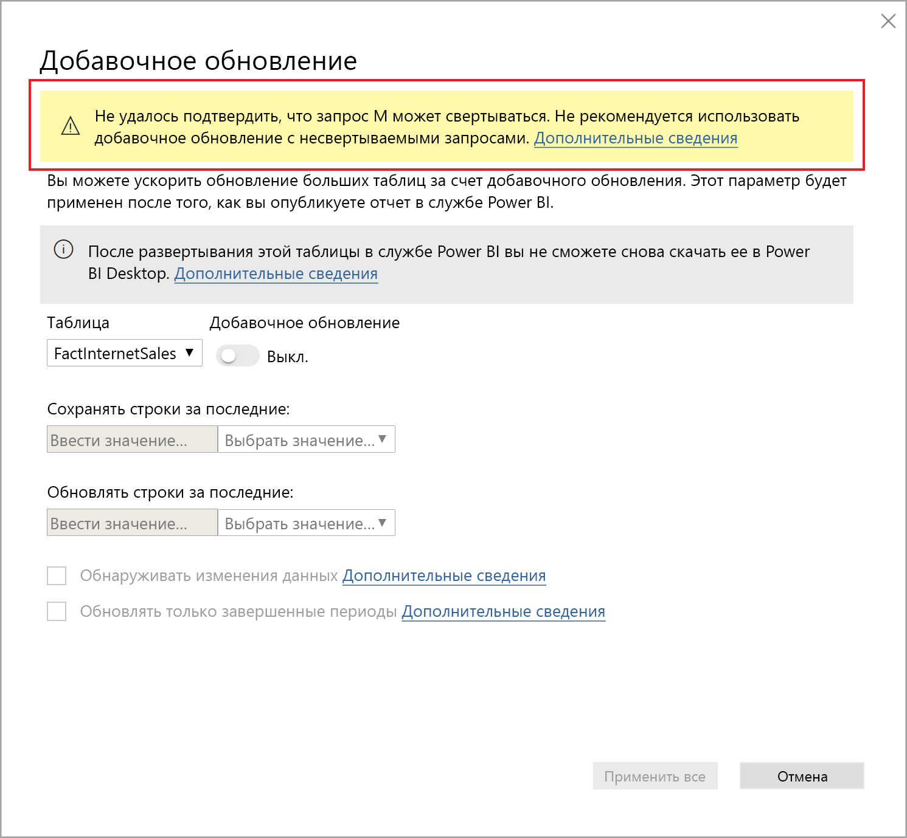

# <a name="incremental-refresh-in-power-bi"></a>Добавочное обновление в Power BI

Добавочное обновление дает указанные ниже преимущества при работе с очень большими наборами данных в службе Power BI.

> [!div class="checklist"]
> * **Обновление происходит быстрее** — обновлять нужно только те данные, которые изменились. Например, в наборе данных за 10 лет могут обновляться данные только за последние пять дней.
> * **Обновления становятся надежнее** — нет необходимости надолго подключаться к нестабильным исходным системам.
> * **Снижается потребление ресурсов** — так как обновлять требуется меньше данных, сокращается общее потребление памяти и других ресурсов.

> [!NOTE]
> Добавочное обновление теперь доступно для Power BI Pro, Premium, а также общих подписок и наборов данных.

## <a name="configure-incremental-refresh"></a>Настройка добавочного обновления

Политики добавочного обновления определяются в Power BI Desktop и применяются при публикации в службе Power BI.

### <a name="filter-large-datasets-in-power-bi-desktop"></a>Фильтрация больших наборов данных в Power BI Desktop

Большие наборы данных, насчитывающие миллиарды строк, могут не помещаться в модель Power BI Desktop, так как возможности PBIX-файла обычно ограничены ресурсами памяти, имеющимися на компьютере. Поэтому, как правило, они фильтруются при импорте. Этот тип фильтрации применяется независимо от того, используется ли добавочное обновление. Для добавочного обновления можно выполнить фильтрацию с помощью параметров даты и времени Power Query.

#### <a name="rangestart-and-rangeend-parameters"></a>Параметры RangeStart и RangeEnd

При использовании добавочного обновления наборы данных фильтруются с помощью параметров даты и времени Power Query с зарезервированными именами **RangeStart** и **RangeEnd**, в которых учитывается регистр. Эти параметры используются для фильтрации данных, импортируемых в Power BI Desktop, а также для динамического секционирования данных на диапазоны после публикации в службе Power BI. Значения параметров подставляются службой для фильтрации для каждой секции. Задавать их в параметрах набора данных службы не нужно. После публикации значения параметров переопределяются автоматически службой Power BI.

Чтобы задать для параметров значения по умолчанию, в редакторе Power Query нажмите кнопку **Управление параметрами**.


Определив параметры, можно применить фильтр. Для этого выберите пункт меню **Пользовательский фильтр** для столбца.


Отфильтруйте строки, в которых значение столбца *не больше* **RangeStart** и *меньше* **RangeEnd**. Другие сочетания фильтров могут привести к двойному подсчету строк.


> [!IMPORTANT]
> Убедитесь, что запросы имеют значение (=) для параметра **RangeStart** или **RangeEnd**, но не для обоих одновременно. Если в обоих параметрах существует знак равенства (=), строка может соответствовать условиям для двух секций, что может привести к дублированию данных в модели. Например,  
> \#"Filtered Rows" = Table.SelectRows(dbo_Fact, each [OrderDate] **>= RangeStart** и [OrderDate] **<= RangeEnd**) может привести к дублированию данных.

> [!TIP]
> Хотя параметры должны иметь тип данных "дата и время", их можно преобразовать в соответствии с требованиями источника данных. Например, приведенная ниже функция Power Query преобразует значение даты и времени в целочисленный суррогатный ключ в формате *ггггммдд*, типичном для хранилищ данных. Эту функцию можно вызывать на этапе фильтрации.
>
> `(x as datetime) => Date.Year(x)*10000 + Date.Month(x)*100 + Date.Day(x)`

В редакторе Power Query нажмите кнопку **Закрыть и применить**. В Power BI Desktop должно появиться подмножество набора данных.

#### <a name="filter-date-column-updates"></a>Обновление фильтра столбцов даты

Фильтр столбцов даты используется для динамического секционирования данных на диапазоны в службе Power BI. Добавочное обновление не поддерживает случаи, когда отфильтрованный столбец даты обновляется в исходной системе. Обновление будет интерпретировано как вставка и удаление (а не как фактическое обновление). Если произошло удаление в диапазоне в прошлом, а не добавочного обновления, данные не будут извлекаться. Это может привести к сбоям обновления данных, возникающим из-за конфликтов ключа и секции.

#### <a name="query-folding"></a>Свертывание запроса

Важно, чтобы на момент отправки запросов для операций обновления фильтры секций отправлялись в исходную систему. Это значит, что источник данных должен поддерживать "свертывание запроса". Большинство источников данных, которые поддерживают запросы SQL, также поддерживают свертывание запроса. При этом такие источники данных, как неструктурированные файлы, BLOB-объекты и веб-ленты, обычно не поддерживают свертывание. Если фильтр не поддерживается в серверной части источника данных, он не может быть отправлен в исходную систему. В таких случаях подсистема гибридных веб-приложений применяет фильтр локально, для чего может потребоваться извлечь полный набор данных из источника данных. Это может привести к существенному замедлению добавочного обновления, и процессу будет недостаточно ресурсов в службе Power BI или в локальном шлюзе данных (если он используется).

Так как каждый источник данных поддерживает собственный уровень свертывания запросов, рекомендуется выполнить проверку, чтобы гарантировать включение логики фильтра в исходные запросы. Чтобы облегчить эту задачу, Power BI Desktop пытается выполнить эту проверку автоматически. Если выполнить проверку не удается, в диалоговом окне добавочного обновления при определении политики добавочного обновления отображается предупреждение. Работа источников данных на основе SQL, таких как SQL, Oracle и Teradata, может зависеть от этого предупреждения. Другие источники данных могут быть неспособны выполнить проверку без трассировки запросов. Если Power BI Desktop не удается выполнить проверку, отображается следующее предупреждение. Если вы видите это предупреждение и хотите убедиться, что происходит необходимое свертывание запросов, можно использовать функцию диагностики запросов или трассировку запросов, получаемых базой данных-источником.

 

### <a name="define-the-refresh-policy"></a>Определение политики обновления

Команда добавочного обновления доступна в контекстном меню таблиц, кроме таблиц на основе модели с динамическим подключением.


#### <a name="incremental-refresh-dialog"></a>Диалоговое окно добавочного обновления

Открывается диалоговое окно добавочного обновления. Чтобы включить или отключить его, используйте переключатель.


> [!NOTE]
> Если в выражении Power Query для таблицы не используются параметры с зарезервированными именами, переключатель отключен.

Текст в заголовке уточняет следующие моменты.

- Политики обновления определяются в Power BI Desktop и применяются при операциях обновления в службе.

- Даже если вам удалось скачать PBIX-файл с политикой добавочного обновления из службы Power BI,его нельзя будет открыть в Power BI Desktop. Хотя эта возможность может поддерживаться в будущем, имейте в виду, что наборы данных могут увеличиваться до таких размеров, что скачивать и открывать их на обычном настольном компьютере будет нецелесообразно.

#### <a name="refresh-ranges"></a>Диапазоны обновления

В следующем примере определяется политика обновления для хранения данных в течение пяти полных календарных лет и данных за текущий год до текущей даты, а также добавочное обновление данных за последние полные 10 дней. Первая операция обновления загружает исторические данные. Последующие обновления являются добавочными и (если запланировано ежедневное выполнение) выполняют следующие операции.

- Добавляются данные за последний день.

- Обновляются данные за последние полные 10 дней до текущей даты.

- Удаляются данные за календарные годы старше пяти лет до текущей даты. Например, если сегодня 1 января 1 2019 г., удаляются данные за 2013 г.

Первое обновление в службе Power BI может занять много времени, так как импортируются все данные за пять лет. Последующие обновления обычно завершаются гораздо быстрее.


#### <a name="current-date"></a>Текущая дата

*Текущая дата* зависит от системной даты на момент обновления. Если для набора данных в службе Power BI включено запланированное обновление, то при определении текущей даты учитывается указанный часовой пояс. Как вызванные вручную, так и запланированные обновления через службу Power BI учитывают часовой пояс (если он доступен). Например, обновление, которое выполняется в 20 часов по тихоокеанскому времени (США и Канада) с заданным часовым поясом, определяет текущую дату по тихоокеанскому времени, а не по Гринвичу (в противном случае это будет следующий день). Операции обновления, которые не были вызваны через службу Power BI, например [команда обновления TMSL](/analysis-services/tmsl/refresh-command-tmsl?view=power-bi-premium-current), не учитывают часовой пояс запланированного обновления.


> [!NOTE]
> Определения этих диапазонов может быть достаточно. В этом случае можно сразу перейти к публикации. В остальных раскрывающихся списках можно настроить дополнительные возможности.

### <a name="advanced-policy-options"></a>Параметры расширенной политики

#### <a name="detect-data-changes"></a>Обнаруживать изменения данных

Добавочное обновление данных за 10 дней гораздо эффективнее полного обновления за пять лет. Однако эффективность может быть еще выше. Если установить флажок **Обнаруживать изменения данных**, можно выбрать столбец типа "дата и время", с помощью которого будут определяться дни, в которые данные изменились; тогда обновляться будут данные только за эти дни. Предполагается, что в исходной системе есть такой столбец. Обычно он предназначен для аудита. **Это не должен быть столбец, использованный для секционирования данных с помощью параметров RangeStart и RangeEnd.** Для каждого из периодов в диапазоне добавочного обновления вычисляется максимальное значение этого столбца. Если оно не изменилось с момента последнего обновления, обновлять данные за этот период не нужно. Благодаря этому в примере число дней, за которые нужно обновить данные, может уменьшиться, например с 10 до двух.


> [!TIP]
> Сейчас требуется, чтобы столбец, который служит для обнаружения изменений данных, был хранимым и кэшировался в памяти. Чтобы уменьшить кратность и потребление памяти, можно воспользоваться одним из описанных ниже приемов.
>
> Сохраняйте только максимальное значение этого столбца во время обновления, например, с помощью функции Power Query.
>
> Уменьшите точность до приемлемого уровня с учетом требований к частоте обновления.
>
> Определите пользовательский запрос для обнаружения изменений данных с помощью конечной точки XMLA и не сохраняйте все значение столбца полностью. Дополнительные сведения см. в приведенном ниже описании пользовательских запросов для обнаружения изменений данных.

#### <a name="only-refresh-complete-periods"></a>Обновлять только завершенные периоды

Допустим, запланировано ежедневное обновление в 04:00. Возможна ситуация, когда данные, появившиеся в исходной системе за эти четыре часа, учитывать не требуется. Некоторые бизнес-метрики, например баррели в сутки в нефтегазовой отрасли, не имеет смысла учитывать за неполные дни.

Другим примером является обновление данных в финансовой системе, в которой данные за предыдущий месяц утверждаются в 12-й календарный день месяца. В этом случае можно задать диапазон добавочного обновления длительностью в месяц и настроить запуск обновления в 12-й день месяца. Например, данные за январь будут обновляться 12 февраля.


> [!NOTE]
> Время выполнения обновления в службе задается в формате UTC. Это может влиять на дату выполнения и полные периоды. Мы планируем добавить возможность переопределять дату выполнения обновления.

## <a name="publish-to-the-service"></a>Публикация в службе

Теперь можно обновить модель. Первое обновление может занять много времени, так как данные импортируются за весь период. Последующие обновления могут происходить гораздо быстрее, так как они являются добавочными.

## <a name="query-timeouts"></a>Истечение времени ожидания запроса

В статье, посвященной [устранению неполадок](../connect-data/refresh-troubleshooting-refresh-scenarios.md), объясняется, что при операциях обновления в службе Power BI может истекать время ожидания. В отношении запросов также может действовать время ожидания по умолчанию, настроенное для источника данных. Большинство реляционных источников позволяют переопределять время ожидания в выражении M. Например, в приведенном ниже выражении с помощью [функции доступа к данным SQL Server](/powerquery-m/sql-database) оно задается равным двум часам. Для каждого периода, определенного в диапазонах политики, запрос выполняется с учетом времени ожидания команды.

```powerquery-m
let
    Source = Sql.Database("myserver.database.windows.net", "AdventureWorks", [CommandTimeout=#duration(0, 2, 0, 0)]),
    dbo_Fact = Source{[Schema="dbo",Item="FactInternetSales"]}[Data],
    #"Filtered Rows" = Table.SelectRows(dbo_Fact, each [OrderDate] >= RangeStart and [OrderDate] < RangeEnd)
in
    #"Filtered Rows"
```

## <a name="xmla-endpoint-benefits-for-incremental-refresh"></a>Преимущества конечных точек XMLA с точки зрения добавочного обновления

В емкости Premium для наборов данных можно включить использование [конечной точки XMLA](service-premium-connect-tools.md) для операций чтения и записи, что может предоставить значительные преимущества с точки зрения добавочного обновления. Операции обновления через конечную точку XMLA не ограничены [48 обновлениями в день](../connect-data/refresh-data.md#data-refresh), и при этом нет строго заданного [времени ожидания запланированного обновления](../connect-data/refresh-troubleshooting-refresh-scenarios.md#scheduled-refresh-timeout), что может оказаться весьма удобным в сценариях с добавочными обновлениями.

### <a name="refresh-management-with-sql-server-management-studio-ssms"></a>Управление обновлениями в SQL Server Management Studio

Если для конечной точки XMLA включен доступ для чтения и записи, SQL Server Management Studio (SSMS) можно использовать для просмотра разделов, созданных приложением политик добавочного обновления, и управления ими. Это позволяет, например, обновить определенный прошлый раздел задним числом вне диапазона добавочного обновления, не обновляя при этом все данные за прошедший период. Кроме того, с помощью SSMS вы можете загружать исторические данные для очень больших наборов данных путем постепенного добавления или обновления исторических секций в виде пакетов.


#### <a name="override-incremental-refresh-behavior"></a>Переопределение поведения при добавочном обновлении

С помощью SSMS вы также можете получить более полный контроль над процессом вызова добавочных обновлений с помощью [языка сценариев табличной модели (TMSL)](/analysis-services/tmsl/tabular-model-scripting-language-tmsl-reference?view=power-bi-premium-current) и [модели табличных объектов (TOM)](/analysis-services/tom/introduction-to-the-tabular-object-model-tom-in-analysis-services-amo?view=power-bi-premium-current). Например, в SSMS в обозревателе объектов щелкните правой кнопкой мыши таблицу и пункт меню **Обработать таблицу**. Затем нажмите кнопку **Сценарий**, чтобы создать команду обновления TMSL.


Чтобы переопределить заданное по умолчанию поведение при добавочном обновлении, можно вставить в команду обновления TMSL следующие параметры.

- **applyRefreshPolicy** — если для таблицы определена политика добавочного обновления, этот параметр определяет, применяется политика или нет. Если политика не применяется, полная операция обработки не приведет к изменению определений разделов и все разделы в таблице будут обновлены полностью. Значение по умолчанию — true.

- **effectiveDate** — если применяется политика добавочного обновления, чтобы определить диапазоны скользящих интервалов для диапазона в прошлом и инкрементного диапазона, необходимо знать текущую дату. Параметр effectiveDate позволяет переопределить текущую дату. Это удобно при тестировании, демонстрации и в бизнес-сценариях, где используется инкрементное обновление данных до даты в прошлом или будущем (например, для бюджетов в будущем). Значение по умолчанию равно текущей дате.

```json
{ 
  "refresh": {
    "type": "full",

    "applyRefreshPolicy": true,
    "effectiveDate": "12/31/2013",

    "objects": [
      {
        "database": "IR_AdventureWorks", 
        "table": "FactInternetSales" 
      }
    ]
  }
}
```

Дополнительные сведения о переопределении поведения добавочного обновления по умолчанию см. в статье [Команда обновления](/analysis-services/tmsl/refresh-command-tmsl?view=power-bi-premium-current).

### <a name="custom-queries-for-detect-data-changes"></a>Пользовательские запросы для обнаружения изменений данных

Для переопределения поведения при обнаружении изменений данных можно использовать TMSL и/или TOM. Это не только позволит избежать сохранения столбца last-update в кэше в памяти, но и обеспечит поддержку сценариев, в которых процессы извлечения, преобразования и загрузки подготавливают таблицу конфигурации или инструкций для обозначения только тех разделов, которые необходимо обновить. Таким образом можно создать более эффективный процесс добавочного обновления, при котором обновление выполняется только для необходимых периодов, независимо от того, как давно обновлялись данные.

Параметр pollingExpression можно использовать в качестве упрощенного выражения M или имени другого запроса M. Он должен возвращать скалярное значение и будет применяться для каждого раздела. Если возвращаемое значение отличается от того, которое было получено в последний раз при выполнении добавочного обновления, то раздел обозначается как подлежащий полной обработке.

В следующем примере рассматриваются все 120 месяцев диапазона в прошлом для изменений задним числом. Тот факт, что вместо 10 лет указано 120 месяцев, означает, что сжатие данных может оказаться не столь эффективным, но при этом не придется обновлять весь прошедший год и тратить лишние ресурсы, если достаточно и месяца для изменения задним числом.

```json
"refreshPolicy": {
    "policyType": "basic",
    "rollingWindowGranularity": "month",
    "rollingWindowPeriods": 120,
    "incrementalGranularity": "month",
    "incrementalPeriods": 120,
    "pollingExpression": "<M expression or name of custom polling query>",
    "sourceExpression": [
    "let ..."
    ]
}
```

## <a name="metadata-only-deployment"></a>Развертывание только метаданных

При публикации новой версии PBIX-файла из Power BI Desktop в рабочую область служба Power BI Premium предложит заменить существующий набор данных, если набор данных с таким именем уже существует.


В некоторых случаях необходимо избежать замены набора данных, особенно добавочными обновлениями. Набор данных в Power BI Desktop может быть намного меньше, чем в службе. Если к набору данных в службе применяется политика добавочного обновления, при замене набора данных могут быть утрачены хранящиеся в нем данные за несколько прошедших лет. Обновление всех данных за прошедший период может занять несколько часов и привести к простою системы для пользователей.

Вместо этого лучше развернуть только метаданные. Это позволит развертывать новые объекты без потери данных за прошедшие периоды. Например, если вы добавили несколько мер, можно развернуть только эти новые меры, не обновляя сами данные, что позволит сохранить много времени.

При настройке для чтения и записи конечная точка XMLA обеспечивает совместимость с инструментами, которые предоставляют такую возможность. Например, набор средств ALM позволяет выявлять отличия в схемах для наборов данных Power BI и может использоваться для развертывания только метаданных.

Скачайте и установите последнюю версию набора средств ALM из [репозитория Git для Analysis Services](https://github.com/microsoft/Analysis-Services/releases). Ссылки на документацию и сведения о поддержке доступны на ленте справки. Чтобы развернуть только метаданные, выполните сравнение и выберите выполняющийся экземпляр Power BI Desktop в качестве источника, а существующий набор данных в службе — в качестве места назначения. Изучите отображаемые различия и пропустите обновление таблицы с разделами, к которым применяется добавочное обновление, или используйте диалоговое окно "Параметры", чтобы сохранить разделы для обновлений таблицы. Проверьте выбор, чтобы убедиться в целостности целевой модели, а затем запустите обновление.


## <a name="see-also"></a>См. также раздел

[Возможность подключения к набору данных с помощью конечной точки XMLA](service-premium-connect-tools.md)   
[Troubleshooting refresh scenarios](../connect-data/refresh-troubleshooting-refresh-scenarios.md) (Устранение неполадок в сценариях обновления)