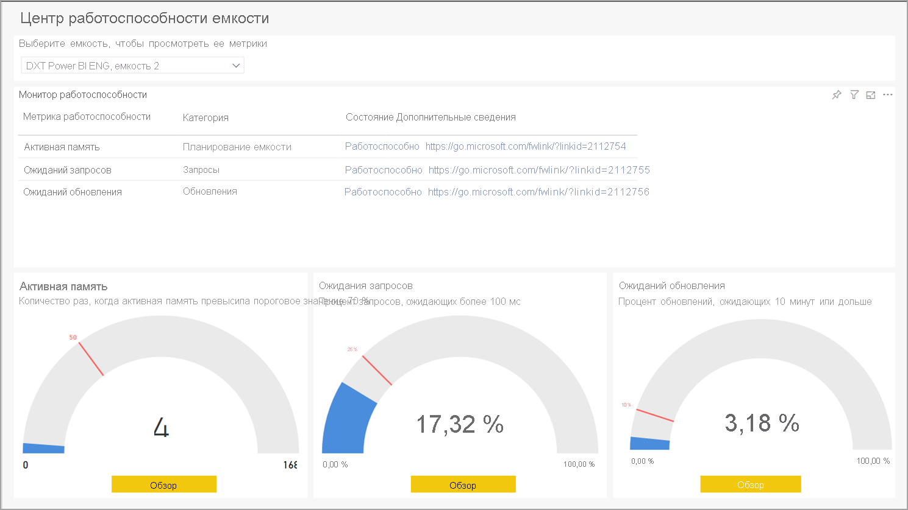
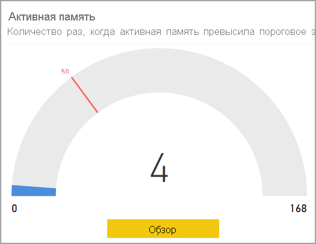
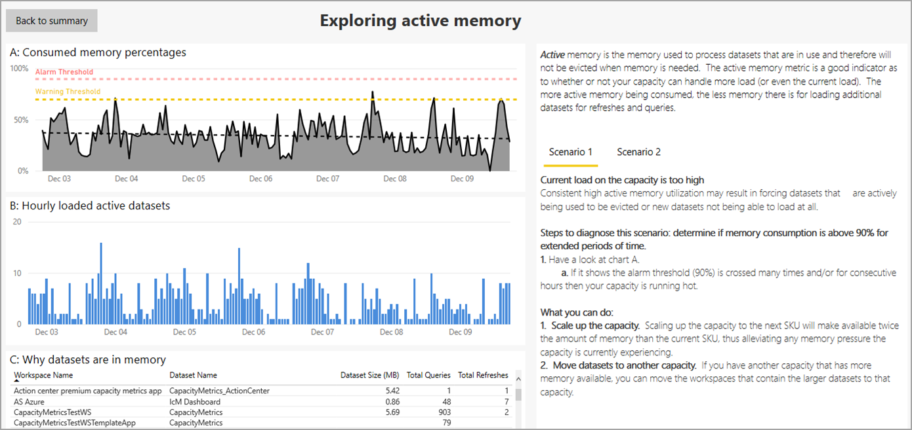
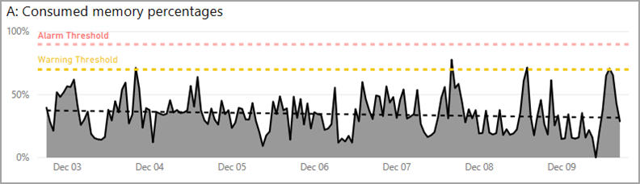
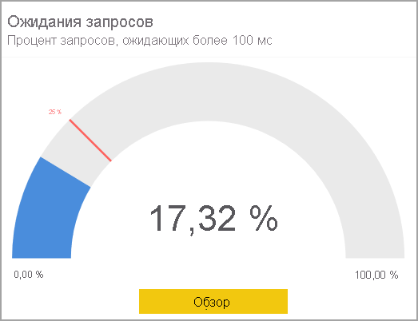
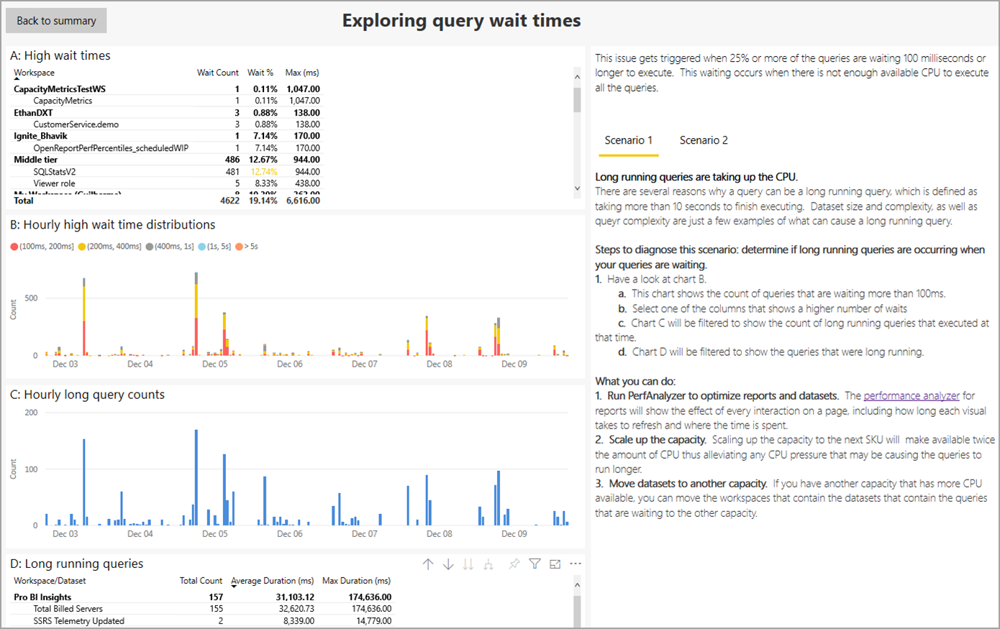
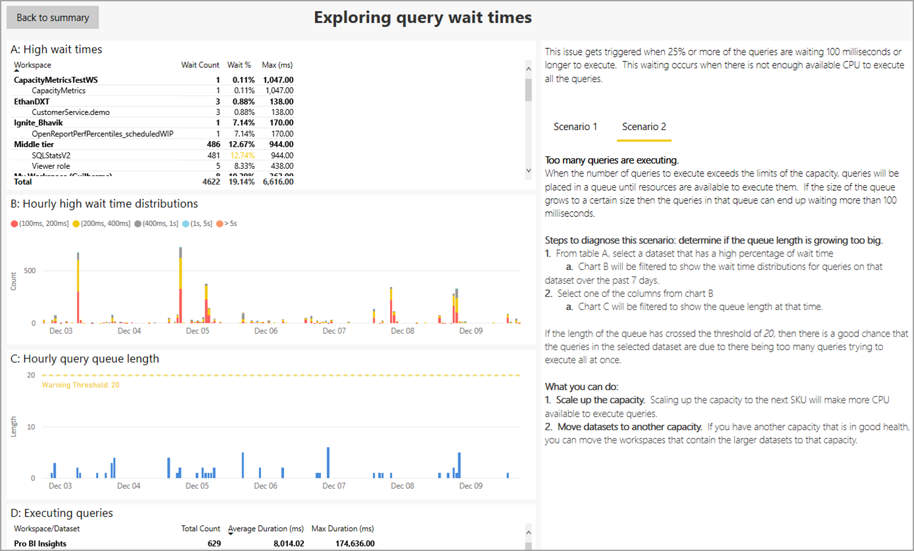
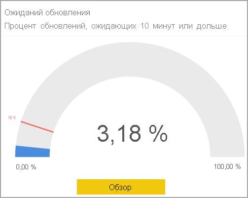
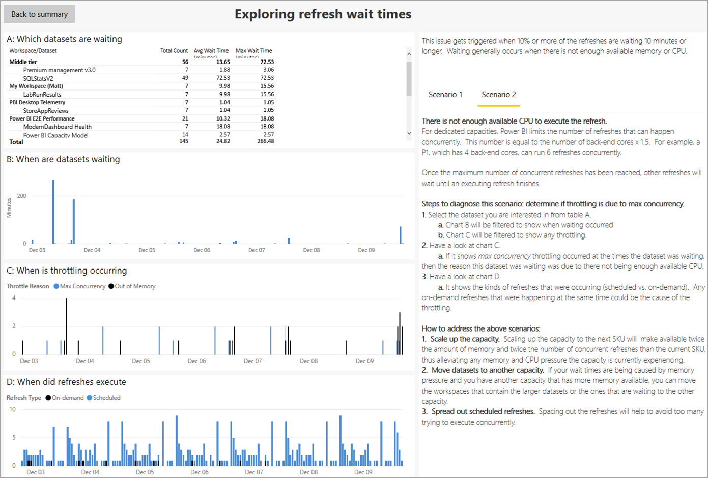

# Приложение Power BI Premium Metrics

Для управления работоспособностью и емкостью подписки Power BI Premium можно использовать **приложение Power BI Premium Metrics**. В этом приложении администраторы используют **Центр работоспособности емкости**, чтобы просмотреть и использовать индикаторы, которые отслеживают работоспособность емкости Premium. Приложение метрик состоит из целевой страницы, которая называется **Центр работоспособности емкости**, а также сведений о трех важных метриках:

* Активная память
* Query waits (Время ожидания запроса)
* Refresh waits (Ожидание обновления).

В следующих разделах подробно описана целевая страница и страницы отчета о трех метриках. 

> [!IMPORTANT]
> Если емкость Power BI Premium подвергается большой нагрузке, из-за которой могут возникать проблемы с производительностью или надежностью, вы можете получать по электронной почте уведомления, чтобы устранять эти проблемы. Это может упростить устранение неполадок, связанных с перегрузкой емкостей. Дополнительные сведения см. в статье [Уведомления о емкости и надежности](service-interruption-notifications.md#capacity-and-reliability-notifications).

## Центр работоспособности емкости Premium

При открытии **приложения Power BI Premium Metrics** появится **Центр работоспособности емкости**, который предоставляет общие сведения о работоспособности емкости Power BI Premium.

Если в вашей организации есть несколько подписок Premium, на целевой странице можно выбрать емкость Power BI Premium, которую нужно просмотреть. Чтобы просмотреть емкость Premium, щелкните в верхней части страницы раскрывающийся список с именем **Select a capacity to see its metrics** (Выберите емкость, чтобы увидеть ее метрики).

Три ключевых показателя эффективности (КПЭ) показывают текущую работоспособность выбранной емкости Premium на основе параметров, примененных к каждому из них. 

Чтобы просмотреть сведения о каждом ключевом показателе эффективности, нажмите кнопку **Просмотреть** в нижней части визуального элемента КПЭ и отобразится страница сведений. В следующих разделах описывается каждый из ключевых показателей эффективности и подробности на соответствующей странице.

## Метрика активной памяти

Метрика **Active memory** (Активная память) — это часть категории *планирования ресурсов*, которая является хорошим индикатором работоспособности, позволяющим определить потребление ресурсов емкости, поэтому можно настроить емкость соответствующим образом, чтобы спланировать ее масштабирование. 

**Активная память** — это память, позволяющая обработать наборы данных, которые используются в настоящее время и поэтому не могут быть выгружены из памяти при необходимости ее освободить. Метрика активной памяти указывает, может ли емкость справиться с дополнительной нагрузкой или текущая нагрузка уже приближается к имеющейся емкости или превышает ее. Использование в данный момент активной памяти означает, что будет меньше доступной памяти для поддержки дополнительных обновлений и запросов. 

Ключевой показатель эффективности **Активная память** измеряет, сколько раз активная память емкости пересекла пороговое значение 70 % (например, 50 раз; маркер установлен на 30 % за последние семь дней). Это указывает на то, что емкость приближается к точке, когда пользователям становятся очевидны проблемы с производительностью запросов.

Индикаторная диаграмма, показанная в этом разделе, отображает, что за последние семь дней с момента обновления отчета емкость превысила пороговое значение 70 % четыре раза (с разделением на часовые периоды). Максимальное значение индикаторной диаграммы — 168. Оно представляет последние семь дней в часах.

Чтобы узнать подробные сведения о ключевом показателе эффективности "Активная память", нажмите кнопку **Просмотреть**, после чего отобразится страница отчета, которая предоставляет конкретные визуализации для этой метрики, а также руководство по устранению неполадок, которое можно увидеть в правом столбце страницы. 

Здесь объясняются два сценария, которые можно отобразить на странице отчета, выбрав тут же **сценарий 1** или **сценарий 2**. 

Связанные с каждым сценарием руководства по устранению неполадок содержат подробные объяснения о том, что означают метрики, благодаря чему вы можете лучше понять состояние емкости и то, что можно сделать для устранения каких-либо проблем. 

Эти два сценария описаны в следующих разделах.

### Сценарий 1. Слишком высокая текущая нагрузка 

Чтобы определить, достаточно ли в емкости памяти для выполнения рабочих нагрузок, просмотрите первый визуальный элемент на странице. **A: Consumed Memory Percentages** (A. Использование памяти (%)) — отображает память, которая занята активно обрабатываемыми наборами данных и поэтому не может быть выгружена.

Пороговое значение тревоги — это красная пунктирная линия, которая информирует об использовании памяти на 90 %.

Пороговое значение предупреждения — это желтая пунктирная линия, которая информирует об использовании памяти на 70 %. 

Черная пунктирная линия обозначает линию тренда использования памяти, исходя из текущего использования памяти емкости на временной шкале.

Высокая линия нагрузки активной памяти выше порога тревоги (красная пунктирная линия) и линия тренда памяти (черная пунктирная линия) означает нехватку памяти, что может препятствовать загрузке дополнительных наборов данных в память в данный момент. 

В таких случаях следует обратить внимание на другие диаграммы страницы, чтобы лучше определить, что и почему так часто использует настолько много памяти, а также как распределить нагрузку, оптимизировать или при необходимости увеличить масштаб емкости. 

Второй визуальный элемент на странице **B: Hourly loaded active datasets** (B. Активные наборы данных, загружаемые каждый час) отображает счетчики максимального количества наборов данных, загруженных в память, с почасовым разбиением. 

Третий визуальный элемент **C: Why datasets are in memory** (C. Почему наборы данных находятся в памяти) является таблицей со списком наборов данных и такими сведениями о них, как имя рабочей области, имя набора данных, их несжатый размер в памяти, а также информация о причине, по которой они загружаются в память (например, обновляются, запрашиваются или то и другое).

#### Диагностика сценария 1

Постоянный высокий уровень использования активной памяти может привести к принудительному удалению активно используемых наборов данных или препятствовать загрузке новых. Следующие шаги помогут диагностировать проблемы.

1. Взгляните на диаграмму *A: Consumed memory percentages* (A. Использование памяти (%)).

    **а.** Если на диаграмме А отображается пересечение порогового значения тревоги (90 %) много раз и (или) несколько часов подряд, тогда у вашей емкости слишком часто заканчивается память. На приведенной ниже диаграмме видно, что пороговое значение предупреждения (70%) было достигнуто четыре раза.

    

    **б.** На диаграмме с названием *B: Hourly loaded active datasets* (B. Активные наборы данных, загружаемые каждый час) отображается максимальное количество загруженных в память уникальных наборов данных с почасовым разбиением. При выборе столбца в визуальном элементе будет выполняться перекрестная фильтрация причин, из-за которых наборы данных находятся в памяти.  

         

    **в.** Изучите таблицу **Почему наборы данных находятся в памяти**, чтобы просмотреть список наборов данных, загруженных в память. Сортируйте по полю *Dataset Size (MB)* (Размер набора данных (МБ)) для выделения наборов данных, которые занимают больше всего места в памяти. Операции с использованием емкости классифицируются как *интерактивные* или *фоновые*. К интерактивным операциям относятся отрисовка отчетов и реагирование на взаимодействие с пользователем (фильтрация, "Вопросы и ответы" и т. д.). Общее количество запросов и обновлений позволяет понять, выполняются ли с набором данных такие операции, как интерактивные (запросы) с высокой интенсивностью или фоновые (обновления). Важно понимать, что интерактивные операции всегда имеют приоритетное значение по сравнению с фоновыми, обеспечивая таким образом лучшее взаимодействие с пользователем. Если ресурсов недостаточно, фоновые операции добавляются в очередь и обрабатываются после освобождения ресурсов. Служба Power BI может остановить выполнение фоновых операций, таких как обновление набора данных и функции ИИ, и добавить их в очередь.
    
      

#### Способы решения проблем для сценария 1

Чтобы устранить проблемы, связанные со сценарием 1, выполните следующие действия.

1. **Увеличьте масштаб емкости**. Увеличив масштаб емкости до следующего номера SKU, вы получите вдвое больший объем памяти, чем у текущего SKU, что снизит нагрузку на память емкости, которая сейчас наблюдается.

2. **Переместите наборы данных в другую емкость**. Если есть другая емкость с большим объемом доступной памяти, можно в нее переместить рабочие области, содержащие большие наборы данных.

### Сценарий 2. Будущая нагрузка превысит ограничения

Чтобы определить, достаточно ли в емкости памяти для выполнения рабочих нагрузок, обратитесь к визуальному элементу **A: Consumed Memory Percentages** (A. Использование памяти (%)) в верхней части страницы, представляющий объем памяти, которая потребляется активно обрабатываемыми наборами данных и поэтому не может быть выгружена. Пунктирной черной линией показаны тенденции. В емкости, испытывающей нехватку памяти, один и тот же визуальный элемент будет ясно отображать возрастающую линию тренда памяти (черная пунктирная линия), а это означает, что в данный момент загрузка дополнительных наборов данных в память невозможна. Линия тренда (черная пунктирная линия) отображает тенденцию роста на основе данных за семь дней. 

#### Диагностика сценария 2

Чтобы диагностировать сценарий 2, определите, идет ли линия тренда вверх к порогу предупреждения или тревоги. 

1. Рассмотрим **диаграмму A.**

    

    **а.** Если на диаграмме отображается восходящий уклон, это означает, что потребление памяти увеличилось за последние семь дней.

    **б.** Предположите текущий рост и спрогнозируйте, когда линия тренда пересечет пороговое значение предупреждения (желтая пунктирная линия).

    **в.** Проверяйте линию тренда как минимум каждые два дня, чтобы увидеть, сохраняется ли тенденция.

#### Способы решения проблем для сценария 2

Чтобы устранить проблемы, связанные со сценарием 2, выполните следующие действия.

1. **Увеличьте масштаб емкости**. Увеличив масштаб емкости до следующего номера SKU, вы получите вдвое больший объем памяти, чем у текущего SKU, что снизит нагрузку на память емкости, которая сейчас наблюдается.

2. **Переместите наборы данных в другую емкость**. Если есть другая емкость с большим объемом доступной памяти, можно в нее переместить рабочие области, содержащие большие наборы данных.

## Метрика ожидания запросов

Категория **Запросы** указывает, могут ли пользователи столкнуться с ситуацией, когда визуальные элементы отчетов медленно реагируют или вообще перестают отвечать. **Ожидание запросов** — это время до начала выполнения запроса с момента его отправки. Этот ключевой показатель эффективности измеряет, ожидают ли 25 % и более запросов выбранной емкости выполнения в течение 100 миллисекунд или дольше. Ожидание запросов возникает, если недостаточно доступных ресурсов ЦП для выполнения всех ожидающих запросов. 

На индикаторной диаграмме в этом визуальном элементе видно, что за последние семь дней с момента последнего обновления отчета 17,32 % запросов были в ожидании более 100 миллисекунд. 

Чтобы узнать подробные сведения о ключевом показателе эффективности "Ожидание запросов", нажмите кнопку **Просмотреть**, после чего отобразится страница отчета с визуализацией соответствующих метрик и руководство по устранению неполадок в правом столбце страницы. Руководство по устранению неполадок охватывает два сценария, для каждого из которых предоставляются подробные объяснения о метрике, состояние емкости и возможности для устранения проблемы.

В следующих разделах мы рассмотрим каждый сценарий ожидания запросов по очереди.

### Сценарий 1. Длительные запросы, использующие ЦП

В сценарии 1 длительные запросы потребляют слишком много ресурсов ЦП. 

Вы можете выяснить, чем вызвана низкая производительность отчета: перегруженной емкостью либо плохо спроектированным набором данных или отчетом. Существует несколько причин, по которым запрос может выполняться в течение длительного периода времени (более 10 секунд до завершения выполнения). Размер и сложность набора данных, а также сложность запросов — это всего лишь несколько примеров того, что может привести к длительному выполнению запроса. 

На странице отчета отображаются следующие визуальные элементы. 

* Верхняя таблица с названием **A: High wait times** (A. Длительное время ожидания) содержит список наборов данных с ожидающими запросами. 
* **B: Hourly high wait time distributions** (B. Почасовое распределение длительного времени ожидания) содержит распределение длительного времени ожидания. 
* На диаграмме с названием **C: Hourly long query counts** (C. Почасовое количество длительных запросов) отображается количество выполненных длительных запросов с разделением на часовые периоды.
* Последним визуальным элементом является таблица **D. Длительные запросы**, которые содержат список длительных запросов и их статистику.

Ниже приведены шаги, которые можно предпринять для диагностики и устранения проблем со временем ожидания запросов.

#### Диагностика сценария 1

Во первых, можно определить, происходят ли длительные запросы, когда запросы находятся в режиме ожидания. 

Взгляните на **диаграмму B**, на которой можно увидеть количество запросов, ожидающих более 100 мс. Выберите один из столбцов, в котором отображается большое число ожиданий.

Если щелкнуть столбец с длительным временем ожидания, **диаграмма C** отфильтруется, и можно будет увидеть количество длительных запросов, выполненных в течение выбранного периода времени, как показано на следующем рисунке:

Кроме того, **диаграмма D** также отфильтруется для отображения длительных запросов за выбранный период времени.

#### Способы решения проблем для сценария 1

Ниже приведены действия, которые можно предпринять для устранения проблем в сценарии 1.

1. **Запустите PerfAnalyzer для оптимизации отчетов и наборов данных**. Анализатор производительности для отчетов показывает влияние каждого взаимодействия на странице, в том числе время, затрачиваемое каждым визуальным элементом для обновления и выполнения.

2. **Увеличьте масштаб емкости**. Увеличив масштаб емкости до следующего номера SKU, вы получите вдвое больше ресурсов ЦП, что снижает нагрузку на ЦП, которая может быть причиной долгого выполнения запросов.

3. **Переместите наборы данных в другую емкость**. Если есть другая емкость с большим доступным ресурсом ЦП, можно в нее переместить рабочие области с наборами данных, содержащими запросы, ожидающие другой емкости.

### Сценарий 2. Слишком много запросов

В сценарии 2 выполняется слишком много запросов.

Когда количество выполняемых запросов превышает ограничения емкости, запросы помещаются в очередь, пока не станут доступны ресурсы для их выполнения. Если размер очереди становится слишком большим, запросы в этой очереди могут пребывать более 100 миллисекунд.

#### Диагностика сценария 2

В **таблице A** выберите набор данных, который имеет высокий процент времени ожидания.

После выбора набора данных с длительным временем ожидания **диаграмма B** отфильтруется для отображения распределений времени ожидания для запросов в этом наборе данных за последние семь дней. Затем выберите один из столбцов на **диаграмме B**.

Затем **диаграмма C** отфильтруется, чтобы отобразить длину очереди в момент времени, выбранный на диаграмме B.

Если длина очереди превысила пороговое значение 20, скорее всего, запросы в выбранном наборе данных будут отложены из-за слишком большого числа запросов, которые пытаются выполниться одновременно.

#### Способы решения проблем для сценария 2

Чтобы устранить проблемы, связанные со сценарием 2, выполните следующие действия.

1. **Увеличьте масштаб емкости**. Увеличив масштаб емкости до следующего номера SKU, вы получите вдвое больший объем памяти, чем у текущего SKU, что снизит нагрузку на память емкости, которая сейчас наблюдается.

2. **Переместите наборы данных в другую емкость**. Если есть другая емкость с большим объемом доступной памяти, можно в нее переместить рабочие области, содержащие большие наборы данных.

## Метрика ожидания обновления

Метрика **Refresh waits** (Ожидание обновления) предоставляет аналитические сведения о том, когда пользователи могут столкнуться со старыми или устаревшими данными отчета. **Ожидание обновления** — это время пребывания заданного обновления данных в ждущем режиме до начала выполнения с момента его запуска по запросу или по расписанию. Этот ключевой показатель эффективности измеряет, ожидают ли более 10 минут 10 % и более от всего количества ожидающих запросов на обновление. Ожидание обычно происходит при нехватке доступной памяти или ресурсов ЦП.

На этой индикаторной диаграмме видно, что за семь дней с момента последнего обновления отчета 3,18 % обновлений были в ожидании более 10 минут. 

Чтобы узнать подробные сведения о ключевом показателе эффективности **Ожидания обновления**, нажмите кнопку **Просмотреть**, после чего отобразится страница с метриками и руководство по устранению неполадок в правом столбце страницы отчета. В этом руководстве содержатся подробные объяснения метрик на странице. Оно поможет определить состояние емкости и возможности для устранения проблем.

Здесь объясняются два сценария, которые можно отобразить на странице отчета, выбрав тут же сценарий 1 или сценарий 2. Мы рассмотрим каждый сценарий по очереди в следующих разделах.

### Сценарий 1. Недостаточно памяти

В сценарии 1 недостаточно доступной памяти для загрузки набора данных. Существует две ситуации, при которых регулируется обновление в условиях нехватки памяти:

1. Недостаточно памяти для загрузки набора данных.
2. Обновление отменено из-за операции с более высоким приоритетом. 

Ниже приведен приоритет для загрузки наборов данных:

1. Интерактивный запрос
2. Обновление по запросу.
3. Запланированное обновление

Если недостаточно памяти, чтобы загрузить набор данных для интерактивного запроса, запланированные обновления останавливаются, а их наборы данных выгружаются, пока не освободится достаточно памяти. Если это не освобождает достаточно памяти, то останавливаются обновления по запросу и выгружаются их наборы данных.

#### Диагностика сценария 1

Чтобы диагностировать сценарий 1, сначала определите, происходит ли регулирование из-за нехватки памяти. Для этого выполните следующие действия.

1.    Выберите интересующий набор данных из **таблицы A**, щелкнув его: 

    

    а. После выбора набора данных из **таблицы A** **диаграмма B** фильтруется, чтобы показать, когда произошло ожидание.

    

    б. Затем для отображения регулирования фильтруется **диаграмма C**, как описано в следующем шаге. 

2. Взгляните на результаты в отфильтрованной **диаграмме C**. Если на диаграмме показано регулирование из-за нехватки памяти в момент, когда набор данных был в ожидании, то это ожидание случилось из-за нехватки памяти.

    

3. Наконец, проверьте **диаграмму D**, в которой отображаются типы обновлений: по расписанию или по запросу. Все обновления по запросу, происходящие в то же время, могут быть причиной регулирования.

    

#### Способы решения проблем для сценария 1

Чтобы устранить проблемы, связанные со сценарием 1, выполните следующие действия.

1. **Увеличьте масштаб емкости**. Увеличив масштаб емкости до следующего номера SKU, вы получите вдвое больший объем памяти, чем у текущего SKU, что снизит нагрузку на память и ресурсы ЦП емкости, которая сейчас наблюдается.

2. **Переместите наборы данных в другую емкость**. Если время ожидания вызвано нехваткой памяти, а есть другая емкость с большим объемом доступной памяти, можно в нее переместить рабочие области с наборами данных, которые ожидают другую емкость.

3. **Распределите запланированные обновления**. Распределение обновлений поможет избежать слишком большого количества обновлений, выполняемых одновременно.

### Сценарий 2. Недостаточно ресурсов ЦП для обновления

В сценарии 2 недостаточно доступных ресурсов ЦП для выполнения обновления. 

Для выделенных емкостей Power BI ограничивает количество обновлений, которые могут выполняться одновременно. Это количество равно числу внутренних ядер, помноженному на 1,5. Например, выделенная емкость P1 с четырьмя внутренними ядрами может выполнять 6 обновлений одновременно. После достижения максимального количества одновременных обновлений другие обновления будут ожидать завершение предыдущих.

#### Диагностика сценария 2

Чтобы диагностировать сценарий 2, сначала определите, связано ли регулирование с максимальным параллелизмом для обновлений. Для этого выполните следующие действия.

1.    Выберите интересующий набор данных из **таблицы A**, щелкнув его: 

    

    а. После выбора набора данных из **таблицы A** **диаграмма B** фильтруется, чтобы показать, когда произошло ожидание.

    

    б. Затем для отображения регулирования фильтруется **диаграмма C**, как описано в следующем шаге. 

2. Взгляните на результаты в отфильтрованной **диаграмме C**. Если на диаграмме показан *максимальный параллелизм* в момент, когда набор данных был в ожидании, то это ожидание случилось из-за нехватки доступных ресурсов ЦП.

    

3. Наконец, проверьте **диаграмму D**, в которой отображаются типы обновлений: по расписанию или по запросу. Все обновления по запросу, происходящие в то же время, могут быть причиной регулирования.

    

#### Способы решения проблем для сценария 2

1. **Увеличьте масштаб емкости**. Увеличив масштаб емкости до следующего номера SKU, вы получите вдвое больший объем памяти и вдвое большее число одновременных обновлений, чем у текущего SKU, что снизит нагрузку на память емкости, которая сейчас наблюдается.

2. **Переместите наборы данных в другую емкость**. Если время ожидания вызвано достижением максимального параллелизма, а есть другая емкость с доступным параллелизмом, можно в нее переместить рабочие области с наборами данных, которые ожидают другую емкость.

3. **Распределите запланированные обновления**. Распределение обновлений поможет избежать слишком большого количества обновлений, выполняемых одновременно.

## Дальнейшие действия

* [Что такое Power BI Premium?](service-premium-what-is.md)
* [Технический документ по Microsoft Power BI Premium](https://aka.ms/pbipremiumwhitepaper)
* [Технический документ по планированию развертывания Power BI Enterprise](https://aka.ms/pbienterprisedeploy)
* [Активация расширенной пробной версии Power BI Pro](../fundamentals/service-self-service-signup-for-power-bi.md)
* [Часто задаваемые вопросы о Power BI Embedded](../developer/embedded/embedded-faq.md)

Появились дополнительные вопросы? [Попробуйте задать вопрос в сообществе Power BI.](https://community.powerbi.com/)
