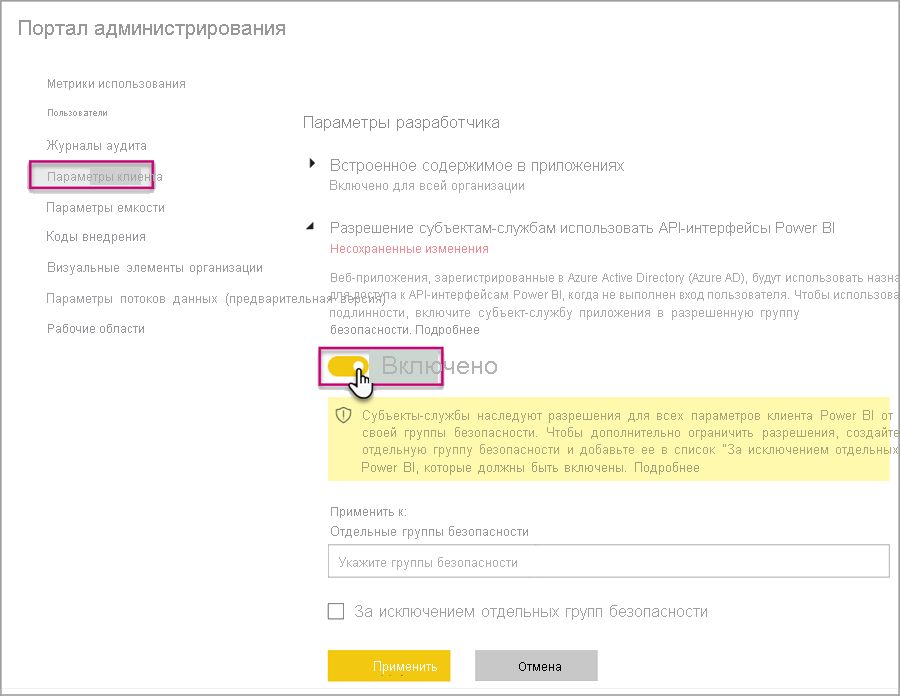
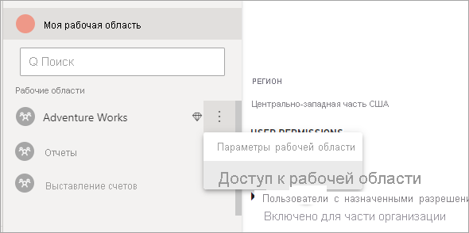

# <a name="automate-premium-workspace-and-dataset-tasks-with-service-principals"></a>Автоматизация задач по управлению рабочими областями Premium и наборами данных с помощью субъектов-служб

Субъект-служба — это *регистрация приложения* Azure Active Directory, созданная в клиенте для выполнения автоматических операций с ресурсом и уровнем обслуживания. Она представляет собой уникальный тип идентификатора пользователя с именем приложения, идентификатором приложения, идентификатором клиента и *секретом клиента* или сертификатом для пароля.

В Power BI Premium используются те же функции субъектов-служб, что и в Power BI Embedded. Подробнее см. в разделе [Внедрение содержимого Power BI с помощью субъектов-служб](../developer/embedded/embed-service-principal.md).

В **Power BI Premium**субъекты-службы также можно использовать вместе с [конечной точкой XMLA](service-premium-connect-tools.md) для автоматизации задач по управлению наборами данных, таких как подготовка рабочих областей, развертывание моделей и обновление набора данных с помощью следующего.

- PowerShell
- Автоматизация Azure
- Azure Logic Apps
- Настраиваемые клиентские приложения

Только [новые рабочие области](../collaborate-share/service-new-workspaces.md) поддерживают подключения к конечной точке XMLA с помощью субъектов-служб. Классические рабочие области не поддерживаются. У субъекта-службы есть разрешения на выполнение только тех задач, которые необходимы для рабочих областей, которым они назначены. Разрешения назначаются посредством доступа к рабочей области, во многом подобно обычным учетным записям UPN.

Для выполнения операций записи в **рабочей нагрузке набора данных** емкости должна быть [конечная точка XMLA, доступная для чтения и записи](service-premium-connect-tools.md#enable-xmla-read-write). Для наборов данных, опубликованных из Power BI Desktop, должна быть включена функция [Расширенный формат метаданных](../connect-data/desktop-enhanced-dataset-metadata.md).

> [!NOTE]
> Функция конечной точки XMLA в Power BI Premium доступна в **предварительной версии**. Возможности предварительной версии не следует использовать в рабочей среде. Некоторые функциональные возможности, поддержка и документация ограничены.  Дополнительные сведения см. на странице [условий лицензирования Microsoft Online Services (OST)](https://www.microsoft.com/licensing/product-licensing/products?rtc=1).

## <a name="create-a-service-principal"></a>Создание субъекта-службы

Субъекты-службы можно создать в качестве регистрации приложения на портале Azure или с помощью PowerShell. При создании субъекта-службы обязательно скопируйте и сохраните отдельно имя приложения, идентификатор приложения (клиента), идентификатор каталога (клиента) и секрет клиента. Сведения о порядке создания субъекта-службы см. в следующих разделах.

[Создание приложения Azure Active Directory и субъекта-службы с доступом к ресурсам с помощью портала](https://docs.microsoft.com/azure/active-directory/develop/howto-create-service-principal-portal)   
[Создание субъекта-службы с помощью PowerShell](https://docs.microsoft.com/azure/active-directory/develop/howto-authenticate-service-principal-powershell)

## <a name="create-an-azure-ad-security-group"></a>Создание группы безопасности Azure AD

По умолчанию субъекты-службы имеют доступ ко всем параметрам клиента, для которых они включены. В зависимости от параметров администратора такой доступ может включать определенную группу безопасности или всю организацию.

Чтобы ограничить доступ субъекта-службы к параметрам определенного клиента, можно разрешить доступ только к определенным группам безопасности. Кроме того, можно создать выделенную группу безопасности для субъектов-служб и исключить ее из параметров нужного клиента. Инструкции по созданию группы безопасности и добавлению субъекта-службы см. в разделе [Создание простой группы и добавление в нее участников с помощью Azure Active Directory](https://docs.microsoft.com/azure/active-directory/fundamentals/active-directory-groups-create-azure-portal).

## <a name="enable-service-principals"></a>Включение субъектов-служб

Прежде чем использовать субъекты-службы в Power BI, администратор должен сначала включить доступ субъекта-службы на портале администрирования Power BI.

В Power BI в разделе **Портал администрирования** > **Параметры клиента** разверните параметр **Разрешить субъектам-службам использовать API Power BI**, а затем щелкните **Включено**. Чтобы применить разрешения к группе безопасности, добавьте имя группы в поле **Определенные группы безопасности**.



## <a name="workspace-access"></a>Доступ к рабочей области

Чтобы субъект-служба имела необходимые разрешения на выполнение операций с рабочей областью Premium и наборами данных, необходимо добавить эту субъект-службу в качестве участника или администратора рабочей области. Использование доступа к рабочей области в службе Power BI описывается в данном разделе, однако также можно обратиться к разделу [REST API для добавления пользователя в группу](https://docs.microsoft.com/rest/api/power-bi/groups/addgroupuser).

1. В службе Power BI для рабочей области выберите **Дополнительно** > **Доступ к рабочей области**.

    

2. Выполните поиск приложения по имени, добавьте субъект-службу как **Администратор** или **Участник** в эту рабочую область.

    

## <a name="connection-strings-for-the-xmla-endpoint"></a>Строки подключения для конечной точки XMLA

После создания субъекта-службы, включения субъекта-службы для клиента и добавления субъекта-службы в рабочую область для доступа к ней ее можно использовать в качестве идентификатора пользователя в строках подключения с конечной точкой XMLA. Разница заключается в том, что в качестве идентификатора пользователя и пароля вы указываете идентификатор приложения, идентификатор клиента и секрет приложения.

`Data Source=powerbi://api.powerbi.com/v1.0/myorg/<workspace name>; Initial Catalog=<dataset name>;User ID=app:<appId>@<tenantId>;Password=<app_secret>;`

### <a name="powershell"></a>PowerShell

#### <a name="using-sqlserver-module"></a>Использование модуля SQLServer

В следующем примере для проверки подлинности операции обновления набора данных используются параметры AppId, TenantId и AppSecret:

```powershell
Param (
        [Parameter(Mandatory=$true)] [String] $AppId,
        [Parameter(Mandatory=$true)] [String] $TenantId,
        [Parameter(Mandatory=$true)] [String] $AppSecret
       )
$PWord = ConvertTo-SecureString -String $AppSecret -AsPlainText -Force

$Credential = New-Object -TypeName "System.Management.Automation.PSCredential" -ArgumentList $AppId, $PWord

Invoke-ProcessTable -Server "powerbi://api.powerbi.com/v1.0/myorg/myworkspace" -TableName "mytable" -DatabaseName "mydataset" -RefreshType "Full" -ServicePrincipal -ApplicationId $AppId -TenantId $TenantId -Credential $Credential
```

### <a name="amo-and-adomd"></a>Объекты AMO и ADOMD

При подключении к клиентским приложениям и веб-приложениям устанавливаемые пакеты от NuGet [клиентских библиотек AMO и ADOMD](https://docs.microsoft.com/azure/analysis-services/analysis-services-data-providers) версии 15.0.2 и выше поддерживают субъекты-службы в строках подключения с помощью следующего синтаксиса: `app:AppID` и пароль или `cert:thumbprint`.

В следующем примере `appID` и `password` используются для выполнения операции обновления шаблона базы данных:

```csharp
string appId = "xxx";
string authKey = "yyy";
string connString = $"Provider=MSOLAP;Data source=powerbi://api.powerbi.com/v1.0/<tenant>/<workspacename>;Initial catalog=<datasetname>;User ID=app:{appId};Password={authKey};";
Server server = new Server();
server.Connect(connString);
Database db = server.Databases.FindByName("adventureworks");
Table tbl = db.Model.Tables.Find("DimDate");
tbl.RequestRefresh(RefreshType.Full);
db.Model.SaveChanges();
```

## <a name="next-steps"></a>Дальнейшие действия

[Возможность подключения к набору данных с помощью конечной точки XMLA](service-premium-connect-tools.md)  
[Служба автоматизации Azure](https://docs.microsoft.com/azure/automation)  
[Azure Logic Apps](https://docs.microsoft.com/azure/logic-apps/)  
[REST API в Power BI](https://docs.microsoft.com/rest/api/power-bi/)
