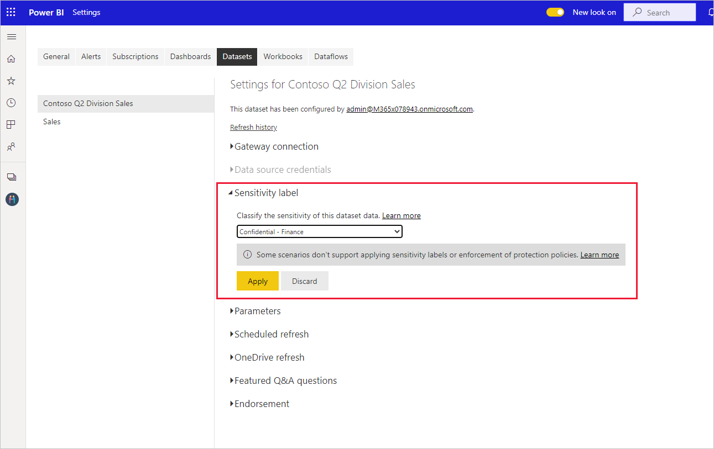

# Применение меток конфиденциальности в Power BI

Метки конфиденциальности Microsoft Information Protection в отчетах, на панелях инструментов, в наборах данных и в потоках данных могут защитить ваше конфиденциальное содержимое от несанкционированного доступа к данным и их утечки. Используя соответствующие метки конфиденциальности, вы гарантируете, что доступ к данным будут получать только лица с соответствующими разрешениями. В этой статье рассказывается, как применять метки конфиденциальности к содержимому.

Для применения меток конфиденциальности в Power BI
* У вас должны быть лицензия Power BI Pro и разрешения на редактирование содержимого, к которым требуется добавлять метки.
* Вы должны входить в группу безопасности, которой назначены разрешения на применение меток конфиденциальности, как описывается в статье [Активация меток конфиденциальности в Power BI](./service-security-enable-data-sensitivity-labels.md#enable-sensitivity-labels).
* Все [предварительные требования](./service-security-sensitivity-label-overview.md#requirements-for-using-sensitivity-labels-in-power-bi) и [требования к лицензированию](./service-security-data-protection-overview.md#licensing) должны быть выполнены.

Дополнительные сведения о метках конфиденциальности в Power BI см. в статье [Метки конфиденциальности в Power BI](service-security-sensitivity-label-overview.md).

## Применение меток конфиденциальности

Если в вашем клиенте включена защита данных, метки конфиденциальности отображаются в столбце "Конфиденциальность" в представлении списка для панелей мониторинга, отчетов, наборов и потоков данных.

**Применение метки конфиденциальности к отчету или панели мониторинга или изменение этой метки**
1. Нажмите кнопку **Дополнительные параметры (...)** .
1. Выберите **Параметры**.
1. На боковой панели параметров выберите соответствующую метку конфиденциальности.
1. Сохраните параметры.

На следующем изображении эти действия показаны в отчете

**Применение метки конфиденциальности к набору или потоку данных или изменение этой метки**

1. Нажмите кнопку **Дополнительные параметры (...)** .
1. Выберите **Параметры**.
1. На боковой панели параметров выберите соответствующую метку конфиденциальности.
1. Примените параметры.

Следующие два изображения демонстрируют эти действия в наборе данных.

Выберите **Дополнительные параметры (...)** , а затем **Параметры**.

На странице параметров откройте раздел "Метка конфиденциальности", выберите нужную метку и нажмите кнопку **Применить**.

## Удаление меток конфиденциальности
Чтобы удалить метку конфиденциальности из отчета, панели мониторинга, набора данных или потока данных, выполните [процедуру, используемую для применения меток](#applying-sensitivity-labels), но выберите **(Нет)** при появлении запроса на классификацию конфиденциальности данных. 

## Рекомендации и ограничения

Список ограничений на использование меток конфиденциальности в Power BI см. в статье [Метки конфиденциальности в Power BI](service-security-sensitivity-label-overview.md#limitations).

## Дальнейшие действия

В этой статье было рассмотрено применение меток конфиденциальности в Power BI. В следующих статьях вы найдете дополнительные сведения о защите данных в Power BI. 

* [Общие сведения о метках конфиденциальности в Power BI](./service-security-sensitivity-label-overview.md)
* [Активация меток конфиденциальности в Power BI](./service-security-enable-data-sensitivity-labels.md)
* [Использование элементов управления Microsoft Cloud App Security в Power BI](./service-security-using-microsoft-cloud-app-security-controls.md)