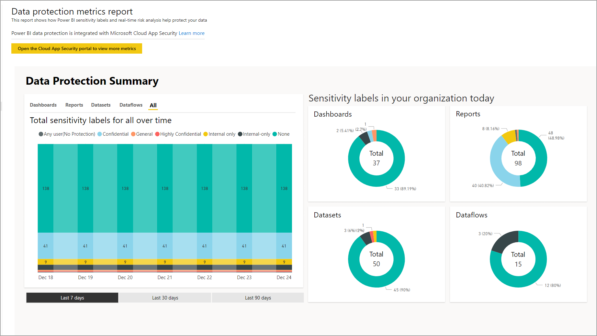

# Отчет о метриках защиты данных

## Что такое отчет о метриках защиты данных?
Отчет о метриках защиты данных — это специальный отчет, с помощью которого [администраторы Power BI](../service-admin-role.md) могут отслеживать использование и принятие меток конфиденциальности данных в клиенте.

 
Функции отчета:
* нормированная гистограмма с накоплением, показывающая ежедневное использование меток конфиденциальности в клиенте за последние 7, 30 или 90 дней; эта диаграмма упрощает отслеживание относительного использования различных типов меток на протяжении времени;
* кольцевые диаграммы, показывающие текущее состояние использования меток конфиденциальности в клиенте для панелей мониторинга, отчетов, наборов данных и потоков данных;
* ссылка на портал Cloud App Security, на котором доступны оповещения Power BI, список находящихся в зоне риска пользователей, журналы действий и другие сведения. Дополнительные сведения см. в статье [Использование элементов управления Microsoft Cloud App Security в Power BI](./service-security-using-microsoft-cloud-app-security-controls.md).

Отчет обновляется каждые 24 часа.

## Просмотр отчета о метриках защиты данных

Для открытия и просмотра отчета необходима роль [администратора Power BI](../service-admin-role.md).
Чтобы просмотреть отчет, перейдите на страницу **Параметры > Портал администрирования** и выберите **Метрики защиты**.

 
 
При первом открытии отчета о метриках защиты данных его загрузка может занять несколько секунд. В вашей личной среде в разделе "Моя рабочая область" будут созданы отчет и набор данных под названием **Метрики защиты данных (автоматически созданные)** . Мы не рекомендуем просматривать отчет здесь — это не полнофункциональная его версия. Вместо этого просмотрите отчет на портале администрирования, как описано выше.

> [!CAUTION]
> Не изменяйте отчет или набор данных каким-либо образом, так как регулярно выпускаются новые версии отчета и все изменения, внесенные в исходный отчет, будут перезаписаны при обновлении до новой версии.

## Обновление отчета

Периодически выпускаются усовершенствованные версии отчета о метриках защиты данных. Если доступна новая версия, при открытии отчета вам будет предложено открыть ее. Если вы ответите "Да", новая версия загрузится и перезапишет старую. Все изменения, внесенные в старую версию отчета и набора данных, будут утеряны. Вы можете не открывать новую версию, но в этом случае вы не получите преимущества новой версии. 
## Замечания и рекомендации
* Для успешного создания отчета о метриках защиты данных в клиенте должна быть включена [защита информации](./service-security-enable-data-sensitivity-labels.md) и [применены метки конфиденциальности](../collaborate-share/service-security-apply-data-sensitivity-labels.md). 
* Для доступа к данным Cloud App Security у вашей организации должна быть соответствующая [лицензия Cloud App Security](https://docs.microsoft.com/power-bi/admin/service-security-using-microsoft-cloud-app-security-controls#microsoft-cloud-app-security-licensing).
* Если вы хотите поделиться сведениями из отчета о метриках защиты данных с пользователем, который не является администратором Power BI, учтите, что этот отчет содержит конфиденциальные сведения о вашей организации.
* Отчет о метриках защиты данных — это отчет особого типа, который не отображается в списках "Мне предоставлен доступ", "Последние" и "Избранное".
* Отчет о метриках защиты данных недоступен для [внешних пользователей (гостевых пользователей B2B Azure Active Directory)](../service-admin-azure-ad-b2b.md).
## Дальнейшие действия
* [Защита данных в Power BI](./service-security-data-protection-overview.md)
* [Использование элементов управления Microsoft Cloud App Security в Power BI](service-security-using-microsoft-cloud-app-security-controls.md)
* [Основные сведения о роли администратора службы Power BI](service-admin-role.md)
* [Активация меток конфиденциальности данных в Power BI](service-security-enable-data-sensitivity-labels.md)