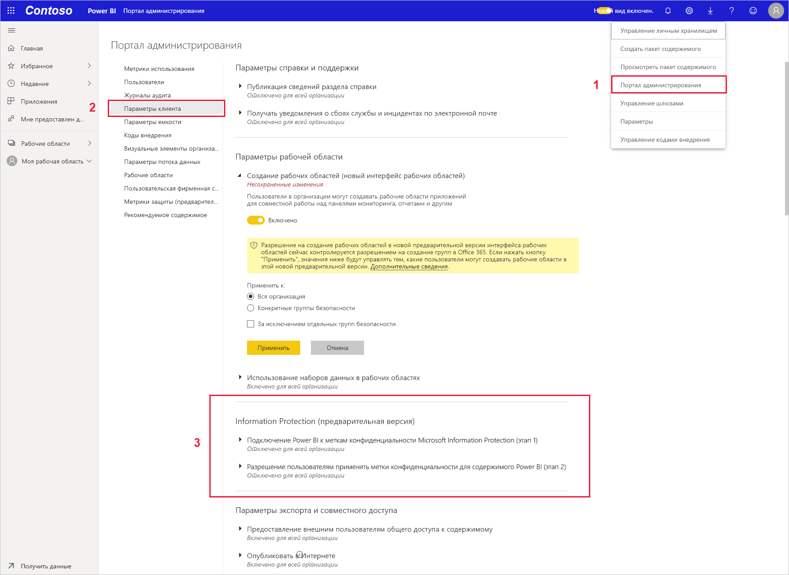
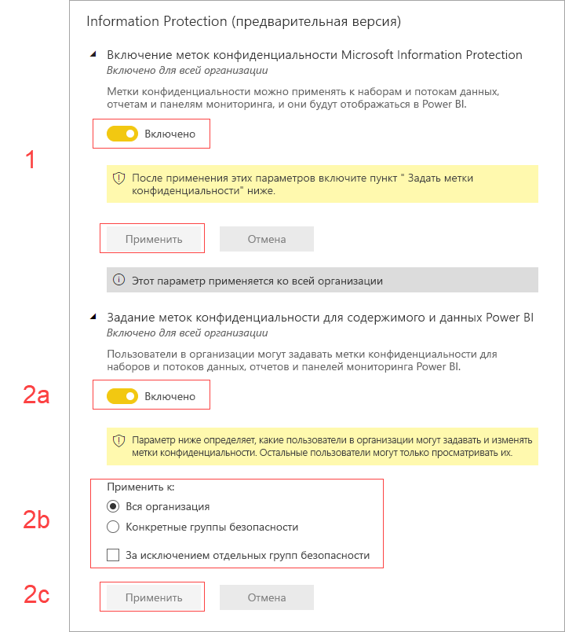

# Активация меток конфиденциальности данных в Power BI (предварительная версия)

Активация [меток конфиденциальности данных Microsoft Information Protection](https://docs.microsoft.com/microsoft-365/compliance/sensitivity-labels) в Power BI дает следующие возможности:

* Некоторые пользователи и группы безопасности в организации могут классифицировать и [применять метки конфиденциальности](../collaborate-share/service-security-apply-data-sensitivity-labels.md) к своим панелям мониторинга, отчетам, наборам данных и потокам данных Power BI (здесь и далее они называются *ресурсами*).
* Все члены организации могут просматривать эти метки.

Применение меток конфиденциальности позволяет обеспечить более эффективную защиту данных за счет предоставления авторам и потребителям Power BI сведений о конфиденциальности данных, а также об уровнях классификации и требованиях к работе с данными, относящимися к конкретным категориям.

При экспорте данных Power BI, имеющих метку конфиденциальности, в файл Excel, PowerPoint или PDF метка сохраняется вместе с файлом. Таким образом, пользователь, не имеющий разрешений на доступ к конфиденциальным данным в соответствии с политиками применения меток конфиденциальности, не сможет открывать такие файлы *вне* среды Power BI (в приложениях Excel, PowerPoint или PDF).

Для активации меток конфиденциальности данных требуется лицензия Azure Information Protection. Дополнительные сведения см. в разделе [Лицензирование](#licensing).

## Активация меток конфиденциальности данных

Чтобы активировать метки конфиденциальности данных Microsoft Information Protection в Power BI, перейдите на портал администрирования Power BI, откройте страницу "Параметры клиента" и найдите раздел "Information Protection".

В разделе **Information Protection** выполните следующие действия:
1.  Включите переключатель **Включение меток конфиденциальности Microsoft Information Protection** и нажмите кнопку **Применить**. На этом этапе метки конфиденциальности будут *только* видны членам вашей организации. Никакие метки при этом применены не будут. Чтобы определить пользователей, которые могут применять эти метки в Power BI, выполните шаг 2.
2.  Определите, кто может применять метки конфиденциальности к ресурсам Power BI и изменять их. На этом шаге необходимо выполнить три действия:
    1.  Включите переключатель **Задание меток конфиденциальности для содержимого и данных Power BI**.
    2.  Выберите соответствующие группы безопасности. По умолчанию метки конфиденциальности могут применять все пользователи вашей организации. При необходимости вы можете разрешить задание меток конфиденциальности только отдельным пользователям или группам безопасности. Выбрав всю организацию или отдельные группы безопасности, вы можете исключить некоторых пользователей или конкретные группы безопасности.
    * Если метки конфиденциальности активированы для всей организации, как правило, исключаются группы безопасности.
    * Если метки конфиденциальности включены для отдельных пользователей или групп безопасности, исключаются обычно конкретные пользователи.  
    Такой подход позволяет запретить применять метки конфиденциальности Power BI некоторым пользователям, даже если они входят в группу с соответствующими разрешениями.
    
    3. Нажмите кнопку **Применить**.

> [!IMPORTANT]
> Задавать и редактировать метки конфиденциальность могут только те пользователи Power BI Pro с разрешениями на *создание* и *изменение* ресурса, которые входят в соответствующую группу безопасности, как описывается в этом разделе. Пользователи, не включенные в такую группу, не смогут задавать или редактировать метки. 

## Рекомендации и ограничения

В Power BI используются метки конфиденциальности Microsoft Information Protection. Если при попытке активировать метки конфиденциальности появляется сообщение об ошибке, это может быть вызвано одной из следующих причин:

* У вас нет [лицензии](#licensing) Azure Information Protection.
* Не был выполнен перенос меток конфиденциальности в версию Microsoft Information Protection, поддерживаемую Power BI. Дополнительные сведения о [переносе меток конфиденциальности](https://docs.microsoft.com/azure/information-protection/configure-policy-migrate-labels).
* В организации не определены метки конфиденциальности Microsoft Information Protection. Кроме того, использовать можно только те метки, которые включены в опубликованную политику. Дополнительные сведения о метках конфиденциальности можно найти в [этой статье](https://docs.microsoft.com/Office365/SecurityCompliance/sensitivity-labels). Чтобы узнать больше об определении меток и публикации политик для организации, вы также можете посетить [центр безопасности и соответствия требованиям Майкрософт](https://sip.protection.office.com/sensitivity?flight=EnableMIPLabels).

## Лицензирование

* Для просмотра и применения меток Microsoft Information Protection в Power BI пользователям требуется лицензия Azure Information Protection категории Premium P1 или P2. Средство Microsoft Azure Information Protection можно приобрести как отдельно, так и в составе одного из наборов лицензирования Майкрософт. Дополнительные сведения см. в статье [Цены на Azure Information Protection](https://azure.microsoft.com/pricing/details/information-protection/).
* Чтобы применять метки к ресурсам Power BI, пользователям потребуется лицензия Power BI Pro.

## Дальнейшие действия

В этой статье приводятся сведения об активации меток конфиденциальности данных в Power BI. В следующих статьях вы найдете дополнительные сведения о защите данных в Power BI. 

* [Общие сведения о защите данных в Power BI](service-security-data-protection-overview.md)
* [Применение меток конфиденциальности данных в Power BI](../collaborate-share/service-security-apply-data-sensitivity-labels.md)
* [Использование элементов управления Microsoft Cloud App Security в Power BI](service-security-using-microsoft-cloud-app-security-controls.md)
* [Отчет о метриках защиты данных](service-security-data-protection-metrics-report.md)