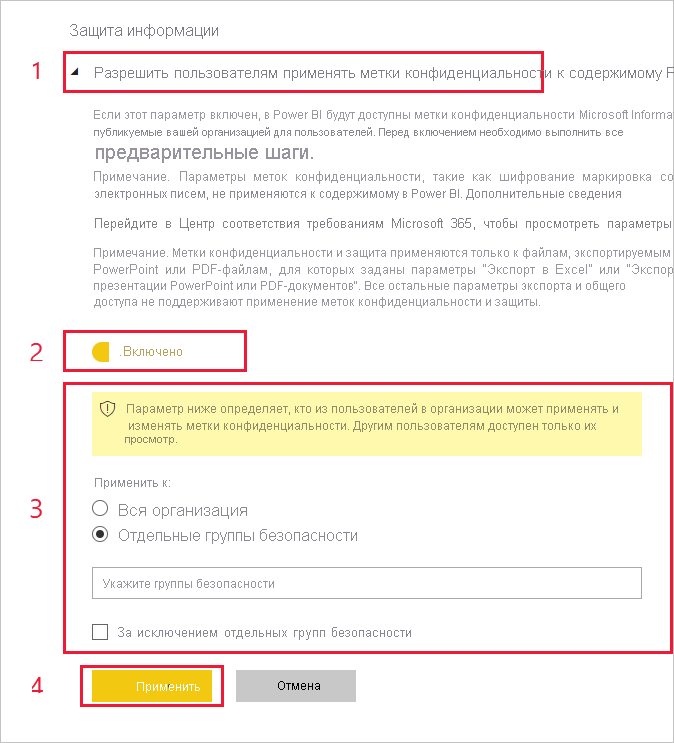

# Активация меток конфиденциальности в Power BI

Чтобы использовать [метки конфиденциальности Microsoft Information Protection](https://docs.microsoft.com/microsoft-365/compliance/sensitivity-labels) в Power BI, их необходимо активировать в клиенте. В этой статье приводятся действия по активации, выполняемые администраторами клиента Power BI. Общие сведения о метках конфиденциальности в Power BI см. в статье [Метки конфиденциальности в Power BI](service-security-sensitivity-label-overview.md). Сведения о применении меток конфиденциальности в Power BI см. в статье [Применение меток конфиденциальности данных в Power BI.](./service-security-apply-data-sensitivity-labels.md) 

Активация меток конфиденциальности дает следующие возможности.

* Определенные пользователи и группы безопасности в организации могут классифицировать метки конфиденциальности и [применять их](./service-security-apply-data-sensitivity-labels.md) к своим панелям мониторинга, отчетам, наборам данных и потокам данных Power BI.
* Все члены организации могут просматривать эти метки.

Для активации меток конфиденциальности требуется лицензия Azure Information Protection. Дополнительные сведения см. в разделе [Лицензирование](service-security-sensitivity-label-overview.md#licensing).

## Активация меток конфиденциальности

Перейдите на портал **администрирования** Power BI, откройте панель **Параметры клиента** и найдите раздел **Information Protection**.

В разделе **Information Protection** выполните следующие действия:
1. Откройте **Разрешить пользователям применять метки конфиденциальности к содержимому Power BI**.
1. Включите переключатель.
1. Определите, кто может применять метки конфиденциальности к ресурсам Power BI и изменять их. По умолчанию метки конфиденциальности могут применять все пользователи вашей организации. При необходимости вы можете разрешить задание меток конфиденциальности только отдельным пользователям или группам безопасности. Выбрав всю организацию или отдельные группы безопасности, вы можете исключить некоторых пользователей или конкретные группы безопасности.
   
   * Если метки конфиденциальности активированы для всей организации, как правило, исключаются группы безопасности.
   * Если метки конфиденциальности включены для отдельных пользователей или групп безопасности, исключаются обычно конкретные пользователи.  
    Такой подход позволяет запретить применять метки конфиденциальности Power BI некоторым пользователям, даже если они входят в группу с соответствующими разрешениями.

1. Нажмите кнопку **Применить**.

> [!IMPORTANT]
> Задавать и редактировать метки конфиденциальность могут только те пользователи Power BI Pro с разрешениями на *создание* и *изменение* ресурса, которые входят в соответствующую группу безопасности, как описывается в этом разделе. Пользователи, не включенные в такую группу, не смогут задавать или редактировать метки.  

## Устранение неполадок

В Power BI используются метки конфиденциальности Microsoft Information Protection. Если при попытке активировать метки конфиденциальности появляется сообщение об ошибке, это может быть вызвано одной из следующих причин:

* У вас нет [лицензии](service-security-sensitivity-label-overview.md#licensing) Azure Information Protection.
* Не был выполнен перенос меток конфиденциальности в версию Microsoft Information Protection, поддерживаемую Power BI. Дополнительные сведения о [переносе меток конфиденциальности](https://docs.microsoft.com/azure/information-protection/configure-policy-migrate-labels).
* В организации не определены метки конфиденциальности Microsoft Information Protection. Учтите, что использовать можно только те метки, которые включены в опубликованную политику. Дополнительные сведения о метках конфиденциальности можно найти в [этой статье](https://docs.microsoft.com/Office365/SecurityCompliance/sensitivity-labels). Чтобы узнать больше об определении меток и публикации политик для организации, вы также можете посетить [центр безопасности и соответствия требованиям Майкрософт](https://sip.protection.office.com/sensitivity?flight=EnableMIPLabels).

## Рекомендации и ограничения

Список ограничений на использование меток конфиденциальности в Power BI см. в статье [Метки конфиденциальности в Power BI](service-security-sensitivity-label-overview.md#limitations).

## Дальнейшие действия

В этой статье была рассмотрена активация меток конфиденциальности в Power BI. В следующих статьях вы найдете дополнительные сведения о защите данных в Power BI. 

* [Общие сведения о метках конфиденциальности в Power BI](service-security-sensitivity-label-overview.md)
* [Применение меток конфиденциальности в Power BI](../collaborate-share/service-security-apply-data-sensitivity-labels.md)
* [Использование элементов управления Microsoft Cloud App Security в Power BI](service-security-using-microsoft-cloud-app-security-controls.md)
* [Отчет о метриках защиты](service-security-data-protection-metrics-report.md)