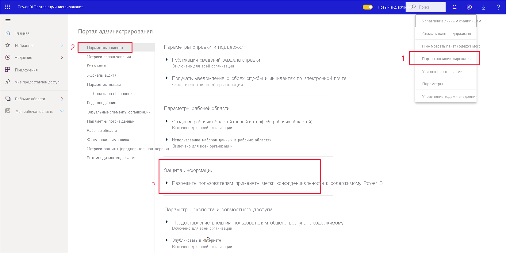

# Активация меток конфиденциальности данных в Power BI

Чтобы использовать [метки конфиденциальности Microsoft Information Protection](https://docs.microsoft.com/microsoft-365/compliance/sensitivity-labels) в Power BI, их необходимо активировать в клиенте. В этой статье приводятся действия по активации, выполняемые администраторами клиента Power BI. Общие сведения о метках конфиденциальности в Power BI см. в статье [Защита данных в Power BI](service-security-data-protection-overview.md). Сведения о применении меток конфиденциальности в Power BI см. в статье [Применение меток конфиденциальности данных в Power BI.](../collaborate-share/service-security-apply-data-sensitivity-labels.md) 

Активация меток конфиденциальности дает следующие возможности.

* Определенные пользователи и группы безопасности в организации могут классифицировать метки конфиденциальности и [применять их](../collaborate-share/service-security-apply-data-sensitivity-labels.md) к своим панелям мониторинга, отчетам, наборам данных и потокам данных Power BI.
* Все члены организации могут просматривать эти метки.

Для активации меток конфиденциальности данных требуется лицензия Azure Information Protection. Дополнительные сведения см. в разделе [Лицензирование](service-security-data-protection-overview.md#licensing).

## Активация меток конфиденциальности данных

Перейдите на портал **администрирования** Power BI, откройте панель **Параметры клиента** и найдите раздел **Information Protection**.

В разделе **Information Protection** выполните следующие действия:
1. Откройте **Разрешить пользователям применять метки конфиденциальности к содержимому Power BI**.
1. Включите переключатель.
1. Определите, кто может применять метки конфиденциальности к ресурсам Power BI и изменять их. По умолчанию метки конфиденциальности могут применять все пользователи вашей организации. При необходимости вы можете разрешить задание меток конфиденциальности только отдельным пользователям или группам безопасности. Выбрав всю организацию или отдельные группы безопасности, вы можете исключить некоторых пользователей или конкретные группы безопасности.
   
   * Если метки конфиденциальности активированы для всей организации, как правило, исключаются группы безопасности.
   * Если метки конфиденциальности включены для отдельных пользователей или групп безопасности, исключаются обычно конкретные пользователи.  
    Такой подход позволяет запретить применять метки конфиденциальности Power BI некоторым пользователям, даже если они входят в группу с соответствующими разрешениями.

1. Нажмите кнопку **Применить**.

> [!IMPORTANT]
> Задавать и редактировать метки конфиденциальность могут только те пользователи Power BI Pro с разрешениями на *создание* и *изменение* ресурса, которые входят в соответствующую группу безопасности, как описывается в этом разделе. Пользователи, не включенные в такую группу, не смогут задавать или редактировать метки.  

## Устранение неполадок

В Power BI используются метки конфиденциальности Microsoft Information Protection. Если при попытке активировать метки конфиденциальности появляется сообщение об ошибке, это может быть вызвано одной из следующих причин:

* У вас нет [лицензии](service-security-data-protection-overview.md#licensing) Azure Information Protection.
* Не был выполнен перенос меток конфиденциальности в версию Microsoft Information Protection, поддерживаемую Power BI. Дополнительные сведения о [переносе меток конфиденциальности](https://docs.microsoft.com/azure/information-protection/configure-policy-migrate-labels).
* В организации не определены метки конфиденциальности Microsoft Information Protection. Учтите, что использовать можно только те метки, которые включены в опубликованную политику. Дополнительные сведения о метках конфиденциальности можно найти в [этой статье](https://docs.microsoft.com/Office365/SecurityCompliance/sensitivity-labels). Чтобы узнать больше об определении меток и публикации политик для организации, вы также можете посетить [центр безопасности и соответствия требованиям Майкрософт](https://sip.protection.office.com/sensitivity?flight=EnableMIPLabels).

## Рекомендации и ограничения

Ниже описываются ограничения, связанные с применением меток конфиденциальности в Power BI:

**Общие**
* Метки конфиденциальности можно применять только к панелям мониторинга, отчетам, наборам и потокам данных. На данный момент недоступны метки конфиденциальности для [отчетов с разбиением на страницы](../paginated-reports/report-builder-power-bi.md) и рабочих книг.
* Метки конфиденциальности ресурсов Power BI отображаются в представлениях списка рабочей области, происхождения, избранного, недавнего и приложений. На данный момент метки не видны в представлении "Мне предоставлен доступ". Тем не менее, следует помнить, что примененная к ресурсу Power BI метка, даже если она не отображается, всегда сохраняется вместе с данными, экспортируемыми в файлы формата Excel, PowerPoint и PDF.
* Метки конфиденциальности поддерживаются только для клиентов в глобальном (общедоступном) облаке. Метки конфиденциальности не поддерживаются для клиентов в облаках других видов.
* Метки конфиденциальности данных не поддерживаются для приложений-шаблонов. Метки конфиденциальности, заданные создателем приложения-шаблона, удаляются при извлечении и установке приложения, а метки конфиденциальности, добавленные к артефактам в установленном приложении-шаблоне пользователем приложения, утрачиваются (сбрасываются в nothing) при обновлении приложения.
* Power BI не поддерживает метки конфиденциальности с типами защиты [Не пересылать](https://docs.microsoft.com/microsoft-365/compliance/encryption-sensitivity-labels?view=o365-worldwide#let-users-assign-permissions), [Определяемая пользователем](https://docs.microsoft.com/microsoft-365/compliance/encryption-sensitivity-labels?view=o365-worldwide#let-users-assign-permissions) и [Специальная](https://docs.microsoft.com/azure/information-protection/configure-adrms-restrictions). Типы защиты "Не пересылать" и "Определяемая пользователем" применяются к меткам, определенным в [Центре безопасности Microsoft 365](https://security.microsoft.com/) или [Центре соответствия требованиям Microsoft 365](https://compliance.microsoft.com/).
* Не рекомендуется разрешать пользователям применять родительские метки в Power BI. Если родительская метка применена к содержимому, экспорт данных из этого содержимого в файл (Excel, PowerPoint и PDF) завершится ошибкой. См. раздел [Подчиненные метки (метки группирования)](https://docs.microsoft.com/microsoft-365/compliance/sensitivity-labels?view=o365-worldwide#sublabels-grouping-labels).

**Экспорт**
* При экспорте метки и элементы управления защитой поддерживаются только для файлов в формате Excel, PowerPoint и PDF. Метки и элементы управления защитой не применяются при экспорте данных в CSV- или PBIX-файлы, в "Анализ в Excel" или в любом другом пути экспорта.
* При применении метки конфиденциальности и защиты к экспортированному файлу содержимое файла не маркируется. Однако если метка настроена для применения маркировки содержимого, клиент Azure Information Protection с поддержкой унифицированных меток автоматически применяет маркировку при открытии файла в классических приложениях Office. Метки содержимого не применяются автоматически при использовании встроенных меток для классических, мобильных и веб-приложений. Дополнительные сведения см. в разделе [Когда приложения Office применяют маркировку и шифрование содержимого](https://docs.microsoft.com/microsoft-365/compliance/sensitivity-labels-office-apps?view=o365-worldwide#when-office-apps-apply-content-marking-and-encryption).
* Пользователь, экспортирующий файл из Power BI, должен иметь разрешения на доступ к соответствующему файлу и его редактирование в соответствии с параметрами метки конфиденциальности. Пользователь, экспортирующий данные, не получает разрешения владельца файла.
* Если метка не может быть применена при экспорте данных в файл, экспорт завершится ошибкой. Чтобы проверить, является невозможность применения метки причиной сбоя экспорта, щелкните имя отчета или панели мониторинга в центре строки заголовка и посмотрите, отображается ли в открывшемся раскрывающемся списке сообщение о невозможности загрузить метку конфиденциальности. Это может произойти, если примененная метка была не опубликована или удалена администратором безопасности, либо причиной может быть временная проблема системы.

## Дальнейшие действия

В этой статье приводятся сведения об активации меток конфиденциальности данных в Power BI. В следующих статьях вы найдете дополнительные сведения о защите данных в Power BI. 

* [Общие сведения о защите данных в Power BI](service-security-data-protection-overview.md)
* [Применение меток конфиденциальности данных в Power BI](../collaborate-share/service-security-apply-data-sensitivity-labels.md)
* [Использование элементов управления Microsoft Cloud App Security в Power BI](service-security-using-microsoft-cloud-app-security-controls.md)
* [Отчет о метриках защиты данных](service-security-data-protection-metrics-report.md)