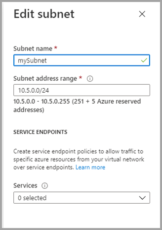

# <a name="private-links-for-accessing-power-bi"></a>Приватные каналы для доступа к Power BI

В Power BI можно настроить и использовать конечную точку, которая позволяет организации получать доступ к Power BI в частном порядке. Чтобы настроить приватные каналы, необходимо быть администратором Power BI и иметь разрешения в Azure для создания и настройки таких ресурсов, как виртуальные машины и виртуальные сети. 

Действия, которые позволяют безопасно получать доступ к Power BI из приватных каналов:

1. [Включение приватных каналов для Power BI](#enable-private-links-for-power-bi)
2. [Создание ресурса Power BI на портале Azure](#create-a-power-bi-resource-in-the-azure-portal)
3. [Создание виртуальной сети](#create-a-virtual-network)
4. [Создание виртуальной машины.](#create-a-virtual-machine-vm)
5. [Создание частной конечной точки](#create-a-private-endpoint)
6. [Подключение к виртуальной машине с помощью удаленного рабочего стола (RDP)](#connect-to-a-vm-using-remote-desktop-rdp)
7. [Доступ к Power BI в частном порядке с виртуальной машины](#access-power-bi-privately-from-the-vm)
8. [Отключение общего доступа для Power BI](#disable-public-access-for-power-bi)

Дополнительные сведения о каждом из этапов приводятся в указанных ниже разделах.

## <a name="enable-private-links-for-power-bi"></a>Включение приватных каналов для Power BI

Чтобы начать работу, войдите в Power BI по адресу app.powerbi.com с правами администратора и перейдите на портал администрирования. Выберите **Параметры клиента** и прокрутите раздел **Улучшенные сетевые функции**, а затем включите переключатель **Приватный канал Azure**, как показано на следующем рисунке. 

Настройка приватного канала для клиента занимает около 15 минут, что включает в себя настройку отдельного полного доменного имени клиента для взаимодействия со службами Power BI.


После завершения можно перейти к следующему шагу.

## <a name="create-a-power-bi-resource-in-the-azure-portal"></a>Создание ресурса Power BI на портале Azure

Затем войдите на [портал Azure](https://portal.azure.com) и создайте ресурс Power BI с помощью **шаблона Azure**. Замените параметры в примере шаблона ARM, как показано в следующей таблице, чтобы создать ресурс Power BI.


|**Параметр**  |**Значение**  |
|---------|---------|
|```<resource-name>```    | myPowerBIResource         |
|```<tenant-object-id>```     | 52d40f65-ad6d-48c3-906f-1ccf598612d4         |

Создание шаблона ARM 

```
{
  "$schema": "http://schema.management.azure.com/schemas/2015-01-01/deploymentTemplate.json#",
  "contentVersion": "1.0.0.0",
  "parameters": {},
  "resources": [
      {
          "type":"Microsoft.PowerBI/privateLinkServicesForPowerBI",
          "apiVersion": "2020-06-01",
          "name" : "<resource-name>",
          "location": "global",
          "properties" : 
          {
               "tenantId": "<tenant-object-id>"
          }
      }
  ]
}
```

В появившемся диалоговом окне установите флажок, чтобы принять условия, а затем выберите **Купить**.


## <a name="create-a-virtual-network"></a>Создание виртуальной сети

Следующим шагом является создание виртуальной сети и подсети. Замените примеры параметров в следующей таблице собственными, чтобы создать виртуальную сеть и подсеть.

| Параметр |   Значение| 
|---------|---------|
| ```<resource-group-name>```   | myResourceGroup |
| ```<virtual-network-name>```  | myVirtualNetwork |
| ```<region-name>```   | Центральная часть США  |
| ```<IPv4-address-space>```    | 10.1.0.0/16 |
| ```<subnet-name>```   | mySubnet |
| ```<subnet-address-range>```  | 10.1.0.0/24 |

1. Слева вверху экрана щелкните **Создать ресурс > Сеть > Виртуальная сеть** или выполните поиск по фразе **виртуальная сеть**.
2. В подменю **Создать виртуальную сеть** введите или выберите следующую информацию на вкладке **Основы**:

    |Настройки | Значение |
    |-------------------|---------|
    |**Сведения о проекте**|
    |Подписка | Выбор подписки Azure |
    |Группа ресурсов |   Выберите элемент **Создать новый**, введите ```<resource-group-name>``` и нажмите кнопку **ОК** или выберите существующее значение ```<resource-group-name>``` на основе параметров. |
    |**Сведения об экземпляре** |
    | Имя  | Введите ```<virtual-network-name>``` |
    |Region | Выберите ```<region-name>``` |
    
    На следующем рисунке показана вкладка **Основы**.
    
    


3. Откройте вкладку **IP-адрес** или нажмите кнопку **Далее: IP-адреса** внизу формы. На вкладке IP-адреса введите следующие сведения.

    |Настройки | Значение |
    |-------------------|---------|
    |Диапазон IPv4-адресов |Введите ```<IPv4-address-space>``` |
    
    
    

4. В разделе **Имя подсети** выберите слово *по умолчанию*, а в разделе **Изменить подсеть** введите следующие сведения.

    |Настройки | Значение |
    |-------------------|---------|
    | Имя подсети |Введите ```<subnet-name>``` |
    | Диапазон адресов подсети | Введите ```<subnet-address-range>``` |
    
    
    

5. Нажмите **Сохранить**, а затем перейдите на вкладку **Просмотр и создание** или нажмите кнопку **Просмотр и создание**. 

6. Затем выберите **Создать**.

После выполнения этих действий можно создать виртуальную машину (ВМ), как описано в следующем разделе.

## <a name="create-a-virtual-machine-vm"></a>Создание виртуальной машины.


Следующим шагом является создание виртуальной сети и подсети для размещения виртуальной машины.

1. В верхнем левом углу экрана на портале Azure выберите **Создать ресурс > Вычисления > Виртуальная машина**.

2. В окне **Создание виртуальной машины — основы** введите или выберите следующую информацию.

    |Настройки | Значение |
    |-------------------|---------|
    |**Сведения о проекте**||
    |Подписка | Выбор подписки Azure |
    |Группа ресурсов |   Выберите **myResourceGroup**, созданную в предыдущем разделе. |
    |**Сведения об экземпляре** ||
    |Имя | Введите **myVm**. |
    |Region | Выберите **Центральная часть США** |
    |Параметры доступности| Оставьте значение по умолчанию **Избыточность инфраструктуры не требуется**. |
    |Образ — | Выберите **Windows 10 профессиональная** |
    |Размер | Оставьте значение по умолчанию **Standard DS1 v2**. |
    |УЧЕТНАЯ ЗАПИСЬ АДМИНИСТРАТОРА ||
    |Имя пользователя |Введите выбранное имя пользователя. |
    |Пароль | Введите выбранный пароль. Пароль должен содержать минимум 12 символов и [соответствовать определенным требованиям к сложности](https://docs.microsoft.com/azure/virtual-machines/windows/faq?toc=/azure/virtual-network/toc.json#what-are-the-password-requirements-when-creating-a-vm). |
    |Подтверждение пароля | Введите пароль еще раз. |
    |ПРАВИЛА ВХОДЯЩЕГО ПОРТА ||
    |Общедоступные входящие порты | Оставьте значение по умолчанию **Отсутствует**. |
    |ЭКОНОМИЯ ||
    |Already have a Windows license? (У вас уже есть лицензия Windows?) |  Оставьте значение по умолчанию **Нет**. |

3. Затем щелкните **Next: диски**
4. В окне **Создание виртуальной машины — Диски** оставьте значения по умолчанию и выберите **Далее: Сети**.
5. В окне **Создание виртуальной машины — сети** выберите следующую информацию.

    |Настройки | Значение |
    |-------------------|---------|
    |Виртуальная сеть|   Оставьте значение по умолчанию **myVirtualNetwork**.|
    |Пространство адресов| Оставьте значение по умолчанию **10.1.0.0/24**.|
    |Подсеть |Оставьте значение по умолчанию **mySubnet (10.1.0.0/24)** .|
    |Общедоступный IP-адрес| Оставьте значение по умолчанию **(new) myVm-ip**.|
    |Общедоступные входящие порты|  Выберите **Разрешить выбранные порты**.|
    |Выбрать входящие порты|  Выберите **RDP**|

6. Выберите **Review + create** (Просмотреть и создать). Вы будете перенаправлены на страницу **Просмотр и создание**, где Azure проверит вашу конфигурацию.
7. При появлении сообщения **Проверка пройдена** нажмите кнопку **Создать**.


## <a name="create-a-private-endpoint"></a>Создание частной конечной точки

Следующий шаг, описанный в этом разделе, — создание закрытой конечной точки для Power BI.

1. В верхнем левом углу портала Azure выберите **Создать ресурс > Сеть > Центр приватных каналов (предварительная версия)** .
2. В окне **Private Link Center — Overview** (Центр приватных каналов — общие сведения) для варианта **Build a private connection to a service** (Создание частного подключения к службе) выберите **Создание частной конечной точки**.
3. В окне **Создание частной конечной точки (предварительная версия) — основы** введите или выберите следующую информацию.

    |Настройки | Значение |
    |-------------------|---------|
    |**Сведения о проекте** ||
    |Подписка|  Выбор подписки Azure|
    |Группа ресурсов|    Выберите **myResourceGroup**. Вы создали ее в предыдущем разделе.|
    |**Сведения об экземпляре** ||
    |Имя|  Введите *myPrivateEndpoint*. Если это имя используется, создайте уникальное имя.|
    |Region|    Выберите **Центральная часть США**|
    
    На следующем рисунке показано окно **Создание частной конечной точки — основы**.
    
    

4. После завершения этой информации выберите **Далее: ресурс**, а на странице **Создание частной конечной точки — ресурс** введите или выберите следующие сведения.

    |Настройки | Значение |
    |-------------------|---------|
    |Метод подключения| Выберите "Подключиться к ресурсу Azure в моем каталоге"|
    |Подписка|  Выберите свою подписку.|
    |Тип ресурса| Выберите **Microsoft.PowerBI/privateLinkServicesForPowerBI** |
    |Ресурс|  myPowerBIResource|
    |Целевой подресурс|   Клиент|
    
    На следующем рисунке показано окно **Создание частной конечной точки — ресурс**.
    
    

5. После правильного ввода данных выберите **Далее: конфигурация**, а на странице **Создание частной конечной точки (предварительная версия) — конфигурация** введите или выберите следующие сведения:

    |Настройки | Значение |
    |-------------------|---------|
    |**СЕТИ** ||
    |Виртуальная сеть|   Выберите *myVirtualNetwork* |
    |Подсеть |Выберите *mySubnet*. |
    |**ЧАСТНАЯ ИНТЕГРАЦИЯ DNS** ||
    |Интеграция с частной зоной DNS|   Выберите **Да**. |
    |Частная зона DNS   |Выберите пункт <br><br>
    *(New)privatelink.analysis.windows.net* <br>
    *(New)privatelink.pbidedicated.windows.net* <br>
    *(New)privatelink.tip1.powerquery.microsoft.com* |
    
    На следующем рисунке показано окно **Создание частной конечной точки — конфигурация**.
    
    
    
    Затем выберите **Проверить и создать**, где будет отображаться страница **проверка и создание**, на которой Azure проверяет конфигурацию. При появлении сообщения **Проверка пройдена** нажмите кнопку **Создать**.

## <a name="connect-to-a-vm-using-remote-desktop-rdp"></a>Подключение к виртуальной машине с помощью удаленного рабочего стола (RDP)

Создав виртуальную машину, которая называется **myVM**, подключитесь к ней из Интернета, выполнив следующие действия.

1. На портале в строке поиска введите *myVm*.
2. Нажмите кнопку **Подключиться**. После нажатия кнопки **Подключиться** откроется окно **Подключение к виртуальной машине**.
3. Выберите **Скачать RDP-файл**. Azure создаст и скачает на ваш компьютер файл протокола удаленного рабочего стола (RDP).
4. Откройте загруженный RDP-файл.
5. При появлении запроса выберите **Подключиться**.
6. Введите имя пользователя и пароль, указанные при создании виртуальной машины.
7. Щелкните **ОК**.
8. При входе в систему может появиться предупреждение о сертификате. В таком случае выберите **Да** или **Продолжить**.

## <a name="access-power-bi-privately-from-the-vm"></a>Доступ Power BI с виртуальной машины в частном порядке

Следующим шагом является доступ к Power BI в частном порядке с виртуальной машины, созданной на предыдущем шаге, с помощью следующих действий. 

1. Откройте PowerShell на удаленном рабочем столе myVm.
2. Введите команду nslookup 52d40f65ad6d48c3906f1ccf598612d4-api.privatelink.analysis.windows.net.
3. Должно появиться сообщение следующего вида:

    ```
    Server:  UnKnown
    Address:  168.63.129.16
    
    Non-authoritative answer:
    Name:    52d40f65ad6d48c3906f1ccf598612d4-api.privatelink.analysis.windows.net
    Address:  10.1.0.4
    ```

4. Откройте браузер и перейдите по адресу app.powerbi.com, чтобы получить доступ к Power BI в частном порядке.

## <a name="disable-public-access-for-power-bi"></a>Отключение общего доступа для Power BI

Наконец, необходимо отключить общий доступ для Power BI. 

Войдите в Power BI по адресу app.powerbi.com с правами администратора и перейдите на **портал администрирования**. Выберите **Параметры клиента** и перейдите к разделу **Улучшенные сетевые функции**. Включите выключатель в разделе **Заблокировать доступ через Интернет**, как показано на следующем рисунке. Чтобы система отключила доступ организации к Power BI из общедоступного Интернета, потребуется около 15 минут.

Вот и все! После выполнения этих действий Power BI для вашей организации будет доступен только посредством приватных каналов, а не из общедоступного Интернета. 

## <a name="considerations-and-limitations"></a>Рекомендации и ограничения

При работе с приватными каналами в Power BI следует помнить о некоторых вопросах:

* Использование внешних изображений или тем недоступно при использовании среды с приватными каналами и может повлиять на пользовательские визуальные элементы.
* Экспорт служб, например экспорт в PDF, экспорт в Excel из отчета и другие службы экспорта, не работают при использовании среды с приватным каналом
* Отчеты SQL Server Reporting Services, обычно известные как RDL-файлы (файлы в формате RDL), не отображаются в средах с приватными каналами


## <a name="next-steps"></a>Дальнейшие действия

- [Администрирование Power BI в организации](service-admin-administering-power-bi-in-your-organization.md)  
- [Основные сведения о роли администратора Power BI](service-admin-role.md)  
- [Аудит Power BI в организации](service-admin-auditing.md)  

Появились дополнительные вопросы? [Попробуйте задать вопрос в сообществе Power BI.](https://community.powerbi.com/)
