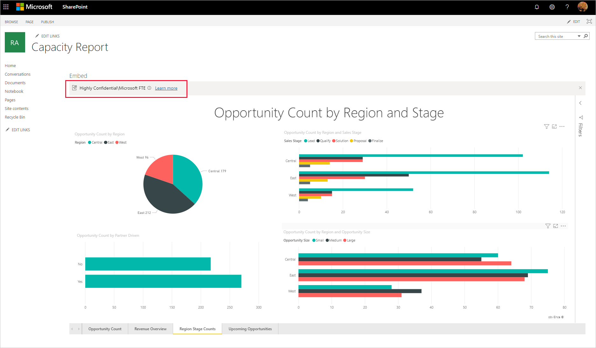
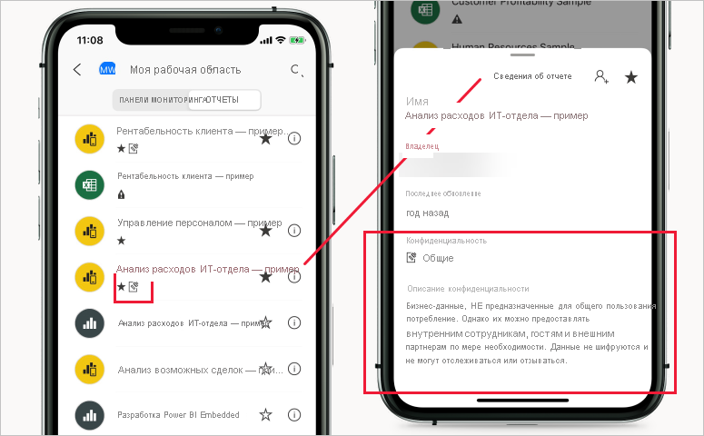

# Метки конфиденциальности в Power BI

В этой статье описывается использование меток конфиденциальности Microsoft Information Protection в Power BI.

Сведения о включении меток конфиденциальности в клиенте, включая требования к лицензированию и предварительные требования, см. в статье [Активация меток конфиденциальности в Power BI](service-security-enable-data-sensitivity-labels.md).

Сведения о применении меток конфиденциальности к отчетам, панелям мониторинга, наборам данных и потокам данных Power BI см. в статье [Применение меток конфиденциальности в Power BI](./service-security-apply-data-sensitivity-labels.md).

## Введение

Метки конфиденциальности Microsoft Information Protection позволяют пользователям легко классифицировать важное содержимое в Power BI без ущерба для производительности или совместной работы.

Метки конфиденциальности можно применять к панелям мониторинга, отчетам, наборам и потокам данных. Когда помеченные данные экспортируются из Power BI в файлы Excel, PowerPoint, PDF или с помощью других поддерживаемых сценариев экспорта, таких как анализ в Excel или сводные таблицы с динамическим подключением к Excel, Power BI автоматически применяет метку к экспортированному файлу и защищает его в соответствии с параметрами шифрования файла метки. Благодаря этому конфиденциальные данные остаются защищенными, где бы они ни находились.

Метки конфиденциальности, применяемые к отчетам, панелям мониторинга, наборам данных и потокам данных, можно просматривать в различных расположениях в службе Power BI. Метки конфиденциальности отчетов и панелей мониторинга также отображаются в мобильных приложениях Power BI для iOS и Android и во внедренных визуальных элементах.

[Отчет о метриках защиты](service-security-data-protection-metrics-report.md), доступный на портале администрирования Power BI, позволяет администраторам Power BI полностью отслеживать конфиденциальные данные в клиенте Power BI. Кроме того, журналы аудита Power BI содержат сведения о таких действиях, как применение, удаление и изменение меток конфиденциальности, а также о просмотре отчетов, панелей мониторинга и других объектов. Это позволяет администраторам Power BI и администраторам безопасности отслеживать использование конфиденциальных данных в целях мониторинга, исследования и получения оповещений системы безопасности.

## Важные замечания

Применение меток конфиденциальности **не** влияет на доступ к содержимому в Power BI, так как доступ к содержимому в Power BI управляется с помощью разрешений Power BI. Когда метки отображаются на содержимом, все связанные параметры шифрования (настроенные в Центре безопасности [Microsoft 365](https://security.microsoft.com/) или [Центре соответствия требованиям Microsoft 365](https://compliance.microsoft.com/)) не применяются. Они применяются только к данным, экспортируемым в файлы Excel, PowerPoint и PDF или другими поддерживаемыми путями экспорта.

Метки конфиденциальности и шифрование файлов **не применяются** к неподдерживаемым путям экспорта. Администратор клиента Power BI может блокировать экспорт из неподдерживаемых путей экспорта:

>[!NOTE]
> Пользователи, которым предоставлен доступ к отчету, получают доступ ко всему базовому набору данных, если только доступ не ограничен [безопасностью на уровне строк (RLS)](./service-admin-rls.md). Авторы отчетов могут классифицировать и помечать отчеты с помощью меток конфиденциальности. Если метка конфиденциальности имеет параметры защиты, Power BI применяет их при экспорте данных отчета в файлы Excel, PowerPoint или PDF. Защищенные файлы могут открывать только авторизованные пользователи.

## Поддерживаемые пути экспорта
Применение меток конфиденциальности и связанной с ними защиты к данным, которые экспортируются из Power BI, в настоящее время поддерживается для следующих путей экспорта:
* экспорт в файлы Excel, PowerPoint и PDF;
* анализ в Excel из службы Power BI, который активирует загрузку файла Excel с динамическим подключением к набору данных Power BI;
* сводная таблица в Excel с динамическим подключением к набору данных Power BI для пользователей с M365 версии E3 и более поздних версий. 

## Принципы применения меток конфиденциальности в Power BI

Метка конфиденциальности, применяемая к панели мониторинга, отчету, набору или потоку данных Power BI, по своему предназначению схожа с тегом и дает следующие преимущества:
* **Возможность настройки** — вы можете создавать категории для разных уровней конфиденциальности содержимого организации, такие как "Личная информация", "Общедоступная информация", "Общая информация", "Конфиденциальная информация" или "Строго конфиденциальная информация".
* **Наглядное представление** — метка представляет собой обычный текст, который хорошо виден пользователям и позволяет сразу понять, каким образом обращаться с содержимым в соответствии с установленными правилами.
* **Постоянство** — примененная к содержимому метка сохраняется с ним при экспорте в файлы Excel, PowerPoint и PDF, PowerPoint и служит в качестве основы для применения политик

Ниже показан краткий пример применения меток конфиденциальности в Power BI. На рисунке ниже показано, как метка конфиденциальности применяется к отчету в службе Power BI, как данные из отчета экспортируются в файл Excel и, наконец, как метка конфиденциальности и ее параметры защиты сохраняются в экспортированном файле.

Метки конфиденциальности, применяемые к содержимому, сохраняются и перемещаются вместе с содержимым в том виде, в котором оно используется в Power BI. На основе этих меток можно создавать отчеты об использовании и просматривать сведения о действиях для конфиденциального содержимого.

## Наследование меток конфиденциальности при создании нового содержимого

Когда в службе Power BI создаются отчеты и панели мониторинга, они автоматически наследуют метки конфиденциальности, ранее примененные к родительскому набору данных или отчету. Например, отчет, созданный на основе набора данных с меткой конфиденциальности "Строго конфиденциально", также автоматически получит метку "Строго конфиденциально".

На рисунке ниже показано, как метка конфиденциальности набора данных автоматически применяется к новому отчету, созданному на основе набора данных.

>[!NOTE]
>Если по какой-либо причине метку конфиденциальности нельзя применить к новому отчету или панели мониторинга, Power BI **не будет** блокировать создание этого объекта.

## Метки конфиденциальности и защита экспортируемых данных

При экспорте данных из Power BI в файлы Excel, PowerPoint или PDF Power BI автоматически применяет метку конфиденциальности к экспортируемому файлу и защищает его в соответствии с параметрами шифрования файла, указанными в метке. Благодаря этому конфиденциальные данные остаются защищенными, где бы они ни находились.

Пользователь, экспортирующий файл из Power BI, должен иметь разрешения на доступ к соответствующему файлу и его редактирование в соответствии с параметрами метки конфиденциальности. Он не получает разрешения владельца файла.

Метки конфиденциальности и параметры защиты не применяются при экспорте данных в CSV- или PBIX-файлы, а также по любому другому пути экспорта.

При применении метки конфиденциальности и защиты к экспортированному файлу содержимое файла не маркируется. Однако если метка настроена для применения маркировки содержимого, клиент Azure Information Protection с поддержкой унифицированных меток автоматически применяет маркировку при открытии файла в классических приложениях Office. Метки содержимого не применяются автоматически при использовании встроенных меток для классических, мобильных и веб-приложений. Дополнительные сведения см. в разделе [Когда приложения Office применяют маркировку и шифрование содержимого](/microsoft-365/compliance/sensitivity-labels-office-apps?view=o365-worldwide#when-office-apps-apply-content-marking-and-encryption).

Если метка не может быть применена при экспорте данных в файл, экспорт завершается ошибкой. Чтобы проверить, является невозможность применения метки причиной сбоя экспорта, щелкните имя отчета или панели мониторинга в центре строки заголовка и посмотрите, отображается ли в открывшемся раскрывающемся списке сообщение о невозможности загрузить метку конфиденциальности. Это может произойти из-за временной проблемы системы или в том случае, если примененная метка была не опубликована или удалена администратором безопасности.

## Наследование метки конфиденциальности в функции "Анализ в Excel"

При создании сводной таблицы в Excel с динамическим подключением к набору данных Power BI (это можно сделать из Power BI с помощью функции [Анализ в Excel](../collaborate-share/service-analyze-in-excel.md) или из [Excel](https://support.microsoft.com/office/create-a-pivottable-from-power-bi-datasets-31444a04-9c38-4dd7-9a45-22848c666884?ui=en-US&rs=en-US&ad=US)), метка конфиденциальности набора данных наследуется и будет применена к файлу Excel вместе с любыми связанными средствами защиты. Если позднее метка для набора данных будет заменена на более строгую, применяемая к связанному файлу Excel метка будет автоматически заменена при обновлении данных.

 
Метки конфиденциальности в Excel, которые были заданы вручную, не перезаписываются автоматически меткой конфиденциальности набора данных. В таком случае отобразится баннер с уведомлением о том, что набор данных включает метку конфиденциальности, и рекомендацией применить ее.

>[!NOTE]
>Если метка конфиденциальности набора данных менее строга по сравнению с меткой конфиденциальности файла Excel, наследование или обновление метки не выполняется. Файл Excel не может наследовать менее строгую метку конфиденциальности.

## Сохранение меток конфиденциальности во внедренных отчетах и панелях мониторинга

В бизнес-приложения, такие как Microsoft Teams и SharePoint, или на веб-сайт организации можно внедрять отчеты, панели мониторинга и визуальные элементы Power BI. При внедрении визуализации, отчета или панели мониторинга, к которым применена метка конфиденциальности, эта метка будет видна во внедренном представлении и будет сохраняться при экспорте данных в Excel вместе с параметрами защиты.

Поддерживаются следующие сценарии внедрения:
* [внедрение для организации](../developer/embedded/embed-sample-for-your-organization.md);
* приложения Microsoft 365 (например, [Teams](../collaborate-share/service-embed-report-microsoft-teams.md) и [SharePoint](../collaborate-share/service-embed-report-spo.md));
* [безопасное внедрение URL-адресов](../collaborate-share/service-embed-secure.md) (внедрение из службы Power BI). 

## Метки конфиденциальности в мобильных приложениях Power BI

Метки конфиденциальности можно просматривать в отчетах и на панелях мониторинга в мобильных приложениях Power BI. Значок рядом с именем отчета или панели мониторинга указывает, что у этого объекта есть метка конфиденциальности, а тип метки и ее описание можно найти в поле сведений об отчете или панели мониторинга.

## Поддерживаемые облака
Метки конфиденциальности поддерживаются только для клиентов в глобальном (общедоступном) облаке. Они не поддерживаются для клиентов в национальном облаке.

## Лицензирование и требования

См. раздел [Лицензирование и требования](service-security-enable-data-sensitivity-labels.md#licensing-and-requirements).

## Создание меток конфиденциальности и управление ими

Для создания и управления меток конфиденциальности используется [центр безопасности Microsoft 365](https://security.microsoft.com/) или [центр соответствия требованиям Microsoft 365](https://compliance.microsoft.com/).

Для работы с ними в любом из этих центров следует выбрать раздел **Классификация > Метки конфиденциальности**. Метки конфиденциальности могут использоваться в самых разных службах Майкрософт, включая Azure Information Protection, приложения Office и службы Office 365.

>[!Important]
> Если в организации используются метки конфиденциальности в Azure Information Protection, необходимо [перенести](/azure/information-protection/configure-policy-migrate-labels) их в одну из перечисленных выше служб, чтобы метки были доступны в Power BI.

## Ограничения

Ниже описываются ограничения, связанные с применением меток конфиденциальности в Power BI:

* Метки конфиденциальности можно применять только к панелям мониторинга, отчетам, наборам и потокам данных. На данный момент недоступны метки конфиденциальности для [отчетов с разбиением на страницы](../paginated-reports/report-builder-power-bi.md) и рабочих книг.
* Метки конфиденциальности ресурсов Power BI отображаются в представлениях списка рабочей области, происхождения, избранного, недавнего и приложений. На данный момент метки не видны в представлении "Мне предоставлен доступ". Тем не менее, следует помнить, что примененная к ресурсу Power BI метка, даже если она не отображается, всегда сохраняется вместе с данными, экспортируемыми в файлы формата Excel, PowerPoint и PDF.
* Метки конфиденциальности данных не поддерживаются для приложений-шаблонов. Метки конфиденциальности, заданные создателем приложения-шаблона, удаляются при извлечении и установке приложения, а метки конфиденциальности, добавленные к артефактам в установленном приложении-шаблоне пользователем приложения, утрачиваются (сбрасываются в nothing) при обновлении приложения.
* Power BI не поддерживает метки конфиденциальности с типами защиты [Не пересылать](/microsoft-365/compliance/encryption-sensitivity-labels?view=o365-worldwide#let-users-assign-permissions), [Определяемая пользователем](/microsoft-365/compliance/encryption-sensitivity-labels?view=o365-worldwide#let-users-assign-permissions) и [Специальная](/azure/information-protection/configure-adrms-restrictions). Типы защиты "Не пересылать" и "Определяемая пользователем" применяются к меткам, определенным в [Центре безопасности Microsoft 365](https://security.microsoft.com/) или [Центре соответствия требованиям Microsoft 365](https://compliance.microsoft.com/).
* Не рекомендуется разрешать пользователям применять родительские метки в Power BI (метка считается родительской, только если она содержит вложенные метки). Если родительская метка применена к содержимому, экспорт данных из этого содержимого в файл (Excel, PowerPoint и PDF) завершится ошибкой. См. раздел [Подчиненные метки (метки группирования)](/microsoft-365/compliance/sensitivity-labels?view=o365-worldwide#sublabels-grouping-labels).

## Дальнейшие действия

Эта статья посвящена защите данных в Power BI. В следующих статьях вы найдете дополнительные сведения о защите данных в Power BI. 

* [Активация меток конфиденциальности в Power BI](service-security-enable-data-sensitivity-labels.md)
* [Применение меток конфиденциальности в Power BI](service-security-apply-data-sensitivity-labels.md)
* [Использование элементов управления Microsoft Cloud App Security в Power BI](service-security-using-microsoft-cloud-app-security-controls.md)
* [Отчет о метриках защиты](service-security-data-protection-metrics-report.md)