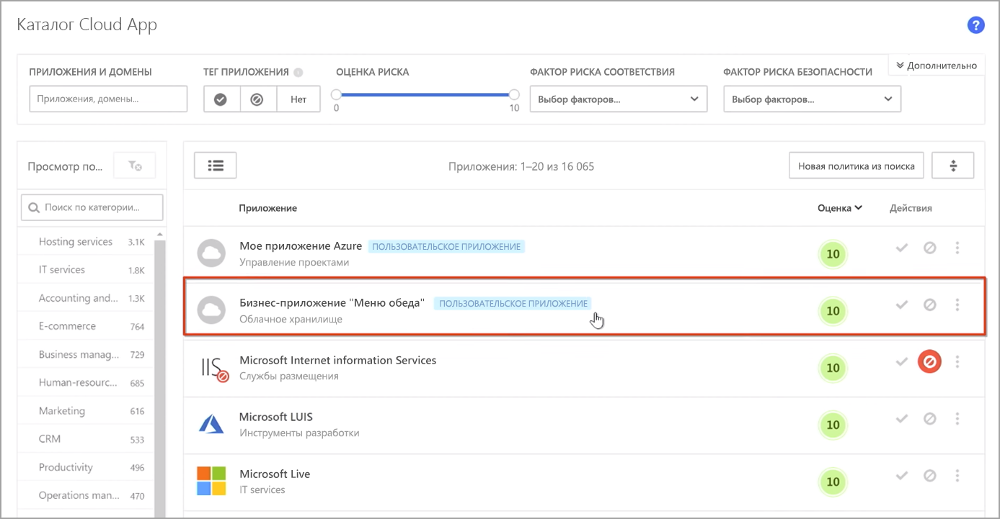
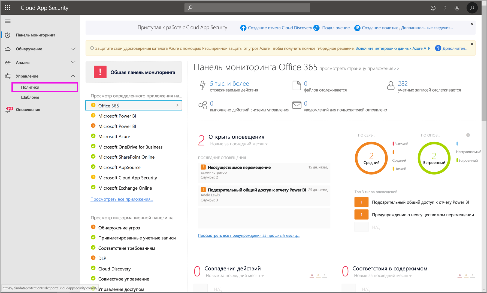
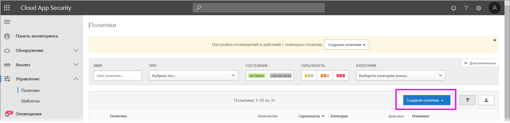
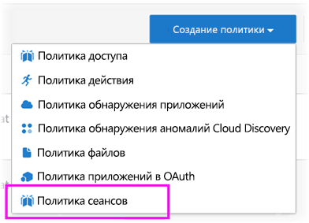
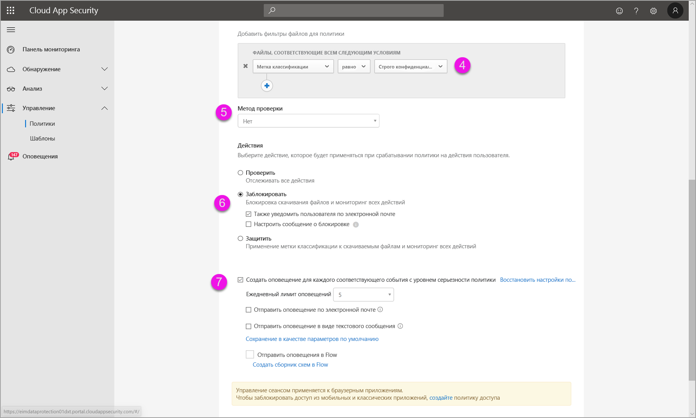
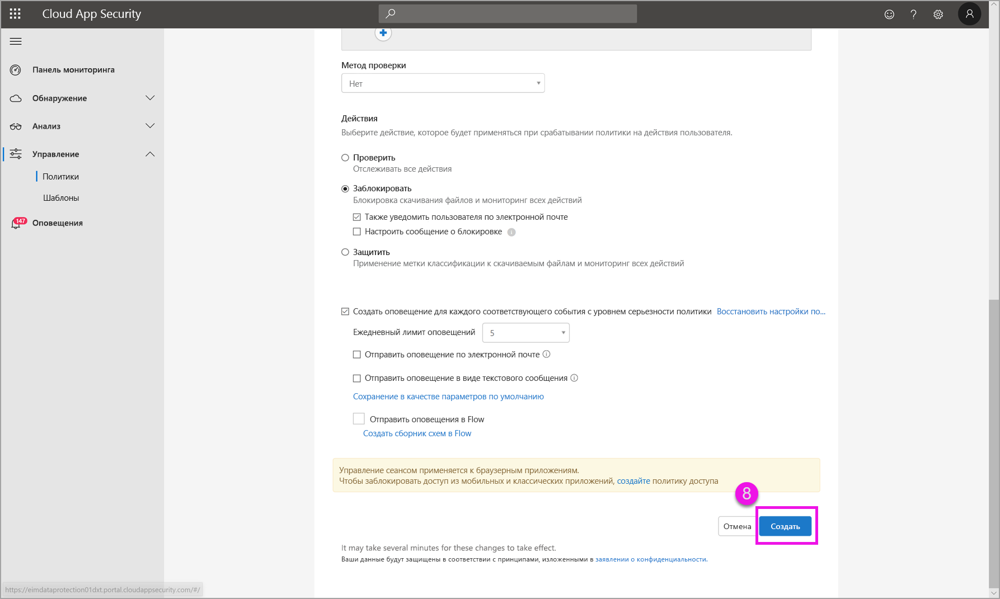

# Использование элементов управления Microsoft Cloud App Security в Power BI

Используя Cloud App Security вместе с Power BI, вы сможете защитить отчеты, данные и службы Power BI от непредвиденных утечек и нарушений. С помощью Cloud App Security вы можете создавать политики условного доступа к данным организации, используя элементы управления сеансами в реальном времени в Azure Active Directory (Azure AD), что позволяет гарантировать безопасность аналитических данных в Power BI. После настройки необходимых политик администраторы смогут отслеживать доступ пользователей и осуществляемые ими действия, выполнять анализ рисков в реальном времени, а также задавать элементы управления для меток. 

Cloud App Security можно настраивать не только для Power BI, но и для самых разных приложений и служб. Чтобы использовать преимущества этой службы для защиты данных и результатов аналитики в Power BI, необходимо настроить Cloud App Security. Дополнительные сведения об этой службе, в том числе описание принципов ее работы, панели мониторинга и оценок рисков для приложений см. в документации по [Cloud App Security](/cloud-app-security/).

## Использование Microsoft Cloud App Security в Power BI

Чтобы использовать Cloud App Security в Power BI, необходимо задействовать и настроить соответствующие службы безопасности Майкрософт, причем в некоторых случаях это требуется сделать вне среды Power BI.

### Лицензирование Cloud App Security

Чтобы использовать Cloud App Security в клиенте, вам потребуются указанные ниже [лицензии](https://query.prod.cms.rt.microsoft.com/cms/api/am/binary/RE2NXYO).
* Microsoft Cloud App Security: предоставляет возможности Cloud App Security для всех поддерживаемых приложений, входящих в наборы EMS E5 и Microsoft 365 E5.
* Office 365 Cloud App Security: предоставляет возможности Cloud App Security только для Office 365; входит в состав набора Office 365 E5.
* Azure Active Directory Premium P1, чтобы использовать преимущества основных возможностей Cloud App Security.

В разделах ниже описываются шаги, которые необходимо выполнить для использования Cloud App Security в Power BI.

### Настройка политик сеансов в Azure AD (обязательно)
Действия по настройке элементов управления сеансами выполняются на порталах Azure AD и Cloud App Security. На портале Azure AD вы создаете политику условного доступа для Power BI и перенаправляете сеансы, используемые в Power BI, через службу Cloud App Security. 

Служба Cloud App Security работает на основе архитектуры обратного прокси-сервера и интегрируется с инфраструктурой условного доступа Azure AD, позволяя отслеживать действия пользователя Power BI в реальном времени. Ниже приводится общее описание процесса. Подробные инструкции можно найти по ссылкам, которые приводятся для каждого из рассматриваемых шагов. Кроме того, общее описание можно найти в этой [статье, посвященной Cloud App Security](/cloud-app-security/proxy-deployment-aad).

1.  [Создание политики тестирования условного доступа Azure AD](/cloud-app-security/proxy-deployment-aad#add-azure-ad)
2.  [Вход в каждое приложение под именем пользователя, входящего в область действия политики](/cloud-app-security/proxy-deployment-aad#sign-in-scoped)
3.  [Проверка конфигурации приложений для использования элементов управления доступом и сеансами](/cloud-app-security/proxy-deployment-aad#portal)
4.  [Тестирование развертывания](/cloud-app-security/proxy-deployment-aad#step-4-test-the-deployment)

Процесс настройки политик сеансов подробно описывается в [этой статье](/cloud-app-security/session-policy-aad). 

### Настройка политик обнаружения аномалий для отслеживания действий Power BI (рекомендуется)
Вы можете определить политики обнаружения аномалий в Power BI с независимо задаваемой областью действия, при необходимости включая и исключая пользователей и группы, на которых они будут распространяться. [Дополнительные сведения](/cloud-app-security/anomaly-detection-policy#scope-anomaly-detection-policies).

В Cloud App Security также предусмотрены два специализированных обнаружения для Power BI. [Дополнительные сведения см. далее в этом документе](#built-in-cloud-app-security-detections-for-power-bi).

### Использование меток конфиденциальности Microsoft Information Protection (рекомендуется)

С помощью меток конфиденциальности вы можете классифицировать и защитить конфиденциальное содержимое. Благодаря этому сотрудники вашей организации смогут работать с находящимися вне ее среды партнерам, не нарушая при этом требований к защите конфиденциального содержимого и данных. 

Дополнительные сведения о применении меток конфиденциальности для Power BI можно найти в [этой статье](service-security-sensitivity-label-overview.md). Также далее приведен [пример политики Power BI на основе меток конфиденциальности](#example).

## Встроенные обнаружения Cloud App Security для Power BI

Благодаря обнаружениям Cloud App Security администраторы могут отслеживать конкретные действия в контролируемом приложении. В Cloud App Security на данный момент предусмотрены два специализированных обнаружения для Power BI: 

* **Подозрительное предоставление доступа** — определяет, когда пользователь предоставляет общий доступ к конфиденциальному отчету незнакомому (стороннему по отношению к организации) адресу электронной почты. Под конфиденциальным понимается отчет, для которого задана метка конфиденциальности **ТОЛЬКО ДЛЯ ВНУТРЕННЕГО ПОЛЬЗОВАНИЯ** или более высокого уровня. 

* **Массовое предоставление общего доступа к отчетам** — определяет, когда пользователь предоставляет общий доступ к большому числу отчетов в рамках одного сеанса.

Настройка этих обнаружений осуществляется на портале Cloud App Security. [Дополнительные сведения](/cloud-app-security/anomaly-detection-policy#unusual-activities-by-user). 

## Роль администратора Power BI в Cloud App Security

При использовании Cloud App Security вместе с Power BI создается новая роль для администраторов Power BI. При входе [на портал Cloud App Security](https://portal.cloudappsecurity.com/) в качестве администратора Power BI вы получаете ограниченный доступ к связанным с Power BI данным, оповещениям, находящимся в зоне риска пользователям, журналам действий и другим сведениям.

## Рекомендации и ограничения 
Применение Cloud App Security вместе с Power BI позволяет защитить содержимое и данные вашей организации, используя обнаружения, предназначенные для отслеживания сеансов и действий пользователей. При использовании Cloud App Security вместе с Power BI необходимо учитывать ряд особенностей и ограничений:

* Cloud App Security поддерживает работу только с файлами в форматах Excel, PowerPoint и PDF.
* Если вы планируете использовать возможности меток конфиденциальности в политиках сеансов для Power BI, вам потребуется лицензия Azure Information Protection Premium P1 или Premium P2. Средство Microsoft Azure Information Protection можно приобрести как отдельно, так и в составе одного из наборов лицензирования Майкрософт. Дополнительные сведения см. в статье [Цены на Azure Information Protection](https://azure.microsoft.com/pricing/details/information-protection/). Кроме того, вам необходимо применить метки конфиденциальности к своим ресурсам Power BI.
* Управление сеансами доступно для любого браузера на любой основной платформе в любой операционной системе. Мы рекомендуем использовать Internet Explorer 11, Microsoft Edge (последней версии), Google Chrome (последней версии), Mozilla Firefox (последней версии) или Apple Safari (последней версии). Вызовы общедоступных API-интерфейсов Power BI и другие сеансы не на основе браузера не поддерживаются в рамках управления сеансами Cloud App Security. [См. дополнительные сведения](/cloud-app-security/proxy-intro-aad#supported-apps-and-clients).

> [!CAUTION]
> * Функция защиты в части действия политики сеанса будет работать только в том случае, если для элемента не определена метка. Если метка уже определена, действие защиты не применяется. Это связано с тем, что переопределение существующей метки, примененной к элементу в Power BI, не допускается.

## Пример

В следующем примере демонстрируется, как создать новую политику сеанса с использованием Cloud App Security в Power BI.

Для начала создайте новую политику сеанса. На портале **Cloud App Security** в меню слева выберите пункт **Политики**.

В появившемся окне щелкните раскрывающийся список **Создать политику**.

В раскрывающемся списке выберите элемент **Политика сеанса**.

Создайте политику сеанса в появившемся окне. Нумерация шагов соответствует подписям параметров на следующем рисунке.

  1. В раскрывающемся списке **Шаблон политики** выберите *Без шаблона*.
  2. В поле **Имя политики** укажите соответствующее имя политики сеанса.
  3. В разделе **Тип управления сеансом** выберите *Управление скачиваемыми файлами (с защитой от потери данных)* .

      В разделе **Источник активности** выберите соответствующие политики блокировки. Мы рекомендуем блокировать неуправляемые и не соответствующие требованиям устройства. Выберите этот параметр, чтобы блокировать скачивание файлов, если сеанс проходит в Power BI.

        

        Выполните прокрутку вниз, чтобы просмотреть дополнительные параметры. Эти параметры с рядом примеров показаны на следующем рисунке. 

  4. Для параметра *Метка конфиденциальности* задайте значение *Строго конфиденциально* или любой другой применяемый в вашей организации уровень защиты.
  5. Для параметра **Метод проверки** задайте значение *Нет*.
  6. В разделе **Блокировать** выберите нужный параметр.
  7. Убедитесь, что для этого действия создано оповещение.

        

        

  8. На заключительном шаге нажмите кнопку **Создать**, чтобы создать политику сеанса.

        

## Дальнейшие действия
В этой статье описывается защита данных и содержимого в Power BI с использованием Cloud App Security. Также вы можете ознакомиться со следующими статьями, в которых рассматриваются вопросы защиты данных в Power BI, и с дополнительными материалами по службам Azure, которые обеспечивают эти возможности.

* [Общие сведения о метках конфиденциальности в Power BI](service-security-sensitivity-label-overview.md)
* [Активация меток конфиденциальности в Power BI](service-security-enable-data-sensitivity-labels.md)
* [Применение меток конфиденциальности в Power BI](service-security-apply-data-sensitivity-labels.md)

Рекомендуем также ознакомиться со следующими материалами по Azure и обеспечению безопасности:

* [Защита приложений с использованием Microsoft Cloud App Security — элемент управления условным доступом к приложению](/cloud-app-security/proxy-intro-aad)
* [Развертывание элемента управления условным доступом к популярным приложениям](/cloud-app-security/proxy-deployment-aad)
* [Политики сеансов](/cloud-app-security/session-policy-aad)
* [Общие сведения о метках конфиденциальности](/microsoft-365/compliance/sensitivity-labels)
* [Отчет о метриках защиты данных](service-security-data-protection-metrics-report.md)