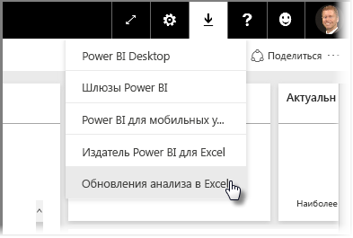
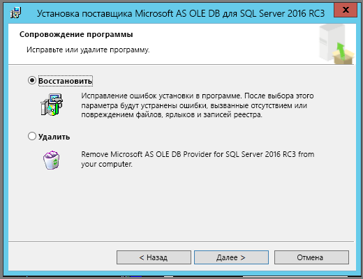
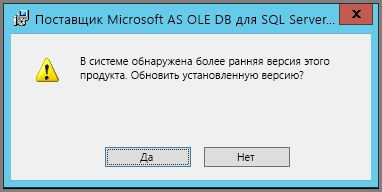

# Устранение неполадок с анализом в Excel

В некоторых случаях функция анализа в Excel дает неожиданный результат или работает не так, как нужно. На этой странице представлены решения наиболее распространенных проблем, возникающих при работе с анализом в Excel.

> [!NOTE]
> Функция [анализа в Excel](service-analyze-in-excel.md) и процедура ее активации описаны на отдельной странице.
> 
> Если возникла проблемная ситуация, не указанная ниже, вы можете запросить дополнительную помощь на [сайте сообщества](https://community.powerbi.com/) или отправить [запрос в службу поддержки](https://powerbi.microsoft.com/support/).
> 
> 

Эта статья содержит следующие разделы по устранению неполадок:

* Обновление библиотек Excel для поставщика OLE DB
* Определение необходимости в обновлении библиотек Excel
* Ошибка невозможности подключения
* Ошибка запрета на доступ
* Отсутствуют модели данных
* Ошибка истечения срока действия токена
* Не удается подключиться к локальным службам Analysis Services
* Не удается перетащить элементы в область значений сводной таблицы (без мер)

## Обновление библиотек Excel для поставщика OLE DB
Для использования функции **анализа в Excel** на компьютере должен быть установлен текущий поставщик OLE DB AS. Этот [пост сообщества](https://community.powerbi.com/t5/Service/Analyze-in-Excel-Initialization-of-the-data-source-failed/m-p/30837#M8081) — отличное средство для проверки установки поставщика OLE DB, а также источник для загрузки последней версии.

Библиотеки Excel и ваша версия Windows должны иметь одинаковую разрядность. Если у вас установлена 64-разрядная версия Windows, установите 64-разрядную версию поставщика OLE DB.

Чтобы загрузить последние библиотеки Excel, зайдите в Power BI и в правом верхнем углу службы щелкните **стрелку вниз**, а затем выберите **Обновления анализа в Excel**.

В открывшемся диалоговом окне выберите **Скачать (предварительная версия)** .

## Определение необходимости в обновлении библиотек Excel
Последнюю версию библиотеки поставщиков OLE DB для Excel можно скачать по ссылкам, указанным в предыдущем разделе. После загрузки соответствующей библиотеки поставщика OLD DB и начала установки система проверит установку текущей версии.

Если клиентские библиотеки поставщиков OLE DB для Excel актуальны, откроется диалоговое окно следующего вида:

Если устанавливаемая версия новее версии, уже установленной на вашем компьютере, откроется следующее диалоговое окно:

Если появляется диалоговое окно с предложением установить обновление, необходимо продолжить установку и получить последнюю версию поставщика OLE DB, установленного на вашем компьютере.

## Ошибка невозможности подключения
Основная причина возникновения ошибки *Не удается установить подключение* связана с тем, что клиентские библиотеки поставщика OLE DB на вашем компьютере устарели. Сведения о том, как определить необходимую версию обновления, а также ссылки на загрузку см. в разделе **Обновление библиотек Excel для поставщика OLE DB** выше в этой статье.

## Ошибка запрета на доступ
Некоторые пользователи имеют более одной учетной записи Power BI, и при попытке подключения к Power BI Excel может использовать учетные данные, не имеющие доступа к нужному вам набору данных или отчету.

В этом случае может возникнуть ошибка **Запрещено**, которая может указывать на то, что вы вошли в Power BI под учетными данными, не позволяющими получить доступ к набору данных. При получении ошибки **Запрещено** введите в соответствующие поля учетные данные, позволяющие получить доступ к необходимому вам набору данных.

Если ошибка повторяется, войдите в Power BI под учетной записью, имеющей разрешение, и убедитесь, что вы можете просматривать и открывать набор данных в Power BI, к которому вы хотите получить доступ в Excel.

## Отсутствуют модели данных
Если возникнет сообщение об ошибке **Не удается найти кубическую модель OLAP**, то набор данных, к которому вы пытаетесь получить доступ, не содержит модели данных, а значит, не может быть проанализирован в Excel.

## Ошибка истечения срока действия токена
Если возникает ошибка **Срок действия токена истек**, значит, вы давно не пользовались функцией **Анализ в Excel** на своем компьютере. Просто введите свои учетные данные или откройте файл, и ошибка исчезнет.

## Не удается подключиться к локальным службам Analysis Services
При попытке обратиться к набору данных, в котором есть подключения к локальным данным служб Analysis Services, может появляться сообщение об ошибке. Функция **Анализ в Excel** поддерживает подключение к наборам данных и отчетам в локальных **службах Analysis Services** с помощью строки подключения, если ваш компьютер входит в тот же домен, что и сервер **служб Analysis Services**, а ваша учетная запись имеет доступ к этому серверу **служб Analysis Services**.

## Не удается перетащить элементы в область значений сводной таблицы (без мер)
Когда функция **Анализ в Excel** подключается к внешней модели OLAP (именно так Excel подключается к Power BI), для *сводной таблицы* [необходимо определить **меры** во внешней модели](https://support.microsoft.com/kb/234700), так как все вычисления выполняются на сервере. В этом заключается различие в работе с локальным источником данных (например, с таблицами в Excel или с наборами данных в **Power BI Desktop** или **службе Power BI**), когда табличная модель доступна локально и [можно использовать неявные меры](https://support.microsoft.com/en-us/office/measures-in-power-pivot-86484821-a324-4da3-803b-82fd2e5033f4), которые создаются динамически и не хранятся в модели данных. В этих случаях работа в Excel отличается от работы в **Power BI Desktop** или **службе Power BI**: в данных могут существовать столбцы, которые можно рассматривать как меры в Power BI, но нельзя использовать как значения (меры) в Excel.

Чтобы устранить эту проблему, можно воспользоваться такими вариантами:

1. Создайте [меры в модели данных в **Power BI Desktop**](../transform-model/desktop-tutorial-create-measures.md), затем опубликуйте модель данных в **службе Power BI** и получите доступ к опубликованному набору данных через Excel.
2. Создайте [меры в модели данных в Excel PowerPivot](https://support.office.com/article/Create-a-Measure-in-Power-Pivot-d3cc1495-b4e5-48e7-ba98-163022a71198).
3. Если данные были импортированы из книги Excel, в которой содержались только таблицы (без модели данных), то можно [добавить таблицы в модель данных](https://support.office.com/article/Add-worksheet-data-to-a-Data-Model-using-a-linked-table-d3665fc3-99b0-479d-ba09-a37640f5be42), а затем выполнить действия из варианта 2 выше, чтобы создать меры в модели данных.

После определения мер в модели в службе Power BI можно использовать их в области **Значения** в сводных таблицах Excel.

## Дальнейшие действия
[Analyze in Excel](service-analyze-in-excel.md) (Анализ в Excel)

[Руководство. Создание собственных мер в Power BI Desktop](../transform-model/desktop-tutorial-create-measures.md)

[Меры в PowerPivot](https://support.microsoft.com/en-us/office/measures-in-power-pivot-86484821-a324-4da3-803b-82fd2e5033f4)

[Создание меры в PowerPivot](https://support.office.com/article/Create-a-Measure-in-Power-Pivot-d3cc1495-b4e5-48e7-ba98-163022a71198)

[Добавление данных листа в модель данных с помощью связанной таблицы](https://support.office.com/article/Add-worksheet-data-to-a-Data-Model-using-a-linked-table-d3665fc3-99b0-479d-ba09-a37640f5be42)
