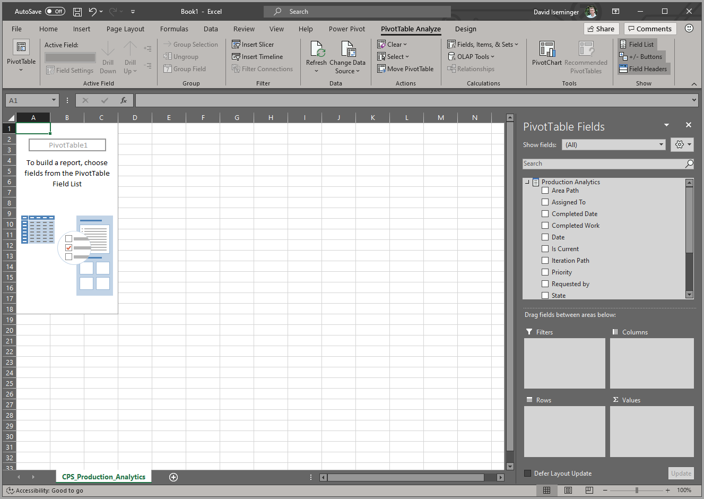

# Анализ в Excel
С помощью компонента **Анализ в Excel** можно перенести наборы данных Power BI в Excel, а затем просматривать их и взаимодействовать с ними с помощью сводных таблиц, диаграмм, срезов и других функций Excel. Чтобы использовать **Анализ в Excel**, необходимо сначала скачать соответствующий компонент из Power BI, установить его, а затем выбрать один или несколько наборов данных для использования в Excel. 

В этой статье показано, как установить и использовать анализ в Excel, описаны ограничения этого компонента, а также приведены связанные с ним дальнейшие действия. В этом учебнике вы узнаете:

* [Установка компонента "Анализ в Excel"](#install-analyze-in-excel)
* [Подключение к данным Power BI](#connect-to-power-bi-data)
* [Использование Excel для анализа данных](#use-excel-to-analyze-the-data)
* [Сохранение и совместное использование книги](#saving-and-sharing-your-new-workbook)
* [Требования](#requirements)

Давайте приступим к установке.

## Установка компонента "Анализ в Excel"

Компонент **Анализ в Excel** следует установить по ссылкам, указанным в службе Power BI. Power BI обнаружит версию Excel, установленную на компьютере, и автоматически скачает соответствующую версию (32- или 64-разрядную). Служба Power BI работает в браузере. Вы можете войти в Power BI по следующей ссылке:

* [Войдите в Power BI](https://app.powerbi.com)

После входа и запуска службы Power BI в браузере выберите элемент **Дополнительные параметры** (...) в правом верхнем углу, а затем щелкните **Скачать > Обновления анализа в Excel**. Этот пункт меню применяется к новым установкам обновлений анализа в Excel.

Кроме того, в службе Power BI можно перейти к набору данных, который необходимо проанализировать, и выбрать элемент **Дополнительные параметры** для набора данных, отчета или другого элемента Power BI. В появившемся меню выберите параметр **Анализ в Excel**, как показано на следующем рисунке.

В любом случае Power BI определит, установлен ли компонент "Анализ в Excel", и если нет, вам будет предложено его скачать. 

Когда вы выберите скачать, Power BI обнаружит установленную версию Excel и скачает соответствующую версию установщика компонента "Анализ в Excel". Вы увидите состояние скачивания в нижней части браузера или в том месте, где в браузере отображается ход загрузки. 

После завершения скачивания запустите установщик (MSI-файл), чтобы установить анализ в Excel. Вместо "Анализ в Excel" для процесса установки используется имя наподобие **Поставщик Microsoft Analysis Services OLE DB**, как показано на следующем рисунке.

По завершении можно выбрать в службе Power BI отчет (или другой элемент данных Power BI, например, набор данных), а затем проанализировать его в Excel.

## Подключение к данным Power BI

В службе Power BI перейдите к набору данных или отчету, который необходимо проанализировать в Excel, откройте меню **Дополнительные параметры** (...) и найдите в нем пункт **Анализ в Excel**. На приведенном ниже изображении показано, как выбрать отчет.

Для получения набора данных из службы Power BI в Excel необходимо выполнить ряд действий.

1. Откройте меню **Дополнительные параметры**.
2. Среди пунктов меню выберите **Анализ в Excel**.

    Затем служба Power BI создаст файл набора данных с расширением файла ODC, предназначенный (и структурированный) для использования с компонентом **Анализ в Excel**. Будет создан файл, после чего в браузере автоматически начнется процесс скачивания.
    
    
    
    Имя файла совпадает с именем набора данных (отчета или другого источника данных), из которого он получен. Поэтому, если отчет назван *Последние_продажи*, то имя скачанного файла будет **Последние_продажи.ODC**.

3. Запуск ODC-файла

Файл уже связан с компонентом **Анализ в Excel**, поэтому при выборе или запуске этого ODC-файла, запускается программа Excel, которая автоматически начинает его загрузку. Однако, скорее всего, появится предупреждение об угрозе внешнего источника данных.

Выберите **Включить**, чтобы загрузить ODC-файл для компонента **Анализ в Excel**, и Excel загрузит файл. 

## Использование Excel для анализа данных

Когда вы разрешите загрузить ODC-файл, выбрав **Включить** в уведомлении о безопасности, Excel отобразит пустую **сводную таблицу** и список **полей** из набора данных Power BI, готовых к анализу.

ODC-файл использует строку подключения MSOLAP для соединения с набором данных в Power BI. При анализе данных или работе с ними Excel отправляет запросы к набору данных Power BI, и результаты возвращаются обратно в Excel. Если набор данных подключен к динамическому источнику с помощью DirectQuery, Power BI отправляет запросы к этому источнику и возвращает результаты в Excel.

При наличии такого подключения к данным Power BI вы можете создавать сводные таблицы и диаграммы, а также анализировать набор данных точно так же, как и при использовании любого локального набора данных в Excel.

**Анализ в Excel** особенно удобен для наборов данных и отчетов, подключенных к следующим источникам данных:

* базы данных с *табличной моделью Analysis Services* или *многомерные* базы данных;
* файлы Power BI Desktop или книги Excel с моделями данных, меры которых, созданы с помощью выражений анализа данных (DAX).

> [!IMPORTANT]
> При использовании компонента **Анализ в Excel** всем пользователям с разрешением на доступ к набору данных данные предоставляются на всех уровнях детализации.

При использовании анализа в Excel необходимо учитывать несколько моментов, в связи с которыми может потребоваться выполнить одно или несколько дополнительных действий для согласования. Эти возможности описаны в следующих разделах. 

### Вход в Power BI
Даже если вы уже вошли в Power BI в браузере, в первый раз при открытии нового ODC-файла в Excel вам, возможно, потребуется снова войти в эту службу со своей учетной записью Power BI. При это выполняется проверка подлинности соединения из Excel в Power BI.

### Пользователи с несколькими учетными записями Power BI
Некоторые пользователи имеют несколько учетных записей Power BI. Если это действительно так, вы можете войти в Power BI, используя одну учетную записью, при том что доступ к набору данных, используемому для анализа в Excel, предоставлен другой. В этом случае при попытке доступа к набору данных, используемому в книге анализа в Excel, вы можете столкнуться с ошибкой **Запрещено** или ошибкой входа в систему.

Если это случится, вы сможете повторно войти в систему с помощью учетной записи Power BI, имеющей доступ к набору данных, используемому для анализа в Excel. Вы также можете выбрать свое имя на верхней ленте в Excel. По нему можно определить, с какой учетной записью вы выполнили вход в систему. Выйдите и снова войдите, используя другую учетную запись.

## Сохранение и совместное использование новой книги

Книгу Excel, созданную с использованием набора данных Power BI, можно **сохранить** как и любую другую книгу. При этом ее нельзя опубликовать или импортировать обратно в Power BI,так как для публикации или импорта данные в книге должны содержаться в таблицах или использовать модель данных. Так как в новой книге есть только подключение к набору данных в Power BI, ее публикация или импорт в Power BI привели бы к возникновению замкнутого цикла.

Сохранив книгу, вы можете предоставить доступ к ней другим пользователям Power BI в своей организации. 

Когда такой пользователь откроет вашу книгу в первый раз, он увидит в ней сводные таблицы и данные в том состоянии, в каком они были на момент последнего сохранения (то есть они могут быть неактуальны). Чтобы обновить данные до текущей версии, потребуется нажать кнопку **Обновить** на ленте **Данные**. А так как книга подключается к набору данных в Power BI, пользователи, пытающиеся обновить книгу, должны будут войти в эту службу и установить обновления для Excel (только в первый раз).

Так как пользователям требуется обновить набор данных, а обновление внешних подключений в Excel Online не поддерживается, рекомендуется открывать такие книги в классическом приложении Excel на компьютере.

> [!NOTE]
> Администраторы клиентов Power BI могут использовать *портал администрирования Power BI*, чтобы отключить функцию **Анализировать в Excel** для работы с локальными наборами данных, размещенными в базах данных Analysis Services (AS). Если этот параметр отключен, функция **Анализировать в Excel** будет отключена для баз данных AS, но по-прежнему будет доступна для работы с другими наборами данных.

## Другие способы доступа к наборам данных Power BI из Excel
Пользователи с определенными номерами SKU Office также могут подключаться к наборам данных Power BI из Excel с помощью функции **Получить данные** в Excel. Если номер SKU не поддерживает эту функцию, пункт меню **Получить данные** не отображается.

В меню ленты **Данные** выберите **Получить данные > Из набора данных Power BI**, как показано на следующем рисунке.

Появится область, где можно просмотреть наборы данных, к которым у вас есть доступ, проверить, являются ли наборы данных сертифицированными или рекомендуемыми, и определить, применены ли к ним метки защит. 

Дополнительные сведения о получении данных в Excel таким способом см. в статье [Создание сводной таблицы на основе набора данных Power BI](https://support.office.com/article/31444a04-9c38-4dd7-9a45-22848c666884) в документации по Excel.

Вы также можете получить в Excel доступ к **рекомендуемым таблицам**, которые отображаются в коллекции **Типы данных**. Дополнительные сведения о рекомендуемых таблицах и способах доступа к ним см. в статье [Доступ к рекомендуемым таблицам Power BI в Excel (предварительная версия)](service-excel-featured-tables.md).

## Требования
К использованию **анализа в Excel** предъявляется ряд требований:

* Компонент **Анализ в Excel** поддерживается в Microsoft Excel 2010 с пакетом обновления 1 и более поздних версиях.

* Сводные таблицы Excel не поддерживают агрегирование числовых полей перетаскиванием. В наборе данных Power BI *должны быть заранее определенные меры*. Прочитайте о [создании мер](../transform-model/desktop-measures.md).
* В некоторых организациях могут действовать правила групповой политики, которые запрещают устанавливать необходимые обновления **Анализ в Excel**. Если вам не удается их установить, обратитесь к своему администратору.
* **Анализ в Excel** требует, чтобы набор данных размещался в Power BI Premium или у пользователя была лицензия Power BI Pro. Дополнительные сведения о различиях в функциональных возможностях между разными типами лицензий Power BI см. в разделе _Сравнение функций Power BI_ на странице [Цены на Power BI](https://powerbi.microsoft.com/pricing/).
* Пользователи могут подключаться к наборам данных через Анализ в Excel, если у них есть разрешение для базового набора данных.  Это разрешение можно получить разными способами, например через роль члена рабочей области, содержащей набор данных, наличие доступа к отчету или панели мониторинга, где используется набор, либо наличие разрешения на сборку для набора данных в рабочей области или в содержащем набор приложении. Дополнительные сведения о [разрешении на сборку](../connect-data/service-datasets-build-permissions.md) для наборов данных.
* Гостевым пользователям недоступна команда **Анализировать в Excel** для наборов данных, отправленных (полученных) из другого клиента. 
* Функция **Анализировать в Excel** относится к службе Power BI и недоступна для сервера отчетов Power BI или Power BI Embedded. 
* **Анализ в Excel** поддерживается только на компьютерах под управлением Microsoft Windows.

Если пользователям необходимо удалить компонент **Анализ в Excel**, это можно сделать с помощью системного средства **Установка и удаление программ** на компьютере с Windows.

## Устранение неполадок
В некоторых случаях функция анализа в Excel дает неожиданный результат или работает не так, как нужно. [На этой странице представлены решения распространенных проблем с компонентом "Анализ в Excel"](desktop-troubleshooting-analyze-in-excel.md).

## Дальнейшие действия

Рекомендуем также ознакомиться со следующими материалами:

* [Использование детализации между отчетами в Power BI Desktop](../create-reports/desktop-cross-report-drill-through.md)
* [Использование срезов в Power BI Desktop](../visuals/power-bi-visualization-slicers.md)
* [Устранение неполадок с анализом в Excel](desktop-troubleshooting-analyze-in-excel.md)
* [Доступ к рекомендуемым таблицам Power BI в Excel (предварительная версия)](service-excel-featured-tables.md)

