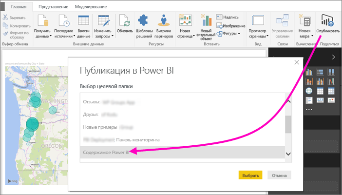
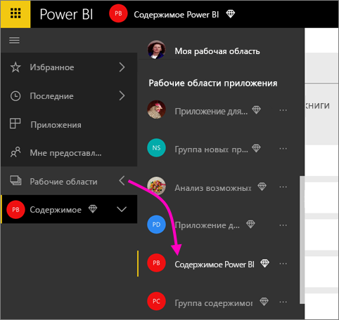
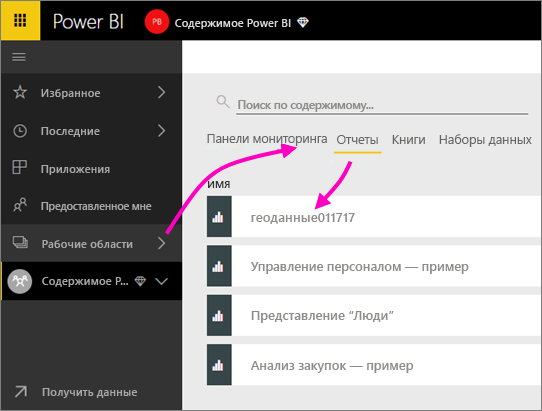
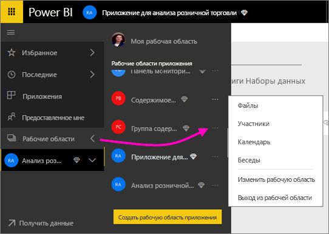
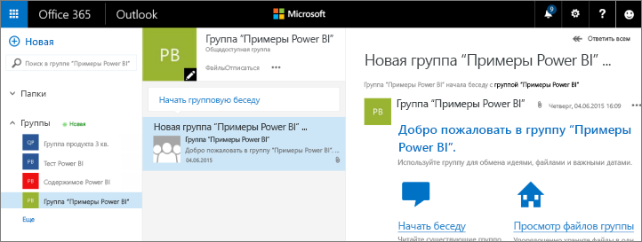
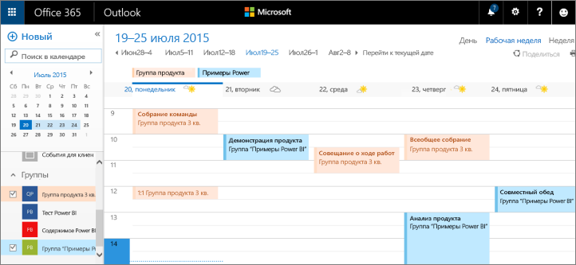

# Совместная работа в классической рабочей области
Рабочие области приложения Power BI — место, где вы с коллегами можете совместно работать с панелями мониторинга, отчетами и наборами данных для создания *приложений*. Эта статья посвящена оригинальным, *классическим* рабочим областям.  

Совместная работа не ограничивается рабочими областями в Power BI. При создании одной из классических рабочих областей в Power BI вы автоматически создаете группу Microsoft 365 в фоновом режиме. В Microsoft 365 доступны и другие службы групп, включая решения по совместному использованию файлов в OneDrive для бизнеса, общению в Exchange, а также общий календарь, задачи и т. д. Узнайте подробнее о [группах в Microsoft 365](https://support.office.com/article/Create-a-group-in-Office-365-7124dc4c-1de9-40d4-b096-e8add19209e9).

> [!NOTE]
> В новом интерфейсе рабочей области изменятся отношения между рабочими областями Power BI и группами Microsoft 365. При создании одной из новых рабочих областей в Power BI вы больше не создаете автоматически группу Microsoft 365 в фоновом режиме. Дополнительные сведения см. в статье [Создание рабочих областей в Power BI](service-create-the-new-workspaces.md).

Для создания рабочей области потребуется лицензия [Power BI Pro](../fundamentals/service-features-license-type.md).

## Совместная работа над файлами Power BI Desktop в рабочей области
Если после создания файла Power BI Desktop вы публикуете его в рабочей области, все участники рабочей области могут совместно работать с ним.

1. В Power BI Desktop на ленте **Главная** выберите **Публикация**. Затем в поле **Выбор целевой папки** выберите рабочую область.
   
    
2. В службе Power BI щелкните стрелку рядом с меню **Рабочие области** и выберите рабочую область.
   
    
3. Откройте вкладку **Отчеты** и выберите отчет.
   
    
   
    Это будет такой же отчет, как и любой другой отчет в Power BI. Вы и другие участники рабочей области можете изменять отчет и сохранять плитки на панели мониторинга по своему выбору.

## Совместная работа в Microsoft 365
Совместная работа в Microsoft 365 начинается в классической рабочей области в Power BI.

1. В службе Power BI щелкните стрелку рядом с элементом **Рабочие области** и выберите **Дополнительные параметры** (…) рядом с именем рабочей области. 
   
   
2. В этом меню вы можете сотрудничать со своей группой несколькими способами: 
   
   * [Беседа в группе в Microsoft 365](#have-a-group-conversation-in-microsoft-365).
   * [Планирование события](#schedule-an-event-on-the-group-workspace-calendar) в календаре рабочей области группы.
   
   Первый переход в рабочую область группы в Microsoft 365 может занять некоторое время. Подождите 15–30 минут, а затем обновите страницу в браузере.

## Беседа в группе в Microsoft 365
1. Нажмите **Дополнительные параметры** (…) рядом с именем рабочей области и выберите \> **Беседы**. 
   
    
   
   Откроется сайт почты и беседы для вашей рабочей области группы в Outlook для Microsoft 365.
   
   
2. Узнайте подробнее о [групповых беседах в Outlook для Microsoft 365](https://support.office.com/Article/Have-a-group-conversation-a0482e24-a769-4e39-a5ba-a7c56e828b22).

## Планирование события в календаре рабочей области группы
1. Нажмите **Дополнительные параметры** (…) рядом с именем рабочей области и выберите \> **Календарь**. 
   
   
   
   Откроется календарь для вашей рабочей области группы в Outlook для Microsoft 365.
   
   
2. Узнайте подробнее о [календарях групп в Outlook в Microsoft 365](https://support.office.com/Article/Add-edit-and-subscribe-to-group-events-0cf1ad68-1034-4306-b367-d75e9818376a).

## Управление классической рабочей областью
Владелец или администратор рабочей области может добавлять или удалять участников рабочей области. Дополнительные сведения см. в статье [Управление рабочей областью в Power BI](service-manage-app-workspace-in-power-bi-and-office-365.md).

## Дальнейшие действия
* [Публикация приложений в Power BI](service-create-distribute-apps.md).
* Появились дополнительные вопросы? [Ответы на них см. в сообществе Power BI](https://community.powerbi.com/).
* Хотите оставить отзыв? Посетите [форум идей по улучшению Power BI](https://ideas.powerbi.com/forums/265200-power-bi).
