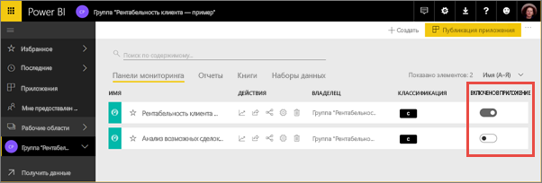
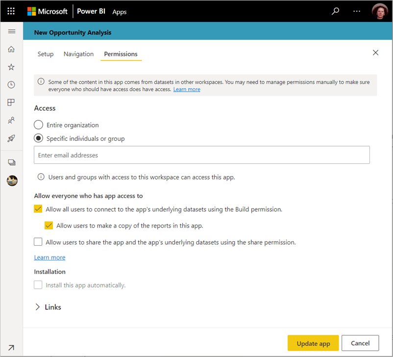

# Публикация приложения в Power BI

В Power BI можно создать официальное упакованное содержимое, а затем распространить его для широкой аудитории в виде *приложения*. Создавайте приложения в *рабочих областях*, где вы можете вместе с коллегами работать над содержимым Power BI. Затем вы можете опубликовать готовые приложения для больших групп сотрудников в вашей организации. 

При работе бизнес-пользователям часто требуется несколько панелей мониторинга и отчетов Power BI. С помощью приложений Power BI можно создавать коллекции информационных панелей и отчетов и публиковать их как приложения во всей организации или среди конкретных пользователей и групп. Для администратора или создателя отчетов приложения упрощают управление разрешениями для этих коллекций.

Бизнес-пользователи могут получить ваши приложения несколькими способами.

- Они могут найти и установить приложения в Microsoft AppSource.
- Вы можете отправить им прямую ссылку.
- С разрешения администратора Power BI его можно установить автоматически в учетных записях Power BI коллег.
- Power BI не отправляет сообщение электронной почты внутренним пользователям при распространении или обновлении приложения. Если приложение распространяется для внешних пользователей, они получают сообщение электронной почты с прямой ссылкой. 

Вы можете создать приложение со своей встроенной навигацией, чтобы пользователям было проще перемещаться по содержимому. Пользователи не могут изменять содержимое приложения. Они могут взаимодействовать с ним в службе Power BI или непосредственно в мобильных приложениях, используя параметры фильтрации, выделения и сортировки данных. Кроме того, эти приложения автоматически получают обновления, и вы можете управлять частотой обновления данных. Вы также можете предоставить пользователям разрешение на сборку, чтобы они могли подключаться к базовым наборам данных и создавать копии отчетов в приложении. См. дополнительные сведения о [разрешении на сборку](../connect-data/service-datasets-build-permissions.md).

## Лицензии для приложений
Чтобы создать или обновить приложение, требуется лицензия Power BI Pro. Для *потребителей* приложения доступны два варианта.

* **Вариант 1** Рабочая область приложения *не* находится в емкости Power BI Premium: всем бизнес-пользователям требуется лицензия Power BI Pro для просмотра вашего приложения. 
* **Вариант 2** Рабочая область приложения *находится* в емкости Power BI Premium: бизнес-пользователи без лицензий Power BI Pro в организации могут просматривать содержимое приложения. Однако они не могут копировать отчеты или создавать их на основе базовых наборов данных. Дополнительные сведения см. в статье [Что такое Power BI Premium?](../admin/service-premium-what-is.md)

## Публикация приложения
Когда панели мониторинга и отчеты в рабочей области будут готовы, выберите панели мониторинга и отчеты, которые необходимо опубликовать, а затем опубликуйте их как приложение. 

1. В представлении списка рабочих областей выберите панели мониторинга и отчеты, которые требуется **включить в приложение**.

    

    Если вы решили не включать отчет, имеющий связанную панель мониторинга, рядом с ним отображается предупреждение. Приложение можно опубликовать, но в связанной панели мониторинга не будет плиток из отчета.

    

2. Нажмите кнопку **Публикация приложения** в правом верхнем углу, чтобы запустить процесс создания и публикации приложения из рабочей области.
   
    

3. На вкладке **Настройка** введите имя и описание, которые помогут пользователям найти приложение. Можно задать цвет темы. Можно также добавить ссылку на сайт поддержки.
   
    

4. В области **Навигация** выберите содержимое, публикуемое в составе приложения. После этого добавьте навигацию приложения, чтобы упорядочить содержимое по разделам. Дополнительные сведения см. в разделе [Проектирование навигации для приложения](#design-the-navigation-experience) этой статьи.
   
    

5. В области **Разрешения** решите, у кого есть доступ к приложению и что они могут делать. 

    - В [классических рабочих областях](service-create-workspaces.md): все сотрудники организации, определенные пользователи или группы безопасности Azure Active Directory (AAD).
    - В [новом интерфейсе рабочих областей](service-create-the-new-workspaces.md): отдельные пользователи, группы безопасности Azure AD, списки рассылки, группы Microsoft 365. Все пользователи рабочей области автоматически получают доступ к приложению для этой рабочей области.
    - Вы можете разрешить пользователям приложения подключаться к базовым наборам данных приложения, предоставив им разрешение "Сборка". Они будут видеть эти наборы при поиске общих наборов данных. Дополнительные сведения см. в статье, посвященной [разрешению на подключение к наборам данных приложения для пользователей](#allow-users-to-connect-to-datasets).
    - Пользователи с разрешением "Сборка" также могут иметь возможность копировать отчеты из приложения в другую рабочую область. Дополнительные сведения см. в статье, посвященной [разрешению на копирование отчетов в приложении для пользователей](#allow-users-to-copy-reports).
    
    >[!IMPORTANT]
    >Если ваше приложение основано на наборах данных из других рабочих областей, именно вы обязаны убедиться, что все пользователи приложения имеют доступ к базовым наборам данных.
    >

6. Вы можете автоматически установить приложение для получателей, если администратор Power BI включил для вас соответствующий параметр на портале администрирования Power BI. Дополнительные сведения см. в [описании автоматической установки приложения](#automatically-install-apps-for-end-users) в этой статье.

    

7. Если выбрать **Публикация приложения**, появится сообщение с подтверждением готовности к публикации. В диалоговом окне **Поделиться приложением** можно скопировать прямую ссылку на это приложение.
   
    

Эту прямую ссылку можно отправить пользователям, с которыми вы поделились, или они могут найти приложение на вкладке "Приложения", перейдя по ссылке **Найти и скачать другие приложения из AppSource**. Дополнительные сведения об этом см. в статье [Что из себя представляют приложения в Power BI?](../consumer/end-user-apps.md).

## Изменение опубликованного приложения
Возможно, после публикации приложения вы захотите изменить или обновить его. Администратор или участник новой рабочей области может легко обновить это приложение. 

1. Откройте соответствующую рабочую область. 
   
    

2. Внесите необходимые изменения в панели мониторинга или отчеты.
 
    Рабочая область — это промежуточная область хранения, поэтому изменения не применяются до повторной публикации приложения. Это позволяет вносить изменения, не влияя на опубликованные приложения.  
 
    > [!IMPORTANT]
    > При удалении отчета и обновлении приложения, даже если вы добавляете отчет обратно в приложение, потребители приложения теряют все настройки, например закладки, комментарии и т. д.  
 
3. Вернитесь в список рабочих областей и нажмите кнопку **Обновить приложение** в правом верхнем углу.
   
1. При необходимости обновите сведения в областях **Настройка**, **Навигация** и **Разрешения**, а затем выберите **Обновить приложение**.
   
Пользователи, для которых опубликовано приложение, увидят его обновленную версию. 

## Проектирование навигации
Параметр **Новый построитель навигации** позволяет создать настраиваемую навигацию для приложения. Настраиваемая навигация упрощает пользователям поиск и использование содержимого в приложении. Для существующих приложений этот параметр отключен, а для новых приложений по умолчанию включен.

Когда этот параметр отключен, вы можете выбрать **Определенное содержимое** для параметра **Целевая страница приложения**, например панель мониторинга или отчета, или выбрать **Нет**, чтобы показать базовый список содержимого для пользователя.

Включив параметр **Новый построитель навигации**, вы можете проектировать настраиваемую навигацию. По умолчанию все отчеты, панели мониторинга и книги Excel, включенные в приложение, отображаются в виде плоского списка. 

Вы можете дополнительно настроить навигацию приложения следующим образом.

* Изменение порядка элементов с помощью стрелок вверх/вниз. 
* Переименование элементов в областях **Сведения об отчете**, **Сведения о панели мониторинга** и **Сведения о книге**.
* Скрытие определенных элементов из навигации.
* Использование параметра **Создать**, чтобы добавить **разделы** в связанное с группой содержимое.
* Использование параметра **Создать**, чтобы добавить **ссылку** на внешний ресурс в область навигации. 

При добавлении **ссылки** в области **Сведения о ссылке** можно выбрать, где ссылка открывается. По умолчанию для открытия ссылки используется **Текущая вкладка**, но вы можете выбрать значение **Новая вкладка** или **Область контента**. 

### Рекомендации по использованию параметра "Новый построитель навигации"
При использовании нового построителя навигации нужно учитывать следующие аспекты.

* Страницы отчета отображаются в области навигации приложения в виде развертываемого раздела. Если отчет содержит одну видимую страницу, отображается только имя отчета. Если щелкнуть имя отчета в области навигации, откроется первая страница отчета. 

    > [!NOTE]
    > В отчете может быть только одна видимая страница, так как вы настроили навигацию на остальные страницы с помощью кнопок или действий детализации.

* Если отключить новый построитель навигации и затем опубликовать или обновить приложение, вы потеряете внесенные изменения. Например, будут потеряны разделы, упорядочение, ссылки и пользовательские имена для элементов навигации.
* Параметр на запрет использования конструктора приложений доступен.

При добавлении ссылок в навигацию приложения и выборе параметра "Область контента" выполните следующее.
* Убедитесь, что ссылка может быть внедрена. Некоторые службы блокируют внедрение их содержимого на сайтах сторонних производителей, таких как Power BI.
* Внедрение содержимого службы Power BI, например отчетов и панелей мониторинга, в другие рабочие области не поддерживается. 
* Вы можете внедрить содержимое сервера отчетов Power BI содержимого с помощью его собственного URL-адреса внедрения из локального развертывания. Следуйте инструкциям по [созданию URL-адреса сервера отчетов Power BI](../report-server/quickstart-embed.md#create-the-power-bi-report-url), чтобы получить URL-адрес. Имейте в виду, что применяются правила регулярной проверки подлинности, поэтому для просмотра содержимого требуется VPN-подключение к локальному серверу. 
* Предупреждение системы безопасности отображается в верхней части внедренного содержимого, чтобы указать, что содержимое находится не в Power BI.

## Автоматическая установка приложений для конечных пользователей
Если администратор предоставляет вам разрешения, можно установить приложения автоматически, *принудительно отправляя* их конечным пользователям. Эта функция принудительной отправки упрощает распространение подходящих приложений среди соответствующих пользователей или групп. Ваше приложение автоматически появится в списке содержимого "Приложения" для конечных пользователей. Им не придется искать его в Microsoft AppSource или использовать ссылку для установки. Сведения о том, как администраторы включают [принудительную отправку приложений конечным пользователям](../admin/service-admin-portal.md#push-apps-to-end-users), см. в статье о портале администрирования Power BI.

### Автоматическая принудительная отправка приложения конечным пользователям
Когда администратор назначит вам разрешения, у вас будет новый вариант для выбора — **установить приложение автоматически**. Если вы установили этот флажок и нажали кнопку **Публикация приложения** (или **Обновить приложение**), то приложение автоматически принудительно отправляется всем пользователям и группам, заданным в разделе **Разрешения** приложения на вкладке **Доступ**.

### Как пользователи получают приложения, которые вы принудительно им отправляете
После принудительной отправки приложения оно автоматически отображается в списке приложений. Так можно специально отбирать приложения, которые должны быть в распоряжении определенного пользователя или должности в вашей организации.

### Рекомендации по автоматической установке приложений
При принудительной отправке приложений конечным пользователям необходимо учитывать следующие аспекты:

* Автоматическая установка приложения для пользователей может занимать некоторое время. Большинство приложений устанавливается для пользователей немедленно, но на принудительную отправку приложений может потребоваться время.  Это зависит от количества элементов в приложении и количества пользователей, которым предоставляется доступ. Рекомендуется отправлять приложения в нерабочее время, чтобы оставалось достаточно времени до того момента, когда пользователям потребуются эти приложения. Прежде чем отправлять широкое сообщение о доступности приложений, выполните проверку с несколькими пользователями.

* Обновите страницу в браузере. Пользователю может потребоваться обновить или закрыть и снова открыть свой браузер, прежде чем отправленное приложение появится в списке приложений.

* Если приложение не появилось сразу в списке приложений, пользователь должен обновить или закрыть и снова открыть свой браузер.

* Старайтесь не перегружать пользователей. Будьте внимательны и не отправляйте слишком много приложений, чтобы пользователи успели оценить полезность предварительно установленных приложений. Рекомендуется контролировать, кто может отправлять приложения конечным пользователям, для координации времени. Установите точку контакта для получения в вашей организации приложений, отправленных конечным пользователям.

* У гостевых пользователей, которые не приняли приглашение, приложение не устанавливается автоматически.  

## Разрешение на подключение к наборам данных для пользователей

Если выбрать параметр **Разрешить пользователям подключаться к базовым наборам данных приложения**, пользователи приложения получат *разрешение "Сборка"* для этих наборов данных. Это разрешение позволяет выполнять несколько важных действий:

- [использовать наборы данных приложения](../connect-data/service-datasets-across-workspaces.md) в качестве основы для собственных отчетов;
- выполнять поиск этих наборов данных в Power BI Desktop и в интерфейсе получения данных в службе Power BI;
- создавать отчеты и панели мониторинга на основе этих наборов данных.

Если этот параметр отключен, новые пользователи, добавляемые в приложение, не получают разрешение на сборку. Однако для существующих пользователей приложения разрешения на доступ к базовым наборам данных не меняются. Вы можете вручную отменить разрешение на сборку для пользователей приложения, которым оно больше не нужно. См. дополнительные сведения о [разрешении на сборку](../connect-data/service-datasets-build-permissions.md).

## Разрешение на копирование отчетов для пользователей

Выбрав параметр **Разрешить пользователям создавать копии отчетов в этом приложении**, вы разрешите пользователям сохранять любые из отчетов в приложении в разделе "Моя рабочая область" или другой рабочей области. Для создания копии пользователю требуется лицензия Pro, даже если исходный отчет находится в рабочей области в емкости Premium. Они могут настроить отчеты под свои потребности. Сначала необходимо включить параметр **Разрешить всем пользователям подключаться к базовым наборам данных с использованием разрешения на сборку**. Выбирая эти параметры, вы включаете новую возможность [копирования отчетов из других рабочих областей ](../connect-data/service-datasets-copy-reports.md).

## Отмена публикации приложения
Любой участник рабочей области может отменить публикацию приложения.

>[!IMPORTANT]
>Когда вы отмените публикацию приложения, пользователи приложения потеряют свои настройки. Они потеряют все личные закладки, комментарии или подписки, связанные с содержимым в приложении. Отменяйте публикацию приложения, только если хотите удалить его.
> 

* В рабочей области нажмите кнопку с многоточием ( **...** ) в правом верхнем углу и щелкните **Отменить публикацию приложения**.
  
    

При этом приложение удаляется для всех назначенных пользователей без возможности дальнейшего доступа к нему. Рабочая область или ее содержимое удалены не будут.

## Просмотр опубликованного приложения

Когда потребитель вашего приложения откроет его, он увидит созданную вами систему навигации вместо стандартной области навигации Power BI. В области навигации приложения перечислены отчеты и панели мониторинга, упорядоченные по заданным вами разделам. Там также перечислены отдельные страницы в каждом отчете, а не просто имя отчета. Вы можете развернуть и свернуть левую панель навигации, используя стрелки в строке меню.

В полноэкранном режиме можно показать или скрыть навигацию, выбрав параметр в углу.

## Рекомендации и ограничения
Ниже приведены важные замечания о публикации приложений.

* Страница разрешения не изменяет разрешения для наборов данных в других рабочих областях. Вы увидите предупреждение о том, что доступ к этим наборам данных предоставляется независимо. Перед началом сборки приложения рекомендуется обратиться к владельцу набора данных, чтобы убедиться, что все пользователи приложения имеют доступ к этим наборам. 
* В списке доступа для приложения может быть не более 100 пользователей или групп. При этом к одному приложению можно предоставить доступ более чем 100 пользователям. Для этого используйте одну группу пользователей или несколько, содержащие всех нужных пользователей.
* Если пользователь, добавленный в список доступа к приложению, уже имеет доступ к приложению через рабочую область, он не будет отображаться в списке доступа для приложения в новом интерфейсе рабочей области.  
* При использовании нового интерфейса службы Power BI URL-адрес сайта поддержки отображается в карточке сведений об элементе. Изучите дополнительные сведения о [новом дизайне Power BI](../consumer/service-new-look.md).
* Приложения могут разрешать пользователям совместное использование приложения и базовых наборов данных приложения с помощью разрешения на предоставление общего доступа. Для новых приложений этот параметр отключен по умолчанию. Мы рекомендуем отключить этот параметр для существующих приложений и обновить разрешения для базовых наборов данных. Параметр был включен для существующих приложений, так как приложения изначально разрабатывались для замены пакетов содержимого, которые имели такое поведение.
* Максимальное число панелей мониторинга в приложениях — 200. 

## Дальнейшие действия
* [Создание рабочей области](service-create-workspaces.md)
* [Установка и использование приложений с информационными панелями и отчетами в Power BI](../consumer/end-user-apps.md)
* [Приложения Power BI для внешних служб](../connect-data/service-connect-to-services.md)
* [Портал администрирования Power BI](../admin/service-admin-portal.md)
* У вас появились вопросы? [Попробуйте задать вопрос в сообществе Power BI.](https://community.powerbi.com/)