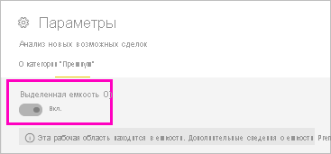

# Создание новых рабочих областей в Power BI

В этой статье объясняется, как создать одну из *новых рабочих областей* вместо *классической* рабочей области. Рабочие области обоих типов — это места для совместной работы с коллегами. В них вы создаете коллекции панелей мониторинга, простых отчетов и отчетов с разбивкой на страницы. При необходимости эту коллекцию можно объединить в *приложение*, которое можно распространять для более широкой аудитории. Дополнительные сведения см. в статье о [новых рабочих областях](service-new-workspaces.md).

Готовы перенести классическую рабочую область? Дополнительные сведения см. в статье [Обновление классических рабочих областей до новых рабочих областей в Power BI](service-upgrade-workspaces.md).

> [!NOTE]
> Чтобы включить безопасность на уровне строк (RLS) для пользователей Power BI Pro, просматривающих содержимое в рабочей области, назначьте им роль зрителя. См. объяснение разных ролей в разделе [Роли в новых рабочих областях](service-new-workspaces.md#roles-in-the-new-workspaces).

## Создание новой рабочей области

1. Начнем с создания рабочей области. Выберите **Рабочие области** > **Создать рабочую область**.
   
     

2. Вы автоматически создаете обновленную рабочую область, если не хотите **Вернуться к классической версии**.
   
     
     
     При выборе варианта **Вернуться к классической версии** создается [классическая рабочая область](service-create-workspaces.md) на основе группы Microsoft 365.

2. Присвойте рабочей области уникальное имя. Если это имя занято, укажите другое, чтобы оно было уникальным.
   
     Приложение, создаваемое из рабочей области, будет иметь те же имя и значок, что и рабочая область.
   
1. Ниже приведены некоторые необязательные элементы, которые можно задать для рабочей области:

    - Загрузите **образ рабочей области**. Файлы могут иметь формат .PNG или .JPG. Размер файла не должен превышать 45 КБ. 
    - [Укажите рабочую область OneDrive](#set-a-workspace-onedrive) для использования расположения хранилища файлов группы Microsoft 365.    
    - [Добавьте список контактов](#create-a-contact-list). По умолчанию администраторами рабочей области являются контакты. 
    - [Разрешить участникам обновлять приложение](#allow-contributors-to-update-the-app) для этой рабочей области
    - Чтобы назначить рабочей области **Выделенное место**, на вкладке **Премиум** выберите **Выделенное место**.

        

1. Щелкните **Сохранить**.

    После этого служба Power BI создаст рабочую область и откроет ее. Она отображается в списке рабочих областей, в которые вы входите. 

## Предоставление доступа к вашей рабочей области

Любой пользователь, имеющий роль администратора в рабочей области, может предоставить доступ к ней другим пользователям, добавив им различные роли. Авторы рабочих областей автоматически являются администраторами. Объяснение ролей см. в разделе [Роли в новых рабочих областях](service-new-workspaces.md#roles-in-the-new-workspaces).

1. Так как вы являетесь администратором, на странице со списком содержимого рабочей области вы видите действие **Доступ**.

    

1. Добавьте группы безопасности, списки рассылки, группы Microsoft 365 или отдельных пользователей в эти рабочие области в качестве администраторов, членов, участников или наблюдателей. 

    

9. Нажмите **Добавить** > **Закрыть**.

## Настройка OneDrive для рабочей области

Функция OneDrive для рабочей области позволяет настроить группу Microsoft 365, хранилище файлов библиотеки документов SharePoint которой доступно пользователям рабочей области. Сначала группа создается вне Power BI. 

Power BI не синхронизирует разрешения пользователей или групп, для которых настроен доступ к рабочей области, с членством в группе Microsoft 365. Рекомендуется предоставить этой же группе Microsoft 365, хранилище файлов которой вы настраиваете в этом параметре группы Microsoft 365, [доступ к рабочей области](#give-access-to-your-workspace). Затем управляйте доступом к рабочей области, управляя членством в группе Microsoft 365. 

1. Доступ к новому параметру **Рабочая область OneDrive** можно получить одним из двух способов:

    В панели **Создание рабочей области** при изначальном ее создании.

    В области навигации нажмите на стрелку рядом с пунктом **Рабочие области**, выберите **Дополнительно** (…) рядом с именем рабочей области, а затем выберите **Параметры рабочей области**. Откроется панель **Параметры**.

    

2. В разделе **Расширенный** > **Рабочая область OneDrive** введите имя группы Microsoft 365, которую вы создали ранее. Введите только имя, но не URL-адрес. Power BI автоматически выбирает OneDrive для группы.

    

3. Щелкните **Сохранить**.

### Доступ к рабочей области OneDrive

Настроив расположение OneDrive, вы получаете доступ к нему так же, как и к другим источникам данных в службе Power BI.

1. В области навигации выберите **Получить данные**, а затем в поле **Файлы** выберите **Получить**.

    

1.  Запись **OneDrive — Бизнес** является вашим собственным OneDrive для бизнеса. Второй OneDrive — это тот, который вы добавили.

    

## Создание списка контактов

Вы можете указать, какие пользователи будут получать уведомления о проблемах, возникающих в рабочей области. По умолчанию уведомление отправляется любому пользователю или группе, но вы можете настроить *список контактов*. Пользователи или группы в списке контактов будут отображаться в пользовательском интерфейсе, чтобы пользователи могли обратиться к ним за помощью, связанной с рабочей областью.

1. Получить доступ к новому параметру **Список контактов** можно одним из двух способов:

    В панели **Создание рабочей области** при изначальном ее создании.

    В области навигации нажмите на стрелку рядом с пунктом **Рабочие области**, выберите **Дополнительно** (…) рядом с именем рабочей области, а затем выберите **Параметры рабочей области**. Откроется панель **Параметры**.

    

2. В разделе **Расширенный**, **Список контактов** примите значение по умолчанию **Администраторы рабочей области** или добавьте свой собственный список **Конкретные пользователи или группы**. 

    

3. Щелкните **Сохранить**.

## Разрешить участникам обновлять приложение

Параметр **Разрешить участникам обновлять приложение для этой рабочей области** позволяет администраторам рабочей области делегировать пользователям с ролью "Участник" возможность обновлять приложение для рабочей области. По умолчанию только администраторы и члены рабочей области могут публиковать и обновлять приложение для рабочей области. 

1. Чтобы перейти к этому параметру, в области навигации нажмите на стрелку рядом с пунктом **Рабочие области**, выберите **Дополнительно** (…) рядом с именем рабочей области, а затем выберите **Параметры рабочей области**. Откроется панель **Параметры**.

    

2. В разделе **Дополнительно** разверните узел **Параметры безопасности**. Выберите параметр **Разрешить участникам обновлять приложение для этой рабочей области**. 

Если этот параметр включен, участники могут:
* обновлять метаданные приложения, например имя, значок, описание, сайт поддержки и цвет;
* добавлять или удалять элементы, включенные в приложение, например отчеты или наборы данных;
* изменять средства навигации в приложении или элемент по умолчанию, на котором оно открывается.

Однако участники не могут:
* публиковать приложение впервые;
* изменять разрешения других пользователей для работы с приложением.

## Приложения в новых рабочих областях

В новом интерфейсе рабочих областей можно создавать и использовать *приложения*, а не пакеты содержимого. Приложения представляют собой коллекции панелей мониторинга, отчетов и наборов данных, которые подключаются к сторонним службам и данным организации. Приложения позволяют легко получать данные от служб, например Microsoft Dynamics CRM, Salesforce и Google Analytics.

В новой рабочей области нельзя создавать или использовать пакеты содержимого организации. Попросите коллег предоставить приложения для пакетов содержимого, которые вы используете. 

### Распространение приложения

Если вы хотите распространить официальное содержимое для широкого круга сотрудников в организации, вы можете опубликовать *приложение* из своей рабочей области.  Когда содержимое будет готово, выберите панели мониторинга и отчеты для публикации, а затем опубликуйте их в виде приложения. В каждой рабочей области можно создать одно приложение.

Дополнительные сведения о [публикации приложения из новых рабочих областей](service-create-distribute-apps.md).

## Дальнейшие действия
* Дополнительные сведения о [организации работы в новых рабочих областях в Power BI](service-new-workspaces.md)
* [Создание классических рабочих областей](service-create-workspaces.md)
* [Публикация приложения из новых рабочих областей в Power BI](service-create-distribute-apps.md)
* У вас появились вопросы? [Попробуйте задать вопрос в сообществе Power BI.](https://community.powerbi.com/)
