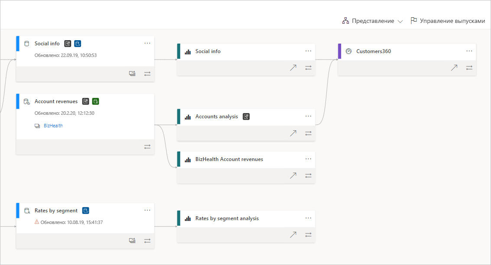
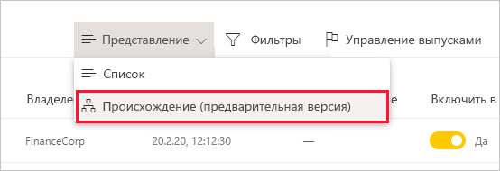
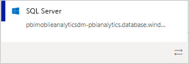
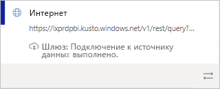
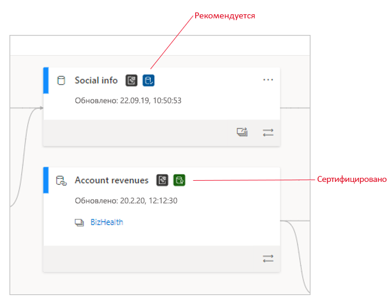
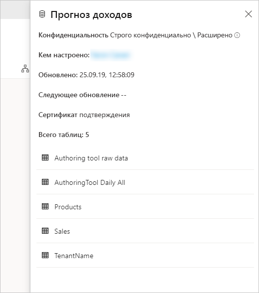
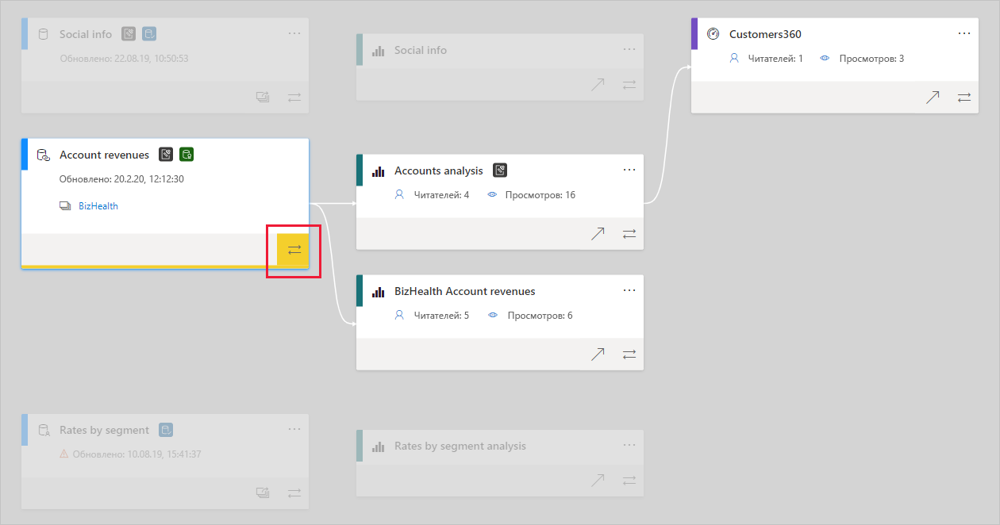

# Происхождение данных
В современных проектах на основе технологий бизнес-аналитики могут возникать сложности с отслеживанием потока данных от источника к адресату. Трудность этой задачи возрастает при работе со сложными аналитическими проектами, которые охватывают несколько источников данных, артефактов и зависимых компонентов. На такие вопросы, как "Что произойдет, если я изменю эти данные?" или "Почему этот отчет содержит неактуальные данные?", порой сложно дать ответ. Для этого может потребоваться участие экспертной группы или углубленное исследование. Чтобы помочь вам получить ответы на эти вопросы, мы разработали представление происхождения данных.

 
В Power BI предусмотрены артефакты различных типов, такие как панели мониторинга, отчеты, наборы данных и потоки данных. Многие наборы и потоки данных подключаются к внешним источникам данных, таким как SQL Server, и к внутренним наборам данных в других рабочих областях. Если набор данных является внешним по отношению к вашей рабочей области, вы можете попасть в рабочую область, принадлежащую другому ИТ-специалисту или аналитику. В конечном итоге работа с внешними источниками и наборами данных усложняет понимание того, откуда поступают данные. Чтобы решить эту проблему как в сложных, так и в более простых проектах, мы разработали представление происхождения данных.

В этом представлении отображаются отношения происхождения данных между всеми артефактами в рабочей области, а также в зависящих от нее внешних компонентах. В нем отображаются подключения между всеми артефактами рабочей области, в том числе подключения к восходящим и нисходящим потокам данных.

## Обзор представления происхождения данных

В каждой новой и классической рабочей области автоматически создается представление происхождения данных. Для просмотра этого представления вам потребуется как минимум роль участника в рабочей области. Дополнительные сведения см. в разделе [Разрешения](#permissions) этой статьи.

* Чтобы открыть представление происхождения данных, перейдите в представление списка рабочих областей. Коснитесь стрелки рядом с элементом **Представление списка** и выберите **Представление происхождения**.

   

В этом представлении отображаются все артефакты рабочей области, а также потоки данных между артефактами.

**Источники данных**

Вы можете видеть источники данных, из которых поступают данные в наборы и потоки данных. На карточках источников данных представлены дополнительные сведения, позволяющие идентифицировать источник. Например, для базы данных SQL Server Azure будет отображаться имя базы данных.

 
**Шлюзы**

Если подключение к источнику данных осуществляется через локальный шлюз, на карточку источника добавляются сведения о шлюзе. Если у вас есть разрешения администратора шлюза или пользователя источника данных, вы сможете просмотреть дополнительные сведения, например имя шлюза.

**Наборы и потоки данных**
 
Для наборов и потоков данных вы увидите сведения о времени последнего обновления, а также о наличии сертификации или повышении уровня.

 
Если отчет в рабочей области построен на основе набора или потока данных из другой рабочей области, на карточке для этого набора или потока данных отображается имя исходной рабочей области. Чтобы перейти к исходной рабочей области, щелкните ее имя.

* Чтобы просмотреть меню параметров для любого артефакта, щелкните **Дополнительные параметры (...)** . В этом меню представлены все действия, которые доступны в представлении списка.

Чтобы просмотреть дополнительные метаданные для любого артефакта, щелкните саму карточку этого артефакта. Дополнительные сведения об артефакте отображаются в боковой панели. На рисунке ниже представлена боковая панель, где отображаются метаданные выбранного набора данных.

 
## Вывод сведений о происхождении данных для любого артефакта 

Предположим, вам необходимо просмотреть сведения о происхождении данных для отдельного артефакта.

* Щелкните кнопку с двойными стрелками, расположенную под артефактом.

   

   В Power BI все артефакты, связанные с этим артефактом, будут выделены, а все остальные будут затемнены. 

## Навигация и полноэкранный режим 

Представление происхождения данных реализовано на основе интерактивного холста. Таким образом, вы можете использовать мышь или сенсорную панель для навигации по холсту и изменения его масштаба.

* Чтобы увеличить или уменьшить масштаб, используйте меню в правом нижнем углу, мышь или сенсорную панель.
* Чтобы получить больше места для отображения графических элементов, воспользуйтесь функцией полноэкранного режима, представленной в правом нижнем углу. 

    

## Разрешения

* Для просмотра представления происхождения данных вам потребуется лицензия Power BI Pro.
* С представлением происхождения данных могут работать только пользователи, имеющие доступ к рабочей области.
* Кроме того, пользователи должны иметь роль администратора, члена или участника рабочей области. Пользователям с ролью зрителя представление происхождения данных недоступно.

## Рекомендации и ограничения

- Представление происхождения данных недоступно в Internet Explorer. Дополнительные сведения см. в разделе [Поддерживаемые браузеры для Power BI](../fundamentals/power-bi-browsers.md).

## Дальнейшие действия

* [Введение в использование наборов данных в рабочих областях (предварительная версия)](../connect-data/service-datasets-across-workspaces.md)
* [Анализ влияния на наборы данных](service-dataset-impact-analysis.md)
