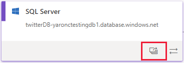
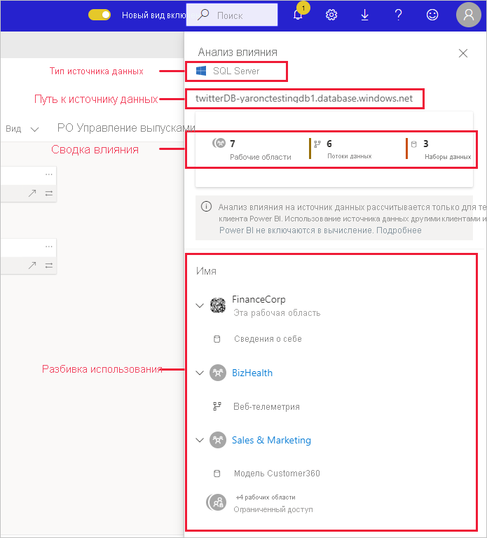
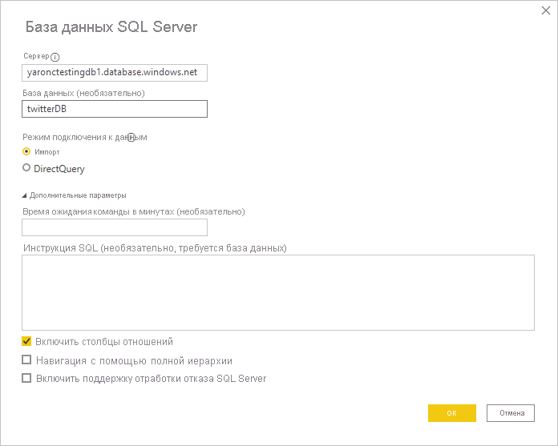
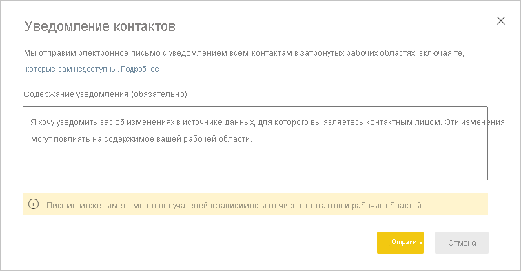

# Анализ влияния на источники данных

Анализ влияния на источники данных помогает понять, где в организации используется источник данных. Это может быть полезно, если источник данных временно или безвозвратно переведен в автономный режим, и вы хотите получить представление о том, что будет затронуто. Здесь показано, сколько рабочих областей, потоков данных и наборов данных использует источник данных. Вы можете с легкостью переходить к рабочим областям, в которых находятся затронутые потоки данных и наборы данных, чтобы подробнее изучить вопрос.

Анализ влияния на источник данных также может помочь в выявлении дублирующихся данных в клиенте, например, когда несколько разных пользователей создают аналогичные модели поверх одного и того же источника данных. Помогая обнаруживать такие избыточные наборы данных и потоки данных, анализ влияния на источники данных обеспечивает достижение цели по созданию "единого источника данных для всех".

## Выполнение анализа влияния на источники данных

Порядок выполнения анализа влияния на источники данных:

1. Перейдите в рабочую область, содержащую интересующий вас источник данных, и откройте [представление иерархии](service-data-lineage.md).
1. Найдите карточку источника данных и щелкните значок анализ влияния.

    
 
Откроется боковая панель анализа влияния.

 
* **Тип источника данных**: задает тип источника данных
* **Путь к источнику данных**: путь к источнику данных, как указано в Power BI Desktop. Например, на снимке экрана выше путь к источнику данных базы данных SQL Server — это строка подключения "twitterDB-yaronctestingdb1.database.windows.net", как указано в Power BI Desktop (показано ниже). Он состоит из имени базы данных "twitterDB" и имени сервера "yaronctestingdb1.database.windows.net".

    
 
* **Сводка данных по влиянию**: указывается количество потенциально затронутых рабочих областей, потоков данных и наборов данных. Это число включает в себя рабочие области, к которым у вас нет доступа.
* **Разбивка использования**: отображаются имена затронутых потоков данных и наборов данных для каждой рабочей области. Чтобы исследовать влияние на конкретную рабочую область более подробно, щелкните имя рабочей области, чтобы открыть ее. В затронутой рабочей области используйте [анализ влияния на набор данных](service-dataset-impact-analysis.md), чтобы просмотреть сведения об использовании подключенных отчетов и панелей мониторинга.

## Уведомление контактов

Если вы уже внесли или собираетесь внести изменения в источник данных, возможно, вам следует сообщить об этом соответствующим пользователям. Когда вы уведомляете контакты, сообщение электронной почты отправляется [списку контактов](service-create-the-new-workspaces.md#create-a-contact-list) во всех затронутых рабочих областях (в случае классической рабочей области сообщение отправляется ее администратору). Ваше имя появится в сообщении электронной почты, чтобы контакты могли найти вас и ответить в новой цепочке сообщений. 

1. Щелкните **Уведомить контакты** на боковой панели анализа влияния. Откроется диалоговое окно уведомления контактов.

   

1. В текстовом поле укажите сведения об изменении.
1. Когда сообщение будет готово, щелкните **Отправить**.

## Конфиденциальность

На боковой панели анализа влияния отображаются только реальные имена рабочих областей, наборов данных и потоков данных, к которым у вас есть доступ. Элементы, к которым у вас нет доступа, отмечены надписью "Доступ ограничен". Это связано с тем, что некоторые имена элементов могут содержать персональные данные.
Суммарные показатели влияния включают в себя все затронутые потоки данных и наборы данных, даже те, которые находятся в рабочих областях, к которым у вас нет доступа.

## Ограничения

Анализ влияния на источники данных еще не поддерживается для отчетов с разбивкой на страницы, поэтому вы не будете видеть, имеет ли источник данных какое-либо прямое воздействие на эти типы отчетов в клиенте.

## Дальнейшие действия

* [Анализ влияния на наборы данных](service-dataset-impact-analysis.md)
* [Data lineage](service-data-lineage.md) (Происхождение данных)