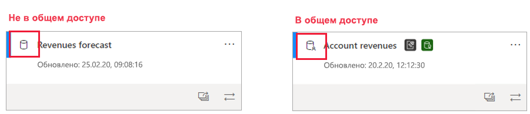
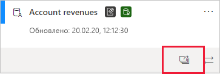
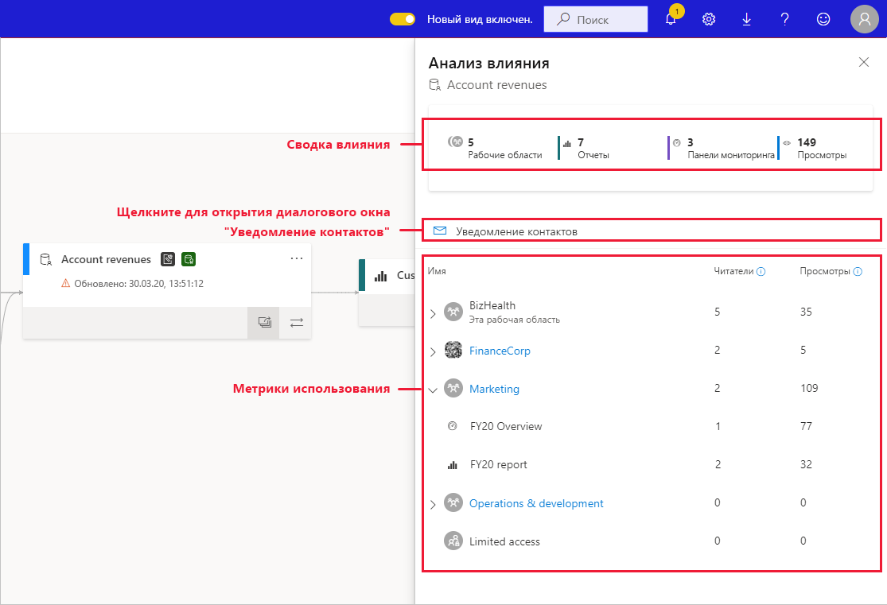
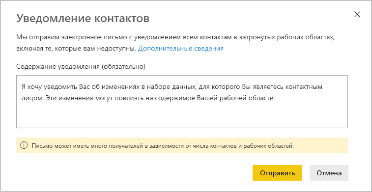
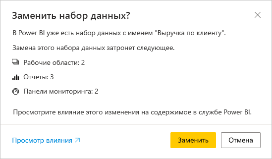

# Анализ влияния на наборы данных

При внесении изменений в набор данных важно оценивать влияние этих изменений на подчиненные отчеты и панели мониторинга, которые зависят от этого набора данных. **Анализ влияния на набор данных** предоставляет сведения, которые помогут вам выполнить оценку.
* Здесь показано, сколько рабочих областей, отчетов и панелей мониторинга может затронуть ваше изменение. Вы можете легко переходить к рабочим областям, в которых находятся затронутые отчеты и панели мониторинга, чтобы подробнее изучить вопрос.
* Вы увидите число уникальных посетителей и просмотров потенциально затронутых элементов. Это помогает определить общее влияние изменения на зависимый элемент. Например, скорее всего, важнее исследовать последствия изменения в отчете, который имеет 20 000 уникальных зрителей, чем в отчете, где их всего трое.
* Это обеспечивает простой способ уведомления соответствующих пользователей об изменениях, которые вы внесли или собираетесь внести.

Анализ влияния набора данных можно легко запустить из [представления происхождения данных](service-data-lineage.md).

## Выявление общих наборов данных

Анализ влияния набора данных можно выполнять как для общих, так и для отдельных наборов данных. Однако он особенно полезен для наборов данных, которые используются совместно в нескольких рабочих областях, где гораздо сложнее получить четкое представление о зависимостях, чем в случае с отдельными наборами данных, когда все зависимости расположены в той же рабочей области, что и сам набор данных.

В представлении происхождения можно определить разницу между общими и отдельными наборами данных с помощью значка, который отображается в верхнем левом углу карточки набора данных.

## Выполнение анализа влияния наборов данных

Вы можете выполнять анализ влияния для любого набора данных в рабочей области независимо от того, является он общим или нет. Вы не можете выполнить анализ влияния внешних наборов данных, которые отображаются в представлении происхождения данных, но фактически находятся в другой рабочей области. Чтобы выполнить анализ влияния внешнего набора данных, необходимо перейти к исходной рабочей области.

Чтобы выполнить анализ влияния набора данных, нажмите кнопку "Анализ влияния" в карточке набора данных.

Откроется боковая панель анализа влияния.

* В **сводке по влиянию** показано количество потенциально затронутых рабочих областей, отчетов и панелей мониторинга, а также общее число просмотров для всех подчиненных отчетов и панелей мониторинга, подключенных к набору данных.
* Ссылка **Уведомить контакты** открывает диалоговое окно, в котором можно создавать и отправлять сообщения о любых изменениях набора данных для пользователей, внесенных в списки контактов в затронутых рабочих областях. 
* **Разбивка использования** для каждой рабочей области показывает общее количество просмотров потенциально затронутых отчетов и панелей мониторинга, а для каждого отчета и панели мониторинга — общее число зрителей и просмотров.
   * Зрители: число уникальных пользователей, которые просматривали отчет или панель мониторинга.
   * Представления: число просмотров отчета или панели мониторинга

Метрики использования представлены за последние 30 дней, за исключением текущего дня. Это число включает использование через связанные приложения. Метрики помогают понять использование набора данных в клиенте, а также оценить влияние любых изменений в наборе данных.

## Уведомление контактов

Если вы уже внесли или собираетесь внести изменения в набор данных, возможно, вам следует сообщить об этом соответствующим пользователям. Когда вы уведомляете контакты, сообщение электронной почты отправляется [списку контактов](../collaborate-share/service-create-the-new-workspaces.md#create-a-contact-list) во всех затронутых рабочих областях. Ваше имя появится в сообщении электронной почты, чтобы контакты могли найти вас и ответить в новой цепочке сообщений. 

1. Щелкните **Уведомить контакты** на боковой панели анализа влияния. Откроется диалоговое окно уведомления контактов.

   

1. В текстовом поле укажите сведения об изменении.
1. Когда сообщение будет готово, щелкните **Отправить**.

> [!NOTE]
> Функция уведомления контактов недоступна, если набор данных, анализ влияния которого вы выполняете, находится в классической рабочей области.

## Конфиденциальность

Чтобы выполнить анализ влияния набора данных, необходимо иметь разрешения на запись в него. На боковой панели анализа влияния отображаются только реальные имена рабочих областей, отчетов и панелей мониторинга, к которым у вас есть доступ. Элементы, к которым у вас нет доступа, отмечены надписью **Доступ ограничен**. Это связано с тем, что некоторые имена элементов могут содержать персональные данные.

Даже если у вас нет доступа к некоторым рабочим областям, вы по-прежнему сможете увидеть обобщенные метрики использования для этих рабочих областей и отправить сообщение пользователям из списка контактов этих рабочих областей.

## Анализ влияния в Power BI Desktop

При внесении изменений в набор данных в Power BI Desktop и его последующей повторной публикации в службе Power BI вы увидите сообщение о том, на сколько рабочих областей, отчетов и панелей мониторинга может повлиять это изменение. Вы должны будете подтвердить замену текущего опубликованного набора данных измененной версией. В этом сообщении также содержится ссылка на полный анализ влияния набора данных в службе Power BI, где можно просмотреть дополнительные сведения и принять меры по устранению рисков, связанных с изменениями.

> [!NOTE]
> В сообщении указано потенциальное влияние, но это не обязательно означает, что что-то не так. Часто изменение набора данных не оказывает негативного влияния на подчиненные отчеты и панели мониторинга. Это сообщение просто помогает понять потенциальное влияние.
>
>В сообщении число рабочих областей отображается только в том случае, если затронутые отчеты и панели мониторинга содержатся в нескольких рабочих областях.

## Ограничения

* Метрики использования в настоящее время не поддерживаются для классических и личных рабочих областей.

## Дальнейшие действия

* [Введение в использование наборов данных в рабочих областях (предварительная версия)](../connect-data/service-datasets-across-workspaces.md)
* [Data lineage](service-data-lineage.md) (Происхождение данных)

