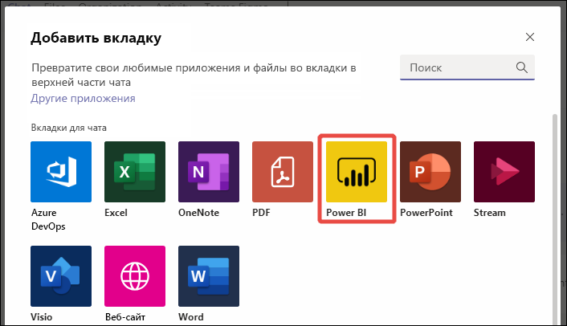
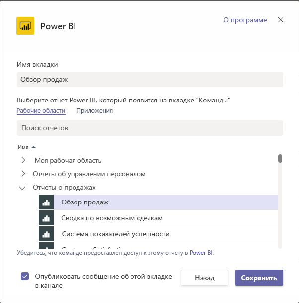
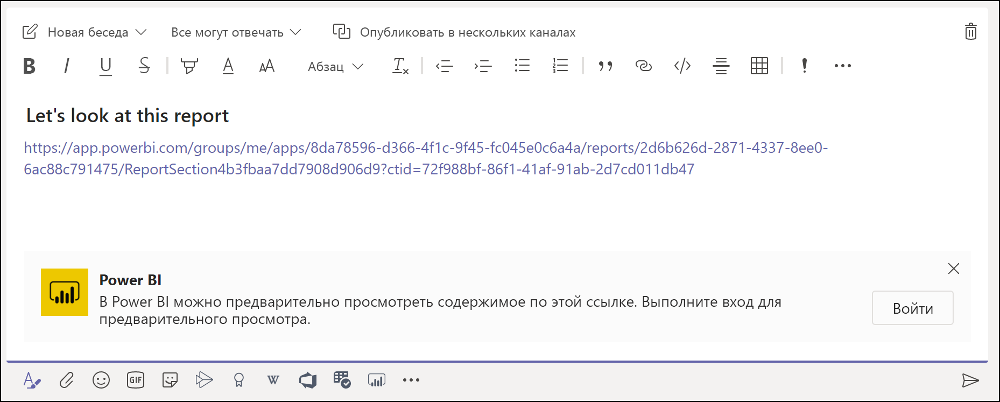
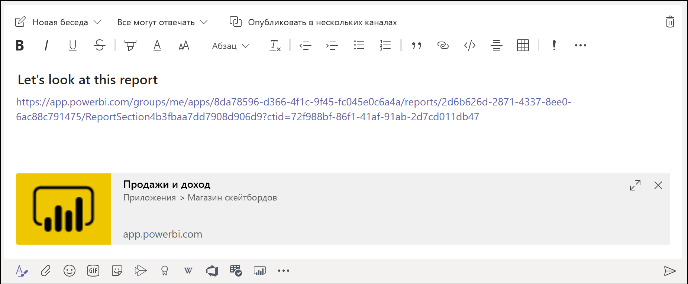
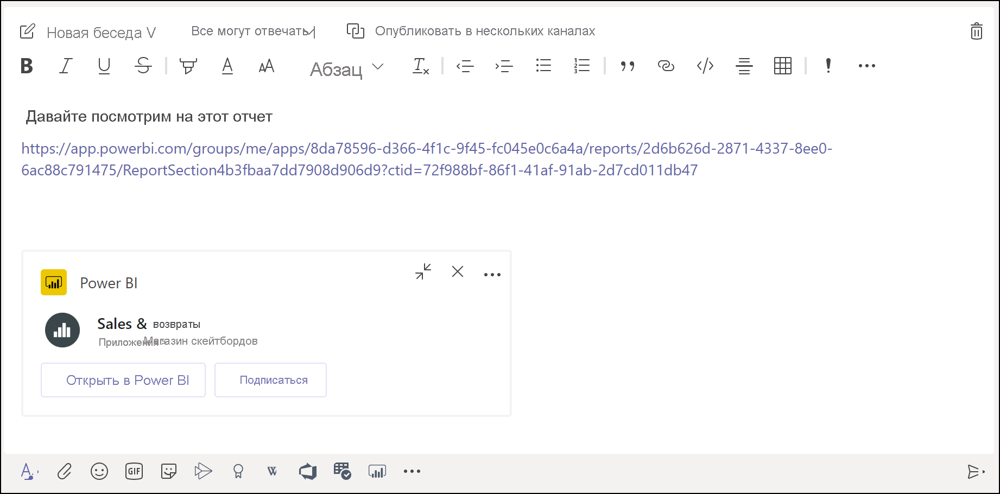
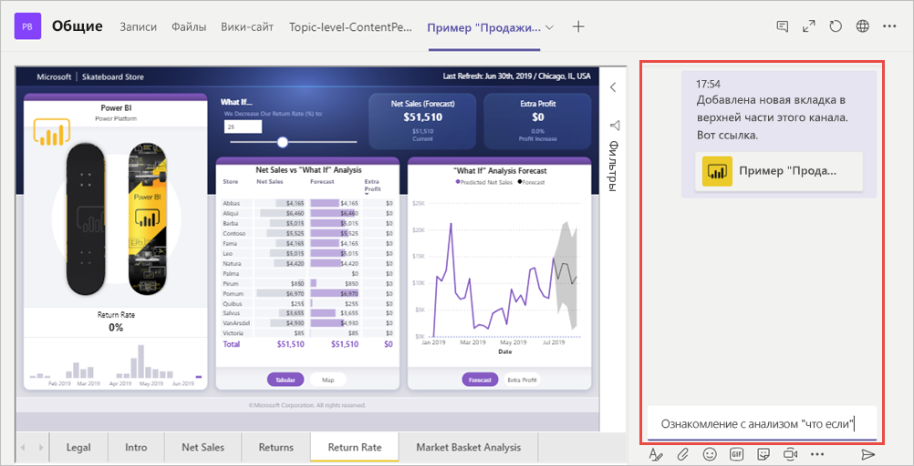

# Внедрение отчетов в Microsoft Teams с помощью вкладки Power BI

С помощью обновленной вкладки Power BI для Microsoft Teams можно легко внедрять интерактивные отчеты в каналы и чаты Microsoft Teams. Используйте вкладку Power BI для Microsoft Teams, чтобы помочь своим коллегам находить данные, над которыми вы работаете, и обсуждать их в каналах команды.  При вставке ссылок на отчеты, панели мониторинга и приложения в поле сообщения Microsoft Teams отображаются краткие сведения об этих элементах. Благодаря этому пользователь может легко понять, на какой элемент ведет ссылка.

## Требования

Для использования **вкладки Power BI для Microsoft Teams** должны выполняться указанные ниже условия.

- У пользователей должна быть лицензия Power BI Pro, либо отчет должен находиться в [емкости Power BI Premium (номер SKU EM или P)](../admin/service-premium-what-is.md) с лицензией Power BI.
- В Microsoft Teams должна быть вкладка Power BI.
- Пользователи выполнили вход в службу Power BI и активировали свою лицензию Power BI Для работы с отчетом.
- У пользователей должно быть разрешение на просмотр отчета.

Кроме того, для **предварительного просмотра ссылок** должны выполняться указанные ниже условия.
- Пользователи должны соответствовать требованиям для использования вкладки Power BI для Microsoft Teams.
- Пользователи выполнили вход в службу-бот Power BI. 

## Внедрение отчета

Чтобы внедрить отчет в канал или чат Microsoft Teams, выполните указанные ниже действия.

1. Откройте канал или чат в Microsoft Teams и щелкните значок **+** .

    

2. Выберите вкладку Power BI.

    

3. Выберите отчет из рабочей области, из списка "Мне предоставлен доступ" или приложения Power BI.

    

4. Имя вкладки обновляется автоматически в соответствии с именем отчета, но его можно изменить. 

5. Нажмите кнопку **Save**(Сохранить).

## Поддерживаемые отчеты для внедрения вкладки Power BI
На вкладке Power BI можно внедрять отчеты следующих типов:

- интерактивные отчеты и отчеты с разбивкой на страницы;
- отчеты из раздела "Моя рабочая область", нового интерфейса рабочих областей и классических рабочих областей;
- отчеты из приложений Power BI.

## Предварительный просмотр ссылки

Чтобы обеспечить предварительный просмотр содержимого, на которое ведет ссылка, в службе Power BI, выполните указанные ниже действия.

1. Скопируйте ссылку на отчет, панель мониторинга или приложение в службе Power BI. Например, скопируйте ссылку из адресной строки браузера.

2. Вставьте ссылку в поле сообщения Microsoft Teams. Если будет предложено, войдите в службу предварительного просмотра ссылок. Загрузка содержимого для предварительного просмотра может занять несколько секунд.

    

3. После успешного входа отображается базовое содержимое для предварительного просмотра ссылки.

    

4. Чтобы открыть карточку расширенного предварительного просмотра, щелкните значок развертывания.

    

5. Карточка расширенного предварительного просмотра с ссылкой и кнопками действий

    

6. Отправьте сообщение.

## Предоставление доступа к отчетам

При внедрении отчета в Microsoft Teams или отправке ссылки на элемент разрешение на просмотр отчета не предоставляется пользователям автоматически — вам нужно [разрешить пользователям просматривать отчет в Power BI](service-share-dashboards.md). Чтобы упростить эту задачу, можно воспользоваться группой Office 365. 

> [!IMPORTANT]
> Обязательно проверьте, кто может просматривать отчет в службе Power BI, и предоставьте доступ пользователям, которых нет в списке.

Один из способов обеспечить доступ всех членов команды к отчетам — поместить отчеты в одну рабочую область в Power BI и предоставить группе Office 365 вашей команды доступ к ней.

## Предварительный просмотр ссылок 

Предварительный просмотр ссылок доступен в Power BI для следующих элементов:
- Отчеты
- Панели мониторинга
- Приложения

Пользователи должны выполнить вход в службу предварительного просмотра ссылок. Чтобы выйти из нее, щелкните значок Power BI в нижней части поля сообщения, а затем выберите команду "Выход".

## Начать беседу

При добавлении вкладки отчета Power BI в Teams в этой службе автоматически создается беседа для обсуждения отчета. 

- В правом верхнем углу выберите **Показать беседу во вкладке**.

    

    Первый комментарий является ссылкой на отчет. Каждый в этом канале Teams может просматривать и обсуждать отчет в беседе.

    

## Известные проблемы и ограничения

- Power BI не поддерживает те же языки с локализацией, что и Microsoft Teams. В результате во внедренном отчете требуемая локализация может не отображаться.
- Панели мониторинга Power BI невозможно внедрить на вкладку Power BI для Microsoft Teams.
- Пользователи, у которых нет лицензии Power BI или разрешения на доступ к отчету, видят сообщение "Содержимое недоступно".
- При использовании Internet Explorer 10 могут возникнуть проблемы. <!--You can look at the [browsers support for Power BI](../consumer/end-user-browsers.md) and for [Office 365](https://products.office.com/office-system-requirements#Browsers-section). -->
- [Фильтры URL-адресов](service-url-filters.md) не поддерживаются на вкладке Power BI для Microsoft Teams.
- В национальных облаках новая вкладка Power BI недоступна. Может быть доступна прежняя версия, которая не поддерживает новый интерфейс рабочих областей и отчеты в приложениях Power BI. 
- После сохранения вкладки ее имя невозможно изменить в параметрах вкладки. Чтобы изменить его, используйте команду "Переименовать".
- Единый вход не поддерживается для службы предварительного просмотра ссылок.
- Предварительный просмотр ссылок не работает в чате собрания и в частных каналах.

## Дальнейшие действия
- [Предоставление общего доступа к панели мониторинга и отчетам коллегам и другим пользователям](service-share-dashboards.md)  
- [Создание и распространение приложения в Power BI](service-create-distribute-apps.md)  
- [Что такое Power BI Premium?](../admin/service-premium-what-is.md)

Появились дополнительные вопросы? [Попробуйте задать вопрос в сообществе Power BI.](https://community.powerbi.com/)
