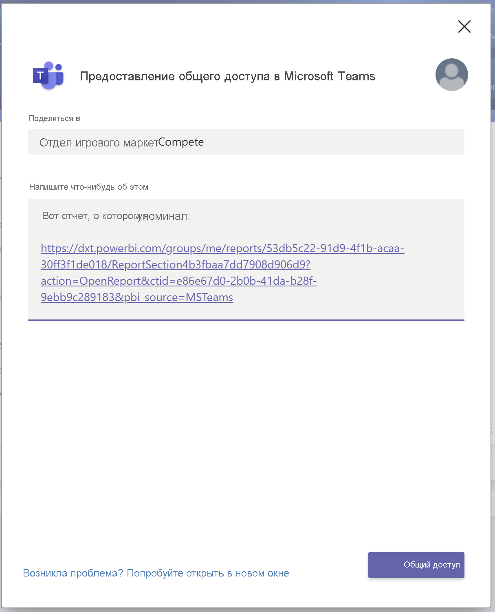
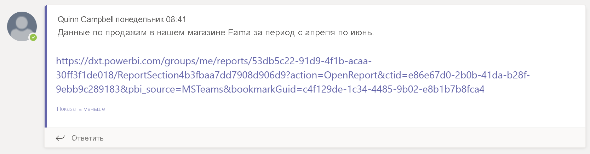
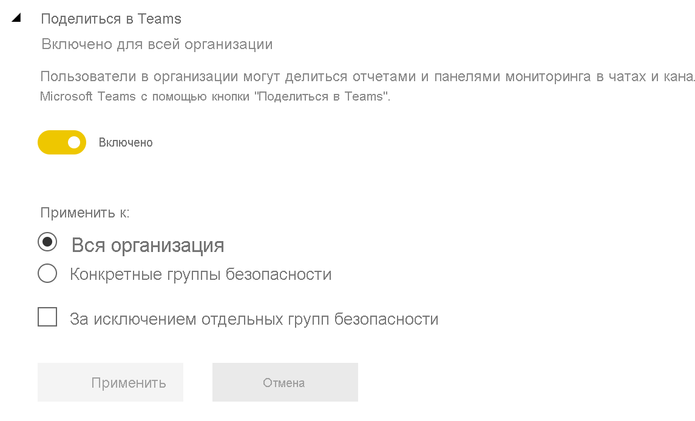

# Совместная работа в Microsoft Teams с использованием Power BI

С помощью вкладки **Power BI** для Microsoft Teams можно легко внедрять интерактивные отчеты в каналы и чаты Microsoft Teams. Используйте вкладку **Power BI** для Microsoft Teams, чтобы помочь своим коллегам находить данные, над которыми вы работаете, и обсуждать их в каналах команды. При вставке ссылок на отчеты, панели мониторинга и приложения в поле сообщения Microsoft Teams отображаются краткие сведения об этих ссылках. С помощью кнопки **Поделиться в Teams** можно быстро начать беседу при просмотре отчетов и панелей мониторинга в Power BI.

## Требования

Для использования вкладки **Power BI** для Microsoft Teams должны выполняться указанные ниже условия.

- У пользователей должна быть лицензия Power BI Pro, либо отчет должен находиться в [емкости Power BI Premium (номер SKU EM или P)](../admin/service-premium-what-is.md) с лицензией Power BI.
- В Microsoft Teams должна быть вкладка **Power BI**.
- Пользователи выполнили вход в службу Power BI и активировали свою лицензию Power BI Для работы с отчетом.
- Чтобы добавить отчет в Microsoft Teams на вкладке **Power BI**, необходимо иметь по крайней мере роль "Читатель" в рабочей области, в которой размещается отчет. Сведения о различных ролях см. в разделе [Роли в новых рабочих областях](service-new-workspaces.md#roles-in-the-new-workspaces).
- Чтобы просмотреть отчет на вкладке **Power BI** в Microsoft Teams, пользователи должны иметь разрешение на просмотр отчета.
- Пользователи должны быть пользователями Microsoft Teams с доступом к каналам и чатам.

Для предварительного просмотра ссылок должны выполняться указанные ниже условия.

- Пользователи должны соответствовать требованиям для использования вкладки **Power BI** для Microsoft Teams.
- Пользователи должны войти в Power BI.

Для надлежащей работы кнопки **Поделиться в Teams** должны выполняться указанные ниже условия.

- Пользователи должны соответствовать требованиям для использования вкладки **Power BI** для Microsoft Teams.
- Пользователи должны войти в Power BI.
- Администраторы Power BI не отключили для клиента параметр **Поделиться в Teams**.

## Внедрение отчета

Чтобы внедрить отчет в канал или чат Microsoft Teams, выполните указанные ниже действия.

1. Откройте канал или чат в Microsoft Teams и щелкните значок **+** .

    

1. Выберите вкладку **Power BI**.

    

1. Выберите необходимый отчет среди доступных в рабочей области или приложении Power BI.

    

1. Имя вкладки обновляется автоматически в соответствии с именем отчета, но его можно изменить.

1. Щелкните **Сохранить**.

## Поддерживаемые отчеты для внедрения вкладки Power BI

На вкладке **Power BI** можно внедрять отчеты следующих типов:

- интерактивные отчеты и отчеты с разбивкой на страницы;
- отчеты из раздела **Моя рабочая область**, нового интерфейса рабочих областей и классических рабочих областей;
- отчеты из приложений Power BI.

## Предварительный просмотр ссылки

Чтобы обеспечить предварительный просмотр содержимого, на которое ведет ссылка, в службе Power BI, выполните указанные ниже действия.

1. Скопируйте ссылку на отчет, панель мониторинга или приложение в службе Power BI. Например, скопируйте ссылку из адресной строки браузера.

1. Вставьте ссылку в поле сообщения Microsoft Teams. Если будет предложено, войдите в службу предварительного просмотра ссылок. Загрузка содержимого для предварительного просмотра может занять несколько секунд.

    

1. После успешного входа отображается базовое содержимое для предварительного просмотра ссылки.

    

1. Чтобы открыть карточку расширенного предварительного просмотра, щелкните значок **Развернуть**.

    

1. На карточке расширенного предварительного просмотра отображаются ссылка и кнопки действий.

    

1. Отправьте сообщение.

## Кнопки "Поделиться в Teams" в службе Power BI

Выполните следующие действия, чтобы поделиться ссылками на каналы и чаты Microsoft Teams при просмотре отчетов или панелей мониторинга в службе Power BI.

1. Вы можете использовать кнопки **Поделиться в Teams** на панели действий или в контекстном меню определенного визуального элемента.

   * Кнопка **Поделиться в Teams** на панели действий:

       
    
   * Кнопка **Поделиться в Teams** в контекстном меню визуального элемента:
    
      

1. В диалоговом окне **Предоставление общего доступа в Microsoft Teams** выберите канал или людей, которым нужно отправить ссылку. При необходимости можно ввести сообщение. Возможно, вам будет предложено сначала войти в Microsoft Teams.

    

1. Выберите **Поделиться**, чтобы отправить ссылку.
    
1. Ссылка будет добавлена к существующим беседам или будет инициировать создание нового чата.

    

1. Щелкните ссылку, чтобы открыть элемент в службе Power BI.

1. Если для определенного визуального элемента использовалось контекстное меню, он выделяется при открытии отчета.

    
    

## Предоставление доступа к отчетам

При внедрении отчета в Microsoft Teams или отправке ссылки на элемент разрешение на просмотр отчета не предоставляется пользователям автоматически. Вам нужно [разрешить пользователям просматривать отчет в Power BI](service-share-dashboards.md). Чтобы упростить эту задачу, можно воспользоваться группой Microsoft 365.

> [!IMPORTANT]
> Обязательно проверьте, кто может просматривать отчет в службе Power BI, и предоставьте доступ пользователям, которых нет в списке.

Один из способов обеспечить доступ всех членов команды к отчетам — поместить эти отчеты в одну рабочую область и предоставить доступ к ней группе Microsoft 365 вашей команды.

## Предварительный просмотр ссылок

Предварительный просмотр ссылок доступен в Power BI для следующих элементов:
- Отчеты
- Панели мониторинга
- Приложения

Пользователи должны выполнить вход в службу предварительного просмотра ссылок. Чтобы выйти из нее, щелкните значок **Power BI** в нижней части поля сообщения. Затем выберите **Выход**.

## Начало общения

При добавлении вкладки отчета Power BI в Microsoft Teams в этой службе автоматически создается беседа для обсуждения отчета.

- В правом верхнем углу выберите значок **Показать беседу во вкладке**.

    

    Первый комментарий является ссылкой на отчет. Каждый в этом канале Microsoft Teams может просматривать и обсуждать отчет в беседе.

    
    
## Параметр "Поделиться в Teams" для клиента

Параметр **Поделиться в Teams** для клиента на портале администрирования Power BI позволяет организациям скрывать кнопки **Поделиться в Teams**. Если этот параметр отключен, пользователи не увидят кнопки **Поделиться в Teams** на панели действий или в контекстных меню при просмотре отчетов и панелей мониторинга в службе Power BI.

## Известные проблемы и ограничения

- Power BI не поддерживает те же языки с локализацией, что и Microsoft Teams. В результате внедренный отчет может быть не локализован должным образом.
- Панели мониторинга Power BI невозможно внедрить на вкладку **Power BI** для Microsoft Teams.
- Пользователи, у которых нет лицензии Power BI или разрешения на доступ к отчету, видят сообщение "Содержимое недоступно".
- При использовании Internet Explorer 10 могут возникнуть проблемы. <!--You can look at the [browsers support for Power BI](../consumer/end-user-browsers.md) and for [Microsoft 365](https://products.office.com/office-system-requirements#Browsers-section). -->
- [Фильтры URL-адресов](service-url-filters.md) не поддерживаются на вкладке **Power BI** для Microsoft Teams.
- В национальных облаках новая вкладка **Power BI** недоступна. Может быть доступна прежняя версия, которая не поддерживает новые возможности рабочих областей и отчеты в приложениях Power BI.
- После сохранения вкладки ее имя невозможно изменить в параметрах вкладки. Чтобы изменить его, используйте команду **Переименовать**.
- Единый вход не поддерживается для службы предварительного просмотра ссылок.
- Предварительный просмотр ссылок не работает в чате собрания и в частных каналах.
- Кнопки **Поделиться в Teams** могут не работать, если в браузере используются ограниченные параметры конфиденциальности. Воспользуйтесь параметром **Не получается? Попробуйте открыть в новом окне**, если диалоговое окно не открывается правильно.
- Для функции **Поделиться в Teams** не предусмотрен предварительный просмотр ссылок.
- Предварительный просмотр ссылок и функция **Поделиться в Teams** не дают пользователям разрешений на просмотр элемента. Разрешения следует настроить отдельно.
- Кнопка **Поделиться в Teams** недоступна в контекстных меню визуальных элементов, когда автор отчета задает в разделе **Дополнительно** значение *Выкл.* для визуального элемента.

## Дальнейшие действия

- [Предоставление общего доступа к панели мониторинга и отчетам коллегам и другим пользователям](service-share-dashboards.md)
- [Создание и распространение приложения в Power BI](service-create-distribute-apps.md)
- [What is Power BI Premium?](../admin/service-premium-what-is.md) (Что собой представляет Power BI Premium)

Остались вопросы? [Попробуйте задать вопрос в Сообществе Power BI](https://community.powerbi.com/).
