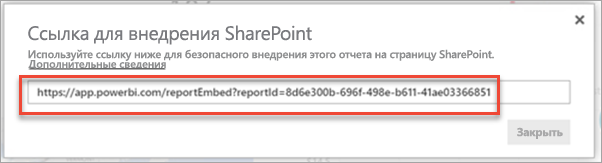

# Внедрение веб-части отчетов в SharePoint Online

С помощью новой веб-части отчетов Power BI для SharePoint Online вы можете легко внедрять интерактивные отчеты Power BI в страницы SharePoint Online.

Если вы используете новый параметр **Внедрить в SharePoint Online**, внедренные отчеты учитывают все разрешения на доступ к объектам и параметры безопасности данных [на уровне строк](../admin/service-admin-rls.md), поэтому вы можете легко создавать безопасные внутренние порталы.

## Требования

Чтобы отчеты, **внедренные в SharePoint Online**, работали, требуется следующее.

* Лицензия Power BI Pro или [емкость Power BI Premium (номер SKU EM или P)](../admin/service-premium-what-is.md) с лицензией Power BI.
* Для веб-части Power BI для SharePoint Online требуются [современные страницы](https://support.office.com/article/Allow-or-prevent-creation-of-modern-site-pages-by-end-users-c41d9cc8-c5c0-46b4-8b87-ea66abc6e63b).
* Для работы с внедренным отчетом пользователю необходимо выполнить вход в службу Power BI и активировать свою лицензию Power BI.

> [!Note]
> Для организаций, использующих Power BI в национальных облаках, нет бесплатной лицензии. В такой среде всем пользователям, которые хотят получить доступ к внедренному отчету в SharePoint, нужна лицензия на Power BI Pro.

## Внедрение отчета
Чтобы внедрить отчет в SharePoint Online, нужно получить URL-адрес отчета и использовать его с веб-частью Power BI в SharePoint Online.

### Получение URL-адреса отчета

1. Просмотрите отчет в Power BI.

2. В раскрывающемся меню **Дополнительные параметры (...)** выберите пункты **Внедрить** > **SharePoint Online**.

    

3. Скопируйте URL-адрес отчета из диалогового окна.

    

### Добавление отчета Power BI на страницу SharePoint Online

1. Откройте целевую страницу в SharePoint Online и нажмите кнопку **Изменить**.

    

    Либо выберите **+ Создать** в Sharepoint Online, чтобы создать современную страницу сайта.

    

2. Откройте раскрывающийся список **+** и выберите веб-часть **Power BI**.

    

3. Нажмите кнопку **Добавить отчет**.

      

4. Вставьте скопированный ранее URL-адрес отчета в область **Ссылка на отчет Power BI**. Отчет загружается автоматически.

    

5. Нажмите кнопку **Опубликовать**, чтобы отчет стал видимым для пользователей SharePoint Online.

    

## Предоставление доступа к отчетам

При внедрении отчета в SharePoint Online разрешение на просмотр отчета не предоставляется пользователям автоматически — вам нужно задать разрешения на просмотр в Power BI.

> [!IMPORTANT]
> Обязательно проверьте, кто может просматривать отчет в службе Power BI, и предоставьте доступ пользователям, которых нет в списке.

Доступ к отчету в Power BI можно предоставить двумя способами. Первый способ. Если вы используете группу Microsoft 365 для создания сайта группы SharePoint Online, укажите пользователя как участника **рабочей области в службе Power BI** и на **странице SharePoint**. Дополнительные сведения см. в статье об [управлении рабочей областью](service-manage-app-workspace-in-power-bi-and-office-365.md).

Второй способ. Можно внедрить отчет в приложение и поделиться им с пользователями напрямую.  

1. Автор, который может пользоваться версией Pro, создает отчет в рабочей области. Чтобы поделиться с *пользователями бесплатной версии Power BI*, рабочую область нужно настроить как *рабочую область "Премиум"* .

2. Автор публикует приложение и устанавливает его. Автор должен установить приложение, чтобы оно имело доступ к URL-адресу отчета, который используется для внедрения в SharePoint Online.

3. Теперь все пользователи также должны установить приложение. Можно настроить предварительную установку приложения для пользователей, включив функцию **Автоматическая установка приложения** на [портале администрирования Power BI](../admin/service-admin-portal.md).

   

4. Автор открывает приложение и переходит к отчету.

5. Автор копирует URL-адрес для внедрения отчета из отчета, установленного приложением. Не используйте исходный URL-адрес отчета из рабочей области.

6. Создайте сайт группы в SharePoint Online.

7. Добавьте скопированный ранее URL-адрес в веб-часть Power BI.

8. Добавьте всех пользователей и (или) группы, которые будут работать с данными на странице SharePoint Online и в приложении Power BI, созданном вами.

    > [!NOTE]
    > **Чтобы пользователи и группы могли видеть отчет на странице SharePoint, им потребуется доступ к странице SharePoint Online и отчету в приложении Power BI.**

Теперь пользователь может перейти на сайт группы SharePoint Online и просматривать отчеты на странице.

## Многофакторная проверка подлинности

Если среда Power BI требует входа с помощью многофакторной идентификации, может появиться запрос на вход с помощью устройства безопасности для проверки вашего удостоверения. Это происходит, если вы не вошли в SharePoint Online с помощью многофакторной проверки подлинности, но среда Power BI требует, чтобы устройство безопасности проверило учетную запись.

> [!NOTE]
> Power BI еще не поддерживает многофакторную проверку подлинности при использовании Azure Active Directory 2.0 — пользователи увидят сообщение об ошибке. Если пользователь повторно войдет в SharePoint Online с помощью своего устройства безопасности, он сможет просматривать отчет.

## Настройки веб-части

Ниже указаны параметры, которые можно изменять в веб-части Power BI для SharePoint Online.

| Свойство | Описание |
| --- | --- |
| Имя страницы |Задает страницу по умолчанию для веб-части. Выберите значение в раскрывающемся списке. Если ни одна страница не отображается, отчет содержит одну страницу или вставленный URL-адрес содержит имя страницы. Удалите раздел report из URL-адреса, чтобы выбрать определенную страницу. |
| Отображение |Настраивает размеры отчета на странице SharePoint Online. |
| Отображение области навигации |Показывает или скрывает область навигации по страницам. |
| Отображение области фильтров |Отображение или скрытие области фильтров. |

## Отчеты, которые не загружаются

Если отчет не загружается в веб-части Power BI, вы можете увидеть следующее сообщение.

Это сообщение может появиться по двум причинам.

1. У вас нет доступа к отчету.
2. Отчет был удален.

Свяжитесь с владельцем страницы SharePoint Online, чтобы он помог устранить проблему.

## Лицензирование

Пользователям, просматривающим отчет в SharePoint, нужна **лицензия Power BI Pro**, если содержимое не размещено в рабочей области **[емкости Power BI Premium (номера SKU: EM или P)](../admin/service-admin-premium-purchase.md)** .

## Известные проблемы и ограничения

* Ошибка. "Произошла ошибка. Попробуйте выйти из системы и войти снова, а затем вернитесь к этой странице. Идентификатор корреляции: неопределенный, состояние HTTP-ответа: 400, код ошибки сервера 10001, сообщение: Отсутствует маркер обновления".
  
  Если возникает такая ошибка, попробуйте один из описанных ниже шагов по устранению неполадок.
  
  1. Выйдите из SharePoint и войдите снова. Перед повторным входом закройте все окна браузера.

  2. Если учетной записи пользователя требуется многофакторная проверка подлинности (MFA), войдите в SharePoint с устройства, поддерживающего многофакторную проверку подлинности (мобильное приложение, смарт-карта и т. д.).
  
  3. Гостевые учетные записи B2B Azure не поддерживаются. Пользователи видят логотип Power BI, показывающий, что часть загружается, но отчет не отображается.

* Power BI не поддерживает те же языки с локализацией, что и SharePoint Online. В результате во внедренном отчете требуемая локализация может не отображаться.

* При использовании Internet Explorer 10 могут возникнуть проблемы. <!--You can look at the [browsers support for Power BI](../fundamentals/power-bi-browsers.md) and for [Microsoft 365](https://products.office.com/office-system-requirements#Browsers-section). -->

* Веб-часть Power BI недоступна в [национальных облаках](https://powerbi.microsoft.com/clouds/).

* Классический сервер SharePoint Server не поддерживается с этой веб-частью.

* [Фильтры URL-адресов](service-url-filters.md) не поддерживаются в веб-части SPO.

## Дальнейшие действия

* [Allow or prevent creation of modern site pages by end users](https://support.office.com/article/Allow-or-prevent-creation-of-modern-site-pages-by-end-users-c41d9cc8-c5c0-46b4-8b87-ea66abc6e63b) (Разрешение или запрет создания современных страниц сайта конечными пользователями)  
* [Создание и распространение приложения в Power BI](service-create-distribute-apps.md)  
* [Предоставление общего доступа к панели мониторинга и отчетам коллегам и другим пользователям](service-share-dashboards.md)  
* [Что такое Power BI Premium?](../admin/service-premium-what-is.md)
* [Embed a report in a secure portal or website](service-embed-secure.md) (Внедрение отчета в защищенный портал или сайт)

Появились дополнительные вопросы? [Попробуйте задать вопрос в сообществе Power BI.](https://community.powerbi.com/)