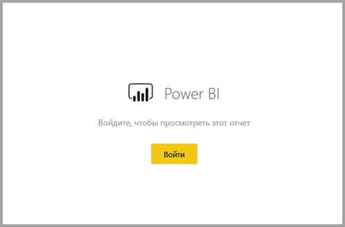
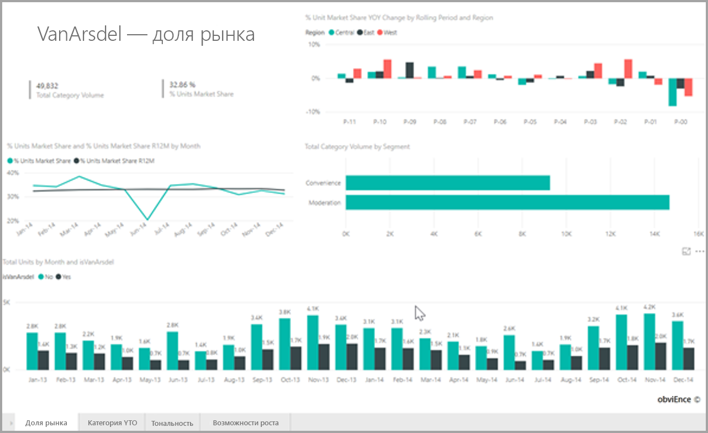

# <a name="embed-a-report-in-a-secure-portal-or-website"></a>Внедрение отчета на защищенный портал или сайт

С новым действием **Внедрение** для отчетов Power BI вы можете легко и безопасно внедрять отчеты на внутренние веб-порталы. Эти порталы могут быть **облачными** или **локальными**, например SharePoint 2019. Внедренные отчеты соответствуют всем разрешениям для элементов и политикам защиты данных, которые обеспечиваются с помощью [механизма безопасности на уровне строк (RLS)](../admin/service-admin-rls.md). Они позволяют обойтись без написания кода при внедрении содержимого на портал, который принимает URL-адрес или iFrame. 

Действие **Внедрение** поддерживает [фильтры URL-адресов](service-url-filters.md) и параметры URL-адресов. Оно позволяет настроить интеграцию с порталами, используя подход с малым объемом кода, который требует базового понимания языков HTML и JavaScript.

## <a name="how-to-embed-power-bi-reports-into-portals"></a>Внедрение отчетов Power BI на порталы

1. Откройте отчет в службе Power BI.

2. В меню **Дополнительные параметры (...)** выберите пункты **Внедрить** >  **Веб-сайт или портал**.

    

2. Выберите параметр **Внедрение**, чтобы открыть диалоговое окно со ссылкой и кодом iFrame, который используется для безопасного внедрения отчета.

    

3. Когда пользователь открывает URL-адрес отчета напрямую или на веб-портале, доступ к отчету требует проверки подлинности. Если пользователь не выполнил вход в Power BI в сеансе браузера, появится следующий экран. При нажатии на кнопку **Вход** может открываться новое окно или отдельная вкладка браузера. Если не отображается запрос на вход, нужно проверить, не блокируются ли всплывающие окна.

    

4. После того, как пользователь выполнит вход, открывается отчет с данными и средствами для навигации между страницами и настройки фильтров. Только пользователи, имеющие разрешение на просмотр, могут просматривать отчет в Power BI. Применяются также все правила [безопасности на уровне строк (RLS)](../admin/service-admin-rls.md). И разумеется, пользователю требуется соответствующая лицензия (Power BI Pro), или отчет должен быть размещен в рабочей области, которая находится в емкости Power BI Premium. Пользователь должен выполнять вход каждый раз, когда открывает новое окно браузера. Однако после входа другие отчеты загружаются автоматически.

    

5. При использовании iFrame может потребоваться изменить **высоту** и **ширину** в соответствии с веб-страницей портала.

    

## <a name="granting-report-access"></a>Предоставление доступа к отчетам

Параметр **Внедрение** не предоставляет пользователям автоматических прав на просмотр отчета. Разрешения на просмотр задаются в службе Power BI.

В службе Power BI можно предоставлять общий доступ к внедренным отчетам для пользователей, которым требуется доступ. Если вы используете группу Office 365, включите пользователя в число участников рабочей области. Дополнительные сведения см. в разделе [Управление рабочей областью в Power BI и Office 365](service-manage-app-workspace-in-power-bi-and-office-365.md).

## <a name="licensing"></a>Лицензирование

Пользователям, просматривающим встроенный отчет, нужна лицензия Power BI Pro, если содержимое не размещено в рабочей области [емкости Power BI Premium (номера SKU: EM или P)](../admin/service-admin-premium-purchase.md).

## <a name="customize-your-embed-experience-using-url-settings"></a>Настройка внедрения с помощью параметров URL-адреса

Пользовательский интерфейс можно настроить с помощью параметров ввода URL-адреса внедрения. В предоставленном iFrame можно обновить параметры **src** URL-адреса.

| Свойство  | Описание  |  |  |  |
|--------------|-----------------------------------------------------------------------------------------------------------------------------------------------------------------------------------------------------------------------|---|---|---|
| pageName  | Параметр строки запроса **pageName** позволяет указать страницу отчета, которая должна открываться. Это значение размещается в конце URL-адреса отчета при просмотре отчета в службе Power BI, как показано ниже. |  |  |  |
| Фильтры URL-адреса  | Вы можете использовать [фильтры URL-адреса](service-url-filters.md) в URL-адресе внедрения, который вы получили через пользовательский интерфейс Power BI, чтобы фильтровать внедряемое содержимое. Это позволяет создавать интеграции с малым количеством кода, используя только базовые возможности HTML и JavaScript.  |  |  |  |

## <a name="set-which-page-opens-for-an-embedded-report"></a>Выбор страницы, которая открывается для внедренного отчета 

Значение **pageName** размещается в конце URL-адреса отчета при просмотре отчета в службе Power BI.

1. Откройте в браузере отчет, размещенный в службе Power BI, и скопируйте URL-адрес из адресной строки.

    

2. Добавьте в URL-адрес параметр **pageName**.

    

## <a name="filter-report-content-using-url-filters"></a>Фильтрация содержимого отчета с помощью фильтров URL-адреса 

Для создания различных представлений отчетов можно использовать [фильтры URL-адресов](service-url-filters.md). Например, представленный ниже URL-адрес фильтрует отчет для отображения данных по энергетической отрасли.

Сочетание **pageName** и [фильтров URL-адреса](service-url-filters.md) позволяет создавать мощные комбинации. Вы сможете создавать интерфейсы, используя простейший код HTML и JavaScript.

Например, вот кнопка, которую можно добавить на страницу HTML:

```html
<button class="textLarge" onclick='show("ReportSection", "Energy");' style="display: inline-block;">Show Energy</button>
```

Нажатие этой кнопки вызывает функцию, которая сохраняет в iFrame обновленный URL-адрес с фильтром по энергетической отрасли.

```javascript
function show(pageName, filterValue)

{

var newUrl = baseUrl + "&pageName=" + pageName;

if(null != filterValue && "" != filterValue)

{

newUrl += "&$filter=Industries/Industry eq '" + filterValue + "'";

}

//Assumes there's an iFrame on the page with id="iFrame"

var report = document.getElementById("iFrame")

report.src = newUrl;

}
```


Вы можете добавить любое количество кнопок в пользовательский интерфейс с малым количеством кода. 

## <a name="considerations-and-limitations"></a>Рекомендации и ограничения

* Сценарии безопасного внедрения поддерживают отчеты с разбивкой на страницы, в том числе с параметрами URL. См. дополнительные сведения о [передаче параметров отчета в URL-адресе для отчета с разбивкой на страницы](../paginated-reports/report-builder-url-pass-parameters.md).

* Для Azure B2B не поддерживаются внешние пользователи с правами гостя.

* Защищенное внедрение работает только для отчетов, опубликованных в службе Power BI.

* Пользователь должен выполнить вход для просмотра отчета каждый раз, когда открывает новое окно браузера.

* Некоторые браузеры требуют обновить страницу после входа, особенно если используются режимы InPrivate или "аноним".

* При использовании неподдерживаемых версий браузера могут возникнуть проблемы. См. [список браузеров](../fundamentals/power-bi-browsers.md), поддерживаемых Power BI.

* Классический сервер SharePoint Server не поддерживается, так как для него требуется Internet Explorer версий ниже 11 или нужно включить просмотр в режиме совместимости.

* Чтобы использовать единый вход, примените параметр [Внедрить в SharePoint Online](service-embed-report-spo.md) или создайте пользовательскую интеграцию на основе метода внедрения [данные принадлежат пользователю](../developer/embedded/embed-sample-for-your-organization.md). 

* Возможность автоматической аутентификации, предоставляемая параметром **Внедрение**, не работает с API JavaScript для Power BI. При работе с API JavaScript для Power BI следует использовать метод внедрения [данные принадлежат пользователю](../developer/embedded/embed-sample-for-your-organization.md). 

* Время существования маркера проверки подлинности регулируется в зависимости от параметров AAD. По истечении срока действия маркера проверки подлинности пользователю потребуется обновить браузер, чтобы получить обновленный маркер проверки подлинности. Время жизни по умолчанию составляет один час, но может быть короче или длиннее в вашей организации.

## <a name="next-steps"></a>Дальнейшие действия

* [Способы совместного использования работы в Power BI](service-how-to-collaborate-distribute-dashboards-reports.md)

* [Фильтрация отчета с помощью параметров строки запроса в URL-адресе](service-url-filters.md)

* [Внедрение с помощью веб-части отчетов в SharePoint Online](service-embed-report-spo.md)

* [Публикация в Интернете из Power BI](service-publish-to-web.md)
