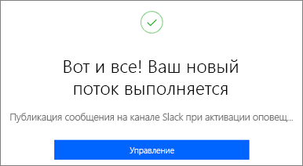
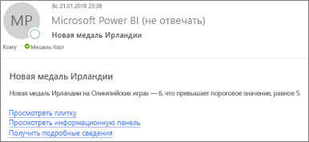
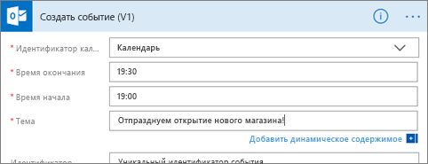
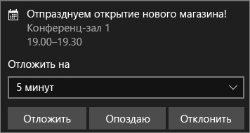

# Интеграция оповещений о данных Power BI с Power Automate

[Power Automate](/power-automate/getting-started) — это предложение SaaS для автоматизации рабочих процессов в различных приложениях и службах SaaS. Вы можете автоматизировать задачи путем интеграции избранных приложений и служб, включая Power BI, для получения уведомлений, синхронизации файлов, сбора данных и т. п. В этой статье описывается, как автоматизировать создание сообщений электронной почты на основе оповещений о данных Power BI.

[Приступая к работе с Power Automate](/power-automate/getting-started).

## Предварительные требования
В этой статье показано, как создать два разных потока — на основе шаблона и с нуля. Для дальнейшей работы [создайте оповещение о данных в Power BI](../create-reports/service-set-data-alerts.md) и [зарегистрируйтесь в Power Automate](https://flow.microsoft.com/#home-signup). Бесплатная версия!

## Создание потока из шаблона
В этой задаче мы создаем на основе шаблона простой поток, который активируется с помощью оповещения о данных (уведомления) Power BI.

1. Войдите в Power Automate (flow.microsoft.com).
2. Выберите **Шаблоны** и найдите шаблон **Power BI** > **Отправка электронного письма кому угодно при активации оповещения о данных Power BI**.
   
    :::image type="content" source="media/service-flow-integration/power-automate-templates.png" alt-text="Снимок экрана: шаблон Power Automate &quot;Отправка электронного письма кому угодно при активации оповещения о данных Power BI&quot;.":::

### Создание потока
Этот шаблон содержит один триггер, оповещение о данных Power BI и одно действие для отправки сообщения электронной почты. При выборе поля Power Automate отобразит динамическое содержимое, которое можно использовать.  В этом примере мы включили в текст сообщения значение и URL-адрес плитки.

1. Выберите **Continue** (Продолжить).

    :::image type="content" source="media/service-flow-integration/power-automate-power-bi-mail.png" alt-text="Снимок экрана: шаблон Power Automate &quot;Отправка электронного письма кому угодно при активации оповещения о данных Power BI&quot;.":::

1. В поле **Идентификатор оповещения** выберите оповещение о данных Power BI. Чтобы узнать, как создать оповещение, см. статью [Оповещения о данных в службе Power BI](../create-reports/service-set-data-alerts.md).
   
    :::image type="content" source="media/service-flow-integration/power-automate-select-alert-id.png" alt-text="Снимок экрана: шаблон Power Automate &quot;Отправка электронного письма кому угодно при активации оповещения о данных Power BI&quot;.":::
2. Укажите один или несколько действительных адресов электронной почты.

3. Power Automate автоматически создаст **тему** и **текст** сообщения, которые можно сохранить или изменить. В тексте сообщения применяется HTML-форматирование.

    :::image type="content" source="media/service-flow-integration/power-automate-autogenerated-email.png" alt-text="Снимок экрана: шаблон Power Automate &quot;Отправка электронного письма кому угодно при активации оповещения о данных Power BI&quot;.":::

1. Завершив работу с сообщением, выберите **Следующий шаг** или **Сохранить**.  Поток будет создан и проанализирован.  При обнаружении ошибок Power Automate отображает соответствующие сообщения.
2. Если будут обнаружены ошибки, выберите **Изменить поток** для их исправления. В противном случае выберите **Готово**, чтобы выполнить новую последовательность.
   
   
5. Когда оповещение о данных активируется, Power Automate отправляет сообщения электронной почты на указанные вами адреса.  
   
   

## Создание потока с нуля
В этой задаче мы создаем с нуля простой поток, который активируется с помощью оповещения о данных (уведомления) Power BI.

1. Войдите в Power Automate (flow.microsoft.com).
2. Выберите **Создать** > **Автоматизированный поток**.

    :::image type="content" source="media/service-flow-integration/power-automate-create-automated-flow.png" alt-text="Снимок экрана: шаблон Power Automate &quot;Отправка электронного письма кому угодно при активации оповещения о данных Power BI&quot;.":::   
3. В окне **Создать автоматизированный поток** присвойте потоку имя.
1. В поле **Выберите триггер потока** выполните поиск по фразе **Power BI**.
1. Последовательно выберите **Power BI — при активации оповещения на основе данных** > **Создать**.

    :::image type="content" source="media/service-flow-integration/power-automate-build-automated-flow.png" alt-text="Снимок экрана: шаблон Power Automate &quot;Отправка электронного письма кому угодно при активации оповещения о данных Power BI&quot;.":::

### Создание потока
1. В поле **Идентификатор оповещения** выберите имя оповещения. Чтобы узнать, как создать оповещение, см. статью [Оповещения о данных в службе Power BI](../create-reports/service-set-data-alerts.md).

    :::image type="content" source="media/service-flow-integration/power-automate-select-alert-id-scratch.png" alt-text="Снимок экрана: шаблон Power Automate &quot;Отправка электронного письма кому угодно при активации оповещения о данных Power BI&quot;.":::   

2. Выберите **Новый шаг**.
   
3. В поле **Выберите действие** с помощью поля поиска найдите **Outlook** > **Создать событие**.

    :::image type="content" source="media/service-flow-integration/power-automate-choose-action-create-event.png" alt-text="Снимок экрана: шаблон Power Automate &quot;Отправка электронного письма кому угодно при активации оповещения о данных Power BI&quot;.":::   
4. Заполните поля в событии. При выборе поля Power Automate отобразит динамическое содержимое, которое можно использовать.
   
   
5. Когда все будет готово, выберите **Создать поток**.  Power Automate сохранит и проанализирует поток. Если ошибок нет, выберите **Готово**, чтобы запустить поток.  Новая последовательность будет добавлена на страницу **Мои потоки**.
   
   
6. Если поток активируется с помощью оповещения о данных Power BI, вы получите в Outlook примерно следующее уведомление о событии.
   
    

## Дальнейшие действия
* [Начало работы с Power Automate](/power-automate/getting-started/)
* [Настройка оповещений о данных в службе Power BI](../create-reports/service-set-data-alerts.md)
* [Настройка оповещений о данных на устройстве iPhone](../consumer/mobile/mobile-set-data-alerts-in-the-mobile-apps.md)
* Остались вопросы? [Ответы на них см. в сообществе Power BI.](https://community.powerbi.com/)